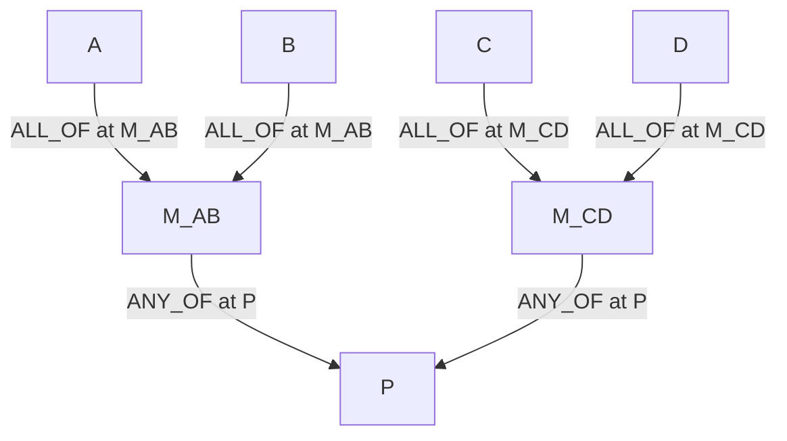

# Claim Decomposition DAG Architecture

This document is the canonical target architecture for claim objects and
agent-consumed proof/decomposition DAGs.

## 1. What Changes From The Current Architecture

The current implementation has three important mismatches with the target
model:

| Current architecture | Target architecture |
|---|---|
| `claims.claim_type` is treated as required identity and sometimes as a proof-routing signal. | `claim_type` is removed from core reasoning. The LLM agent reasons from the claim object: text, relation, polarity, participants, context, status, and evidence rollups. |
| `claim_relations` stores both semantic relations and proof/decomposition DAG edges. | `claim_relations` stores only semantic relations. `claim_decomposition_edges` stores Boolean proof composition. |
| Mechanism role appears ad hoc as `node_kind` in `claims.full_data` or `claim_relations.properties`. | Role is edge-scoped in `claim_decomposition_edges.source_role` / `target_role`, because the same claim can play different roles in different DAGs. |

The practical difference is that the agent no longer asks "what claim type is
this?" before choosing proof work. It asks:

```text
What does the claim assert?
Where does it apply?
What evidence would support or refute it?
How is it wired into the current parent decomposition?
```

## 2. Three Tables, Three Jobs

```text
claims
  durable biological assertions

claim_relations
  semantic relationships between claims; not Boolean proof composition

claim_decomposition_edges
  the acyclic proof/decomposition DAG consumed by the agent
```

These tables have different lifecycles and consumers. Keeping them separate
prevents narrative relations such as `enables` from accidentally contributing
to Boolean parent rollup.

## 3. `claims`: The Assertion Itself

A `claims` row is the durable biological assertion. It does not know how it
will be used in any particular proof.

Required conceptual fields:

```text
claim_id
claim_text
relation_name
relation_polarity
participants
context_set_json
cell_states_json
context_operator
participant_combinator
evidence_status
prior_art_status
review_status
confidence_summary
rollups
edge_signature
full_data
```

`claim_type` is intentionally not listed. If a legacy database keeps
`claim_type`, it is optional/derived metadata and must not drive agent proof
logic.

## 4. `claim_relations`: Semantic Relations Between Claims

These rows say something durable about two claims. They are not used for
Boolean rollup.

Conceptual fields:

```text
relation_id
source_claim_id
target_claim_id
relation_kind
relation_strength
relation_status
notes
```

Recommended `relation_kind` values:

| Relation kind | Meaning |
|---|---|
| `same_as` | The claims assert the same biology and should be merged or read as aliases. |
| `refines` | Source is a finer or corrected version of target. |
| `contradicts` | Source conflicts with target by polarity, context, or evidence interpretation. |
| `corroborates` | Source provides convergent support but is not load-bearing proof composition. |
| `enables` | Source precedes or enables target mechanistically or temporally. |
| `parallel_to` | Source and target are related alternatives without a proof-composition claim. |

`enables` belongs here. It can explain temporal order, but it does not
contribute to Boolean rollup unless a separate decomposition edge makes that
claim load-bearing.

## 5. `claim_decomposition_edges`: The Agent's Proof DAG

These edges form the acyclic decomposition graph that the agent walks. Edges
with the same `target_claim_id` form the local Boolean rule at that target.
The stored direction is child-to-target:

```text
source_claim_id -> target_claim_id
child/module    -> parent/module being satisfied
```

Conceptual fields:

```text
edge_id
source_claim_id
target_claim_id
support_operator
support_operator_params
source_role
target_role
group_id
edge_status
created_at
retired_at
notes
```

Recommended values:

| Field | Values |
|---|---|
| `support_operator` | `ALL_OF`, `ANY_OF`, `K_OF_N`, `INDEPENDENT_CAUSES`, `MUTUALLY_EXCLUSIVE_ALTERNATIVES` |
| `source_role` | `shared_anchor`, `required_step`, `sufficient_module`, `context_bridge`, `ordinary_child` |
| `target_role` | `parent_claim`, `mechanism_module` |
| `edge_status` | `proposed`, `active`, `retired` |

Constraint:

```text
All active edges sharing one target_claim_id must carry the same support_operator.
```

That no-mixed-operators rule makes the local rollup unambiguous.

## 5.1 Target DDL

This is the target storage shape. During migration, existing databases may keep
legacy columns such as `claims.claim_type` and old structural rows in
`claim_relations`; new code should treat those as compatibility paths.

```sql
CREATE TABLE claims (
  claim_id TEXT PRIMARY KEY,
  claim_text TEXT NOT NULL,
  relation_name TEXT NOT NULL,
  relation_polarity TEXT NOT NULL,
  context_set_json TEXT DEFAULT '{}',
  cell_states_json TEXT DEFAULT '[]',
  context_operator TEXT DEFAULT 'AND',
  participant_combinator TEXT DEFAULT '',
  evidence_status TEXT DEFAULT 'unchecked',
  prior_art_status TEXT DEFAULT 'new',
  review_status TEXT DEFAULT 'draft',
  confidence_summary TEXT DEFAULT '{}',
  rollups TEXT DEFAULT '{}',
  edge_signature TEXT DEFAULT '',
  full_data TEXT DEFAULT '{}'
);

CREATE TABLE claim_relations (
  relation_id TEXT PRIMARY KEY,
  source_claim_id TEXT NOT NULL,
  target_claim_id TEXT NOT NULL,
  relation_kind TEXT NOT NULL,
  relation_strength REAL DEFAULT NULL,
  relation_status TEXT DEFAULT 'proposed',
  notes TEXT DEFAULT '',
  created_at TEXT DEFAULT '',
  retired_at TEXT DEFAULT '',
  FOREIGN KEY (source_claim_id) REFERENCES claims(claim_id),
  FOREIGN KEY (target_claim_id) REFERENCES claims(claim_id)
);

CREATE TABLE claim_decomposition_edges (
  edge_id TEXT PRIMARY KEY,
  source_claim_id TEXT NOT NULL,
  target_claim_id TEXT NOT NULL,
  support_operator TEXT NOT NULL,
  support_operator_params TEXT DEFAULT '{}',
  source_role TEXT DEFAULT 'ordinary_child',
  target_role TEXT DEFAULT 'parent_claim',
  group_id TEXT DEFAULT '',
  edge_status TEXT DEFAULT 'proposed',
  created_at TEXT DEFAULT '',
  retired_at TEXT DEFAULT '',
  notes TEXT DEFAULT '',
  FOREIGN KEY (source_claim_id) REFERENCES claims(claim_id),
  FOREIGN KEY (target_claim_id) REFERENCES claims(claim_id)
);

CREATE INDEX idx_claim_relations_source ON claim_relations(source_claim_id);
CREATE INDEX idx_claim_relations_target ON claim_relations(target_claim_id);
CREATE INDEX idx_claim_relations_kind ON claim_relations(relation_kind);

CREATE INDEX idx_claim_decomp_source ON claim_decomposition_edges(source_claim_id);
CREATE INDEX idx_claim_decomp_target ON claim_decomposition_edges(target_claim_id);
CREATE INDEX idx_claim_decomp_status ON claim_decomposition_edges(edge_status);
```

SQLite cannot enforce "one support operator per active target" with a simple
portable `CHECK`. Enforce it in writer code and migration tests.

## 6. Why Role Lives On The Edge

The same biological fact can play different roles in different decompositions.

Example:

```text
F_SETDB1_imposes_H3K9me3
```

In one parent DAG it may be a `shared_anchor` because two SETDB1 immune-evasion
arms both depend on it. In another parent DAG it may be an `ordinary_child`
under a broader epigenetic silencing claim.

The claim itself is unchanged. The role is a property of how that claim is used
in a particular target's decomposition, so it belongs on
`claim_decomposition_edges`.

Likewise, "module" versus "leaf" is not intrinsic to a claim. With the stored
child-to-target direction, a claim with active incoming decomposition children
is acting as a module in that DAG. A claim with no active incoming children is
acting as a leaf. The same claim can still have an outgoing edge to a broader
parent while acting as a module for its own children.

## 7. Naming Convention

Examples use readable prefixes only:

| Prefix | Meaning in examples |
|---|---|
| `P_*` | Root of a particular decomposition; the focal parent being proved. |
| `M_*` | Claim currently used as a mechanism module. |
| `F_*` | Claim currently used as an atomic fact. |

These prefixes are descriptive and not enforced. The agent reads structure
from `claim_decomposition_edges`, not from claim ids.

## 8. Operators

The operator is interpreted at the target claim.

| Operator | Semantics | Example |
|---|---|---|
| `ALL_OF` | All active children must hold. | Statin LDL lowering: hepatic uptake and SREBP2/LDLR facts must all hold. |
| `ANY_OF` | Any one active child suffices. | Ferroptosis suppression can occur through a GPX4 axis or an FSP1 axis. |
| `K_OF_N` | At least `min_required` active children must hold. | Senescence call if any 3 of SA-beta-gal, p16, SASP, irreversible arrest hold. |
| `INDEPENDENT_CAUSES` | One supported child can support the target; more than one may be true and should be tracked. | Diabetes etiology: T1D, T2D, MODY, gestational, drug-induced. |
| `MUTUALLY_EXCLUSIVE_ALTERNATIVES` | Exactly one child should win per context; multiple supported children flag a structural problem. | T helper fate: Th1, Th2, Th17, Treg, Tfh. |

`ALL_OF` and `ANY_OF` are the workhorses. The other operators capture real
biological structures that should not be forced into plain AND/OR.

## 9. No Mixed Operators At One Target

Do not encode this as direct children of one target:

```text
P = (A AND B) OR (C AND D)
```

Reify the inner expressions:

```text
M_AB = A AND B
M_CD = C AND D
P = M_AB OR M_CD
```



The cost is one extra module claim per nested expression. The benefit is that
every target has a single local Boolean rule.

## 10. Sequential Or Temporal Ordering

Use `claim_relations.relation_kind = enables` for ordering:

```text
F_statins_inhibit_HMGCR enables F_intracellular_cholesterol_falls
F_intracellular_cholesterol_falls enables F_SREBP2_activated
F_SREBP2_activated enables F_LDLR_upregulated
F_LDLR_upregulated enables F_serum_LDL_cleared
```

These relations are documentation and search hints. They do not enforce
Boolean completion.

If completion semantics matter, encode them in the claim:

```text
F_HMGCR_inhibition_during_clinical_dose_window
```

Then make that claim an `ALL_OF` child in the relevant decomposition. Do not
smuggle temporal logic into `support_operator`.

## 11. How The DAG Grows

### Append

Add a new atomic claim and one active decomposition edge under an existing
module. Existing edges do not change.

### Promote To Alternative

When one mechanism becomes one of several alternatives:

1. Insert a new module claim such as `M_lineage_choice`.
2. Retire the old direct edge from the existing mechanism into the parent.
3. Add `M_existing -> M_lineage_choice`.
4. Add sibling modules into `M_lineage_choice`.
5. Add `M_lineage_choice -> P`.

Old edges are retired, not deleted.

### Refine

When a finer reformulation appears:

1. Create finer claim rows.
2. Wire finer claims into a finer module with decomposition edges.
3. Add a semantic `claim_relations` row: `M_finer refines M_coarser`.
4. Optionally retire old parent decomposition edges and replace them with the
   finer module.

## 12. Agent Action Ontology

Structural actions:

| Action | Effect |
|---|---|
| `propose_decomposition(parent, children, operator)` | Draft new decomposition edges. |
| `instantiate_claim(claim_object)` | Create a new claim with `evidence_status = unchecked`. |
| `add_decomposition_edge(child, parent, source_role, support_operator, group_id)` | Wire a child into a target's proof DAG. |
| `mark_edge(edge_id, status)` | Move an edge between `proposed`, `active`, and `retired`. |
| `propose_alternative(parent, new_module)` | Apply the promote-to-alternative pattern. |
| `refine_claim(coarse, finer)` | Add finer claims and a semantic `refines` relation. |

Evidence actions:

| Action | Effect |
|---|---|
| `gather_evidence(claim)` | Fetch evidence relevant to one claim. |
| `interpret_evidence(claim, evidence_chunk)` | Decide support/refute/null/inconclusive for one claim. |
| `attach_evidence(claim, evidence_id)` | Persist interpretation. |
| `update_confidence(claim, confidence_summary)` | Materialize rollup state on the claim. |

Traversal and rollup actions:

| Action | Effect |
|---|---|
| `select_frontier(parent)` | Pick the next unresolved child to attack. |
| `descend(claim)` | Move focus to a child. |
| `ascend(claim)` | Move focus to a parent. |
| `revisit_anchor(claim)` | Reuse cached confidence for a shared anchor. |
| `rollup_parent(parent)` | Recompute parent confidence from active decomposition children. |
| `terminate_search(focal, status)` | End proof search for the focal claim. |

UCT2 state is scoped to `(focal_claim, target_claim, action_path_hash)`.
Confidence summaries and interpreted evidence can be shared across focal
claims; visit counts should not be shared.

## 13. Operator-Aware Search Policy

| Operator at target | Frontier preference |
|---|---|
| `ALL_OF` | Attack the child with highest expected information loss. Refuting one child can kill the parent. |
| `ANY_OF` | Attack the child most likely to be supported. Supporting one child can finish the parent. |
| `K_OF_N` | Stop once `min_required` children are supported; before that, prefer cheap/high-yield children. |
| `MUTUALLY_EXCLUSIVE_ALTERNATIVES` | Prefer evidence that discriminates between alternatives. Evidence supporting two alternatives flags structure mismatch. |
| `INDEPENDENT_CAUSES` | Prefer the child most likely to be operative in the current context. |

This is where the search policy reads the operator. Claims themselves remain
operator-free.

## 14. Migration Plan

### Phase 1: Add The New Table

Add `claim_decomposition_edges` beside the existing tables. Do not remove
`claim_type` or old `claim_relations` fields yet.

### Phase 2: Dual-Write

Writers that currently emit `claim_relations.relation_type = claim_dag_of`
should also emit equivalent `claim_decomposition_edges` rows.

Mapping:

| Old location | New location |
|---|---|
| `claim_relations.source_claim_id` | `claim_decomposition_edges.source_claim_id` |
| `claim_relations.target_claim_id` | `claim_decomposition_edges.target_claim_id` |
| `properties.parent_support_operator` | `support_operator` |
| `properties.min_required` | `support_operator_params.min_required` |
| `properties.claim_dag_node_kind` / `properties.node_kind` | `source_role` or `target_role`, edge-scoped |
| `properties.dag_edge_status` | `edge_status` |
| `properties.support_group_id` / `path_ids` | `group_id` |

### Phase 3: Read From The New Table

Move frontier selection, parent rollup, and UCT2 decomposition traversal to
`claim_decomposition_edges`.

`claim_relations` remains available for `enables`, `refines`, `same_as`,
`contradicts`, and other semantic search hints.

### Phase 4: Stop Writing Structural Claim Relations

Stop creating new `claim_relations` rows with `claim_dag_of`,
`chain_dag_of`, `context_split_of`, or `split_of` for proof composition. Keep
read compatibility for old databases.

### Phase 5: Demote `claim_type`

Make `claim_type` nullable or move it into `full_data.legacy_claim_type`.
Agent policies must use claim content and decomposition edges, not claim type.

### Phase 6: Backfill And Audit

Backfill every active old structural relation into `claim_decomposition_edges`,
then run invariants:

```sql
-- no mixed operators per active target
SELECT target_claim_id, COUNT(DISTINCT support_operator) AS n_ops
FROM claim_decomposition_edges
WHERE edge_status = 'active'
GROUP BY target_claim_id
HAVING COUNT(DISTINCT support_operator) > 1;

-- no active cycles in decomposition DAG
-- use a recursive CTE in SQLite or networkx in migration tooling
```

Only after those checks pass should old structural relation reads be retired.
