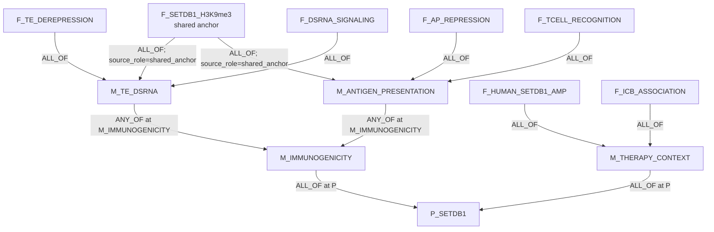
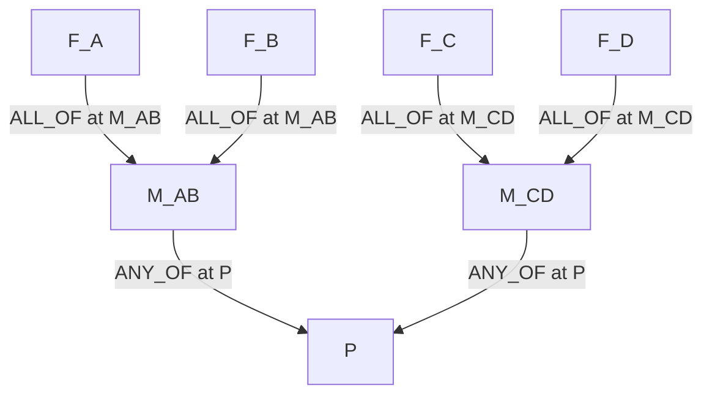
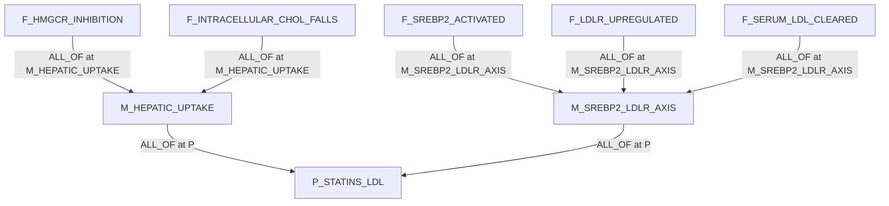
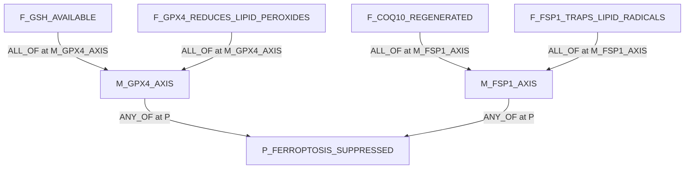
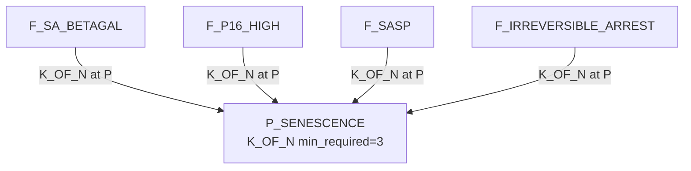
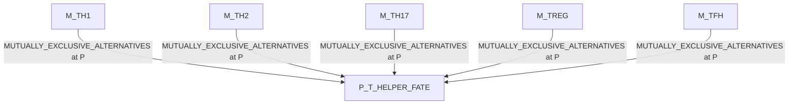
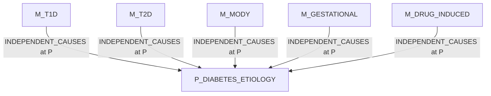

# Claim Object Mechanism DAG Examples

This document gives examples for the architecture in
`CLAIM_DECOMPOSITION_DAG_ARCHITECTURE.md`.

The key rule is:

```text
claims are biological assertions
claim_relations are semantic relations
claim_decomposition_edges are proof/decomposition DAG edges
```

`claim_type` is not used to decide what to prove. The agent reads the claim
object and the decomposition edges.

## 1. Edge Shape

Example decomposition edge from a shared anchor fact into a mechanism module:

```json
{
  "edge_id": "decomp:setdb1:A1-to-te-dsrna",
  "source_claim_id": "F_SETDB1_H3K9me3",
  "target_claim_id": "M_TE_DSRNA",
  "support_operator": "ALL_OF",
  "support_operator_params": {},
  "source_role": "shared_anchor",
  "target_role": "mechanism_module",
  "group_id": "setdb1_te_dsrna",
  "edge_status": "active",
  "notes": "Shared chromatin anchor required by the TE/dsRNA arm."
}
```

Example semantic ordering relation:

```json
{
  "relation_id": "rel:setdb1-h3k9me3-enables-te-repression",
  "source_claim_id": "F_SETDB1_H3K9me3",
  "target_claim_id": "F_TE_REPRESSION",
  "relation_kind": "enables",
  "relation_status": "active",
  "notes": "Mechanistic order only; not Boolean parent rollup."
}
```

## 2. Local Boolean Semantics

All active decomposition edges into one `target_claim_id` form that target's
local Boolean rule.

```text
source_claim_id -> target_claim_id
child claim     -> parent or mechanism-module claim
```

No mixed operators at a target:

```text
valid:   all active children into M_A use ALL_OF
valid:   all active children into P use ANY_OF
invalid: one child into P uses ALL_OF and another child into P uses ANY_OF
```

For mixed expressions, introduce mechanism modules.

## 3. Shared Anchor: SETDB1 Immunogenicity Arms

Broad parent:

```text
P_SETDB1:
SETDB1 overactivity suppresses tumour-intrinsic immunogenicity and can
contribute to immune-checkpoint-blockade resistance.
```

Boolean structure:

```text
P_SETDB1 = M_IMMUNOGENICITY AND M_THERAPY_CONTEXT
M_IMMUNOGENICITY = M_TE_DSRNA OR M_ANTIGEN_PRESENTATION
M_TE_DSRNA = F_SETDB1_H3K9me3 AND F_TE_DEREPRESSION AND F_DSRNA_SIGNALING
M_ANTIGEN_PRESENTATION = F_SETDB1_H3K9me3 AND F_AP_REPRESSION AND F_TCELL_RECOGNITION
M_THERAPY_CONTEXT = F_HUMAN_SETDB1_AMP AND F_ICB_ASSOCIATION
```

Atomic claims:

| Claim | Meaning |
|---|---|
| `F_SETDB1_H3K9me3` | SETDB1 imposes repressive H3K9me3/heterochromatin at immune-relevant repetitive or open-genome regions. |
| `F_TE_DEREPRESSION` | Loss of SETDB1 derepresses transposable-element-derived RNAs or regulatory elements. |
| `F_DSRNA_SIGNALING` | TE derepression increases dsRNA/viral-mimicry or tumour-intrinsic inflammatory signaling. |
| `F_AP_REPRESSION` | SETDB1 activity represses antigen-presentation-related loci or MHC-I pathway output. |
| `F_TCELL_RECOGNITION` | Reduced antigen presentation lowers tumour recognition by cytotoxic T cells. |
| `F_HUMAN_SETDB1_AMP` | SETDB1 amplification/overactivity occurs in human tumours in the claimed context. |
| `F_ICB_ASSOCIATION` | SETDB1 amplification/overactivity is associated with immune exclusion or checkpoint-blockade resistance. |



`F_SETDB1_H3K9me3` is one claim row with two active decomposition edges. That
fan-out is the DAG join point.

Semantic order can still be stored separately:

```text
F_SETDB1_H3K9me3 enables F_TE_DEREPRESSION
F_TE_DEREPRESSION enables F_DSRNA_SIGNALING
F_SETDB1_H3K9me3 enables F_AP_REPRESSION
F_AP_REPRESSION enables F_TCELL_RECOGNITION
```

Those `enables` rows live in `claim_relations`; they do not roll up
`P_SETDB1`.

Source anchor: Griffin et al., Nature 2021,
https://www.nature.com/articles/s41586-021-03520-4.

## 4. Mixed Logic Reified As Modules

Target expression:

```text
P = (A AND B) OR (C AND D)
```

Correct storage:

```text
M_AB = A AND B
M_CD = C AND D
P = M_AB OR M_CD
```



This satisfies the no-mixed-operators rule because each target has exactly one
operator across active incoming edges.

## 5. ALL_OF Mechanism: Statins Lower LDL

Parent:

```text
P_STATINS_LDL:
Statins lower serum LDL cholesterol through hepatic cholesterol synthesis
inhibition and LDL receptor upregulation.
```

Decomposition:

```text
P_STATINS_LDL = M_HEPATIC_UPTAKE AND M_SREBP2_LDLR_AXIS
M_HEPATIC_UPTAKE = F_HMGCR_INHIBITION AND F_INTRACELLULAR_CHOL_FALLS
M_SREBP2_LDLR_AXIS = F_SREBP2_ACTIVATED AND F_LDLR_UPREGULATED AND F_SERUM_LDL_CLEARED
```



Temporal order belongs in `claim_relations`:

```text
F_HMGCR_INHIBITION enables F_INTRACELLULAR_CHOL_FALLS
F_INTRACELLULAR_CHOL_FALLS enables F_SREBP2_ACTIVATED
F_SREBP2_ACTIVATED enables F_LDLR_UPREGULATED
F_LDLR_UPREGULATED enables F_SERUM_LDL_CLEARED
```

## 6. ANY_OF Mechanism: Ferroptosis Suppression

Parent:

```text
P_FERROPTOSIS_SUPPRESSED:
Cells suppress ferroptosis by maintaining lipid-peroxide detoxification.
```

Decomposition:

```text
P_FERROPTOSIS_SUPPRESSED = M_GPX4_AXIS OR M_FSP1_AXIS
M_GPX4_AXIS = F_GSH_AVAILABLE AND F_GPX4_REDUCES_LIPID_PEROXIDES
M_FSP1_AXIS = F_COQ10_REGENERATED AND F_FSP1_TRAPS_LIPID_RADICALS
```



The two modules are sufficient alternatives. Both may be true in the same cell,
but either one can satisfy this parent claim.

## 7. K_OF_N Mechanism: Senescence Call

Parent:

```text
P_SENESCENCE:
The cell population is senescent.
```

Decomposition:

```text
P_SENESCENCE = K_OF_N(3, F_SA_BETAGAL, F_P16_HIGH, F_SASP, F_IRREVERSIBLE_ARREST)
```



Each edge into `P_SENESCENCE` uses:

```json
{
  "support_operator": "K_OF_N",
  "support_operator_params": {
    "min_required": 3
  }
}
```

## 8. Mutually Exclusive Alternatives: T Helper Fate

Parent:

```text
P_T_HELPER_FATE:
A CD4 T cell is committed to one helper-cell fate in this context.
```

Decomposition:

```text
P_T_HELPER_FATE = exactly_one(M_TH1, M_TH2, M_TH17, M_TREG, M_TFH)
```



If evidence supports both `M_TH1` and `M_TREG` in the same cell/context, that
is not redundant support. It flags either a mixed population, ambiguous
context, or a bad decomposition.

## 9. Independent Causes: Diabetes Etiology

Parent:

```text
P_DIABETES_ETIOLOGY:
This patient's diabetes can be explained by a supported etiology.
```

Decomposition:

```text
P_DIABETES_ETIOLOGY = independent_causes(M_T1D, M_T2D, M_MODY, M_GESTATIONAL, M_DRUG_INDUCED)
```



More than one cause may be true. The search policy should prefer the cause
most plausible in the current `context_set_json`.

## 10. Minimal SQL

Find active decomposition children:

```sql
SELECT
  source_claim_id AS child_claim_id,
  target_claim_id AS target_claim_id,
  support_operator,
  support_operator_params,
  source_role,
  target_role,
  group_id
FROM claim_decomposition_edges
WHERE target_claim_id = '<claim_id>'
  AND edge_status = 'active'
ORDER BY group_id, source_claim_id;
```

Find shared anchors:

```sql
SELECT
  source_claim_id AS shared_child_claim_id,
  COUNT(DISTINCT target_claim_id) AS n_targets
FROM claim_decomposition_edges
WHERE edge_status = 'active'
GROUP BY source_claim_id
HAVING COUNT(DISTINCT target_claim_id) > 1;
```

Check the no-mixed-operators invariant:

```sql
SELECT target_claim_id, COUNT(DISTINCT support_operator) AS n_ops
FROM claim_decomposition_edges
WHERE edge_status = 'active'
GROUP BY target_claim_id
HAVING COUNT(DISTINCT support_operator) > 1;
```

Find semantic ordering relations:

```sql
SELECT source_claim_id, target_claim_id, relation_kind, notes
FROM claim_relations
WHERE relation_kind = 'enables'
  AND relation_status = 'active';
```
