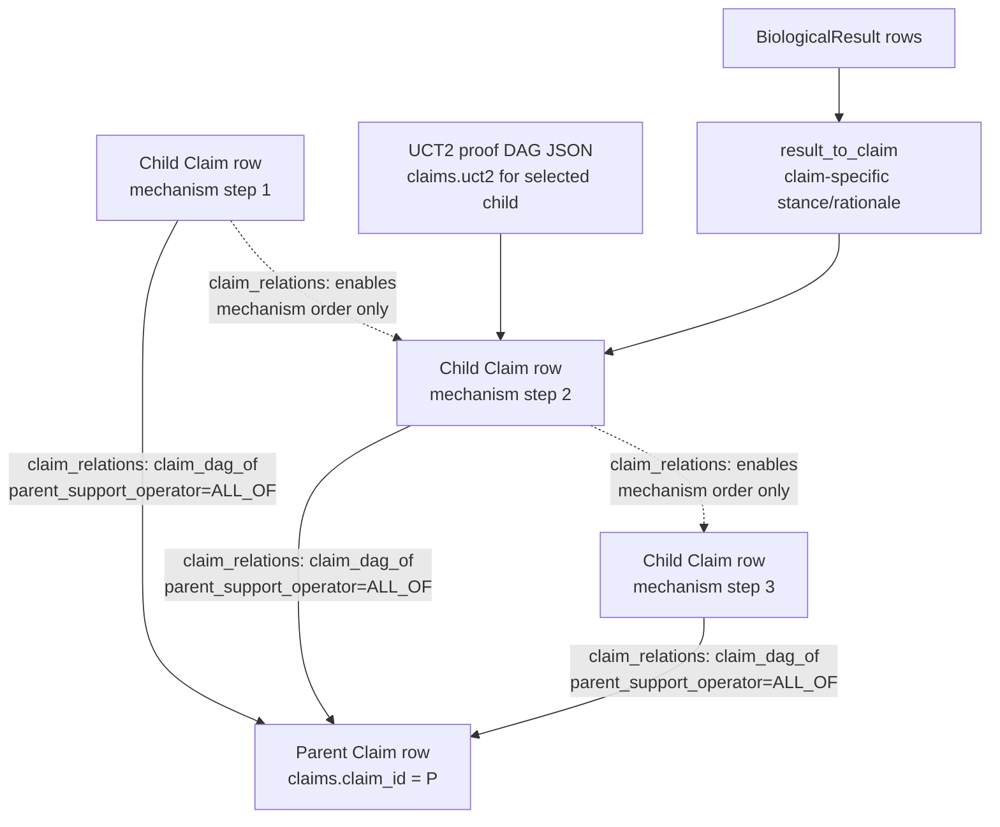
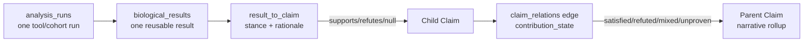
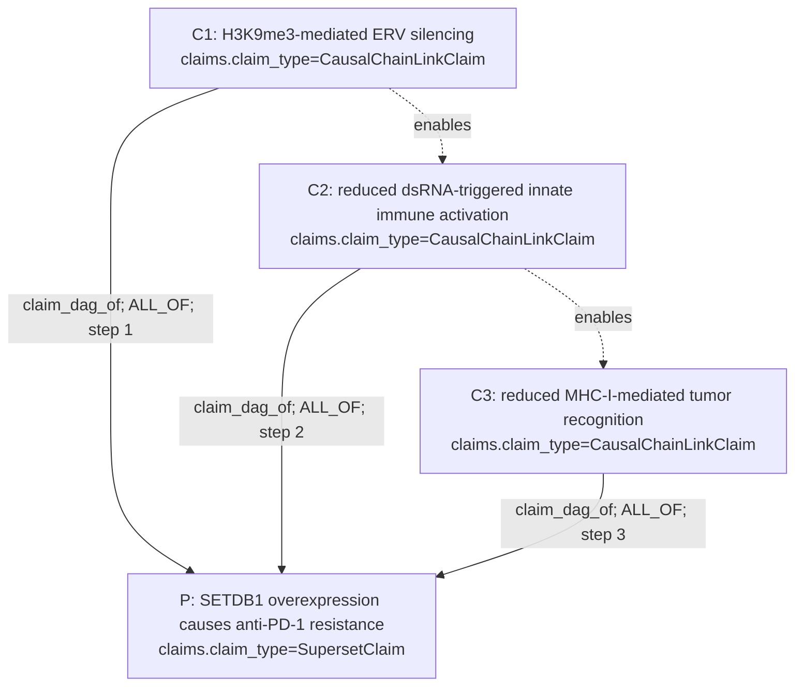
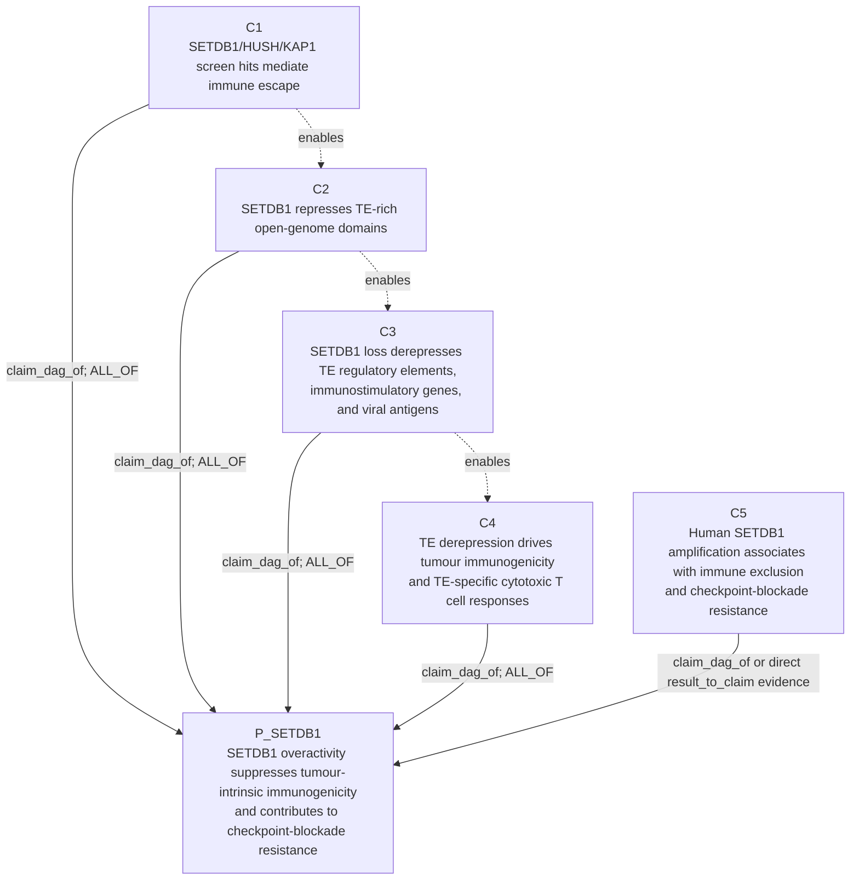
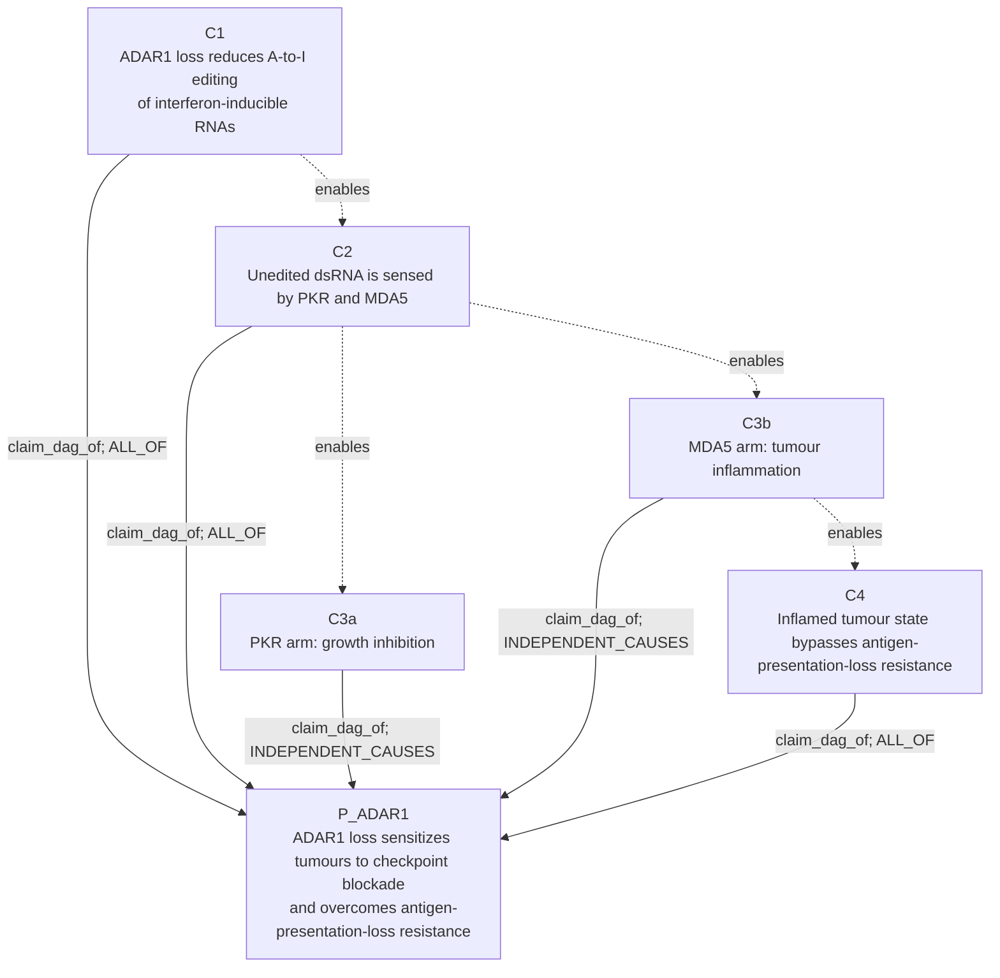
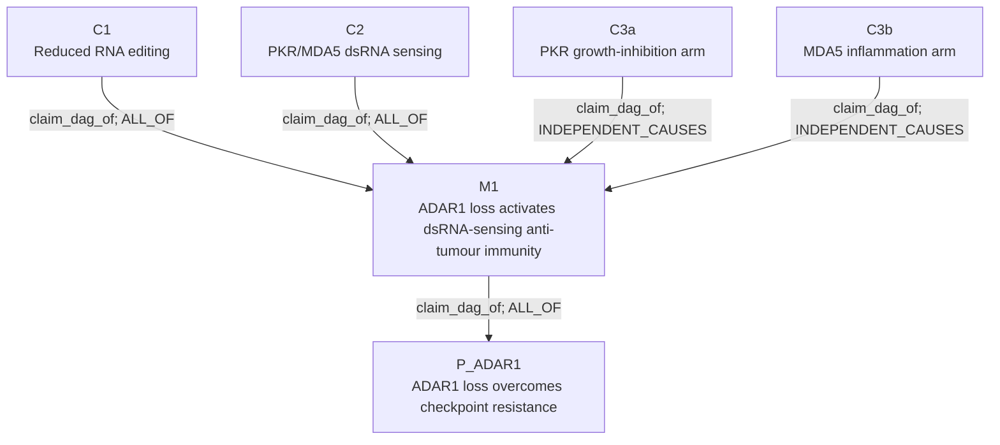

# Claim Object and Mechanism DAG Examples

Status: current `get-biology-done-proof-dag` fork, May 6, 2026.

This is a more organized companion to the older claim architecture notes. It
focuses on one question: when a paper or agent states a parent biological
claim, where do the mechanism child claims live, what DAG is that, and how does
proof evidence attach to it?

## 1. The Short Version

A `Claim` is the truth object. It is not just an edge label. It is a row in
`claims` with text, relation, context, participants, status, evidence rollups,
and optional proof-search state.

There are two different DAGs:

| DAG | What it means | Where it lives | Main edge direction |
|---|---|---|---|
| Claim DAG / UCT1 truth DAG | Which biological subclaims, mechanisms, context splits, or alternatives make a parent claim true or false | `claims` plus `claim_relations` | child claim -> parent claim |
| UCT2 proof DAG | Which proof obligations and evidence routes should be tried for one focal claim | JSON in `claims.uct2` | proof node -> proof/verdict policy, inside JSON |

The claim DAG is the biological mechanism structure. UCT2 is the local proof
strategy for one selected claim in that structure.



The important rule is that `claim_dag_of` points from child to parent. The
`enables` edges can record mechanistic order, but they do not by themselves say
that a child supports the parent.

## 2. Current Storage Map

The proof-DAG fork currently uses these stores for the claim object:

| Store | Role |
|---|---|
| `claims` | One row per biological assertion. Holds `claim_text`, `relation_name`, `relation_polarity`, context, lifecycle status, generated `narrative`, and `uct2` proof-search JSON. |
| `claim_participants` | Entity participants for a claim: effector gene, target gene, therapy context, outcome, cancer type, cell type, pathway, confounder, and related roles. |
| `claim_relations` | Typed claim-to-claim edges. This is where the biological claim DAG lives. Structural DAG edge types include `claim_dag_of`, `chain_dag_of`, `branches_from`, `context_split_of`, `mediator_specific_of`, `polarity_inverse_of`, and `split_of`. |
| `analysis_runs` | Claim-agnostic computational work: tool, provider, datasets, params, code version, artifacts, and timing. |
| `biological_results` | Reusable result rows produced by analysis runs. The legacy `claim_id` is only the originating claim, not the sole meaning of the result. |
| `result_to_claim` | Claim-specific interpretation of one result: `supports`, `refutes`, `null`, or `inconclusive`, with relevance, context fit, proof node, rationale, and quality metadata. |
| `support_sets` | AND-grouped bundles of evidence ids for older/noisy-or scoring paths. |
| `publication_support` | Literature authority and novelty rollup for a claim. |

Current code reference points:

| Concern | File |
|---|---|
| Claim dataclasses | `src/gbd/knowledge_graph/schema.py` |
| SQLite tables and claim narrative rollup | `src/gbd/knowledge_graph/graph.py` |
| Claim DAG construction and UCT1 child selection | `src/gbd/core/claim_dag.py` |
| UCT2 proof state and proof DAG | `src/gbd/core/uct2.py` |
| Runtime proof iteration over selected child claims | `src/gbd/core/uct2_runner.py` |

## 3. Claim Row Shape

The minimal useful parent claim row:

```json
{
  "claim_id": "paper:setdb1-immune-evasion",
  "claim_type": "SupersetClaim",
  "claim_text": "SETDB1 overactivity in tumour cells suppresses tumour-intrinsic immunogenicity and contributes to immune-checkpoint-blockade resistance.",
  "relation_name": "suppresses_tumor_intrinsic_immunogenicity",
  "relation_polarity": "negative",
  "context_set_json": {
    "cell_type": "tumor_cell",
    "therapy": "immune_checkpoint_blockade"
  },
  "evidence_status": "draft",
  "prior_art_status": "canonical",
  "review_status": "clean"
}
```

The minimal useful child claim row:

```json
{
  "claim_id": "paper:setdb1-immune-evasion:child:te-silencing",
  "claim_type": "CausalChainLinkClaim",
  "claim_text": "SETDB1 represses transposable-element-rich genomic domains in tumour cells.",
  "relation_name": "mechanism_subclaim_of",
  "relation_polarity": "positive",
  "context_set_json": {
    "cell_type": "tumor_cell"
  }
}
```

The edge that makes the child part of the parent mechanism:

```json
{
  "source_claim_id": "paper:setdb1-immune-evasion:child:te-silencing",
  "target_claim_id": "paper:setdb1-immune-evasion",
  "relation_type": "claim_dag_of",
  "relation_context_set_json": {
    "cell_type": "tumor_cell",
    "therapy": "immune_checkpoint_blockade"
  },
  "properties": {
    "parent_support_operator": "ALL_OF",
    "path_support_operator": "ALL_OF",
    "dag_edge_status": "active",
    "claim_dag_node_kind": "mechanism_step",
    "step_index": 2,
    "multi_true_allowed": true,
    "composition": "required"
  }
}
```

`parent_claim_id` still exists on some Python dataclass and legacy payload
paths, but the current persistence boundary is `claim_relations`. Do not rely
on a parent column in `claims` to reconstruct the real DAG.

## 4. Edge Semantics

Use these structural edges for parent/child truth structure:

| Relation type | Direction | Use |
|---|---|---|
| `claim_dag_of` | child -> parent | Canonical child-in-parent mechanism or support DAG edge. |
| `chain_dag_of` | child -> parent | Legacy alias accepted by readers. New writers should use `claim_dag_of`. |
| `branches_from` | child -> parent | Alternative or parallel biological branch. |
| `context_split_of` | narrowed child -> broader parent | Parent narrowed to one context value. |
| `mediator_specific_of` | mediator-specific child -> parent | A mechanism specialized to one mediator. |
| `polarity_inverse_of` | inverse child -> parent | Opposite-polarity child for disproof tracking. |
| `split_of` | split child -> parent | Legacy context split. |
| `enables` | upstream child -> downstream child | Mechanistic order between child claims; not a parent-support edge. |

Use these `properties.parent_support_operator` values to say how children
compose into the parent:

| Operator | Meaning |
|---|---|
| `ALL_OF` | Every active child must be satisfied for the parent mechanism path to be satisfied. |
| `ANY_OF` | One supported child is enough. |
| `K_OF_N` | At least `min_required` supported children are enough. |
| `INDEPENDENT_CAUSES` | Multiple mechanisms can each independently support the parent. More than one may be true. |
| `MUTUALLY_EXCLUSIVE_ALTERNATIVES` | Exactly one alternative should win in a context; more than one supported child means the claim needs disambiguation. |

## 5. How Evidence Propagates

Evidence is interpreted at the child or parent claim, not at a generic edge.



`KnowledgeGraph.refresh_claim_narrative()` walks direct evidence and active
child DAG edges. A supported child becomes `contribution_state=satisfied`
unless the child/parent context is incompatible. Parent narratives then say
whether the child DAG is satisfied, blocked, mixed, or still unproven.

## 6. Local Runtime Example: Current SETDB1 Claim DAG

The most recent local runtime KG inspected for this doc is:

```text
reports/setdb1-claimdag-uct-e2e-20260506-183639/runtime_kg/setdb1-claimdag-uct-e2e-20260506-183639-iter01.db
```

Parent claim:

```text
setdb1-claimdag-uct-e2e-20260506-183639
SETDB1 overexpression in tumor cells causes resistance to anti-PD-1 therapy
by H3K9me3-mediated silencing of endogenous retroviruses and
antigen-presentation genes, reducing dsRNA-triggered innate immune activation
and MHC-I-mediated tumor recognition.
```

Child claims currently created by `ensure_claim_dag_for_claim()`:

| Child claim id suffix | Child text | Edge to parent |
|---|---|---|
| `__claim-dag-1-45dd9a61` | H3K9me3-mediated ERV silencing | `claim_dag_of`, `ALL_OF`, step 1 |
| `__claim-dag-2-8e4a2d70` | reduced dsRNA-triggered innate immune activation | `claim_dag_of`, `ALL_OF`, step 2 |
| `__claim-dag-3-4f54bf65` | reduced MHC-I-mediated tumor recognition | `claim_dag_of`, `ALL_OF`, step 3 |



At the time inspected, the parent narrative said the `ALL_OF` DAG was not yet
satisfied because 0 of 3 children were satisfied. That is exactly the expected
state for a freshly created mechanism DAG before UCT2 proof runs attach results
to the child claims.

The query shape:

```sql
SELECT source_claim_id, target_claim_id, relation_type, properties
FROM claim_relations
WHERE target_claim_id = 'setdb1-claimdag-uct-e2e-20260506-183639'
ORDER BY created_at;
```

## 7. Nature Example 1: SETDB1 Epigenetic Checkpoint

Source paper: Griffin et al., "Epigenetic silencing by SETDB1 suppresses
tumour intrinsic immunogenicity", Nature 595, 309-314 (2021),
https://www.nature.com/articles/s41586-021-03520-4.

Nature page facts used here: the article was published on May 5, 2021; the
abstract reports in vivo CRISPR-Cas9 chromatin-regulator screens, identifies
SETDB1/HUSH/KAP1 complex members as immune-escape mediators, connects SETDB1
amplification with immune exclusion and checkpoint-blockade resistance in human
tumours, and describes SETDB1 loss derepressing TE-derived regulatory elements,
immunostimulatory genes, TE-encoded retroviral antigens, and TE-specific
cytotoxic T cell responses.

### Parent Claim

```text
P_SETDB1:
SETDB1 overactivity in tumour cells suppresses tumour-intrinsic
immunogenicity and contributes to immune-checkpoint-blockade resistance.
```

### Mechanism Child Claims

| Child | Claim text | Suggested relation to parent |
|---|---|---|
| C1 | SETDB1 and associated repressive chromatin machinery mediate immune escape in checkpoint-treated tumour models. | `claim_dag_of`, `ALL_OF`, screen/entry step |
| C2 | SETDB1 represses broad open-genome domains enriched for transposable elements and immune clusters. | `claim_dag_of`, `ALL_OF`, chromatin mechanism |
| C3 | SETDB1 loss derepresses latent TE-derived regulatory elements, immunostimulatory genes, and TE-encoded retroviral antigens. | `claim_dag_of`, `ALL_OF`, molecular consequence |
| C4 | TE derepression creates tumour-intrinsic immunogenicity and TE-specific cytotoxic T cell responses in vivo. | `claim_dag_of`, `ALL_OF`, immune consequence |
| C5 | SETDB1 amplification in human tumours is associated with immune exclusion and resistance to immune checkpoint blockade. | direct parent evidence or `claim_dag_of` as human-context bridge |

### DAG Visualization



### How To Store This Example

Parent row:

```json
{
  "claim_id": "paper:nature-2021-setdb1:P",
  "claim_type": "SupersetClaim",
  "relation_name": "suppresses_tumor_intrinsic_immunogenicity",
  "relation_polarity": "negative",
  "claim_text": "SETDB1 overactivity in tumour cells suppresses tumour-intrinsic immunogenicity and contributes to immune-checkpoint-blockade resistance.",
  "context_set_json": {
    "cell_type": "tumor_cell",
    "therapy": "immune_checkpoint_blockade"
  }
}
```

Child edge example:

```json
{
  "source_claim_id": "paper:nature-2021-setdb1:C3",
  "target_claim_id": "paper:nature-2021-setdb1:P",
  "relation_type": "claim_dag_of",
  "rationale": "TE and immune-gene derepression is a required mechanism step for the parent SETDB1 immune-evasion claim.",
  "properties": {
    "parent_support_operator": "ALL_OF",
    "path_support_operator": "ALL_OF",
    "claim_dag_node_kind": "mechanism_step",
    "step_index": 3,
    "dag_edge_status": "active",
    "composition": "required"
  }
}
```

## 8. Nature Example 2: ADAR1 Loss and Checkpoint Resistance

Source paper: Ishizuka et al., "Loss of ADAR1 in tumours overcomes resistance
to immune checkpoint blockade", Nature 565, 43-48 (2019),
https://www.nature.com/articles/s41586-018-0768-9.

Nature page facts used here: the article was published on December 17, 2018;
the abstract states that tumour-cell ADAR1 loss sensitizes tumours to
immunotherapy, reduces A-to-I editing of interferon-inducible RNAs, promotes
dsRNA sensing by PKR and MDA5, produces growth inhibition and tumour
inflammation, and overcomes PD-1 resistance caused by impaired antigen
presentation. The figure list names a dsRNA-sensing mechanism through MDA5 and
PKR and a resistance-overcoming result under antigen-presentation loss.

### Parent Claim

```text
P_ADAR1:
Loss of tumour-cell ADAR1 sensitizes tumours to immune-checkpoint blockade and
can overcome PD-1 resistance caused by antigen-presentation loss.
```

### Mechanism Child Claims

| Child | Claim text | Suggested relation to parent |
|---|---|---|
| C1 | ADAR1 loss reduces A-to-I editing of interferon-inducible RNA species. | `claim_dag_of`, `ALL_OF`, upstream molecular step |
| C2 | Reduced RNA editing permits endogenous dsRNA ligand sensing by PKR and MDA5. | `claim_dag_of`, `ALL_OF`, sensor activation step |
| C3a | PKR activation contributes to tumour-cell growth inhibition. | `claim_dag_of`, `INDEPENDENT_CAUSES` under dsRNA-sensing branch |
| C3b | MDA5 activation contributes to tumour inflammation. | `claim_dag_of`, `INDEPENDENT_CAUSES` under dsRNA-sensing branch |
| C4 | Tumour inflammation can bypass the usual need for intact CD8 T cell recognition of cancer cells when antigen presentation is impaired. | `claim_dag_of`, `ALL_OF`, resistance-bypass step |

### DAG Visualization



The PKR and MDA5 arms are not mutually exclusive. In this claim object they
should not be represented as XOR alternatives. They are better represented as
parallel mechanism children with `multi_true_allowed=true`, or as children
under an intermediate superset claim called `ADAR1 loss activates dsRNA
sensing`.

### Optional Multilevel Version

If the parent is too broad, introduce an intermediate mechanism parent:



This is often cleaner for papers where the mechanism has a molecular sub-DAG
and the parent claim is a therapy-response claim.

## 9. Parent Claim vs Child Claim vs Proof Node

Do not collapse these three objects:

| Object | Example | Storage |
|---|---|---|
| Parent claim | "ADAR1 loss overcomes checkpoint resistance." | `claims` row |
| Child claim | "ADAR1 loss reduces A-to-I editing of interferon-inducible RNAs." | another `claims` row |
| Proof node | "Find perturbational RNA-editing evidence for this child claim." | `claims.uct2.proof_dag.proof_nodes[]` for the selected child |

A child claim is a biological assertion that can remain in the KG. A proof node
is a temporary proof obligation or evidence route for one focal claim.

## 10. Minimal SQL To Inspect A Claim DAG

Find parent and children:

```sql
SELECT
  cr.relation_type,
  cr.source_claim_id AS child_claim_id,
  child.claim_text AS child_text,
  cr.target_claim_id AS parent_claim_id,
  parent.claim_text AS parent_text,
  cr.properties
FROM claim_relations cr
LEFT JOIN claims child ON child.claim_id = cr.source_claim_id
LEFT JOIN claims parent ON parent.claim_id = cr.target_claim_id
WHERE cr.target_claim_id = '<parent_claim_id>'
  AND cr.relation_type IN (
    'claim_dag_of',
    'chain_dag_of',
    'branches_from',
    'context_split_of',
    'mediator_specific_of',
    'polarity_inverse_of',
    'split_of'
  )
ORDER BY cr.created_at, cr.source_claim_id;
```

Find the proof DAG for one selected child:

```sql
SELECT claim_id, uct2
FROM claims
WHERE claim_id = '<selected_child_claim_id>';
```

Find evidence attached to one child:

```sql
SELECT
  rtc.claim_id,
  rtc.result_id,
  rtc.stance,
  rtc.relevance,
  rtc.context_fit,
  rtc.proof_node_id,
  rtc.rationale_text,
  br.assay,
  br.provider,
  br.effect_size,
  br.p_value,
  br.n
FROM result_to_claim rtc
JOIN biological_results br ON br.result_id = rtc.result_id
WHERE rtc.claim_id = '<child_claim_id>'
  AND rtc.attached = 1;
```

## 11. Checklist For Adding A Paper Mechanism As Claims

1. Write the parent claim as one falsifiable biological assertion.
2. Split the mechanism into child claims only where each child can be proved or
   refuted independently.
3. Store every child as a `claims` row, usually `CausalChainLinkClaim` or
   `SupersetClaim`.
4. Add child -> parent `claim_dag_of` edges in `claim_relations`.
5. Use `enables` only for order between child claims.
6. Put composition on the edge: `ALL_OF`, `ANY_OF`, `K_OF_N`,
   `INDEPENDENT_CAUSES`, or `MUTUALLY_EXCLUSIVE_ALTERNATIVES`.
7. Put context on both the claim rows and `relation_context_set_json`; let
   context compatibility prevent a supported child from incorrectly satisfying
   an incompatible parent.
8. Attach results through `result_to_claim`, not by duplicating results per
   claim.
9. Let UCT2 create proof obligations under the currently selected child claim.
10. Read the parent `narrative` to see the live DAG rollup.

