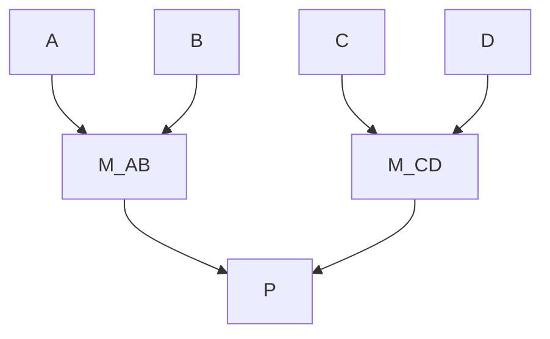
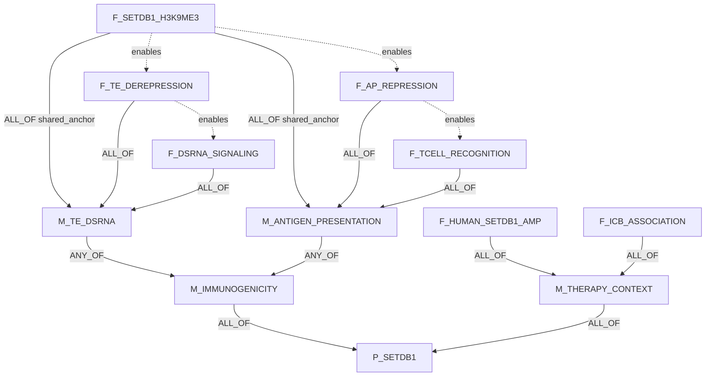
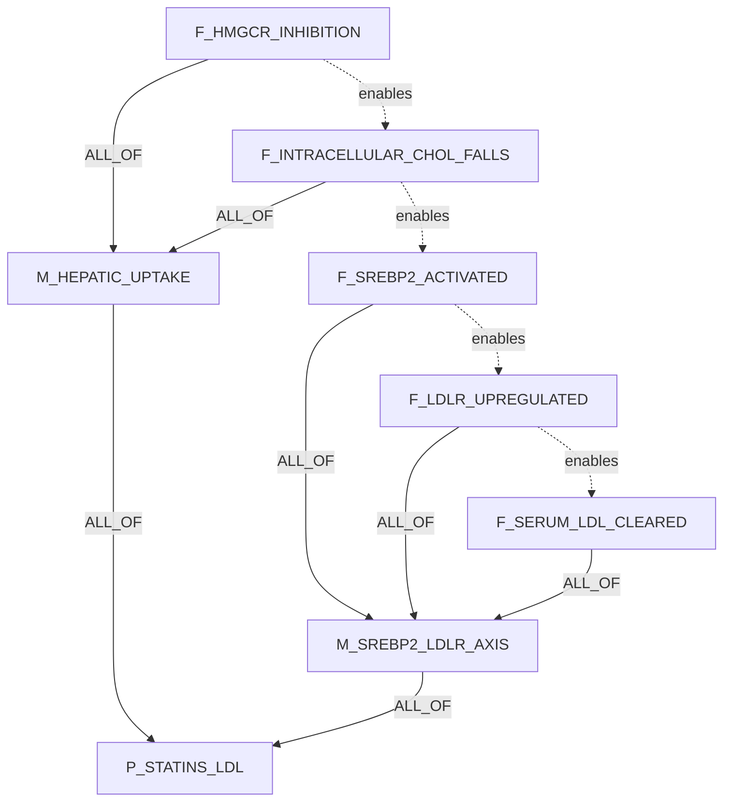
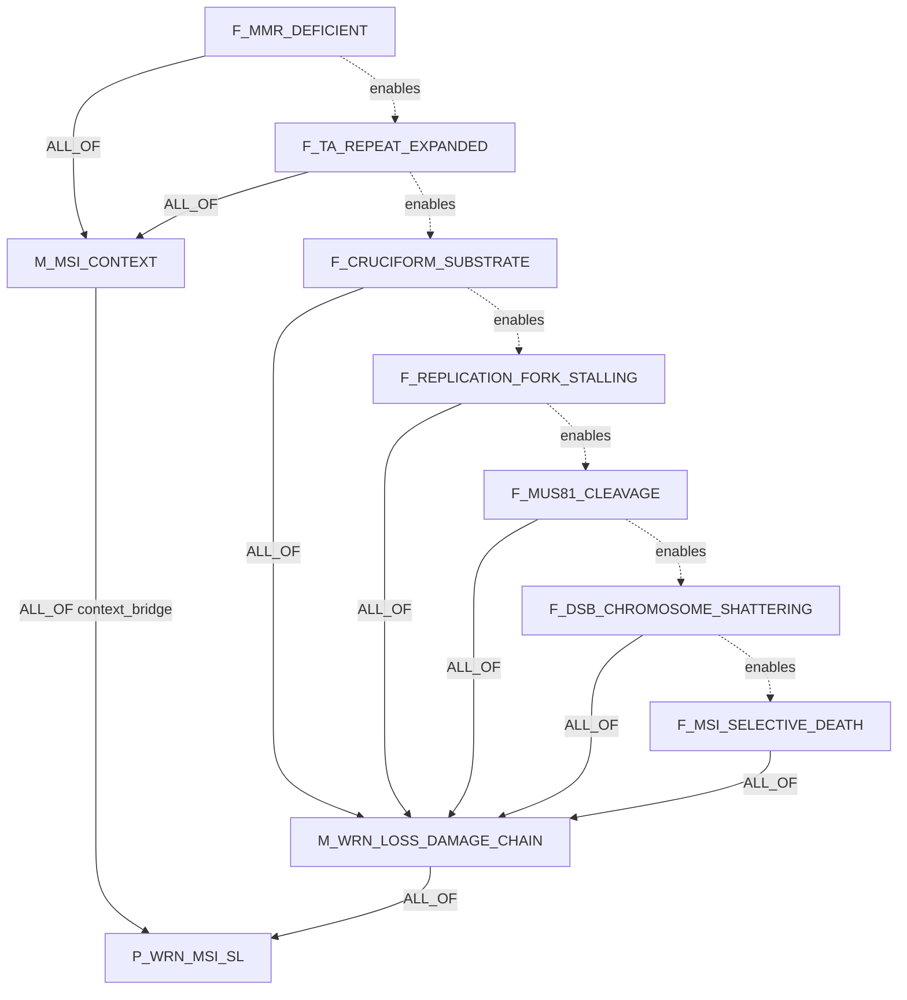
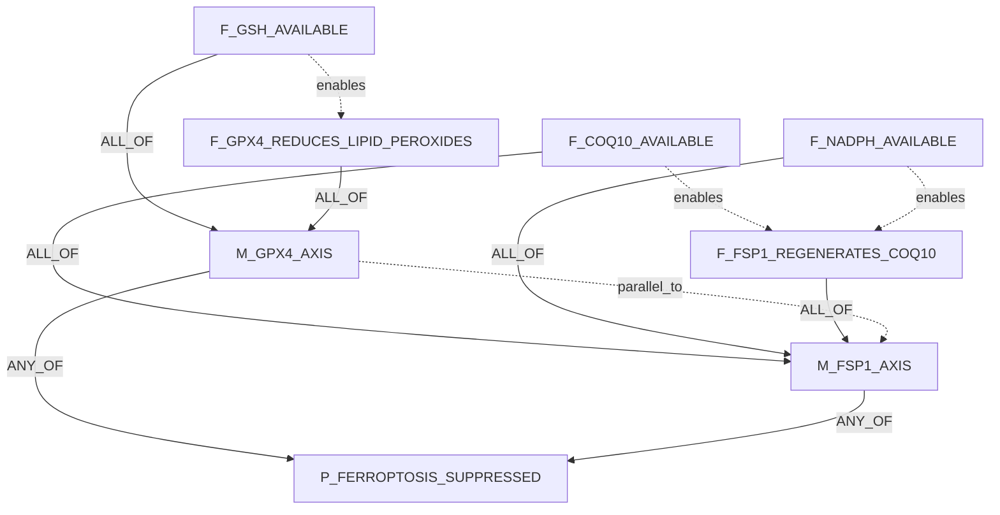
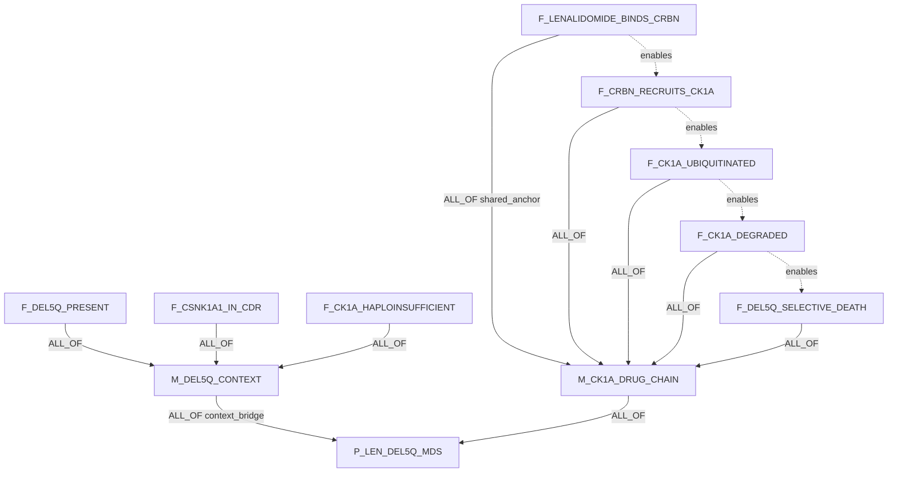
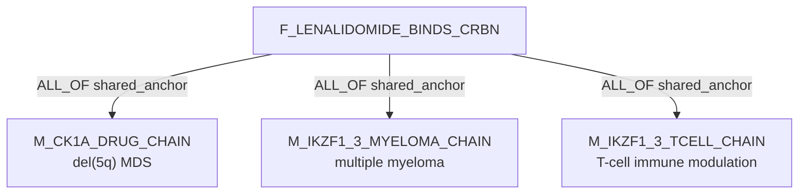
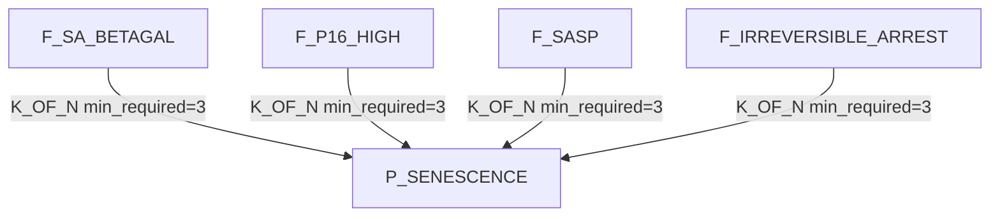
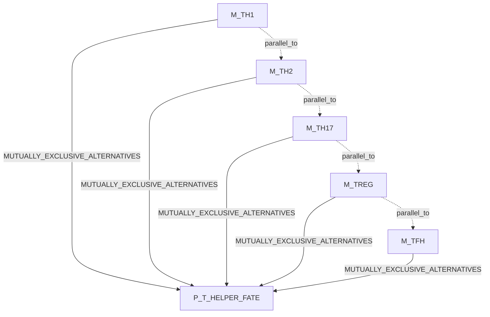
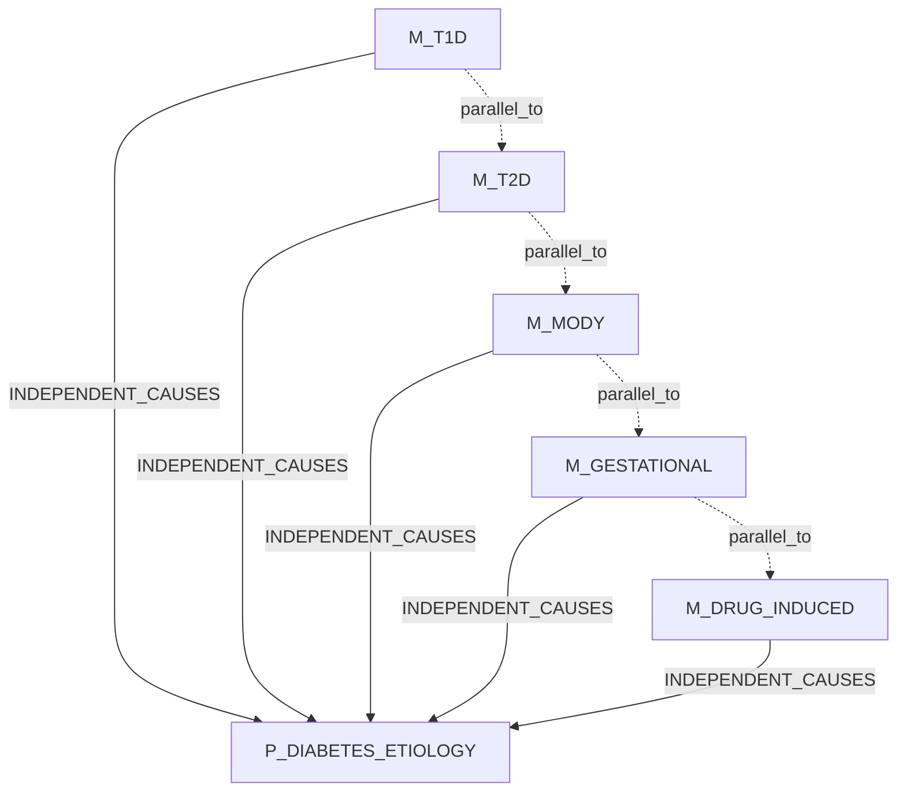

# Claim Object Mechanism DAG Examples

These examples use the target three-table design:

```text
claims                     biological assertions
claim_decomposition_edges  proof DAG edges and Boolean operators
claim_relations            semantic relations such as enables/refines/parallel_to
```

`claim_type` is not used for proof decisions.

## Key

### Claim Fields

Each example lists the claim rows first.

| Column | Meaning |
|---|---|
| `ID` | Stable claim id used in diagrams. |
| `claim_text` | Full assertion text. |
| `participants` | Free-text participants: subject, object, context, phenotype. |
| `relation_name` | Predicate on the claim. |
| `polarity` | `positive`, `negative`, `null_hypothesis`, or `unknown`. |
| `context/properties` | Context and non-proof metadata. DAG role does not live here. |

### Edge Fields

Solid arrows are `claim_decomposition_edges`.

| Field | Meaning |
|---|---|
| `source_claim_id -> target_claim_id` | Child/module supports target. |
| `support_operator` | `ALL_OF`, `ANY_OF`, `K_OF_N`, `INDEPENDENT_CAUSES`, `MUTUALLY_EXCLUSIVE_ALTERNATIVES`. |
| `source_role` | `shared_anchor`, `required_step`, `sufficient_module`, `context_bridge`, `ordinary_child`. |
| `group_id` | Mechanism/pathway group. |

Dotted arrows are `claim_relations`. They are semantic only and do not roll up
parent truth.

## Pattern: Reify Mixed Logic

Do not store mixed operators at one target:

```text
bad: P = (A AND B) OR (C AND D)
```

Store modules:

```text
M_AB = A AND B
M_CD = C AND D
P = M_AB OR M_CD
```



## 1. SETDB1 Shared Anchor

Formula:

```text
P_SETDB1 = M_IMMUNOGENICITY AND M_THERAPY_CONTEXT
M_IMMUNOGENICITY = M_TE_DSRNA OR M_ANTIGEN_PRESENTATION
M_TE_DSRNA = F_SETDB1_H3K9ME3 AND F_TE_DEREPRESSION AND F_DSRNA_SIGNALING
M_ANTIGEN_PRESENTATION = F_SETDB1_H3K9ME3 AND F_AP_REPRESSION AND F_TCELL_RECOGNITION
M_THERAPY_CONTEXT = F_HUMAN_SETDB1_AMP AND F_ICB_ASSOCIATION
```

Claims:

| ID | claim_text | participants | relation_name | relation_polarity | context/properties |
|---|---|---|---|---|---|
| `P_SETDB1` | SETDB1 overactivity suppresses tumor-intrinsic immunogenicity and can contribute to immune-checkpoint-blockade resistance. | SETDB1; tumor cell; immunogenicity; immune-checkpoint blockade response | `suppresses_immunogenicity_and_contributes_to_resistance` | `positive` | tumor_intrinsic=true; therapy=ICB |
| `M_IMMUNOGENICITY` | SETDB1 suppresses tumor immunogenicity through TE/dsRNA or antigen-presentation mechanisms. | SETDB1; tumor immunogenicity; TE/dsRNA arm; antigen-presentation arm | `suppresses` | `negative` | module=true |
| `M_TE_DSRNA` | SETDB1 suppresses viral-mimicry signaling through TE repression. | SETDB1; transposable elements; dsRNA signaling | `suppresses` | `negative` | module=true |
| `M_ANTIGEN_PRESENTATION` | SETDB1 suppresses antigen-presentation-mediated T-cell recognition. | SETDB1; antigen presentation; cytotoxic T cells | `suppresses` | `negative` | module=true |
| `M_THERAPY_CONTEXT` | SETDB1 status is relevant to human ICB resistance context. | SETDB1 amplification; human tumors; ICB response | `associates_with` | `positive` | module=true |
| `F_SETDB1_H3K9ME3` | SETDB1 imposes repressive H3K9me3/heterochromatin at immune-relevant repetitive or open-genome regions. | SETDB1; H3K9me3; repetitive/open-genome regions; tumor cell | `increases` | `positive` | shared anchor |
| `F_TE_DEREPRESSION` | SETDB1 loss derepresses transposable-element-derived RNAs or regulatory elements. | SETDB1 loss; TE-derived RNAs/elements; tumor cell | `derepresses` | `positive` | TE arm |
| `F_DSRNA_SIGNALING` | TE derepression increases dsRNA/viral-mimicry or inflammatory signaling. | TE derepression; dsRNA; viral mimicry; inflammatory signaling | `increases` | `positive` | TE arm |
| `F_AP_REPRESSION` | SETDB1 activity represses antigen-presentation-related loci or MHC-I pathway output. | SETDB1; antigen-presentation loci; MHC-I output | `represses` | `negative` | AP arm |
| `F_TCELL_RECOGNITION` | Reduced antigen presentation lowers tumor recognition by cytotoxic T cells. | antigen presentation; cytotoxic T cells; tumor recognition | `lowers` | `negative` | AP arm |
| `F_HUMAN_SETDB1_AMP` | SETDB1 amplification or overactivity occurs in human tumors in the claimed context. | SETDB1; human tumors | `occurs_in` | `positive` | human context |
| `F_ICB_ASSOCIATION` | SETDB1 amplification or overactivity associates with immune exclusion or ICB resistance. | SETDB1; immune exclusion; ICB resistance | `associates_with` | `positive` | human context |

Decomposition edges:

| source -> target | operator | source_role | group_id |
|---|---|---|---|
| `M_IMMUNOGENICITY -> P_SETDB1` | `ALL_OF` | `required_step` | `setdb1_parent` |
| `M_THERAPY_CONTEXT -> P_SETDB1` | `ALL_OF` | `context_bridge` | `setdb1_parent` |
| `M_TE_DSRNA -> M_IMMUNOGENICITY` | `ANY_OF` | `sufficient_module` | `immune_arm_choice` |
| `M_ANTIGEN_PRESENTATION -> M_IMMUNOGENICITY` | `ANY_OF` | `sufficient_module` | `immune_arm_choice` |
| `F_SETDB1_H3K9ME3 -> M_TE_DSRNA` | `ALL_OF` | `shared_anchor` | `te_dsrna` |
| `F_SETDB1_H3K9ME3 -> M_ANTIGEN_PRESENTATION` | `ALL_OF` | `shared_anchor` | `antigen_presentation` |
| all other fact edges | `ALL_OF` | `required_step` | matching module |

Semantic claim_relations:

| source -> target | relation_kind |
|---|---|
| `F_SETDB1_H3K9ME3 -> F_TE_DEREPRESSION` | `enables` |
| `F_TE_DEREPRESSION -> F_DSRNA_SIGNALING` | `enables` |
| `F_SETDB1_H3K9ME3 -> F_AP_REPRESSION` | `enables` |
| `F_AP_REPRESSION -> F_TCELL_RECOGNITION` | `enables` |



Source: Griffin et al., Nature 2021, https://www.nature.com/articles/s41586-021-03520-4

## 2. Statins Lower LDL: Context-Free ALL_OF

Formula:

```text
P_STATINS_LDL = M_HEPATIC_UPTAKE AND M_SREBP2_LDLR_AXIS
M_HEPATIC_UPTAKE = F_HMGCR_INHIBITION AND F_INTRACELLULAR_CHOL_FALLS
M_SREBP2_LDLR_AXIS = F_SREBP2_ACTIVATED AND F_LDLR_UPREGULATED AND F_SERUM_LDL_CLEARED
```

Claims:

| ID | claim_text | participants | relation_name | relation_polarity | context/properties |
|---|---|---|---|---|---|
| `P_STATINS_LDL` | Statins lower serum LDL cholesterol through hepatic cholesterol synthesis inhibition and LDL receptor upregulation. | statins; hepatocytes; serum LDL cholesterol | `lowers` | `negative` | drug class=statin |
| `M_HEPATIC_UPTAKE` | Statins reduce intracellular hepatic cholesterol synthesis. | statins; HMGCR; hepatocyte cholesterol | `reduces` | `negative` | module=true |
| `M_SREBP2_LDLR_AXIS` | Reduced hepatic cholesterol activates SREBP2 and increases LDLR-mediated LDL clearance. | cholesterol; SREBP2; LDLR; serum LDL | `increases_clearance_of` | `positive` | module=true |
| `F_HMGCR_INHIBITION` | Statins inhibit HMG-CoA reductase. | statins; HMGCR enzyme | `inhibits` | `negative` | hepatic context |
| `F_INTRACELLULAR_CHOL_FALLS` | HMGCR inhibition lowers intracellular hepatic cholesterol. | HMGCR inhibition; intracellular hepatic cholesterol | `lowers` | `negative` | hepatic context |
| `F_SREBP2_ACTIVATED` | Low intracellular cholesterol activates SREBP2 processing. | intracellular cholesterol; SREBP2 | `activates` | `positive` | hepatic context |
| `F_LDLR_UPREGULATED` | Activated SREBP2 upregulates LDL receptor expression. | SREBP2; LDLR expression | `upregulates` | `positive` | hepatic context |
| `F_SERUM_LDL_CLEARED` | Increased LDLR clears LDL particles from serum. | LDLR; serum LDL particles | `clears` | `positive` | hepatic context |

Decomposition: every listed edge uses `ALL_OF`.

Semantic claim_relations:

```text
F_HMGCR_INHIBITION enables F_INTRACELLULAR_CHOL_FALLS
F_INTRACELLULAR_CHOL_FALLS enables F_SREBP2_ACTIVATED
F_SREBP2_ACTIVATED enables F_LDLR_UPREGULATED
F_LDLR_UPREGULATED enables F_SERUM_LDL_CLEARED
```



Use this as the reference chain without a separate genotype/context anchor.

## 3. WRN / MSI Synthetic Lethality

Formula:

```text
P_WRN_MSI_SL = M_MSI_CONTEXT AND M_WRN_LOSS_DAMAGE_CHAIN
M_MSI_CONTEXT = F_MMR_DEFICIENT AND F_TA_REPEAT_EXPANDED
M_WRN_LOSS_DAMAGE_CHAIN =
  F_CRUCIFORM_SUBSTRATE AND F_REPLICATION_FORK_STALLING AND
  F_MUS81_CLEAVAGE AND F_DSB_CHROMOSOME_SHATTERING AND F_MSI_SELECTIVE_DEATH
```

Claims:

| ID | claim_text | participants | relation_name | relation_polarity | context/properties |
|---|---|---|---|---|---|
| `P_WRN_MSI_SL` | WRN loss or inhibition selectively kills microsatellite-unstable cancer cells. | WRN; MSI cancer cells; viability | `selectively_kills` | `positive` | context=MSI |
| `M_MSI_CONTEXT` | MMR deficiency creates an MSI repeat-expansion context. | mismatch repair; microsatellite instability; TA repeats | `creates_context_for` | `positive` | context_bridge |
| `M_WRN_LOSS_DAMAGE_CHAIN` | WRN loss converts expanded repeat structures into lethal DNA damage. | WRN loss; repeat structures; DNA damage; cell death | `causes` | `positive` | module=true |
| `F_MMR_DEFICIENT` | The cancer context is mismatch-repair deficient. | mismatch-repair pathway; cancer cell | `is_deficient_in` | `negative` | context anchor |
| `F_TA_REPEAT_EXPANDED` | TA-dinucleotide repeat expansions are present in the MSI genome. | TA repeats; MSI genome | `contains_expansions_of` | `positive` | context anchor |
| `F_CRUCIFORM_SUBSTRATE` | Expanded TA repeats form cruciform-like non-B DNA structures. | expanded TA repeats; cruciform DNA | `forms` | `positive` | substrate |
| `F_REPLICATION_FORK_STALLING` | Repeat-derived structures stall replication forks and require WRN-dependent resolution. | cruciform DNA; replication fork; WRN | `stalls` | `positive` | damage chain |
| `F_MUS81_CLEAVAGE` | Without WRN, MUS81 cleaves stalled repeat-derived substrates. | WRN loss; MUS81; stalled substrate | `cleaves` | `positive` | damage chain |
| `F_DSB_CHROMOSOME_SHATTERING` | MUS81 cleavage produces DSBs and chromosome shattering. | MUS81 cleavage; DSBs; chromosomes | `causes` | `positive` | damage chain |
| `F_MSI_SELECTIVE_DEATH` | The DNA damage response produces MSI-selective growth arrest or death. | DNA damage; MSI cells; cell death | `causes` | `positive` | phenotype |

Decomposition:

| source -> target | operator | source_role | group_id |
|---|---|---|---|
| `M_MSI_CONTEXT -> P_WRN_MSI_SL` | `ALL_OF` | `context_bridge` | `wrn_parent` |
| `M_WRN_LOSS_DAMAGE_CHAIN -> P_WRN_MSI_SL` | `ALL_OF` | `required_step` | `wrn_parent` |
| context facts -> `M_MSI_CONTEXT` | `ALL_OF` | `required_step` | `msi_context` |
| damage-chain facts -> `M_WRN_LOSS_DAMAGE_CHAIN` | `ALL_OF` | `required_step` | `wrn_damage` |

Semantic claim_relations:

```text
F_MMR_DEFICIENT enables F_TA_REPEAT_EXPANDED
F_TA_REPEAT_EXPANDED enables F_CRUCIFORM_SUBSTRATE
F_CRUCIFORM_SUBSTRATE enables F_REPLICATION_FORK_STALLING
F_REPLICATION_FORK_STALLING enables F_MUS81_CLEAVAGE
F_MUS81_CLEAVAGE enables F_DSB_CHROMOSOME_SHATTERING
F_DSB_CHROMOSOME_SHATTERING enables F_MSI_SELECTIVE_DEATH
```



Sources:

- Chan et al., Nature 2019, https://www.nature.com/articles/s41586-019-1102-x
- van Wietmarschen et al., Nature 2020, https://www.nature.com/articles/s41586-020-2769-8

## 4. FSP1 / GPX4 Ferroptosis Suppression

Formula:

```text
P_FERROPTOSIS_SUPPRESSED = M_GPX4_AXIS OR M_FSP1_AXIS
M_GPX4_AXIS = F_GSH_AVAILABLE AND F_GPX4_REDUCES_LIPID_PEROXIDES
M_FSP1_AXIS = F_COQ10_AVAILABLE AND F_NADPH_AVAILABLE AND F_FSP1_REGENERATES_COQ10
```

Claims:

| ID | claim_text | participants | relation_name | relation_polarity | context/properties |
|---|---|---|---|---|---|
| `P_FERROPTOSIS_SUPPRESSED` | Cells suppress ferroptosis by detoxifying lipid peroxides or lipid radicals. | cell; lipid peroxides/radicals; ferroptosis | `suppresses` | `negative` | parent |
| `M_GPX4_AXIS` | The GSH-GPX4 axis detoxifies lipid peroxides. | glutathione; GPX4; lipid peroxides | `detoxifies` | `negative` | sufficient module |
| `M_FSP1_AXIS` | The FSP1-CoQ-NAD(P)H axis suppresses ferroptosis independently of GPX4. | FSP1; CoQ10; NAD(P)H; lipid radicals | `suppresses` | `negative` | sufficient module |
| `F_GSH_AVAILABLE` | Glutathione is available as a GPX4 reducing cofactor. | glutathione; GPX4 | `provides_cofactor_for` | `positive` | GPX4 axis |
| `F_GPX4_REDUCES_LIPID_PEROXIDES` | GPX4 reduces phospholipid hydroperoxides. | GPX4; phospholipid hydroperoxides | `reduces` | `negative` | GPX4 axis |
| `F_COQ10_AVAILABLE` | CoQ10 is available at the membrane for FSP1-dependent redox cycling. | CoQ10; membrane; FSP1 | `is_available_to` | `positive` | FSP1 axis |
| `F_NADPH_AVAILABLE` | NAD(P)H is available as the reducing equivalent for FSP1. | NAD(P)H; FSP1 | `provides_reducing_equivalents_for` | `positive` | FSP1 axis |
| `F_FSP1_REGENERATES_COQ10` | FSP1 regenerates reduced CoQ10 to trap lipid radicals. | FSP1; CoQ10; lipid radicals | `regenerates` | `positive` | FSP1 axis |

Decomposition:

| source -> target | operator | source_role | group_id |
|---|---|---|---|
| `M_GPX4_AXIS -> P_FERROPTOSIS_SUPPRESSED` | `ANY_OF` | `sufficient_module` | `ferroptosis_choice` |
| `M_FSP1_AXIS -> P_FERROPTOSIS_SUPPRESSED` | `ANY_OF` | `sufficient_module` | `ferroptosis_choice` |
| GPX4 facts -> `M_GPX4_AXIS` | `ALL_OF` | `required_step` | `gpx4_axis` |
| FSP1 facts -> `M_FSP1_AXIS` | `ALL_OF` | `required_step` | `fsp1_axis` |

Semantic claim_relations:

| source -> target | relation_kind |
|---|---|
| `M_GPX4_AXIS -> M_FSP1_AXIS` | `parallel_to` |
| `F_GSH_AVAILABLE -> F_GPX4_REDUCES_LIPID_PEROXIDES` | `enables` |
| `F_COQ10_AVAILABLE -> F_FSP1_REGENERATES_COQ10` | `enables` |
| `F_NADPH_AVAILABLE -> F_FSP1_REGENERATES_COQ10` | `enables` |



No shared anchor is forced. GPX4 and FSP1 converge at ferroptosis suppression,
not at a clean upstream fact.

Sources:

- Bersuker et al., Nature 2019, https://www.nature.com/articles/s41586-019-1705-2
- Doll et al., Nature 2019, https://www.nature.com/articles/s41586-019-1707-0

## 5. Lenalidomide / CK1alpha In del(5q) MDS

Formula:

```text
P_LEN_DEL5Q_MDS = M_DEL5Q_CONTEXT AND M_CK1A_DRUG_CHAIN
M_DEL5Q_CONTEXT = F_DEL5Q_PRESENT AND F_CSNK1A1_IN_CDR AND F_CK1A_HAPLOINSUFFICIENT
M_CK1A_DRUG_CHAIN =
  F_LENALIDOMIDE_BINDS_CRBN AND F_CRBN_RECRUITS_CK1A AND
  F_CK1A_UBIQUITINATED AND F_CK1A_DEGRADED AND F_DEL5Q_SELECTIVE_DEATH
```

Claims:

| ID | claim_text | participants | relation_name | relation_polarity | context/properties |
|---|---|---|---|---|---|
| `P_LEN_DEL5Q_MDS` | Lenalidomide creates a therapeutic window in del(5q) MDS by degrading CK1alpha. | lenalidomide; del(5q) MDS; CK1alpha; therapeutic window | `creates_therapeutic_window_by` | `positive` | disease=del(5q) MDS |
| `M_DEL5Q_CONTEXT` | del(5q) places CSNK1A1 in the commonly deleted region and creates CK1alpha haploinsufficiency. | del(5q); CSNK1A1; CK1alpha dosage | `creates_context_for` | `positive` | context_bridge |
| `M_CK1A_DRUG_CHAIN` | Lenalidomide redirects CRBN to ubiquitinate and degrade CK1alpha. | lenalidomide; CRBN; CK1alpha; ubiquitination | `induces_degradation_of` | `negative` | drug mechanism |
| `F_DEL5Q_PRESENT` | The malignant clone carries deletion 5q. | del(5q); MDS clone | `has_genomic_lesion` | `positive` | genetic context |
| `F_CSNK1A1_IN_CDR` | CSNK1A1 lies in the del(5q) commonly deleted region. | CSNK1A1; del(5q) CDR | `is_within` | `positive` | genetic context |
| `F_CK1A_HAPLOINSUFFICIENT` | del(5q) reduces CK1alpha gene dosage. | del(5q); CSNK1A1/CK1alpha dosage | `reduces` | `negative` | genetic context |
| `F_LENALIDOMIDE_BINDS_CRBN` | Lenalidomide binds CRBN. | lenalidomide; CRBN | `binds` | `positive` | shared drug anchor |
| `F_CRBN_RECRUITS_CK1A` | Lenalidomide-bound CRBN recruits CK1alpha as a neo-substrate. | lenalidomide-bound CRBN; CK1alpha | `recruits` | `positive` | drug chain |
| `F_CK1A_UBIQUITINATED` | CRL4-CRBN ubiquitinates CK1alpha. | CRL4-CRBN; CK1alpha; ubiquitin | `ubiquitinates` | `positive` | drug chain |
| `F_CK1A_DEGRADED` | Ubiquitinated CK1alpha is degraded. | ubiquitinated CK1alpha; proteasome | `degrades` | `negative` | drug chain |
| `F_DEL5Q_SELECTIVE_DEATH` | Additional CK1alpha loss selectively impairs del(5q) MDS cells. | CK1alpha loss; del(5q) MDS cells; viability | `selectively_impairs` | `negative` | phenotype |

Decomposition:

| source -> target | operator | source_role | group_id |
|---|---|---|---|
| `M_DEL5Q_CONTEXT -> P_LEN_DEL5Q_MDS` | `ALL_OF` | `context_bridge` | `len_parent` |
| `M_CK1A_DRUG_CHAIN -> P_LEN_DEL5Q_MDS` | `ALL_OF` | `required_step` | `len_parent` |
| context facts -> `M_DEL5Q_CONTEXT` | `ALL_OF` | `required_step` | `del5q_context` |
| drug-chain facts -> `M_CK1A_DRUG_CHAIN` | `ALL_OF` | `required_step` | `ck1a_chain` |

Semantic claim_relations:

```text
F_LENALIDOMIDE_BINDS_CRBN enables F_CRBN_RECRUITS_CK1A
F_CRBN_RECRUITS_CK1A enables F_CK1A_UBIQUITINATED
F_CK1A_UBIQUITINATED enables F_CK1A_DEGRADED
F_CK1A_DEGRADED enables F_DEL5Q_SELECTIVE_DEATH
```



Cross-parent join:



Sources:

- Kronke et al., Nature 2015, https://www.nature.com/articles/nature14610
- Petzold et al., Nature 2016, https://www.nature.com/articles/nature16979

## 6. K_OF_N: Senescence Call

Formula:

```text
P_SENESCENCE = K_OF_N(3, F_SA_BETAGAL, F_P16_HIGH, F_SASP, F_IRREVERSIBLE_ARREST)
```

Claims:

| ID | claim_text | participants | relation_name | relation_polarity | context/properties |
|---|---|---|---|---|---|
| `P_SENESCENCE` | The cell population is senescent. | cell population; senescence state | `has_cell_state` | `positive` | min_required=3 |
| `F_SA_BETAGAL` | The population is positive for SA-beta-gal activity. | cell population; SA-beta-gal | `has_marker` | `positive` | senescence marker |
| `F_P16_HIGH` | The population has high p16/CDKN2A expression. | cell population; p16/CDKN2A | `has_high_expression_of` | `positive` | senescence marker |
| `F_SASP` | The population secretes a SASP-like inflammatory program. | cell population; SASP cytokines | `secretes` | `positive` | senescence marker |
| `F_IRREVERSIBLE_ARREST` | The population shows durable cell-cycle arrest. | cell population; cell-cycle arrest | `has_state` | `positive` | senescence marker |

Decomposition: all edges into `P_SENESCENCE` use `K_OF_N` with
`support_operator_params = {"min_required": 3}`.

Semantic claim_relations: none required.



## 7. Mutually Exclusive Alternatives: T Helper Fate

Formula:

```text
P_T_HELPER_FATE = exactly_one(M_TH1, M_TH2, M_TH17, M_TREG, M_TFH)
```

Claims:

| ID | claim_text | participants | relation_name | relation_polarity | context/properties |
|---|---|---|---|---|---|
| `P_T_HELPER_FATE` | A CD4 T cell is committed to one helper-cell fate in this context. | CD4 T cell; helper-cell fate | `has_fate` | `positive` | mutually exclusive |
| `M_TH1` | The cell is committed to a Th1 fate. | CD4 T cell; Th1 program | `has_fate` | `positive` | fate module |
| `M_TH2` | The cell is committed to a Th2 fate. | CD4 T cell; Th2 program | `has_fate` | `positive` | fate module |
| `M_TH17` | The cell is committed to a Th17 fate. | CD4 T cell; Th17 program | `has_fate` | `positive` | fate module |
| `M_TREG` | The cell is committed to a Treg fate. | CD4 T cell; Treg program | `has_fate` | `positive` | fate module |
| `M_TFH` | The cell is committed to a Tfh fate. | CD4 T cell; Tfh program | `has_fate` | `positive` | fate module |

Decomposition: all edges into `P_T_HELPER_FATE` use
`MUTUALLY_EXCLUSIVE_ALTERNATIVES`.

Semantic claim_relations: pairwise `parallel_to` can be stored for search, but
the exclusivity rule lives in decomposition edges.



## 8. Independent Causes: Diabetes Etiology

Formula:

```text
P_DIABETES_ETIOLOGY = independent_causes(M_T1D, M_T2D, M_MODY, M_GESTATIONAL, M_DRUG_INDUCED)
```

Claims:

| ID | claim_text | participants | relation_name | relation_polarity | context/properties |
|---|---|---|---|---|---|
| `P_DIABETES_ETIOLOGY` | This patient's diabetes can be explained by a supported etiology. | patient; diabetes; etiology | `explained_by` | `positive` | patient context |
| `M_T1D` | Autoimmune beta-cell destruction explains the diabetes. | autoimmune process; beta cells; diabetes | `causes` | `positive` | etiology |
| `M_T2D` | Insulin resistance with beta-cell dysfunction explains the diabetes. | insulin resistance; beta-cell dysfunction; diabetes | `causes` | `positive` | etiology |
| `M_MODY` | Monogenic beta-cell dysfunction explains the diabetes. | MODY gene; beta-cell dysfunction; diabetes | `causes` | `positive` | etiology |
| `M_GESTATIONAL` | Pregnancy-associated metabolic state explains the diabetes. | pregnancy; metabolic state; diabetes | `causes` | `positive` | etiology |
| `M_DRUG_INDUCED` | Drug exposure explains the diabetes. | drug exposure; glucose dysregulation; diabetes | `causes` | `positive` | etiology |

Decomposition: all edges into `P_DIABETES_ETIOLOGY` use `INDEPENDENT_CAUSES`.

Semantic claim_relations: etiologies can be `parallel_to`; more than one can be
true.



## 9. Minimal SQL

Active decomposition children:

```sql
SELECT source_claim_id, target_claim_id, support_operator,
       support_operator_params, source_role, group_id
FROM claim_decomposition_edges
WHERE target_claim_id = '<claim_id>'
  AND edge_status = 'active'
ORDER BY group_id, source_claim_id;
```

Shared anchors:

```sql
SELECT source_claim_id, COUNT(DISTINCT target_claim_id) AS n_targets
FROM claim_decomposition_edges
WHERE edge_status = 'active'
GROUP BY source_claim_id
HAVING COUNT(DISTINCT target_claim_id) > 1;
```

No-mixed-operators check:

```sql
SELECT target_claim_id, COUNT(DISTINCT support_operator) AS n_ops
FROM claim_decomposition_edges
WHERE edge_status = 'active'
GROUP BY target_claim_id
HAVING COUNT(DISTINCT support_operator) > 1;
```

Semantic relations:

```sql
SELECT source_claim_id, target_claim_id, relation_kind, notes
FROM claim_relations
WHERE relation_status = 'active'
ORDER BY relation_kind, source_claim_id;
```
