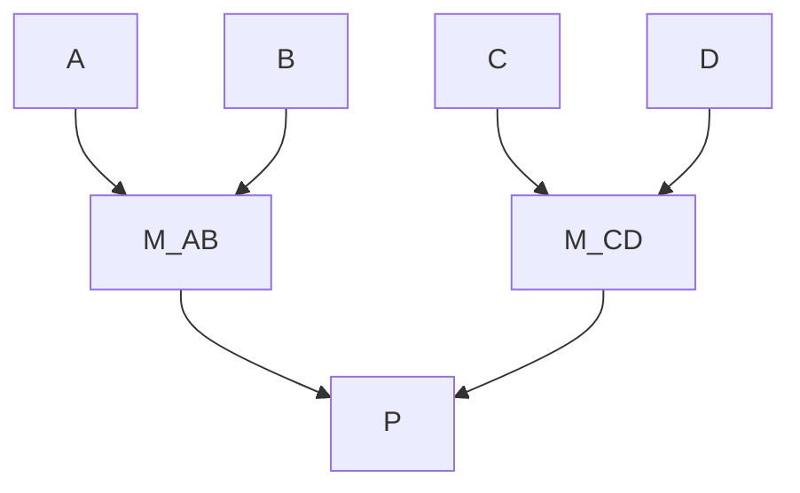
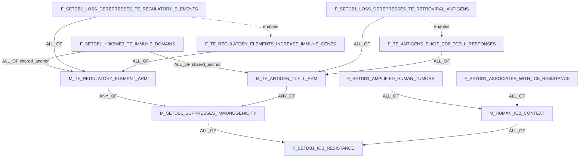
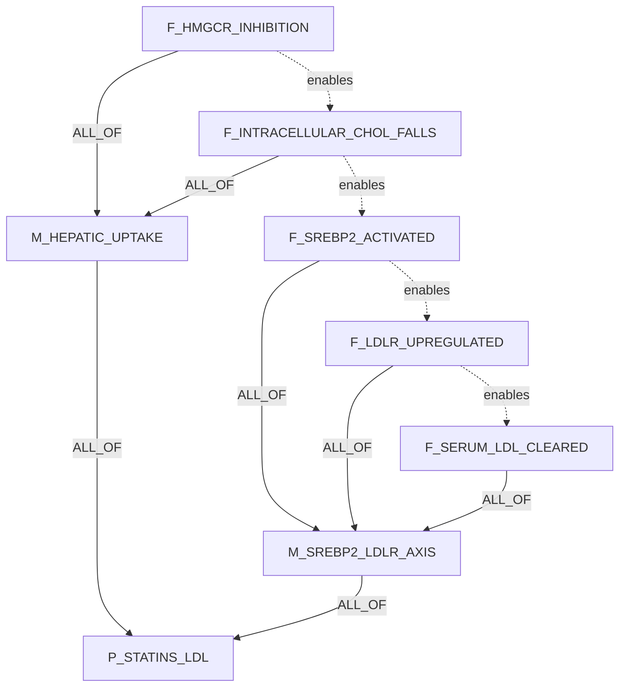
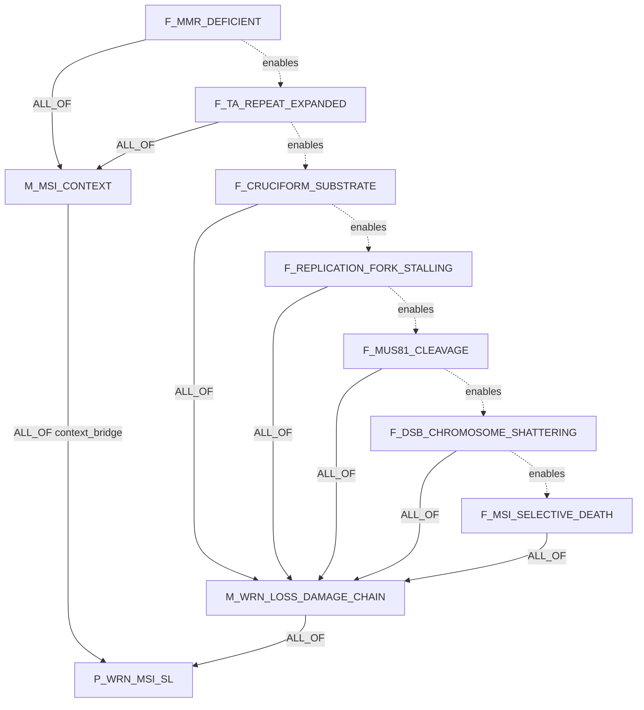
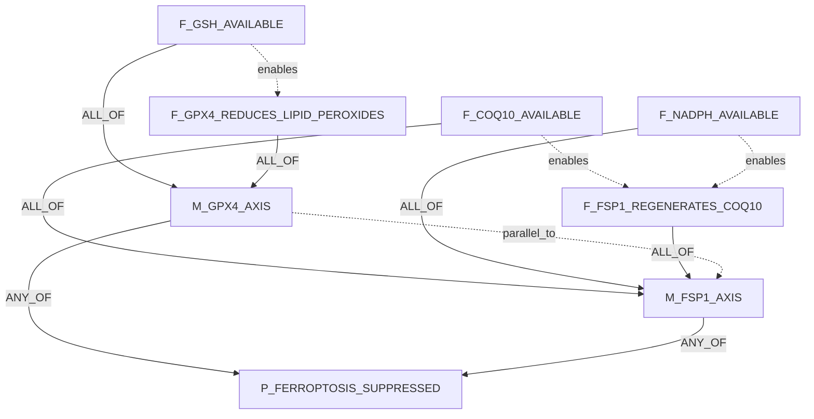
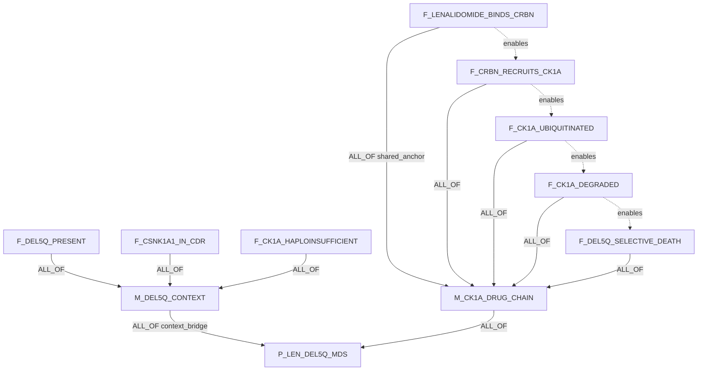
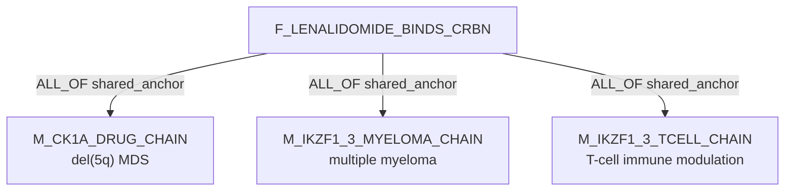
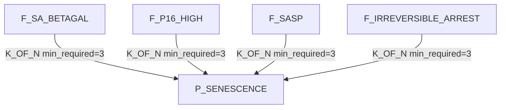
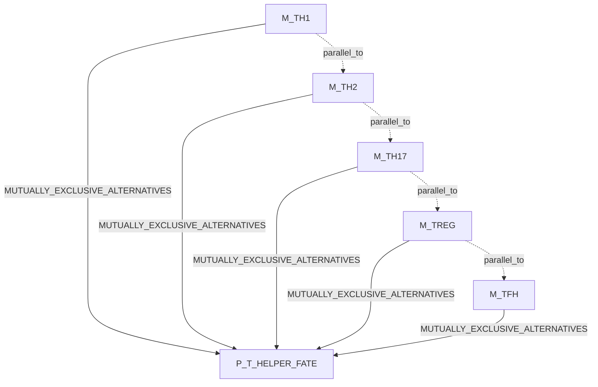
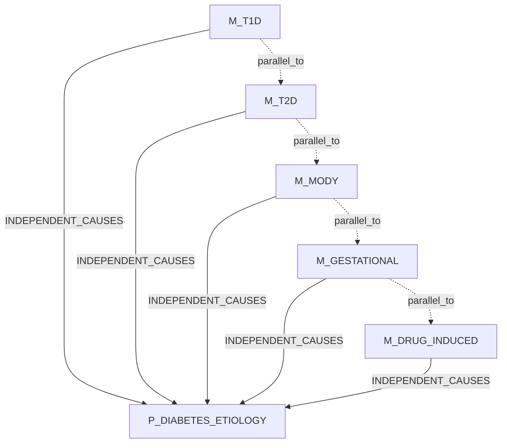

# Claim Object Mechanism DAG Examples

These examples use the target three-table design:

```text
claims                     biological assertions
claim_decomposition_edges  proof DAG edges and Boolean operators
claim_relations            semantic relations such as enables/refines/parallel_to
```

`claim_type` is not used for proof decisions.

## Key

### Claim Fields

Each example lists the claim rows first.

| Column | Meaning |
|---|---|
| `ID` | Stable claim id used in diagrams. |
| `claim_text` | Full assertion text. |
| `participants` | Role-labeled KG node ids from `entities`; no prose-only participants. |
| `relation_name` | Predicate on the claim. |
| `polarity` | `positive`, `negative`, `bidirectional`, `null`, `unknown`, or SQL `NULL` when sign is not applicable. |
| `context/properties` | Context and non-proof metadata. DAG role does not live here. |

If an example uses a node id that is not already present, the writer must
insert the proposed entity before accepting the claim row.

### Edge Fields

Solid arrows are `claim_decomposition_edges`.

| Field | Meaning |
|---|---|
| `source_claim_id -> target_claim_id` | Child/module supports target. |
| `support_operator` | `ALL_OF`, `ANY_OF`, `K_OF_N`, `INDEPENDENT_CAUSES`, `MUTUALLY_EXCLUSIVE_ALTERNATIVES`. |
| `source_role` | `shared_anchor`, `required_step`, `sufficient_module`, `context_bridge`, `ordinary_child`. |
| `group_id` | Mechanism/pathway group. |

Dotted arrows are `claim_relations`. They are semantic only and do not roll up
parent truth.

## Pattern: Reify Mixed Logic

Do not store mixed operators at one target:

```text
bad: P = (A AND B) OR (C AND D)
```

Store modules:

```text
M_AB = A AND B
M_CD = C AND D
P = M_AB OR M_CD
```



## 1. SETDB1 Shared Anchor

Formula:

```text
P_SETDB1_ICB_RESISTANCE = M_SETDB1_SUPPRESSES_IMMUNOGENICITY AND M_HUMAN_ICB_CONTEXT
M_SETDB1_SUPPRESSES_IMMUNOGENICITY = M_TE_REGULATORY_ELEMENT_ARM OR M_TE_ANTIGEN_TCELL_ARM
M_TE_REGULATORY_ELEMENT_ARM =
  F_SETDB1_H3K9ME3_TE_IMMUNE_DOMAINS AND
  F_SETDB1_LOSS_DEREPRESSES_TE_REGULATORY_ELEMENTS AND
  F_TE_REGULATORY_ELEMENTS_INCREASE_IMMUNE_GENES
M_TE_ANTIGEN_TCELL_ARM =
  F_SETDB1_H3K9ME3_TE_IMMUNE_DOMAINS AND
  F_SETDB1_LOSS_DEREPRESSES_TE_RETROVIRAL_ANTIGENS AND
  F_TE_ANTIGENS_ELICIT_CD8_TCELL_RESPONSES
M_HUMAN_ICB_CONTEXT = F_SETDB1_AMPLIFIED_HUMAN_TUMORS AND F_SETDB1_ASSOCIATES_WITH_ICB_RESISTANCE
```

Participant node key:

| node_id | type | meaning |
|---|---|---|
| `SETDB1` | `Gene` | SET domain bifurcated histone lysine methyltransferase 1. |
| `PHENO-ICB_RESISTANCE` | `Phenotype` | Poor response or resistance to immune-checkpoint blockade. |
| `PHENO-TUMOR_IMMUNOGENICITY_SUPPRESSION` | `Phenotype` | Reduced tumor-intrinsic immunogenicity. |
| `PHENO-TE_SPECIFIC_CD8_RESPONSE` | `Phenotype` | TE-specific CD8 cytotoxic T-cell response. |
| `THR-immune_checkpoint_blockade` | `TherapyRegimen` | ICB regimen. Use `THR-anti_PD1` plus therapy_target:`PDCD1` only for anti-PD-1-specific claims. |
| `TME-tumor_intrinsic` | `TMECompartment` | Tumor-cell-intrinsic compartment. |
| `CANCER-human_tumor` | `Disease` | Human tumor context. |
| `EPI-H3K9me3` | `EpigeneticMark` | Histone H3 lysine 9 trimethylation. |
| `GENOME-TE_IMMUNE_DOMAINS` | `BiologicalProcess` | TE-rich or immune-associated genomic domains. |
| `GENOME-TE_REGULATORY_ELEMENTS` | `BiologicalProcess` | Latent TE-derived regulatory elements. |
| `GENOME-TE_RETROVIRAL_ANTIGENS` | `Neoantigen` | TE-encoded retroviral antigen set. |
| `BP-IMMUNOSTIMULATORY_GENE_EXPRESSION` | `BiologicalProcess` | Tumor-intrinsic immune gene expression. |
| `CT-CD8_TCELL` | `CellType` | CD8 cytotoxic T cell. |

Claims:

| ID | claim_text | participants | relation_name | relation_polarity | context/properties |
|---|---|---|---|---|---|
| `P_SETDB1_ICB_RESISTANCE` | SETDB1 overactivity drives immune-checkpoint-blockade resistance in tumor cells. | effector:`SETDB1`; phenotype:`PHENO-ICB_RESISTANCE`; therapy_context:`THR-immune_checkpoint_blockade`; cell_context:`TME-tumor_intrinsic` | `drives_phenotype` | `positive` | SETDB1 alteration=overactivity |
| `M_SETDB1_SUPPRESSES_IMMUNOGENICITY` | SETDB1 overactivity drives tumor-intrinsic immunogenicity suppression through TE regulatory or TE antigen mechanisms. | effector:`SETDB1`; phenotype:`PHENO-TUMOR_IMMUNOGENICITY_SUPPRESSION`; cell_context:`TME-tumor_intrinsic` | `drives_phenotype` | `positive` | module=true; SETDB1 alteration=overactivity |
| `M_TE_REGULATORY_ELEMENT_ARM` | SETDB1 loss derepresses latent TE-derived regulatory elements and increases immunostimulatory gene expression. | effector:`SETDB1`; target:`GENOME-TE_REGULATORY_ELEMENTS`; phenotype:`BP-IMMUNOSTIMULATORY_GENE_EXPRESSION`; cell_context:`TME-tumor_intrinsic` | `perturbation_changes_phenotype` | `positive` | module=true; SETDB1 alteration=loss |
| `M_TE_ANTIGEN_TCELL_ARM` | SETDB1 loss derepresses TE-encoded retroviral antigens and elicits TE-specific CD8 T-cell responses. | effector:`SETDB1`; target:`GENOME-TE_RETROVIRAL_ANTIGENS`; phenotype:`PHENO-TE_SPECIFIC_CD8_RESPONSE`; cell_context:`TME-tumor_intrinsic` | `perturbation_changes_phenotype` | `positive` | module=true; SETDB1 alteration=loss |
| `M_HUMAN_ICB_CONTEXT` | SETDB1 overactivity in human tumors associates with ICB resistance. | effector:`SETDB1`; phenotype:`PHENO-ICB_RESISTANCE`; therapy_context:`THR-immune_checkpoint_blockade`; disease_context:`CANCER-human_tumor` | `is_associated_with_outcome` | `positive` | module=true; SETDB1 alteration=overactivity |
| `F_SETDB1_H3K9ME3_TE_IMMUNE_DOMAINS` | SETDB1-dependent H3K9me3 domains are enriched for TE-rich and immune-associated genomic domains. | effector:`SETDB1`; mark:`EPI-H3K9me3`; region_class:`GENOME-TE_IMMUNE_DOMAINS`; cell_context:`TME-tumor_intrinsic` | `has_observed_property` | SQL `NULL` | shared anchor |
| `F_SETDB1_LOSS_DEREPRESSES_TE_REGULATORY_ELEMENTS` | SETDB1 loss derepresses latent TE-derived regulatory elements. | effector:`SETDB1`; target:`GENOME-TE_REGULATORY_ELEMENTS`; cell_context:`TME-tumor_intrinsic` | `perturbation_changes_phenotype` | `positive` | TE regulatory arm; SETDB1 alteration=loss |
| `F_TE_REGULATORY_ELEMENTS_INCREASE_IMMUNE_GENES` | Derepressed TE-derived regulatory elements increase immunostimulatory gene expression. | effector:`GENOME-TE_REGULATORY_ELEMENTS`; phenotype:`BP-IMMUNOSTIMULATORY_GENE_EXPRESSION`; cell_context:`TME-tumor_intrinsic` | `drives_phenotype` | `positive` | TE regulatory arm |
| `F_SETDB1_LOSS_DEREPRESSES_TE_RETROVIRAL_ANTIGENS` | SETDB1 loss derepresses TE-encoded retroviral antigens. | effector:`SETDB1`; target:`GENOME-TE_RETROVIRAL_ANTIGENS`; cell_context:`TME-tumor_intrinsic` | `perturbation_changes_phenotype` | `positive` | TE antigen arm; SETDB1 alteration=loss |
| `F_TE_ANTIGENS_ELICIT_CD8_TCELL_RESPONSES` | TE-encoded retroviral antigens elicit TE-specific CD8 cytotoxic T-cell responses. | effector:`GENOME-TE_RETROVIRAL_ANTIGENS`; phenotype:`PHENO-TE_SPECIFIC_CD8_RESPONSE`; immune_cell:`CT-CD8_TCELL`; cell_context:`TME-tumor_intrinsic` | `drives_phenotype` | `positive` | TE antigen arm |
| `F_SETDB1_AMPLIFIED_HUMAN_TUMORS` | SETDB1 amplification or overactivity occurs in a subset of human tumors. | effector:`SETDB1`; disease_context:`CANCER-human_tumor` | `has_observed_property` | SQL `NULL` | human context; SETDB1 alteration=amplification_or_overactivity |
| `F_SETDB1_ASSOCIATES_WITH_ICB_RESISTANCE` | SETDB1 overactivity associates with ICB resistance in human tumors. | effector:`SETDB1`; phenotype:`PHENO-ICB_RESISTANCE`; therapy_context:`THR-immune_checkpoint_blockade`; disease_context:`CANCER-human_tumor` | `is_associated_with_outcome` | `positive` | human context; SETDB1 alteration=overactivity |

Decomposition edges:

| source -> target | operator | source_role | group_id |
|---|---|---|---|
| `M_SETDB1_SUPPRESSES_IMMUNOGENICITY -> P_SETDB1_ICB_RESISTANCE` | `ALL_OF` | `required_step` | `setdb1_parent` |
| `M_HUMAN_ICB_CONTEXT -> P_SETDB1_ICB_RESISTANCE` | `ALL_OF` | `context_bridge` | `setdb1_parent` |
| `M_TE_REGULATORY_ELEMENT_ARM -> M_SETDB1_SUPPRESSES_IMMUNOGENICITY` | `ANY_OF` | `sufficient_module` | `immune_arm_choice` |
| `M_TE_ANTIGEN_TCELL_ARM -> M_SETDB1_SUPPRESSES_IMMUNOGENICITY` | `ANY_OF` | `sufficient_module` | `immune_arm_choice` |
| `F_SETDB1_H3K9ME3_TE_IMMUNE_DOMAINS -> M_TE_REGULATORY_ELEMENT_ARM` | `ALL_OF` | `shared_anchor` | `te_regulatory_element` |
| `F_SETDB1_H3K9ME3_TE_IMMUNE_DOMAINS -> M_TE_ANTIGEN_TCELL_ARM` | `ALL_OF` | `shared_anchor` | `te_antigen_tcell` |
| all other fact edges | `ALL_OF` | `required_step` | matching module |

Semantic claim_relations:

| source -> target | relation_kind |
|---|---|
| `F_SETDB1_LOSS_DEREPRESSES_TE_REGULATORY_ELEMENTS -> F_TE_REGULATORY_ELEMENTS_INCREASE_IMMUNE_GENES` | `enables` |
| `F_SETDB1_LOSS_DEREPRESSES_TE_RETROVIRAL_ANTIGENS -> F_TE_ANTIGENS_ELICIT_CD8_TCELL_RESPONSES` | `enables` |



Source: Griffin et al., Nature 2021, https://www.nature.com/articles/s41586-021-03520-4

## 2. Statins Lower LDL: Context-Free ALL_OF

Formula:

```text
P_STATINS_LDL = M_HEPATIC_UPTAKE AND M_SREBP2_LDLR_AXIS
M_HEPATIC_UPTAKE = F_HMGCR_INHIBITION AND F_INTRACELLULAR_CHOL_FALLS
M_SREBP2_LDLR_AXIS = F_SREBP2_ACTIVATED AND F_LDLR_UPREGULATED AND F_SERUM_LDL_CLEARED
```

Claims:

| ID | claim_text | participants | relation_name | relation_polarity | context/properties |
|---|---|---|---|---|---|
| `P_STATINS_LDL` | Statins lower serum LDL cholesterol through hepatic cholesterol synthesis inhibition and LDL receptor upregulation. | drug_class:`CMPD-statin_class`; cell_context:`CT-hepatocyte`; phenotype:`PHENO-serum_LDL_cholesterol` | `lowers` | `negative` | drug class=statin |
| `M_HEPATIC_UPTAKE` | Statins reduce intracellular hepatic cholesterol synthesis. | drug_class:`CMPD-statin_class`; target:`HMGCR`; phenotype:`BP-hepatic_cholesterol_synthesis`; cell_context:`CT-hepatocyte` | `reduces` | `negative` | module=true |
| `M_SREBP2_LDLR_AXIS` | Reduced hepatic cholesterol activates SREBP2 and increases LDLR-mediated LDL clearance. | metabolite:`CHEBI-cholesterol`; effector:`SREBF2`; target:`LDLR`; phenotype:`PHENO-serum_LDL_clearance` | `increases_clearance_of` | `positive` | module=true |
| `F_HMGCR_INHIBITION` | Statins inhibit HMG-CoA reductase. | drug_class:`CMPD-statin_class`; target:`HMGCR`; cell_context:`CT-hepatocyte` | `inhibits` | `negative` | hepatic context |
| `F_INTRACELLULAR_CHOL_FALLS` | HMGCR inhibition lowers intracellular hepatic cholesterol. | target:`HMGCR`; metabolite:`CHEBI-cholesterol`; cell_context:`CT-hepatocyte` | `lowers` | `negative` | hepatic context |
| `F_SREBP2_ACTIVATED` | Low intracellular cholesterol activates SREBP2 processing. | metabolite:`CHEBI-cholesterol`; target:`SREBF2`; cell_context:`CT-hepatocyte` | `activates` | `positive` | hepatic context |
| `F_LDLR_UPREGULATED` | Activated SREBP2 upregulates LDL receptor expression. | effector:`SREBF2`; target:`LDLR`; cell_context:`CT-hepatocyte` | `upregulates` | `positive` | hepatic context |
| `F_SERUM_LDL_CLEARED` | Increased LDLR clears LDL particles from serum. | effector:`LDLR`; phenotype:`PHENO-serum_LDL_cholesterol`; compartment:`ANAT-serum` | `clears` | `positive` | hepatic context |

Decomposition: every listed edge uses `ALL_OF`.

Semantic claim_relations:

```text
F_HMGCR_INHIBITION enables F_INTRACELLULAR_CHOL_FALLS
F_INTRACELLULAR_CHOL_FALLS enables F_SREBP2_ACTIVATED
F_SREBP2_ACTIVATED enables F_LDLR_UPREGULATED
F_LDLR_UPREGULATED enables F_SERUM_LDL_CLEARED
```



Use this as the reference chain without a separate genotype/context anchor.

## 3. WRN / MSI Synthetic Lethality

Formula:

```text
P_WRN_MSI_SL = M_MSI_CONTEXT AND M_WRN_LOSS_DAMAGE_CHAIN
M_MSI_CONTEXT = F_MMR_DEFICIENT AND F_TA_REPEAT_EXPANDED
M_WRN_LOSS_DAMAGE_CHAIN =
  F_CRUCIFORM_SUBSTRATE AND F_REPLICATION_FORK_STALLING AND
  F_MUS81_CLEAVAGE AND F_DSB_CHROMOSOME_SHATTERING AND F_MSI_SELECTIVE_DEATH
```

Claims:

| ID | claim_text | participants | relation_name | relation_polarity | context/properties |
|---|---|---|---|---|---|
| `P_WRN_MSI_SL` | WRN loss or inhibition selectively kills microsatellite-unstable cancer cells. | effector:`WRN`; phenotype:`PHENO-MSI_SELECTIVE_CELL_DEATH`; cell_context:`CANCER-MSI` | `selectively_kills` | `positive` | context=MSI |
| `M_MSI_CONTEXT` | MMR deficiency creates an MSI repeat-expansion context. | pathway:`PATHWAY-mismatch_repair`; phenotype:`PHENO-microsatellite_instability`; genomic_feature:`GENOME-TA_REPEAT_EXPANSION` | `creates_context_for` | `positive` | context_bridge |
| `M_WRN_LOSS_DAMAGE_CHAIN` | WRN loss converts expanded repeat structures into lethal DNA damage. | effector:`WRN`; genomic_feature:`GENOME-TA_REPEAT_EXPANSION`; phenotype:`PHENO-DNA_DAMAGE_CELL_DEATH` | `causes` | `positive` | module=true; WRN alteration=loss_or_inhibition |
| `F_MMR_DEFICIENT` | The cancer context is mismatch-repair deficient. | pathway:`PATHWAY-mismatch_repair`; cell_context:`CANCER-MSI` | `is_deficient_in` | `negative` | context anchor |
| `F_TA_REPEAT_EXPANDED` | TA-dinucleotide repeat expansions are present in the MSI genome. | genomic_feature:`GENOME-TA_REPEATS`; genome_context:`GENOME-MSI` | `contains_expansions_of` | `positive` | context anchor |
| `F_CRUCIFORM_SUBSTRATE` | Expanded TA repeats form cruciform-like non-B DNA structures. | genomic_feature:`GENOME-TA_REPEAT_EXPANSION`; structure:`DNA-cruciform` | `forms` | `positive` | substrate |
| `F_REPLICATION_FORK_STALLING` | Repeat-derived structures stall replication forks and require WRN-dependent resolution. | structure:`DNA-cruciform`; process:`BP-replication_fork_stalling`; effector:`WRN` | `stalls` | `positive` | damage chain |
| `F_MUS81_CLEAVAGE` | Without WRN, MUS81 cleaves stalled repeat-derived substrates. | effector:`MUS81`; target:`BP-replication_fork_stalling`; context_gene:`WRN` | `cleaves` | `positive` | damage chain; WRN alteration=loss |
| `F_DSB_CHROMOSOME_SHATTERING` | MUS81 cleavage produces DSBs and chromosome shattering. | effector:`MUS81`; phenotype:`PHENO-double_strand_breaks`; phenotype:`PHENO-chromosome_shattering` | `causes` | `positive` | damage chain |
| `F_MSI_SELECTIVE_DEATH` | The DNA damage response produces MSI-selective growth arrest or death. | effector:`PHENO-DNA_DAMAGE`; cell_context:`CANCER-MSI`; phenotype:`PHENO-MSI_SELECTIVE_CELL_DEATH` | `causes` | `positive` | phenotype |

Decomposition:

| source -> target | operator | source_role | group_id |
|---|---|---|---|
| `M_MSI_CONTEXT -> P_WRN_MSI_SL` | `ALL_OF` | `context_bridge` | `wrn_parent` |
| `M_WRN_LOSS_DAMAGE_CHAIN -> P_WRN_MSI_SL` | `ALL_OF` | `required_step` | `wrn_parent` |
| context facts -> `M_MSI_CONTEXT` | `ALL_OF` | `required_step` | `msi_context` |
| damage-chain facts -> `M_WRN_LOSS_DAMAGE_CHAIN` | `ALL_OF` | `required_step` | `wrn_damage` |

Semantic claim_relations:

```text
F_MMR_DEFICIENT enables F_TA_REPEAT_EXPANDED
F_TA_REPEAT_EXPANDED enables F_CRUCIFORM_SUBSTRATE
F_CRUCIFORM_SUBSTRATE enables F_REPLICATION_FORK_STALLING
F_REPLICATION_FORK_STALLING enables F_MUS81_CLEAVAGE
F_MUS81_CLEAVAGE enables F_DSB_CHROMOSOME_SHATTERING
F_DSB_CHROMOSOME_SHATTERING enables F_MSI_SELECTIVE_DEATH
```



Sources:

- Chan et al., Nature 2019, https://www.nature.com/articles/s41586-019-1102-x
- van Wietmarschen et al., Nature 2020, https://www.nature.com/articles/s41586-020-2769-8

## 4. FSP1 / GPX4 Ferroptosis Suppression

Formula:

```text
P_FERROPTOSIS_SUPPRESSED = M_GPX4_AXIS OR M_FSP1_AXIS
M_GPX4_AXIS = F_GSH_AVAILABLE AND F_GPX4_REDUCES_LIPID_PEROXIDES
M_FSP1_AXIS = F_COQ10_AVAILABLE AND F_NADPH_AVAILABLE AND F_FSP1_REGENERATES_COQ10
```

Claims:

| ID | claim_text | participants | relation_name | relation_polarity | context/properties |
|---|---|---|---|---|---|
| `P_FERROPTOSIS_SUPPRESSED` | Cells suppress ferroptosis by detoxifying lipid peroxides or lipid radicals. | cell_context:`CELL-generic`; phenotype:`PHENO-ferroptosis_suppression`; target:`CHEBI-lipid_peroxide` | `suppresses` | `negative` | parent |
| `M_GPX4_AXIS` | The GSH-GPX4 axis detoxifies lipid peroxides. | cofactor:`CHEBI-glutathione`; effector:`GPX4`; target:`CHEBI-phospholipid_hydroperoxide` | `detoxifies` | `negative` | sufficient module |
| `M_FSP1_AXIS` | The FSP1-CoQ-NAD(P)H axis suppresses ferroptosis independently of GPX4. | effector:`AIFM2`; cofactor:`CHEBI-coenzyme_Q10`; cofactor:`CHEBI-NADPH`; target:`CHEBI-lipid_radical` | `suppresses` | `negative` | sufficient module |
| `F_GSH_AVAILABLE` | Glutathione is available as a GPX4 reducing cofactor. | cofactor:`CHEBI-glutathione`; effector:`GPX4` | `provides_cofactor_for` | `positive` | GPX4 axis |
| `F_GPX4_REDUCES_LIPID_PEROXIDES` | GPX4 reduces phospholipid hydroperoxides. | effector:`GPX4`; target:`CHEBI-phospholipid_hydroperoxide` | `reduces` | `negative` | GPX4 axis |
| `F_COQ10_AVAILABLE` | CoQ10 is available at the membrane for FSP1-dependent redox cycling. | cofactor:`CHEBI-coenzyme_Q10`; compartment:`GO-plasma_membrane`; effector:`AIFM2` | `is_available_to` | `positive` | FSP1 axis |
| `F_NADPH_AVAILABLE` | NAD(P)H is available as the reducing equivalent for FSP1. | cofactor:`CHEBI-NADPH`; effector:`AIFM2` | `provides_reducing_equivalents_for` | `positive` | FSP1 axis |
| `F_FSP1_REGENERATES_COQ10` | FSP1 regenerates reduced CoQ10 to trap lipid radicals. | effector:`AIFM2`; cofactor:`CHEBI-coenzyme_Q10`; target:`CHEBI-lipid_radical` | `regenerates` | `positive` | FSP1 axis |

Decomposition:

| source -> target | operator | source_role | group_id |
|---|---|---|---|
| `M_GPX4_AXIS -> P_FERROPTOSIS_SUPPRESSED` | `ANY_OF` | `sufficient_module` | `ferroptosis_choice` |
| `M_FSP1_AXIS -> P_FERROPTOSIS_SUPPRESSED` | `ANY_OF` | `sufficient_module` | `ferroptosis_choice` |
| GPX4 facts -> `M_GPX4_AXIS` | `ALL_OF` | `required_step` | `gpx4_axis` |
| FSP1 facts -> `M_FSP1_AXIS` | `ALL_OF` | `required_step` | `fsp1_axis` |

Semantic claim_relations:

| source -> target | relation_kind |
|---|---|
| `M_GPX4_AXIS -> M_FSP1_AXIS` | `parallel_to` |
| `F_GSH_AVAILABLE -> F_GPX4_REDUCES_LIPID_PEROXIDES` | `enables` |
| `F_COQ10_AVAILABLE -> F_FSP1_REGENERATES_COQ10` | `enables` |
| `F_NADPH_AVAILABLE -> F_FSP1_REGENERATES_COQ10` | `enables` |



No shared anchor is forced. GPX4 and FSP1 converge at ferroptosis suppression,
not at a clean upstream fact.

Sources:

- Bersuker et al., Nature 2019, https://www.nature.com/articles/s41586-019-1705-2
- Doll et al., Nature 2019, https://www.nature.com/articles/s41586-019-1707-0

## 5. Lenalidomide / CK1alpha In del(5q) MDS

Formula:

```text
P_LEN_DEL5Q_MDS = M_DEL5Q_CONTEXT AND M_CK1A_DRUG_CHAIN
M_DEL5Q_CONTEXT = F_DEL5Q_PRESENT AND F_CSNK1A1_IN_CDR AND F_CK1A_HAPLOINSUFFICIENT
M_CK1A_DRUG_CHAIN =
  F_LENALIDOMIDE_BINDS_CRBN AND F_CRBN_RECRUITS_CK1A AND
  F_CK1A_UBIQUITINATED AND F_CK1A_DEGRADED AND F_DEL5Q_SELECTIVE_DEATH
```

Claims:

| ID | claim_text | participants | relation_name | relation_polarity | context/properties |
|---|---|---|---|---|---|
| `P_LEN_DEL5Q_MDS` | Lenalidomide creates a therapeutic window in del(5q) MDS by degrading CK1alpha. | drug:`CHEMBL848`; disease_context:`DISEASE-del5q_MDS`; target:`CSNK1A1`; phenotype:`PHENO-therapeutic_window` | `creates_therapeutic_window_by` | `positive` | disease=del(5q) MDS |
| `M_DEL5Q_CONTEXT` | del(5q) places CSNK1A1 in the commonly deleted region and creates CK1alpha haploinsufficiency. | genomic_lesion:`VAR-del5q`; target:`CSNK1A1`; phenotype:`PHENO-CK1A_haploinsufficiency` | `creates_context_for` | `positive` | context_bridge |
| `M_CK1A_DRUG_CHAIN` | Lenalidomide redirects CRBN to ubiquitinate and degrade CK1alpha. | drug:`CHEMBL848`; effector:`CRBN`; target:`CSNK1A1`; process:`PTM-ubiquitination` | `induces_degradation_of` | `negative` | drug mechanism |
| `F_DEL5Q_PRESENT` | The malignant clone carries deletion 5q. | genomic_lesion:`VAR-del5q`; disease_context:`DISEASE-MDS_clone` | `has_genomic_lesion` | `positive` | genetic context |
| `F_CSNK1A1_IN_CDR` | CSNK1A1 lies in the del(5q) commonly deleted region. | target:`CSNK1A1`; genomic_region:`GENOME-del5q_CDR` | `is_within` | `positive` | genetic context |
| `F_CK1A_HAPLOINSUFFICIENT` | del(5q) reduces CK1alpha gene dosage. | genomic_lesion:`VAR-del5q`; target:`CSNK1A1`; phenotype:`PHENO-CK1A_haploinsufficiency` | `reduces` | `negative` | genetic context |
| `F_LENALIDOMIDE_BINDS_CRBN` | Lenalidomide binds CRBN. | drug:`CHEMBL848`; target:`CRBN` | `binds` | `positive` | shared drug anchor |
| `F_CRBN_RECRUITS_CK1A` | Lenalidomide-bound CRBN recruits CK1alpha as a neo-substrate. | effector:`COMPLEX-lenalidomide_CRBN`; target:`CSNK1A1` | `recruits` | `positive` | drug chain |
| `F_CK1A_UBIQUITINATED` | CRL4-CRBN ubiquitinates CK1alpha. | effector:`COMPLEX-CRL4_CRBN`; target:`CSNK1A1`; process:`PTM-ubiquitination` | `ubiquitinates` | `positive` | drug chain |
| `F_CK1A_DEGRADED` | Ubiquitinated CK1alpha is degraded. | target:`CSNK1A1`; process:`BP-proteasomal_degradation` | `degrades` | `negative` | drug chain |
| `F_DEL5Q_SELECTIVE_DEATH` | Additional CK1alpha loss selectively impairs del(5q) MDS cells. | target:`CSNK1A1`; disease_context:`DISEASE-del5q_MDS`; phenotype:`PHENO-cell_viability` | `selectively_impairs` | `negative` | phenotype |

Decomposition:

| source -> target | operator | source_role | group_id |
|---|---|---|---|
| `M_DEL5Q_CONTEXT -> P_LEN_DEL5Q_MDS` | `ALL_OF` | `context_bridge` | `len_parent` |
| `M_CK1A_DRUG_CHAIN -> P_LEN_DEL5Q_MDS` | `ALL_OF` | `required_step` | `len_parent` |
| context facts -> `M_DEL5Q_CONTEXT` | `ALL_OF` | `required_step` | `del5q_context` |
| drug-chain facts -> `M_CK1A_DRUG_CHAIN` | `ALL_OF` | `required_step` | `ck1a_chain` |

Semantic claim_relations:

```text
F_LENALIDOMIDE_BINDS_CRBN enables F_CRBN_RECRUITS_CK1A
F_CRBN_RECRUITS_CK1A enables F_CK1A_UBIQUITINATED
F_CK1A_UBIQUITINATED enables F_CK1A_DEGRADED
F_CK1A_DEGRADED enables F_DEL5Q_SELECTIVE_DEATH
```



Cross-parent join:



Sources:

- Kronke et al., Nature 2015, https://www.nature.com/articles/nature14610
- Petzold et al., Nature 2016, https://www.nature.com/articles/nature16979

## 6. K_OF_N: Senescence Call

Formula:

```text
P_SENESCENCE = K_OF_N(3, F_SA_BETAGAL, F_P16_HIGH, F_SASP, F_IRREVERSIBLE_ARREST)
```

Claims:

| ID | claim_text | participants | relation_name | relation_polarity | context/properties |
|---|---|---|---|---|---|
| `P_SENESCENCE` | The cell population is senescent. | cell_population:`CELL-population`; phenotype:`PHENO-senescence` | `has_cell_state` | `positive` | min_required=3 |
| `F_SA_BETAGAL` | The population is positive for SA-beta-gal activity. | cell_population:`CELL-population`; marker:`PHENO-SA_beta_gal_activity` | `has_marker` | `positive` | senescence marker |
| `F_P16_HIGH` | The population has high p16/CDKN2A expression. | cell_population:`CELL-population`; marker_gene:`CDKN2A` | `has_high_expression_of` | `positive` | senescence marker |
| `F_SASP` | The population secretes a SASP-like inflammatory program. | cell_population:`CELL-population`; phenotype:`PHENO-SASP_program` | `secretes` | `positive` | senescence marker |
| `F_IRREVERSIBLE_ARREST` | The population shows durable cell-cycle arrest. | cell_population:`CELL-population`; phenotype:`PHENO-durable_cell_cycle_arrest` | `has_state` | `positive` | senescence marker |

Decomposition: all edges into `P_SENESCENCE` use `K_OF_N` with
`support_operator_params = {"min_required": 3}`.

Semantic claim_relations: none required.



## 7. Mutually Exclusive Alternatives: T Helper Fate

Formula:

```text
P_T_HELPER_FATE = exactly_one(M_TH1, M_TH2, M_TH17, M_TREG, M_TFH)
```

Claims:

| ID | claim_text | participants | relation_name | relation_polarity | context/properties |
|---|---|---|---|---|---|
| `P_T_HELPER_FATE` | A CD4 T cell is committed to one helper-cell fate in this context. | cell_context:`CT-CD4_TCELL`; phenotype:`PHENO-helper_T_cell_fate` | `has_fate` | `positive` | mutually exclusive |
| `M_TH1` | The cell is committed to a Th1 fate. | cell_context:`CT-CD4_TCELL`; phenotype:`PHENO-Th1_fate` | `has_fate` | `positive` | fate module |
| `M_TH2` | The cell is committed to a Th2 fate. | cell_context:`CT-CD4_TCELL`; phenotype:`PHENO-Th2_fate` | `has_fate` | `positive` | fate module |
| `M_TH17` | The cell is committed to a Th17 fate. | cell_context:`CT-CD4_TCELL`; phenotype:`PHENO-Th17_fate` | `has_fate` | `positive` | fate module |
| `M_TREG` | The cell is committed to a Treg fate. | cell_context:`CT-CD4_TCELL`; phenotype:`PHENO-Treg_fate` | `has_fate` | `positive` | fate module |
| `M_TFH` | The cell is committed to a Tfh fate. | cell_context:`CT-CD4_TCELL`; phenotype:`PHENO-Tfh_fate` | `has_fate` | `positive` | fate module |

Decomposition: all edges into `P_T_HELPER_FATE` use
`MUTUALLY_EXCLUSIVE_ALTERNATIVES`.

Semantic claim_relations: pairwise `parallel_to` can be stored for search, but
the exclusivity rule lives in decomposition edges.



## 8. Independent Causes: Diabetes Etiology

Formula:

```text
P_DIABETES_ETIOLOGY = independent_causes(M_T1D, M_T2D, M_MODY, M_GESTATIONAL, M_DRUG_INDUCED)
```

Claims:

| ID | claim_text | participants | relation_name | relation_polarity | context/properties |
|---|---|---|---|---|---|
| `P_DIABETES_ETIOLOGY` | This patient's diabetes can be explained by a supported etiology. | patient_context:`COHORT-patient`; disease:`MONDO-diabetes`; etiology_set:`BP-diabetes_etiology` | `explained_by` | `positive` | patient context |
| `M_T1D` | Autoimmune beta-cell destruction explains the diabetes. | process:`BP-autoimmune_beta_cell_destruction`; cell_context:`CT-pancreatic_beta_cell`; disease:`MONDO-diabetes` | `causes` | `positive` | etiology |
| `M_T2D` | Insulin resistance with beta-cell dysfunction explains the diabetes. | phenotype:`PHENO-insulin_resistance`; phenotype:`PHENO-beta_cell_dysfunction`; disease:`MONDO-diabetes` | `causes` | `positive` | etiology |
| `M_MODY` | Monogenic beta-cell dysfunction explains the diabetes. | gene_set:`GENESET-MODY`; phenotype:`PHENO-beta_cell_dysfunction`; disease:`MONDO-diabetes` | `causes` | `positive` | etiology |
| `M_GESTATIONAL` | Pregnancy-associated metabolic state explains the diabetes. | context:`PHENO-pregnancy`; phenotype:`PHENO-pregnancy_metabolic_state`; disease:`MONDO-diabetes` | `causes` | `positive` | etiology |
| `M_DRUG_INDUCED` | Drug exposure explains the diabetes. | exposure:`CMPD-drug_exposure`; phenotype:`PHENO-glucose_dysregulation`; disease:`MONDO-diabetes` | `causes` | `positive` | etiology |

Decomposition: all edges into `P_DIABETES_ETIOLOGY` use `INDEPENDENT_CAUSES`.

Semantic claim_relations: etiologies can be `parallel_to`; more than one can be
true.



## 9. Minimal SQL

Active decomposition children:

```sql
SELECT source_claim_id, target_claim_id, support_operator,
       support_operator_params, source_role, group_id
FROM claim_decomposition_edges
WHERE target_claim_id = '<claim_id>'
  AND edge_status = 'active'
ORDER BY group_id, source_claim_id;
```

Shared anchors:

```sql
SELECT source_claim_id, COUNT(DISTINCT target_claim_id) AS n_targets
FROM claim_decomposition_edges
WHERE edge_status = 'active'
GROUP BY source_claim_id
HAVING COUNT(DISTINCT target_claim_id) > 1;
```

No-mixed-operators check:

```sql
SELECT target_claim_id, COUNT(DISTINCT support_operator) AS n_ops
FROM claim_decomposition_edges
WHERE edge_status = 'active'
GROUP BY target_claim_id
HAVING COUNT(DISTINCT support_operator) > 1;
```

Semantic relations:

```sql
SELECT source_claim_id, target_claim_id, relation_kind, notes
FROM claim_relations
WHERE relation_status = 'active'
ORDER BY relation_kind, source_claim_id;
```
