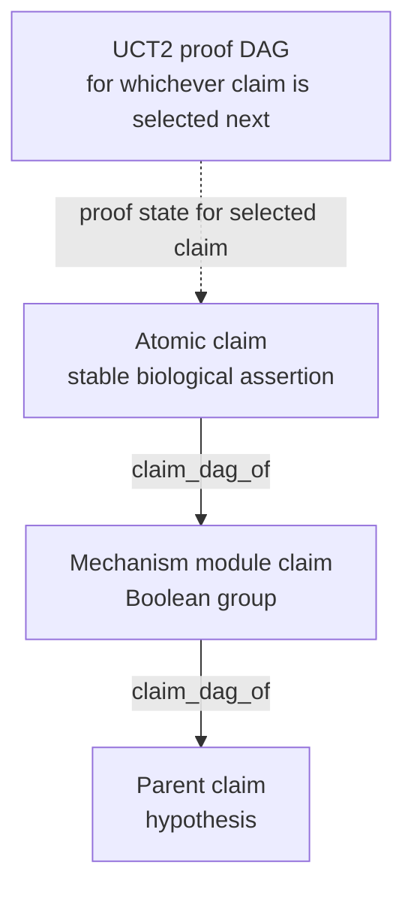
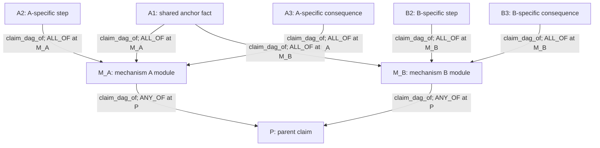
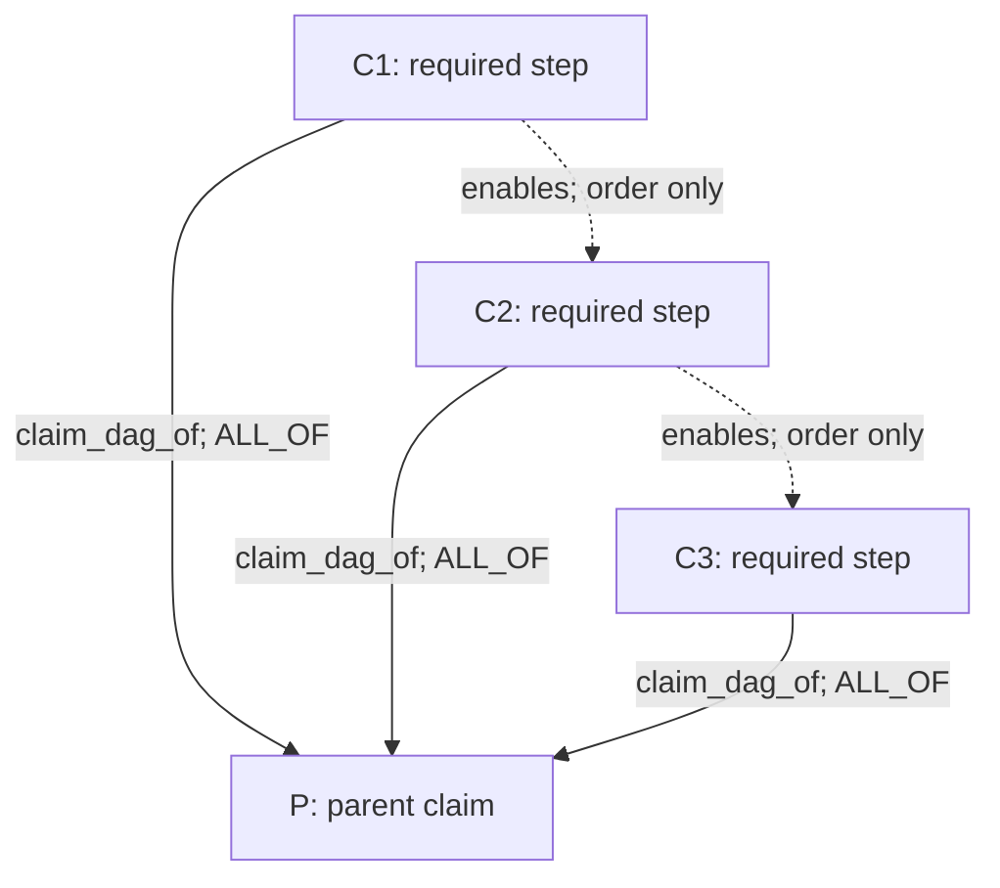
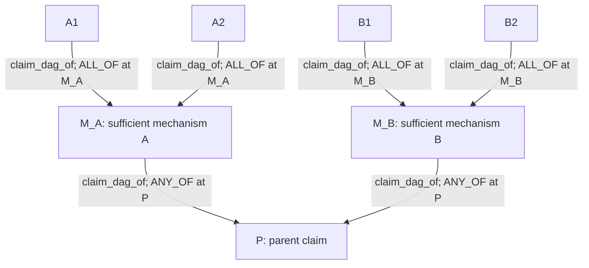
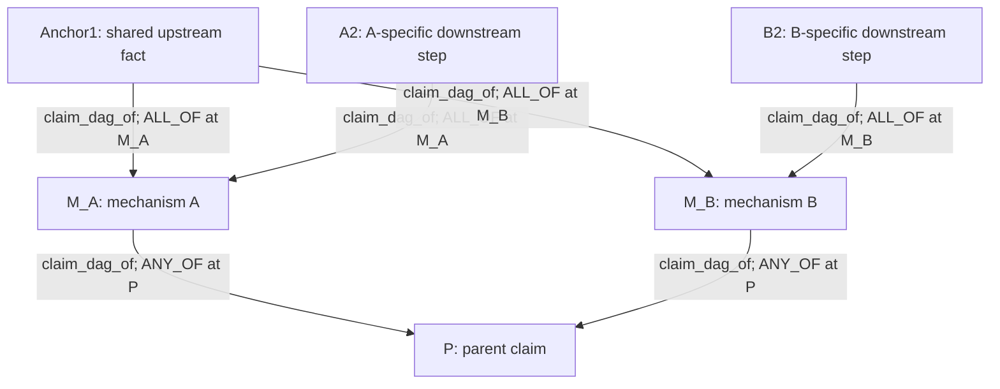
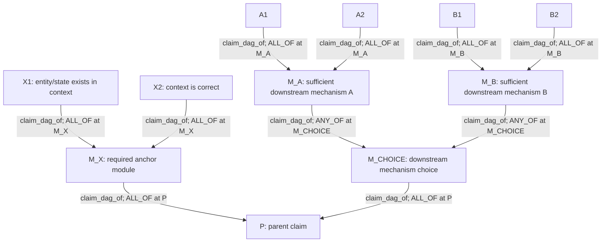
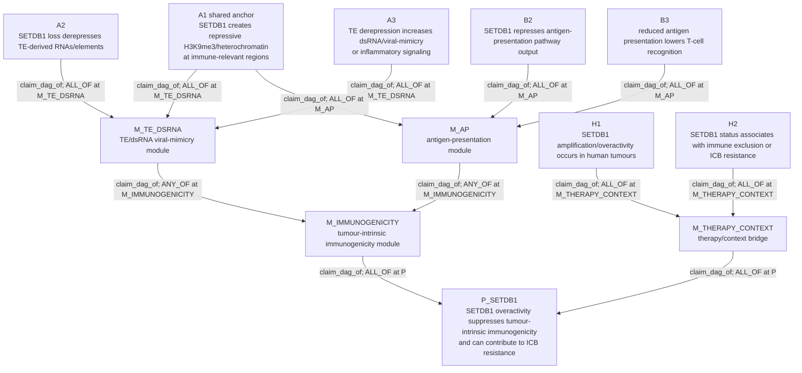
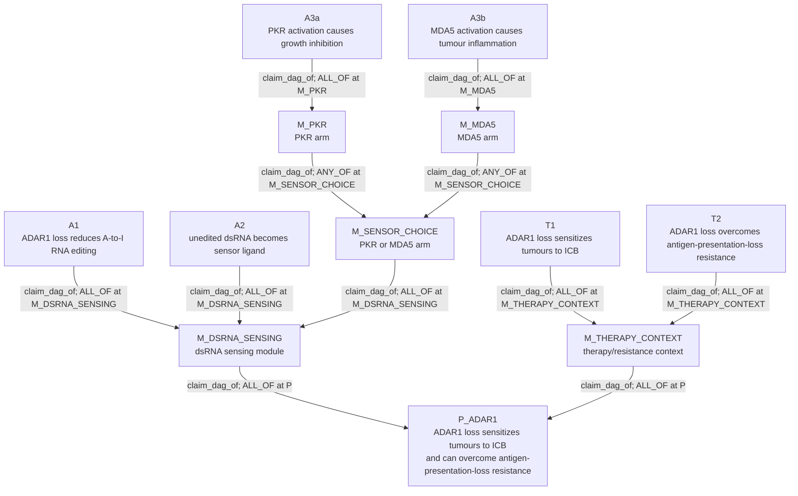
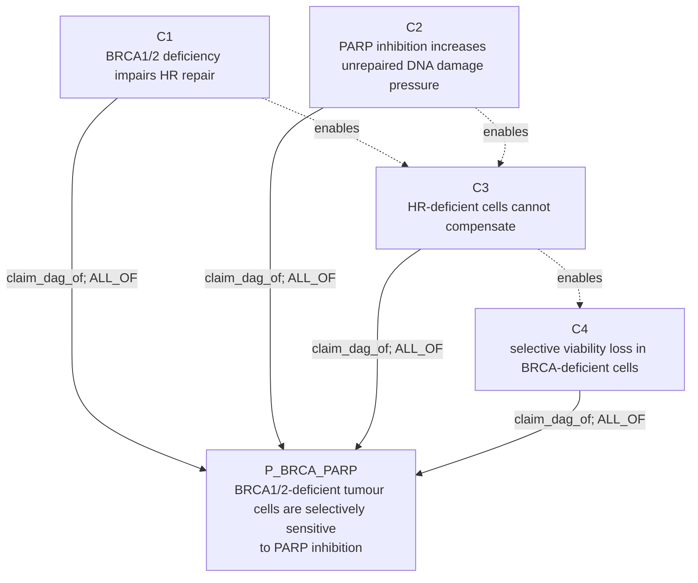

# Claim Object Mechanism DAG Examples

This document corrects the core logic of the claim DAG.

A mechanism DAG is not a flat list of child facts below a parent claim. It is a
Boolean structure over biological assertions:

```text
Parent holds if:
  required anchor facts are true
  AND at least one sufficient mechanism module is true
```

The same atomic child claim can support more than one mechanism module. That is
why the structure is a DAG rather than a tree.

## 1. Two DAGs, Different Jobs

| DAG | Question | Storage |
|---|---|---|
| Claim DAG / truth DAG | Which biological claims, modules, alternatives, and context splits make another claim true? | `claims` + `claim_relations` |
| UCT2 proof DAG | For one selected focal claim, which evidence route should be tried next? | `claims.uct2` JSON |

The claim DAG is durable biology. UCT2 is local proof-search state.



## 2. Claim Types To Use

The recommended model has three semantic levels:

| Semantic level | What it means | Suggested storage |
|---|---|---|
| Parent hypothesis | Main claim being evaluated | `claims.claim_type = SupersetClaim` or a domain-specific claim type |
| Mechanism module | A grouped sub-hypothesis, usually one sufficient path or one required anchor bundle | `claims.claim_type = SupersetClaim` |
| Atomic mechanism claim | A testable biological assertion, such as "ADAR1 loss reduces A-to-I RNA editing" | Any normal claim row with `properties.node_kind = atomic_mechanism_claim` or equivalent |

Do not make the doc depend on `CausalChainLinkClaim` as the conceptual model.
That name exists in some code paths as an implementation/backward-compatibility
label, but the current architecture should describe atomic claims generically:
they are just `claims` rows connected by `claim_relations`.

## 3. Boolean Logic Encoding

### 3.1 Incoming Edges Are Interpreted Per Target

For a target claim `T`, all active child edges into `T` form the local Boolean
rule for `T`.

```text
source_claim_id -> target_claim_id
child claim     -> parent/module claim
```

The edge property `parent_support_operator` says how sibling children compose
for the same target.

| Operator | Meaning for one target claim |
|---|---|
| `ALL_OF` | All active children are required. |
| `ANY_OF` | Any one active child is sufficient. |
| `K_OF_N` | At least `min_required` active children are sufficient. |
| `INDEPENDENT_CAUSES` | One supported child can support the target, and more than one may be true. |
| `MUTUALLY_EXCLUSIVE_ALTERNATIVES` | One child should win for a context; multiple supported children trigger disambiguation. |

### 3.2 Use Module Claims For Mixed Logic

Do not encode this directly as a flat set of children:

```text
P = A1 AND ((A2 AND A3) OR (B2 AND B3))
```

Instead create module nodes:

```text
P = AnchorModule AND (MechanismA OR MechanismB)
MechanismA = A1 AND A2 AND A3
MechanismB = A1 AND B2 AND B3
```

The shared claim `A1` points to both modules.



This is the central pattern. A shared biological fact is one claim row with two
outgoing `claim_dag_of` edges. It is not duplicated as `A1_for_A` and
`A1_for_B`.

## 4. Edge Shape

Example edge from atomic claim `A1` into module `M_A`:

```json
{
  "source_claim_id": "claim:A1",
  "target_claim_id": "claim:M_A",
  "relation_type": "claim_dag_of",
  "properties": {
    "parent_support_operator": "ALL_OF",
    "dag_edge_status": "active",
    "edge_role": "shared_anchor",
    "node_kind": "atomic_mechanism_claim"
  }
}
```

Example edge from a mechanism module into parent `P`:

```json
{
  "source_claim_id": "claim:M_A",
  "target_claim_id": "claim:P",
  "relation_type": "claim_dag_of",
  "properties": {
    "parent_support_operator": "ANY_OF",
    "dag_edge_status": "active",
    "edge_role": "sufficient_mechanism_module",
    "node_kind": "mechanism_module"
  }
}
```

## 5. Example Structures

### 5.1 Linear Required Mechanism

Use when every step is required and there are no alternatives.

```text
P = C1 AND C2 AND C3
```



`enables` is optional ordering metadata. The truth logic is in
`claim_dag_of`.

### 5.2 Alternative Sufficient Mechanisms

Use when either pathway can make the parent true.

```text
P = MechanismA OR MechanismB
MechanismA = A1 AND A2
MechanismB = B1 AND B2
```



### 5.3 Shared Anchor Plus Split Pathways

Use when two mechanisms rely on a common upstream fact but diverge downstream.

```text
P = MechanismA OR MechanismB
MechanismA = Anchor1 AND A2
MechanismB = Anchor1 AND B2
```



This is the actual DAG case: `Anchor1` has two parents.

### 5.4 Required Anchor Bundle Plus Alternative Mechanisms

Use when every successful mechanism needs one required biological state first.

```text
P = AnchorModule AND (MechanismA OR MechanismB)
AnchorModule = X1 AND X2
MechanismA = A1 AND A2
MechanismB = B1 AND B2
```



This is also the recommended implementation shape when the evaluator supports
one operator per target:

```text
P = RequiredAnchor AND DownstreamMechanismChoice
DownstreamMechanismChoice = MechanismA OR MechanismB
```

The extra `DownstreamMechanismChoice` module avoids mixed `ALL_OF` and
`ANY_OF` siblings at the same target.

## 6. Corrected SETDB1 Example

The earlier SETDB1 example was misleading because it made three broad claims
look like a linear chain. A better SETDB1 DAG depends on the parent wording.

### 6.1 Broad Parent

```text
P_SETDB1:
SETDB1 overactivity suppresses tumour-intrinsic immunogenicity and can
contribute to immune-checkpoint-blockade resistance.
```

This broad parent needs two things: a tumour-intrinsic immunogenicity mechanism
and a therapy/context bridge. The mechanism module can be satisfied by
alternative downstream paths that share an upstream chromatin anchor.

```text
P_SETDB1 = M_IMMUNOGENICITY AND M_THERAPY_CONTEXT
M_IMMUNOGENICITY = M_TE_DSRNA OR M_ANTIGEN_PRESENTATION
M_TE_DSRNA = A1 AND A2 AND A3
M_ANTIGEN_PRESENTATION = A1 AND B2 AND B3
M_THERAPY_CONTEXT = H1 AND H2
```

Atomic claims:

| Claim | Meaning |
|---|---|
| A1 | SETDB1 imposes repressive H3K9me3/heterochromatin at immune-relevant repetitive or open-genome regions. |
| A2 | Loss of SETDB1 derepresses transposable-element-derived RNAs or regulatory elements. |
| A3 | TE derepression increases dsRNA/viral-mimicry or tumour-intrinsic inflammatory signaling. |
| B2 | SETDB1 activity represses antigen-presentation-related loci or MHC-I pathway output in the relevant context. |
| B3 | Reduced antigen presentation lowers tumour recognition by cytotoxic T cells. |
| H1 | SETDB1 amplification/overactivity occurs in human tumours in the claimed context. |
| H2 | SETDB1 amplification/overactivity is associated with immune exclusion or checkpoint-blockade resistance in human tumours. |



The shared anchor `A1` is not duplicated. It is one claim row feeding both
`M_TE_DSRNA` and `M_AP`.

### 6.2 Narrow Parent

If the parent says "SETDB1 causes ICB resistance through TE/dsRNA
viral-mimicry suppression", then the antigen-presentation module should not be
a direct child. It is either a competing/parallel mechanism or a separate
parent claim.

```text
P_NARROW = A1 AND A2 AND A3 AND H2
```

The DAG should match the claim wording. If the parent contains two mechanisms,
make two modules. If the parent names one mechanism, do not smuggle another
mechanism into the proof requirement.

Source anchor: Griffin et al., Nature 2021,
https://www.nature.com/articles/s41586-021-03520-4.

## 7. ADAR1 Example: Shared Upstream Anchor With Branching Arms

Parent:

```text
P_ADAR1:
Loss of tumour-cell ADAR1 sensitizes tumours to immune-checkpoint blockade and
can overcome PD-1 resistance caused by antigen-presentation loss.
```

Better structure:

```text
P_ADAR1 = M_DSRNA_SENSING AND M_THERAPY_CONTEXT
M_DSRNA_SENSING = A1 AND A2 AND (M_PKR OR M_MDA5)
M_PKR = A3a
M_MDA5 = A3b
M_THERAPY_CONTEXT = T1 AND T2
```

Atomic claims:

| Claim | Meaning |
|---|---|
| A1 | ADAR1 loss reduces A-to-I editing of interferon-inducible RNAs. |
| A2 | Reduced editing exposes endogenous dsRNA ligands to innate sensors. |
| A3a | PKR activation contributes to tumour-cell growth inhibition. |
| A3b | MDA5 activation contributes to tumour inflammation. |
| T1 | ADAR1 loss sensitizes tumours to checkpoint blockade in vivo. |
| T2 | ADAR1 loss can overcome resistance caused by impaired antigen presentation. |



This is a DAG because `A1` and `A2` are upstream anchors for either downstream
sensor arm. It is also not a strict chain: PKR and MDA5 are branch modules, not
ordered steps.

Source anchor: Ishizuka et al., Nature 2019,
https://www.nature.com/articles/s41586-018-0768-9.

## 8. BRCA/PARP Example: Clean ALL_OF Chain

Parent:

```text
P_BRCA_PARP:
BRCA1/2-deficient tumour cells are selectively sensitive to PARP inhibition.
```

This is closer to a true required mechanism chain:

```text
P_BRCA_PARP = C1 AND C2 AND C3 AND C4
```

Atomic claims:

| Claim | Meaning |
|---|---|
| C1 | BRCA1/2 deficiency impairs homologous recombination repair. |
| C2 | PARP inhibition increases unrepaired single-strand break / replication-associated DNA damage pressure. |
| C3 | HR-deficient cells cannot compensate for PARP-inhibition-induced damage. |
| C4 | This produces selective loss of viability in BRCA1/2-deficient cells relative to HR-proficient cells. |



This example is a good contrast to SETDB1 and ADAR1: it is mostly an `ALL_OF`
claim DAG with two converging upstream requirements.

Source anchor: Bryant et al., Nature 2005,
https://www.nature.com/articles/nature03443.

## 9. Practical Rules

1. First write the parent claim exactly. The DAG logic depends on the wording.
2. Split the mechanism into modules before splitting into atomic facts.
3. Create a module claim for each sufficient pathway, required anchor bundle,
   or context bridge.
4. Reuse shared atomic claims. Shared children are the point of a DAG.
5. Avoid mixed operators at one target. If you need `A AND (B OR C)`, add a
   module node for `(B OR C)`.
6. Use `enables` only for mechanistic ordering, not truth satisfaction.
7. Attach evidence to the most specific atomic claim that the evidence tests.
8. Let parent/module confidence roll up through `claim_relations`.
9. Treat `CausalChainLinkClaim` as an implementation/backward-compatibility
   label, not as the conceptual model.

## 10. Minimal SQL

Find mechanism children of a target:

```sql
SELECT
  cr.source_claim_id AS child_claim_id,
  child.claim_text AS child_text,
  cr.target_claim_id AS target_claim_id,
  target.claim_text AS target_text,
  cr.relation_type,
  cr.properties
FROM claim_relations cr
LEFT JOIN claims child ON child.claim_id = cr.source_claim_id
LEFT JOIN claims target ON target.claim_id = cr.target_claim_id
WHERE cr.target_claim_id = '<claim_id>'
  AND cr.relation_type = 'claim_dag_of'
ORDER BY cr.created_at, cr.source_claim_id;
```

Find shared children, which are DAG join points:

```sql
SELECT
  source_claim_id AS shared_child_claim_id,
  COUNT(DISTINCT target_claim_id) AS n_parent_modules
FROM claim_relations
WHERE relation_type = 'claim_dag_of'
GROUP BY source_claim_id
HAVING COUNT(DISTINCT target_claim_id) > 1;
```

Find evidence interpreted for an atomic claim:

```sql
SELECT
  rtc.claim_id,
  rtc.result_id,
  rtc.stance,
  rtc.relevance,
  rtc.context_fit,
  rtc.proof_node_id,
  rtc.rationale_text
FROM result_to_claim rtc
WHERE rtc.claim_id = '<atomic_claim_id>'
  AND rtc.attached = 1;
```
