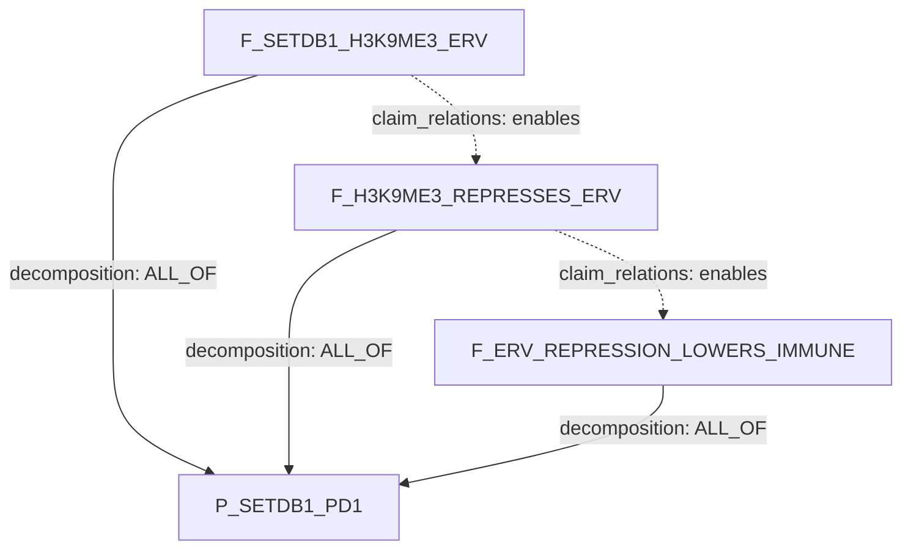

# Claim Object, Simple Version

## Stores

| Store | Job | Boolean rollup? |
|---|---|---|
| `claims` | Durable biological assertions. | No |
| `claim_relations` | Semantic relations: `same_as`, `refines`, `contradicts`, `enables`, `corroborates`. | No |
| `claim_decomposition_edges` | Proof/decomposition DAG edges consumed by the agent. | Yes |

`claim_type` is not core claim identity. If present during migration, treat it
as legacy or derived metadata.

Evidence path:

```text
analysis_runs -> biological_results -> result_to_claim -> claims
```

## Claim Row Key

| Field | Meaning |
|---|---|
| `claim_id` | Stable id. |
| `claim_text` | Free-text assertion. |
| `participants` | Free-text and/or entity ids for subject, object, context, phenotype. |
| `relation_name` | Predicate, e.g. `increases`, `represses`, `causes_resistance_to`. |
| `relation_polarity` | `positive`, `negative`, `null_hypothesis`, or `unknown`. |
| `context_set_json` | Where the assertion holds. |
| `evidence_status` | `unchecked`, `evidenced`, `refuted`, `inconclusive`. |
| `prior_art_status` | `new`, `literature_supported`, `literature_refuted`. |
| `review_status` | `draft`, `under_review`, `accepted`, `retired`. |
| `confidence_summary` / `rollups` | Materialized evidence rollup. |
| `edge_signature` | Canonical dedup hash. |
| `full_data` | Extra structured JSON; not proof role. |

## Tiny Example

Parent:

```text
P_SETDB1_PD1: SETDB1 overexpression causes anti-PD-1 resistance.
```

### Claims

| ID | claim_text | participants | relation_name | relation_polarity | context/properties |
|---|---|---|---|---|---|
| `P_SETDB1_PD1` | SETDB1 overexpression causes anti-PD-1 resistance. | SETDB1; anti-PD-1 therapy; tumor cell; resistance phenotype | `causes_resistance_to` | `positive` | therapy=anti-PD1; cell_type=tumor_cell |
| `F_SETDB1_H3K9ME3_ERV` | SETDB1 increases H3K9me3 at ERV loci. | SETDB1; H3K9me3; ERV loci; tumor cell | `increases` | `positive` | locus_class=ERV |
| `F_H3K9ME3_REPRESSES_ERV` | H3K9me3 represses ERV transcription. | H3K9me3; ERV transcription; tumor cell | `represses` | `negative` | locus_class=ERV |
| `F_ERV_REPRESSION_LOWERS_IMMUNE` | ERV repression lowers tumour immune activation. | ERV repression; dsRNA/immune activation; tumor cell | `lowers` | `negative` | tumor_intrinsic=true |

### Decomposition Edges

| source_claim_id | target_claim_id | support_operator | source_role | target_role | group_id |
|---|---|---|---|---|---|
| `F_SETDB1_H3K9ME3_ERV` | `P_SETDB1_PD1` | `ALL_OF` | `required_step` | `parent_claim` | `setdb1_required_chain` |
| `F_H3K9ME3_REPRESSES_ERV` | `P_SETDB1_PD1` | `ALL_OF` | `required_step` | `parent_claim` | `setdb1_required_chain` |
| `F_ERV_REPRESSION_LOWERS_IMMUNE` | `P_SETDB1_PD1` | `ALL_OF` | `required_step` | `parent_claim` | `setdb1_required_chain` |

### Semantic Claim Relations

| source_claim_id | target_claim_id | relation_kind | notes |
|---|---|---|---|
| `F_SETDB1_H3K9ME3_ERV` | `F_H3K9ME3_REPRESSES_ERV` | `enables` | Temporal/mechanistic order only. |
| `F_H3K9ME3_REPRESSES_ERV` | `F_ERV_REPRESSION_LOWERS_IMMUNE` | `enables` | Temporal/mechanistic order only. |

### DAG



Readout:

```text
P_SETDB1_PD1 is satisfied only if all three active child claims are supported.
The dotted enables edges do not count toward rollup.
```

## Query Shapes

Active proof children:

```sql
SELECT source_claim_id, target_claim_id, support_operator, source_role, group_id
FROM claim_decomposition_edges
WHERE target_claim_id = '<parent_claim_id>'
  AND edge_status = 'active';
```

Semantic relations:

```sql
SELECT source_claim_id, target_claim_id, relation_kind, relation_status, notes
FROM claim_relations
WHERE source_claim_id = '<claim_id>'
   OR target_claim_id = '<claim_id>';
```

Evidence for a claim:

```sql
SELECT claim_id, result_id, stance, rationale_text
FROM result_to_claim
WHERE claim_id = '<claim_id>'
  AND attached = 1;
```
