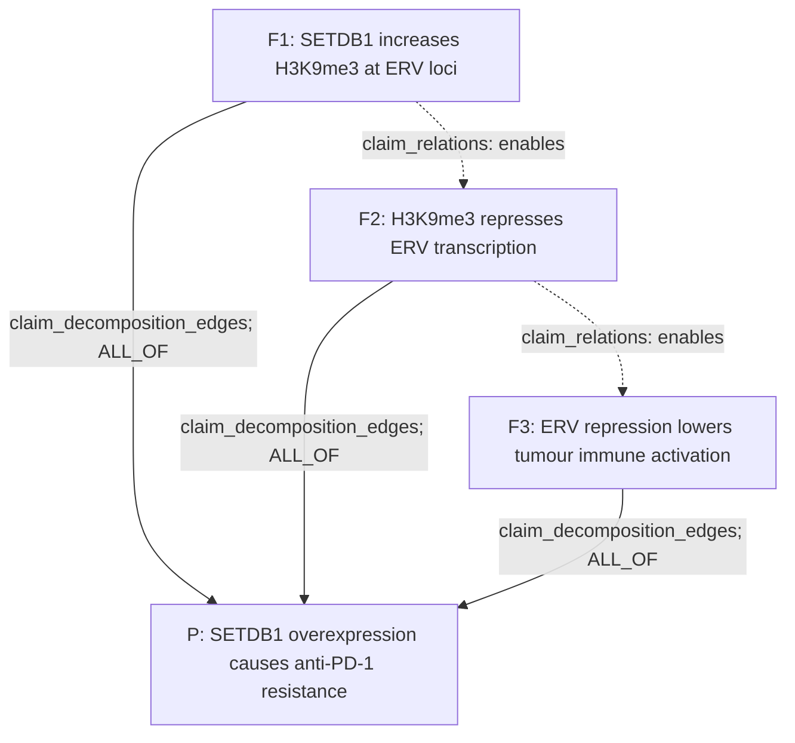

# Claim Object, Simple Version

This is the minimal mental model for the claim object and the proof
decomposition DAG.

## The Three Stores

| Store | Job | Used for Boolean proof rollup? |
|---|---|---|
| `claims` | Durable biological assertions. | No, not by itself. |
| `claim_relations` | Semantic relationships between claims, such as `same_as`, `refines`, `contradicts`, `enables`, and `corroborates`. | No. |
| `claim_decomposition_edges` | Proof/decomposition DAG edges consumed by the agent. | Yes. |

The important separation is:

```text
claim_relations says how claims relate biologically or semantically.
claim_decomposition_edges says how child claims compose to prove a parent.
```

`claim_type` is not part of the core claim object. A claim is defined by its
text, relation, participants, context, status, evidence rollups, and stable
identity. If `claim_type` exists during migration, treat it as legacy or
derived metadata, not something the agent depends on.

Evidence does not live directly on the claim. It is interpreted through:

```text
analysis_runs -> biological_results -> result_to_claim -> claims
```

## Tiny Example

Parent claim:

```text
SETDB1 overexpression causes anti-PD-1 resistance.
```

Mechanism child claims:

```text
F1: SETDB1 increases H3K9me3 at ERV loci.
F2: H3K9me3 represses ERV transcription.
F3: ERV repression lowers tumour immune activation.
```

The proof/decomposition DAG:



Read this as:

```text
The parent claim is not satisfied until F1, F2, and F3 are all supported.
The enables edges are narrative/temporal ordering only.
```

## What Gets Stored

Parent claim row:

```json
{
  "claim_id": "claim:setdb1-pd1-resistance",
  "claim_text": "SETDB1 overexpression causes anti-PD-1 resistance.",
  "relation_name": "causes_resistance_to",
  "relation_polarity": "positive",
  "context_set_json": {
    "therapy": "anti-PD1",
    "cell_type": "tumor_cell"
  },
  "evidence_status": "unchecked",
  "prior_art_status": "new",
  "review_status": "draft",
  "edge_signature": "<canonical hash>",
  "full_data": {}
}
```

Child claim row:

```json
{
  "claim_id": "claim:setdb1-h3k9me3-erv",
  "claim_text": "SETDB1 increases H3K9me3 at ERV loci.",
  "relation_name": "increases",
  "relation_polarity": "positive",
  "context_set_json": {
    "cell_type": "tumor_cell",
    "locus_class": "ERV"
  },
  "evidence_status": "unchecked",
  "prior_art_status": "new",
  "review_status": "draft",
  "edge_signature": "<canonical hash>",
  "full_data": {}
}
```

Proof/decomposition edge:

```json
{
  "edge_id": "decomp:setdb1-pd1:F1",
  "source_claim_id": "claim:setdb1-h3k9me3-erv",
  "target_claim_id": "claim:setdb1-pd1-resistance",
  "support_operator": "ALL_OF",
  "support_operator_params": {},
  "source_role": "required_step",
  "target_role": "parent_claim",
  "group_id": "setdb1_required_mechanism",
  "edge_status": "active"
}
```

Semantic ordering relation:

```json
{
  "relation_id": "rel:setdb1-h3k9me3-enables-erv-repression",
  "source_claim_id": "claim:setdb1-h3k9me3-erv",
  "target_claim_id": "claim:h3k9me3-represses-erv",
  "relation_kind": "enables",
  "relation_status": "active"
}
```

## The Most Important Rule

Do not hide a mechanism inside one giant parent claim.

Bad:

```text
SETDB1 causes PD-1 resistance by increasing H3K9me3, repressing ERVs,
lowering dsRNA sensing, lowering antigen presentation, and reducing T-cell
recognition.
```

Better:

```text
Parent: SETDB1 causes PD-1 resistance.
Child 1: SETDB1 increases H3K9me3.
Child 2: H3K9me3 represses ERVs.
Child 3: ERV repression lowers immune activation.
Child 4: lower immune activation reduces PD-1 response.
```

Each child can then get its own evidence and its own UCT2 proof state.

If the same anchor fact supports two downstream mechanisms, store the anchor
claim once and connect it to both mechanism modules through
`claim_decomposition_edges`. The shared fan-out pattern is what makes this a
DAG rather than a tree.

## Quick Queries

Show proof children for a parent:

```sql
SELECT source_claim_id AS child, target_claim_id AS parent,
       support_operator, source_role, group_id, edge_status
FROM claim_decomposition_edges
WHERE target_claim_id = '<parent_claim_id>'
  AND edge_status = 'active';
```

Show semantic relations around one claim:

```sql
SELECT source_claim_id, target_claim_id, relation_kind, relation_status, notes
FROM claim_relations
WHERE source_claim_id = '<claim_id>'
   OR target_claim_id = '<claim_id>';
```

Show evidence interpreted for one child:

```sql
SELECT rtc.claim_id, rtc.result_id, rtc.stance, rtc.rationale_text
FROM result_to_claim rtc
WHERE rtc.claim_id = '<child_claim_id>'
  AND rtc.attached = 1;
```
