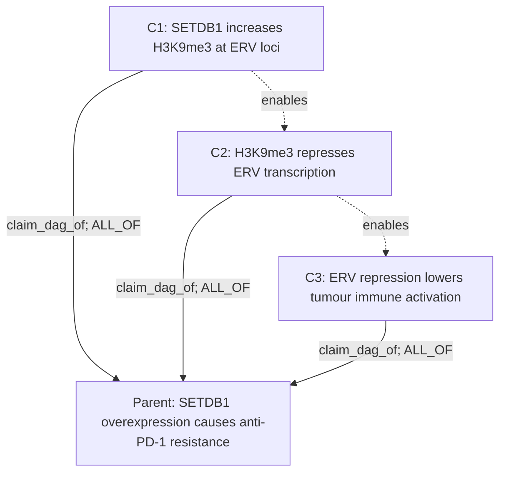

# Claim Object, Simple Version

This is the minimal mental model for the current proof-DAG fork.

## The Three Objects

| Thing | What it is | Where it lives |
|---|---|---|
| Parent claim | The main hypothesis we care about | `claims` |
| Child claim | A mechanism step that helps prove the parent | `claims` |
| Claim DAG edge | The statement that a child belongs to the parent mechanism | `claim_relations` |

The child claim does not need a special legacy type. It should be a normal
claim row, with a property such as `node_kind = atomic_mechanism_claim` if the
caller needs to distinguish mechanism leaves from parent/module claims.

Evidence does not live directly on the claim. It is interpreted through:

```text
analysis_runs -> biological_results -> result_to_claim -> claims
```

## Tiny Example

Parent claim:

```text
SETDB1 overexpression causes anti-PD-1 resistance.
```

Mechanism child claims:

```text
C1: SETDB1 increases H3K9me3 at ERV loci.
C2: H3K9me3 represses ERV transcription.
C3: ERV repression lowers tumour immune activation.
```

The claim DAG:



Read this as:

```text
The parent claim is not satisfied until C1, C2, and C3 are all supported.
```

## What Gets Stored

Parent claim row:

```json
{
  "claim_id": "claim:setdb1-pd1-resistance",
  "claim_type": "SupersetClaim",
  "claim_text": "SETDB1 overexpression causes anti-PD-1 resistance.",
  "relation_name": "causes_resistance_to",
  "relation_polarity": "positive",
  "context_set_json": {
    "therapy": "anti-PD1",
    "cell_type": "tumor_cell"
  }
}
```

Child claim row:

```json
{
  "claim_id": "claim:setdb1-pd1-resistance:step1",
  "claim_type": "<domain-specific claim type>",
  "claim_text": "SETDB1 increases H3K9me3 at ERV loci.",
  "relation_name": "modulates_epigenetic_state",
  "relation_polarity": "positive",
  "properties": {
    "node_kind": "atomic_mechanism_claim"
  }
}
```

Claim DAG edge:

```json
{
  "source_claim_id": "claim:setdb1-pd1-resistance:step1",
  "target_claim_id": "claim:setdb1-pd1-resistance",
  "relation_type": "claim_dag_of",
  "properties": {
    "parent_support_operator": "ALL_OF",
    "claim_dag_node_kind": "mechanism_step",
    "step_index": 1,
    "dag_edge_status": "active"
  }
}
```

## The Most Important Rule

Use child claims for mechanism steps. Do not hide a mechanism inside one giant
parent claim.

Bad:

```text
SETDB1 causes PD-1 resistance by increasing H3K9me3, repressing ERVs,
lowering dsRNA sensing, lowering antigen presentation, and reducing T-cell
recognition.
```

Better:

```text
Parent: SETDB1 causes PD-1 resistance.
Child 1: SETDB1 increases H3K9me3.
Child 2: H3K9me3 represses ERVs.
Child 3: ERV repression lowers immune activation.
Child 4: lower immune activation reduces PD-1 response.
```

Each child can then get its own evidence and its own UCT2 proof DAG.

If the same anchor fact supports two downstream mechanisms, store it once and
connect that one child claim to both mechanism modules. That shared outgoing
edge pattern is what makes this a DAG rather than a tree.

## Quick Queries

Show the mechanism children for a parent:

```sql
SELECT source_claim_id AS child, target_claim_id AS parent, relation_type, properties
FROM claim_relations
WHERE target_claim_id = '<parent_claim_id>'
  AND relation_type = 'claim_dag_of';
```

Show evidence interpreted for one child:

```sql
SELECT rtc.claim_id, rtc.result_id, rtc.stance, rtc.rationale_text
FROM result_to_claim rtc
WHERE rtc.claim_id = '<child_claim_id>'
  AND rtc.attached = 1;
```

Show the proof DAG for one child:

```sql
SELECT claim_id, uct2
FROM claims
WHERE claim_id = '<child_claim_id>';
```
