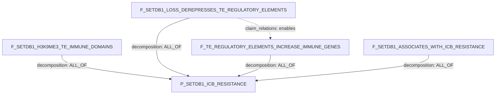

# Claim Object, Simple Version

## Stores

| Store | Job | Boolean rollup? |
|---|---|---|
| `claims` | Durable biological assertions. | No |
| `claim_relations` | Semantic relations: `same_as`, `refines`, `contradicts`, `enables`, `corroborates`. | No |
| `claim_decomposition_edges` | Proof/decomposition DAG edges consumed by the agent. | Yes |

`claim_type` is not core claim identity. If present during migration, treat it
as legacy or derived metadata.

Evidence path:

```text
analysis_runs -> biological_results -> result_to_claim -> claims
```

## Claim Row Key

| Field | Meaning |
|---|---|
| `claim_id` | Stable id. |
| `claim_text` | Free-text assertion. |
| `participants` | Role-labeled KG node ids from `entities`; no prose-only participants. |
| `relation_name` | Canonical predicate, e.g. `drives_phenotype`, `correlates_with`, `binds`. |
| `relation_polarity` | `positive`, `negative`, `bidirectional`, `null`, `unknown`, or SQL `NULL` when sign is not applicable. |
| `context_set_json` | Where the assertion holds. |
| `evidence_status` | `unchecked`, `evidenced`, `refuted`, `inconclusive`. |
| `prior_art_status` | `new`, `literature_supported`, `literature_refuted`. |
| `review_status` | `draft`, `under_review`, `accepted`, `retired`. |
| `confidence_summary` / `rollups` | Materialized evidence rollup. |
| `edge_signature` | Canonical dedup hash. |
| `full_data` | Extra structured JSON; not proof role. |

If no node exists for a needed phenotype, therapy context, or genomic region,
create a proposed `entities` row first. Do not store that participant as prose.

## Tiny Example

Parent:

```text
P_SETDB1_ICB_RESISTANCE:
SETDB1 overactivity drives immune-checkpoint-blockade resistance in tumor
cells.
```

Participant node key:

| node_id | type | meaning |
|---|---|---|
| `SETDB1` | `Gene` | SET domain bifurcated histone lysine methyltransferase 1. |
| `PHENO-ICB_RESISTANCE` | `Phenotype` | Poor response or resistance to immune-checkpoint blockade. |
| `THR-immune_checkpoint_blockade` | `TherapyRegimen` | ICB regimen. Use `THR-anti_PD1` for anti-PD-1-specific claims. |
| `TME-tumor_intrinsic` | `TMECompartment` | Tumor-cell-intrinsic compartment. |
| `EPI-H3K9me3` | `EpigeneticMark` | Histone H3 lysine 9 trimethylation. |
| `GENOME-TE_IMMUNE_DOMAINS` | `BiologicalProcess` | TE-rich or immune-associated genomic domains. |
| `GENOME-TE_REGULATORY_ELEMENTS` | `BiologicalProcess` | Latent TE-derived regulatory elements. |
| `BP-IMMUNOSTIMULATORY_GENE_EXPRESSION` | `BiologicalProcess` | Tumor-intrinsic immune gene expression. |

### Claims

| ID | claim_text | participants | relation_name | relation_polarity | context/properties |
|---|---|---|---|---|---|
| `P_SETDB1_ICB_RESISTANCE` | SETDB1 overactivity drives immune-checkpoint-blockade resistance in tumor cells. | effector:`SETDB1`; phenotype:`PHENO-ICB_RESISTANCE`; therapy_context:`THR-immune_checkpoint_blockade`; cell_context:`TME-tumor_intrinsic` | `drives_phenotype` | `positive` | SETDB1 alteration=overactivity |
| `F_SETDB1_H3K9ME3_TE_IMMUNE_DOMAINS` | SETDB1-dependent H3K9me3 domains are enriched for TE-rich and immune-associated genomic domains. | effector:`SETDB1`; mark:`EPI-H3K9me3`; region_class:`GENOME-TE_IMMUNE_DOMAINS`; cell_context:`TME-tumor_intrinsic` | `has_observed_property` | SQL `NULL` | shared anchor |
| `F_SETDB1_LOSS_DEREPRESSES_TE_REGULATORY_ELEMENTS` | SETDB1 loss derepresses latent TE-derived regulatory elements. | effector:`SETDB1`; target:`GENOME-TE_REGULATORY_ELEMENTS`; cell_context:`TME-tumor_intrinsic` | `perturbation_changes_phenotype` | `positive` | SETDB1 alteration=loss |
| `F_TE_REGULATORY_ELEMENTS_INCREASE_IMMUNE_GENES` | Derepressed TE-derived regulatory elements increase immunostimulatory gene expression. | effector:`GENOME-TE_REGULATORY_ELEMENTS`; phenotype:`BP-IMMUNOSTIMULATORY_GENE_EXPRESSION`; cell_context:`TME-tumor_intrinsic` | `drives_phenotype` | `positive` | tumor_intrinsic=true |
| `F_SETDB1_ASSOCIATES_WITH_ICB_RESISTANCE` | SETDB1 overactivity associates with ICB resistance in human tumors. | effector:`SETDB1`; phenotype:`PHENO-ICB_RESISTANCE`; therapy_context:`THR-immune_checkpoint_blockade`; cell_context:`TME-tumor_intrinsic` | `is_associated_with_outcome` | `positive` | human context; SETDB1 alteration=overactivity |

### Decomposition Edges

| source_claim_id | target_claim_id | support_operator | source_role | target_role | group_id |
|---|---|---|---|---|---|
| `F_SETDB1_H3K9ME3_TE_IMMUNE_DOMAINS` | `P_SETDB1_ICB_RESISTANCE` | `ALL_OF` | `shared_anchor` | `parent_claim` | `setdb1_simple` |
| `F_SETDB1_LOSS_DEREPRESSES_TE_REGULATORY_ELEMENTS` | `P_SETDB1_ICB_RESISTANCE` | `ALL_OF` | `required_step` | `parent_claim` | `setdb1_simple` |
| `F_TE_REGULATORY_ELEMENTS_INCREASE_IMMUNE_GENES` | `P_SETDB1_ICB_RESISTANCE` | `ALL_OF` | `required_step` | `parent_claim` | `setdb1_simple` |
| `F_SETDB1_ASSOCIATES_WITH_ICB_RESISTANCE` | `P_SETDB1_ICB_RESISTANCE` | `ALL_OF` | `context_bridge` | `parent_claim` | `setdb1_simple` |

### Semantic Claim Relations

| source_claim_id | target_claim_id | relation_kind | notes |
|---|---|---|---|
| `F_SETDB1_LOSS_DEREPRESSES_TE_REGULATORY_ELEMENTS` | `F_TE_REGULATORY_ELEMENTS_INCREASE_IMMUNE_GENES` | `enables` | Temporal/mechanistic order only. |

### DAG



Readout:

```text
P_SETDB1_ICB_RESISTANCE is satisfied only if all four active child claims are
supported.
The dotted enables edges do not count toward rollup.
```

## Query Shapes

Active proof children:

```sql
SELECT source_claim_id, target_claim_id, support_operator, source_role, group_id
FROM claim_decomposition_edges
WHERE target_claim_id = '<parent_claim_id>'
  AND edge_status = 'active';
```

Semantic relations:

```sql
SELECT source_claim_id, target_claim_id, relation_kind, relation_status, notes
FROM claim_relations
WHERE source_claim_id = '<claim_id>'
   OR target_claim_id = '<claim_id>';
```

Evidence for a claim:

```sql
SELECT claim_id, result_id, stance, rationale_text
FROM result_to_claim
WHERE claim_id = '<claim_id>'
  AND attached = 1;
```
