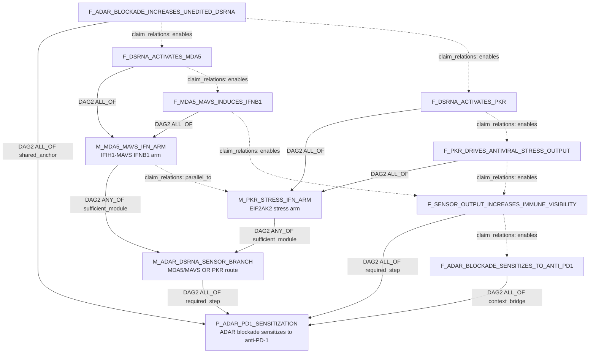
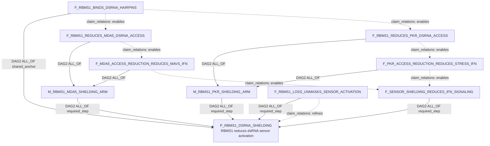
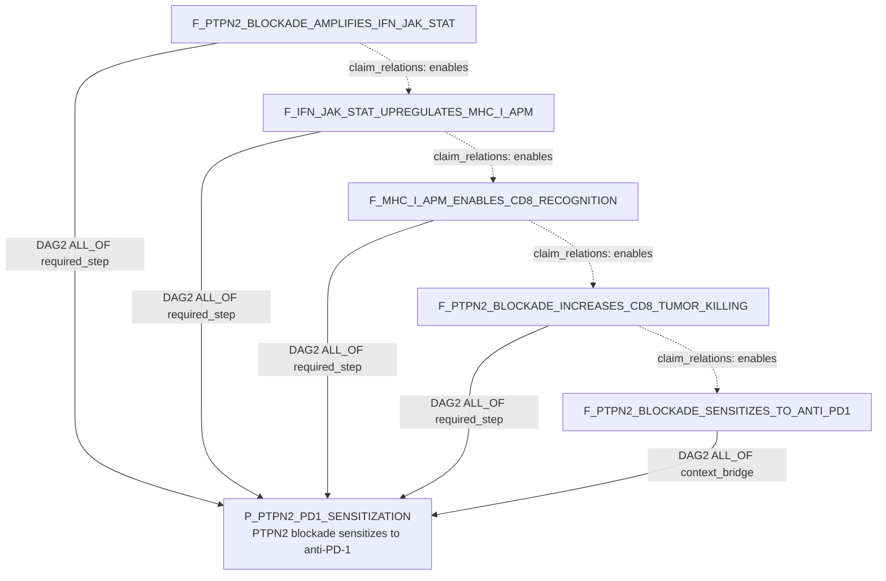
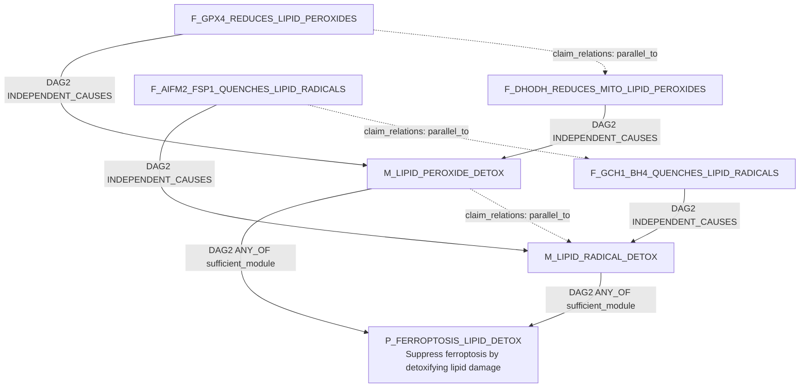

# Focused DAG2 Claim Relation Examples

Date: 2026-06-04

Purpose: target DAG2 constructions for four hypotheses where the current broad
example file is too noisy or scientifically ambiguous. These are candidate
claim-object DAGs intended to guide Step0/DAG2 compiler behavior, not L2/L3
proof results.

Solid arrows in the Mermaid diagrams are `claim_decomposition_edges`: they
carry Boolean rollup operators. Dotted arrows are `claim_relations`: they show
biological order, refinement, or branch relationships and do not roll up parent
truth.

Participant convention: participants should be role-labeled KG node ids. When a
node is not known to exist yet, it is written as `PROPOSED-*` and should be
inserted into `entities` before accepting the claim row. ADAR1 maps to the
canonical HGNC gene `HGNC:ADAR`; MDA5 maps to `HGNC:IFIH1`; PKR maps to
`HGNC:EIF2AK2`.

## 1. ADAR1 Blockade / dsRNA Sensing / PD-1 Sensitization

Input hypothesis:

```text
ADAR1 blockade will sensitize tumors to PD-1 therapy by allowing endogenous
double-stranded RNA to activate antiviral sensing and tumor inflammation.
```

Corrected construction note: the sensor branch should not be a flat ALL_OF
chain where both MDA5 and PKR are mandatory. MDA5/MAVS and PKR are alternative
dsRNA-sensor routes. The therapeutic PD-1 endpoint remains a separate required
claim so that "PKR activation" alone does not automatically prove anti-PD-1
sensitization.

Formula:

```text
P_ADAR_PD1_SENSITIZATION =
  F_ADAR_BLOCKADE_INCREASES_UNEDITED_DSRNA AND
  M_ADAR_DSRNA_SENSOR_BRANCH AND
  F_SENSOR_OUTPUT_INCREASES_IMMUNE_VISIBILITY AND
  F_ADAR_BLOCKADE_SENSITIZES_TO_ANTI_PD1

M_ADAR_DSRNA_SENSOR_BRANCH =
  M_MDA5_MAVS_IFN_ARM OR
  M_PKR_STRESS_IFN_ARM

M_MDA5_MAVS_IFN_ARM =
  F_DSRNA_ACTIVATES_MDA5 AND
  F_MDA5_MAVS_INDUCES_IFNB1

M_PKR_STRESS_IFN_ARM =
  F_DSRNA_ACTIVATES_PKR AND
  F_PKR_DRIVES_ANTIVIRAL_STRESS_OUTPUT
```

Source context: local `ADAR1paper.pdf`; DOI reported in the earlier audit as
`10.1038/s41586-018-0768-9`.

### Claim Rows

| ID | claim_text | participants | relation_name | polarity | context/properties |
|---|---|---|---|---|---|
| `P_ADAR_PD1_SENSITIZATION` | ADAR blockade sensitizes tumors to anti-PD-1 therapy by increasing endogenous dsRNA sensing, antiviral inflammatory output, and tumor immune visibility. | target:`HGNC:ADAR`; therapy_context:`THR-anti_PD1`; therapy_target:`HGNC:PDCD1`; phenotype:`PHENO-ICB_sensitization`; cell_context:`TME-tumor_intrinsic` | `sensitizes_to_therapy` | `positive` | parent hypothesis; ADAR1 alias resolved to ADAR |
| `M_ADAR_DSRNA_SENSOR_BRANCH` | At least one endogenous-dsRNA sensor branch is activated after ADAR blockade. | target:`HGNC:ADAR`; substrate:`PROPOSED-unedited_endogenous_dsRNA`; pathway:`PATHWAY-antiviral_RNA_sensing` | `describes_mechanism` | SQL `NULL` | module=true; alternative sensor routes |
| `M_MDA5_MAVS_IFN_ARM` | The IFIH1/MDA5-MAVS arm converts unedited endogenous dsRNA into IFNB1-linked inflammatory signaling. | sensor:`HGNC:IFIH1`; adaptor:`HGNC:MAVS`; output:`HGNC:IFNB1`; pathway:`PATHWAY-type_I_interferon` | `drives_pathway_output` | `positive` | module=true; MDA5/MAVS route |
| `M_PKR_STRESS_IFN_ARM` | The EIF2AK2/PKR arm converts unedited endogenous dsRNA into antiviral stress or inflammatory output. | sensor_kinase:`HGNC:EIF2AK2`; substrate:`PROPOSED-unedited_endogenous_dsRNA`; pathway:`PATHWAY-integrated_stress_response` | `drives_pathway_output` | `positive` | module=true; PKR route |
| `F_ADAR_BLOCKADE_INCREASES_UNEDITED_DSRNA` | ADAR loss or blockade increases unedited endogenous dsRNA available for antiviral sensor recognition in tumor cells. | target:`HGNC:ADAR`; substrate:`PROPOSED-unedited_endogenous_dsRNA`; process:`BP-antiviral_sensor_exposure`; cell_context:`TME-tumor_intrinsic` | `increases` | `positive` | shared substrate anchor |
| `F_DSRNA_ACTIVATES_MDA5` | Unedited endogenous dsRNA activates IFIH1/MDA5 signaling in ADAR-blocked tumor cells. | substrate:`PROPOSED-unedited_endogenous_dsRNA`; sensor:`HGNC:IFIH1`; cell_context:`TME-tumor_intrinsic` | `activates` | `positive` | MDA5 branch |
| `F_MDA5_MAVS_INDUCES_IFNB1` | IFIH1/MDA5 signaling requires MAVS to induce IFNB1 or type-I-interferon output in ADAR-blocked tumor cells. | sensor:`HGNC:IFIH1`; adaptor:`HGNC:MAVS`; output:`HGNC:IFNB1`; cell_context:`TME-tumor_intrinsic` | `requires` | `positive` | MDA5/MAVS output |
| `F_DSRNA_ACTIVATES_PKR` | Unedited endogenous dsRNA activates EIF2AK2/PKR signaling in ADAR-blocked tumor cells. | substrate:`PROPOSED-unedited_endogenous_dsRNA`; sensor_kinase:`HGNC:EIF2AK2`; cell_context:`TME-tumor_intrinsic` | `activates` | `positive` | PKR branch |
| `F_PKR_DRIVES_ANTIVIRAL_STRESS_OUTPUT` | EIF2AK2/PKR activation drives antiviral stress or growth-control output in ADAR-blocked tumor cells. | sensor_kinase:`HGNC:EIF2AK2`; pathway:`PATHWAY-integrated_stress_response`; phenotype:`PHENO-antiviral_stress_output`; cell_context:`TME-tumor_intrinsic` | `drives_phenotype` | `positive` | PKR output |
| `F_SENSOR_OUTPUT_INCREASES_IMMUNE_VISIBILITY` | Antiviral sensor output after ADAR blockade increases tumor inflammation, immune visibility, or T-cell-recognition programs. | pathway:`PATHWAY-antiviral_RNA_sensing`; phenotype:`PHENO-tumor_immune_visibility`; immune_cell:`CT-CD8_TCELL`; cell_context:`TME-tumor_intrinsic` | `increases` | `positive` | immune-visibility bridge |
| `F_ADAR_BLOCKADE_SENSITIZES_TO_ANTI_PD1` | ADAR loss or blockade increases anti-PD-1 response in immune-competent tumor contexts. | target:`HGNC:ADAR`; therapy_context:`THR-anti_PD1`; therapy_target:`HGNC:PDCD1`; phenotype:`PHENO-ICB_sensitization` | `sensitizes_to_therapy` | `positive` | therapeutic endpoint |

### Decomposition Edges

| source -> target | operator | source_role | group_id |
|---|---|---|---|
| `F_ADAR_BLOCKADE_INCREASES_UNEDITED_DSRNA -> P_ADAR_PD1_SENSITIZATION` | `ALL_OF` | `shared_anchor` | `adar_parent` |
| `M_ADAR_DSRNA_SENSOR_BRANCH -> P_ADAR_PD1_SENSITIZATION` | `ALL_OF` | `required_step` | `adar_parent` |
| `F_SENSOR_OUTPUT_INCREASES_IMMUNE_VISIBILITY -> P_ADAR_PD1_SENSITIZATION` | `ALL_OF` | `required_step` | `adar_parent` |
| `F_ADAR_BLOCKADE_SENSITIZES_TO_ANTI_PD1 -> P_ADAR_PD1_SENSITIZATION` | `ALL_OF` | `context_bridge` | `adar_parent` |
| `M_MDA5_MAVS_IFN_ARM -> M_ADAR_DSRNA_SENSOR_BRANCH` | `ANY_OF` | `sufficient_module` | `adar_sensor_choice` |
| `M_PKR_STRESS_IFN_ARM -> M_ADAR_DSRNA_SENSOR_BRANCH` | `ANY_OF` | `sufficient_module` | `adar_sensor_choice` |
| `F_DSRNA_ACTIVATES_MDA5 -> M_MDA5_MAVS_IFN_ARM` | `ALL_OF` | `required_step` | `mda5_mavs_arm` |
| `F_MDA5_MAVS_INDUCES_IFNB1 -> M_MDA5_MAVS_IFN_ARM` | `ALL_OF` | `required_step` | `mda5_mavs_arm` |
| `F_DSRNA_ACTIVATES_PKR -> M_PKR_STRESS_IFN_ARM` | `ALL_OF` | `required_step` | `pkr_arm` |
| `F_PKR_DRIVES_ANTIVIRAL_STRESS_OUTPUT -> M_PKR_STRESS_IFN_ARM` | `ALL_OF` | `required_step` | `pkr_arm` |

### Semantic Claim Relations

| source -> target | relation_kind | notes |
|---|---|---|
| `F_ADAR_BLOCKADE_INCREASES_UNEDITED_DSRNA -> F_DSRNA_ACTIVATES_MDA5` | `enables` | Increased unedited dsRNA supplies the ligand for the MDA5 branch. |
| `F_ADAR_BLOCKADE_INCREASES_UNEDITED_DSRNA -> F_DSRNA_ACTIVATES_PKR` | `enables` | Increased unedited dsRNA supplies the ligand for the PKR branch. |
| `F_DSRNA_ACTIVATES_MDA5 -> F_MDA5_MAVS_INDUCES_IFNB1` | `enables` | MDA5 activation is upstream of MAVS-dependent IFNB1 output. |
| `F_DSRNA_ACTIVATES_PKR -> F_PKR_DRIVES_ANTIVIRAL_STRESS_OUTPUT` | `enables` | PKR activation is upstream of stress or antiviral output. |
| `M_MDA5_MAVS_IFN_ARM -> M_PKR_STRESS_IFN_ARM` | `parallel_to` | Distinct endogenous-dsRNA sensor routes. |
| `F_SENSOR_OUTPUT_INCREASES_IMMUNE_VISIBILITY -> F_ADAR_BLOCKADE_SENSITIZES_TO_ANTI_PD1` | `enables` | Immune visibility is the mechanistic bridge into checkpoint response. |

### Relation-Labeled DAG2 Visualization



## 2. RBMS1 / dsRNA Shielding / Cell-Intrinsic Immune Suppression

Input hypothesis:

```text
RBMS1 binds endogenous dsRNA hairpins and shields them from MDA5 and PKR
recognition, preventing activation of antiviral interferon signaling and thereby
reducing cell-intrinsic immune activation.
```

Construction note: this hypothesis explicitly names both MDA5 and PKR. Unless
the user rewrites it as "one of several sensors," DAG2 should require both
shielding arms. The arms are separate modules because MDA5/MAVS interferon
signaling and PKR stress signaling have different readouts.

Formula:

```text
P_RBMS1_DSRNA_SHIELDING =
  F_RBMS1_BINDS_DSRNA_HAIRPINS AND
  M_RBMS1_MDA5_SHIELDING_ARM AND
  M_RBMS1_PKR_SHIELDING_ARM AND
  F_SENSOR_SHIELDING_REDUCES_IFN_SIGNALING AND
  F_RBMS1_LOSS_UNMASKS_SENSOR_ACTIVATION

M_RBMS1_MDA5_SHIELDING_ARM =
  F_RBMS1_REDUCES_MDA5_DSRNA_ACCESS AND
  F_MDA5_ACCESS_REDUCTION_REDUCES_MAVS_IFN

M_RBMS1_PKR_SHIELDING_ARM =
  F_RBMS1_REDUCES_PKR_DSRNA_ACCESS AND
  F_PKR_ACCESS_REDUCTION_REDUCES_STRESS_IFN
```

Source context: lab hypothesis; direct primary literature attachment is still
needed before any child is treated as known evidence.

### Claim Rows

| ID | claim_text | participants | relation_name | polarity | context/properties |
|---|---|---|---|---|---|
| `P_RBMS1_DSRNA_SHIELDING` | RBMS1 shields endogenous dsRNA hairpins from MDA5 and PKR recognition, reducing antiviral interferon signaling and cell-intrinsic immune activation. | effector:`HGNC:RBMS1`; substrate:`PROPOSED-endogenous_dsRNA_hairpin`; sensor:`HGNC:IFIH1`; sensor_kinase:`HGNC:EIF2AK2`; phenotype:`PHENO-cell_intrinsic_immune_activation` | `suppresses` | `negative` | parent hypothesis |
| `M_RBMS1_MDA5_SHIELDING_ARM` | RBMS1 shielding reduces MDA5/MAVS interferon signaling from endogenous dsRNA hairpins. | effector:`HGNC:RBMS1`; sensor:`HGNC:IFIH1`; adaptor:`HGNC:MAVS`; substrate:`PROPOSED-endogenous_dsRNA_hairpin` | `suppresses` | `negative` | module=true; MDA5 arm |
| `M_RBMS1_PKR_SHIELDING_ARM` | RBMS1 shielding reduces PKR-dependent stress or antiviral signaling from endogenous dsRNA hairpins. | effector:`HGNC:RBMS1`; sensor_kinase:`HGNC:EIF2AK2`; substrate:`PROPOSED-endogenous_dsRNA_hairpin` | `suppresses` | `negative` | module=true; PKR arm |
| `F_RBMS1_BINDS_DSRNA_HAIRPINS` | RBMS1 physically binds endogenous dsRNA hairpin structures. | effector:`HGNC:RBMS1`; substrate:`PROPOSED-endogenous_dsRNA_hairpin` | `binds` | `positive` | substrate anchor |
| `F_RBMS1_REDUCES_MDA5_DSRNA_ACCESS` | RBMS1 occupancy on endogenous dsRNA hairpins reduces IFIH1/MDA5 access or recognition. | effector:`HGNC:RBMS1`; substrate:`PROPOSED-endogenous_dsRNA_hairpin`; sensor:`HGNC:IFIH1` | `blocks_recognition_by` | `negative` | MDA5 branch |
| `F_MDA5_ACCESS_REDUCTION_REDUCES_MAVS_IFN` | Reduced MDA5 recognition lowers MAVS-dependent type-I-interferon or ISG signaling. | sensor:`HGNC:IFIH1`; adaptor:`HGNC:MAVS`; pathway:`PATHWAY-type_I_interferon`; process:`BP-ISG_expression` | `reduces` | `negative` | MDA5 downstream |
| `F_RBMS1_REDUCES_PKR_DSRNA_ACCESS` | RBMS1 occupancy on endogenous dsRNA hairpins reduces EIF2AK2/PKR access or recognition. | effector:`HGNC:RBMS1`; substrate:`PROPOSED-endogenous_dsRNA_hairpin`; sensor_kinase:`HGNC:EIF2AK2` | `blocks_recognition_by` | `negative` | PKR branch |
| `F_PKR_ACCESS_REDUCTION_REDUCES_STRESS_IFN` | Reduced PKR recognition lowers PKR-dependent stress signaling or antiviral immune activation. | sensor_kinase:`HGNC:EIF2AK2`; pathway:`PATHWAY-integrated_stress_response`; phenotype:`PHENO-antiviral_immune_activation` | `reduces` | `negative` | PKR downstream |
| `F_SENSOR_SHIELDING_REDUCES_IFN_SIGNALING` | Shielding endogenous dsRNA from MDA5 and PKR reduces antiviral interferon signaling and cell-intrinsic immune activation. | sensor:`HGNC:IFIH1`; sensor_kinase:`HGNC:EIF2AK2`; phenotype:`PHENO-cell_intrinsic_immune_activation`; pathway:`PATHWAY-antiviral_RNA_sensing` | `reduces` | `negative` | endpoint bridge |
| `F_RBMS1_LOSS_UNMASKS_SENSOR_ACTIVATION` | RBMS1 loss unmasks endogenous dsRNA hairpins and increases MDA5 or PKR sensor activation. | effector:`HGNC:RBMS1`; substrate:`PROPOSED-endogenous_dsRNA_hairpin`; sensor:`HGNC:IFIH1`; sensor_kinase:`HGNC:EIF2AK2` | `increases_when_lost` | `positive` | perturbation discriminator |

### Decomposition Edges

| source -> target | operator | source_role | group_id |
|---|---|---|---|
| `F_RBMS1_BINDS_DSRNA_HAIRPINS -> P_RBMS1_DSRNA_SHIELDING` | `ALL_OF` | `shared_anchor` | `rbms1_parent` |
| `M_RBMS1_MDA5_SHIELDING_ARM -> P_RBMS1_DSRNA_SHIELDING` | `ALL_OF` | `required_step` | `rbms1_parent` |
| `M_RBMS1_PKR_SHIELDING_ARM -> P_RBMS1_DSRNA_SHIELDING` | `ALL_OF` | `required_step` | `rbms1_parent` |
| `F_SENSOR_SHIELDING_REDUCES_IFN_SIGNALING -> P_RBMS1_DSRNA_SHIELDING` | `ALL_OF` | `required_step` | `rbms1_parent` |
| `F_RBMS1_LOSS_UNMASKS_SENSOR_ACTIVATION -> P_RBMS1_DSRNA_SHIELDING` | `ALL_OF` | `required_step` | `rbms1_parent` |
| `F_RBMS1_REDUCES_MDA5_DSRNA_ACCESS -> M_RBMS1_MDA5_SHIELDING_ARM` | `ALL_OF` | `required_step` | `rbms1_mda5_arm` |
| `F_MDA5_ACCESS_REDUCTION_REDUCES_MAVS_IFN -> M_RBMS1_MDA5_SHIELDING_ARM` | `ALL_OF` | `required_step` | `rbms1_mda5_arm` |
| `F_RBMS1_REDUCES_PKR_DSRNA_ACCESS -> M_RBMS1_PKR_SHIELDING_ARM` | `ALL_OF` | `required_step` | `rbms1_pkr_arm` |
| `F_PKR_ACCESS_REDUCTION_REDUCES_STRESS_IFN -> M_RBMS1_PKR_SHIELDING_ARM` | `ALL_OF` | `required_step` | `rbms1_pkr_arm` |

### Semantic Claim Relations

| source -> target | relation_kind | notes |
|---|---|---|
| `F_RBMS1_BINDS_DSRNA_HAIRPINS -> F_RBMS1_REDUCES_MDA5_DSRNA_ACCESS` | `enables` | Binding is the physical substrate anchor for MDA5 shielding. |
| `F_RBMS1_BINDS_DSRNA_HAIRPINS -> F_RBMS1_REDUCES_PKR_DSRNA_ACCESS` | `enables` | Binding is the physical substrate anchor for PKR shielding. |
| `F_RBMS1_REDUCES_MDA5_DSRNA_ACCESS -> F_MDA5_ACCESS_REDUCTION_REDUCES_MAVS_IFN` | `enables` | Less sensor access lowers downstream signaling. |
| `F_RBMS1_REDUCES_PKR_DSRNA_ACCESS -> F_PKR_ACCESS_REDUCTION_REDUCES_STRESS_IFN` | `enables` | Less sensor access lowers downstream signaling. |
| `F_MDA5_ACCESS_REDUCTION_REDUCES_MAVS_IFN -> F_SENSOR_SHIELDING_REDUCES_IFN_SIGNALING` | `enables` | MDA5 branch contributes to endpoint suppression. |
| `F_PKR_ACCESS_REDUCTION_REDUCES_STRESS_IFN -> F_SENSOR_SHIELDING_REDUCES_IFN_SIGNALING` | `enables` | PKR branch contributes to endpoint suppression. |
| `F_RBMS1_LOSS_UNMASKS_SENSOR_ACTIVATION -> P_RBMS1_DSRNA_SHIELDING` | `refines` | Loss-of-function is the key reversal test for the parent mechanism. |

### Relation-Labeled DAG2 Visualization



## 3. PTPN2 Blockade / Anti-PD-1 Sensitization

Input hypothesis:

```text
PTPN2 blockade sensitizes tumors to PD-1 therapy.
```

Construction note: this should not import the dual PTPN2/PTPN1 claim or the NK
arm unless the hypothesis explicitly asks for them. For a PD-1 sensitization
claim, the core chain should be PTPN2 inhibition -> interferon/JAK-STAT
amplification -> tumor antigen-presentation/MHC-I visibility -> CD8 recognition
or killing -> anti-PD-1 response.

Formula:

```text
P_PTPN2_PD1_SENSITIZATION =
  F_PTPN2_BLOCKADE_AMPLIFIES_IFN_JAK_STAT AND
  F_IFN_JAK_STAT_UPREGULATES_MHC_I_APM AND
  F_MHC_I_APM_ENABLES_CD8_RECOGNITION AND
  F_PTPN2_BLOCKADE_INCREASES_CD8_TUMOR_KILLING AND
  F_PTPN2_BLOCKADE_SENSITIZES_TO_ANTI_PD1
```

Source context: PTPN2/PTPN1 primary paper in local folder
`s41586-023-06575-7.pdf`, DOI `10.1038/s41586-023-06575-7`. This focused
example intentionally tests the PTPN2-only version.

### Claim Rows

| ID | claim_text | participants | relation_name | polarity | context/properties |
|---|---|---|---|---|---|
| `P_PTPN2_PD1_SENSITIZATION` | PTPN2 blockade sensitizes tumors to anti-PD-1 therapy by amplifying interferon signaling and CD8-mediated tumor recognition. | target:`HGNC:PTPN2`; therapy_context:`THR-anti_PD1`; therapy_target:`HGNC:PDCD1`; immune_cell:`CT-CD8_TCELL`; phenotype:`PHENO-ICB_sensitization`; cell_context:`TME-tumor_intrinsic` | `sensitizes_to_therapy` | `positive` | parent hypothesis |
| `F_PTPN2_BLOCKADE_AMPLIFIES_IFN_JAK_STAT` | PTPN2 blockade increases interferon-induced JAK-STAT signaling in tumor cells. | target:`HGNC:PTPN2`; pathway:`PATHWAY-interferon_JAK_STAT`; process:`BP-ISG_expression`; cell_context:`TME-tumor_intrinsic` | `amplifies` | `positive` | proximal pathway |
| `F_IFN_JAK_STAT_UPREGULATES_MHC_I_APM` | Amplified interferon-JAK-STAT signaling after PTPN2 blockade increases tumor-cell antigen-processing and MHC-I presentation machinery. | pathway:`PATHWAY-interferon_JAK_STAT`; target:`HGNC:B2M`; target:`HGNC:TAP1`; target:`PROPOSED-HLA_CLASS_I`; phenotype:`PHENO-antigen_presentation`; cell_context:`TME-tumor_intrinsic` | `upregulates` | `positive` | tumor visibility |
| `F_MHC_I_APM_ENABLES_CD8_RECOGNITION` | Increased tumor-cell peptide-MHC-I presentation enables greater CD8 T-cell recognition. | phenotype:`PHENO-antigen_presentation`; immune_cell:`CT-CD8_TCELL`; cell_context:`TME-tumor_intrinsic` | `enables_recognition_by` | `positive` | CD8 participant required |
| `F_PTPN2_BLOCKADE_INCREASES_CD8_TUMOR_KILLING` | PTPN2 blockade increases CD8 T-cell-mediated tumor killing in immune-competent contexts. | target:`HGNC:PTPN2`; immune_cell:`CT-CD8_TCELL`; phenotype:`PHENO-CD8_TCELL_killing`; cell_context:`TME-tumor_intrinsic` | `increases` | `positive` | CD8 effector endpoint |
| `F_PTPN2_BLOCKADE_SENSITIZES_TO_ANTI_PD1` | PTPN2 blockade increases tumor response to anti-PD-1 therapy. | target:`HGNC:PTPN2`; therapy_context:`THR-anti_PD1`; therapy_target:`HGNC:PDCD1`; phenotype:`PHENO-ICB_sensitization` | `sensitizes_to_therapy` | `positive` | therapeutic endpoint |

### Decomposition Edges

| source -> target | operator | source_role | group_id |
|---|---|---|---|
| `F_PTPN2_BLOCKADE_AMPLIFIES_IFN_JAK_STAT -> P_PTPN2_PD1_SENSITIZATION` | `ALL_OF` | `required_step` | `ptpn2_pd1_chain` |
| `F_IFN_JAK_STAT_UPREGULATES_MHC_I_APM -> P_PTPN2_PD1_SENSITIZATION` | `ALL_OF` | `required_step` | `ptpn2_pd1_chain` |
| `F_MHC_I_APM_ENABLES_CD8_RECOGNITION -> P_PTPN2_PD1_SENSITIZATION` | `ALL_OF` | `required_step` | `ptpn2_pd1_chain` |
| `F_PTPN2_BLOCKADE_INCREASES_CD8_TUMOR_KILLING -> P_PTPN2_PD1_SENSITIZATION` | `ALL_OF` | `required_step` | `ptpn2_pd1_chain` |
| `F_PTPN2_BLOCKADE_SENSITIZES_TO_ANTI_PD1 -> P_PTPN2_PD1_SENSITIZATION` | `ALL_OF` | `context_bridge` | `ptpn2_pd1_chain` |

### Semantic Claim Relations

| source -> target | relation_kind | notes |
|---|---|---|
| `F_PTPN2_BLOCKADE_AMPLIFIES_IFN_JAK_STAT -> F_IFN_JAK_STAT_UPREGULATES_MHC_I_APM` | `enables` | JAK-STAT amplification is upstream of antigen-presentation gene induction. |
| `F_IFN_JAK_STAT_UPREGULATES_MHC_I_APM -> F_MHC_I_APM_ENABLES_CD8_RECOGNITION` | `enables` | MHC-I/APM is a CD8-recognition bridge, not an NK-killing claim. |
| `F_MHC_I_APM_ENABLES_CD8_RECOGNITION -> F_PTPN2_BLOCKADE_INCREASES_CD8_TUMOR_KILLING` | `enables` | CD8 recognition is upstream of CD8 cytotoxicity. |
| `F_PTPN2_BLOCKADE_INCREASES_CD8_TUMOR_KILLING -> F_PTPN2_BLOCKADE_SENSITIZES_TO_ANTI_PD1` | `enables` | The CD8 effector change is the biological bridge to PD-1 response. |

### Relation-Labeled DAG2 Visualization



## 4. Ferroptosis / Lipid Peroxide and Radical Detox

Input hypothesis:

```text
Cells suppress ferroptosis by detoxifying lipid peroxides or lipid radicals.
```

Construction note: this should be represented as alternative sufficient detox
modules. A context may use GPX4, FSP1/AIFM2, DHODH, GCH1/BH4, or another
well-defined branch. No shared anchor should force all branches to be true.

Formula:

```text
P_FERROPTOSIS_LIPID_DETOX =
  M_LIPID_PEROXIDE_DETOX OR
  M_LIPID_RADICAL_DETOX

M_LIPID_PEROXIDE_DETOX =
  F_GPX4_REDUCES_LIPID_PEROXIDES OR
  F_DHODH_REDUCES_MITO_LIPID_PEROXIDES

M_LIPID_RADICAL_DETOX =
  F_AIFM2_FSP1_QUENCHES_LIPID_RADICALS OR
  F_GCH1_BH4_QUENCHES_LIPID_RADICALS
```

Source context: existing ferroptosis examples in this repo plus local review
context. Direct primary paper attachment should be added before using any child
as known evidence.

### Claim Rows

| ID | claim_text | participants | relation_name | polarity | context/properties |
|---|---|---|---|---|---|
| `P_FERROPTOSIS_LIPID_DETOX` | Cells suppress ferroptosis through detoxification of lipid peroxides or lipid radicals. | phenotype:`PHENO-ferroptosis_suppression`; substrate:`CHEBI-lipid_peroxide`; substrate:`PROPOSED-lipid_radical`; cell_context:`CELL-generic` | `suppresses` | `negative` | parent hypothesis |
| `M_LIPID_PEROXIDE_DETOX` | Lipid peroxide detoxification suppresses ferroptosis. | substrate:`CHEBI-lipid_peroxide`; phenotype:`PHENO-ferroptosis_suppression`; cell_context:`CELL-generic` | `suppresses` | `negative` | module=true; peroxide detox |
| `M_LIPID_RADICAL_DETOX` | Lipid radical quenching suppresses ferroptosis. | substrate:`PROPOSED-lipid_radical`; phenotype:`PHENO-ferroptosis_suppression`; cell_context:`CELL-generic` | `suppresses` | `negative` | module=true; radical detox |
| `F_GPX4_REDUCES_LIPID_PEROXIDES` | GPX4 reduces lipid peroxides and suppresses ferroptotic death. | effector:`HGNC:GPX4`; substrate:`CHEBI-lipid_peroxide`; phenotype:`PHENO-ferroptosis` | `reduces` | `negative` | GPX4 branch |
| `F_DHODH_REDUCES_MITO_LIPID_PEROXIDES` | DHODH reduces mitochondrial lipid peroxide accumulation and suppresses ferroptosis. | effector:`HGNC:DHODH`; substrate:`CHEBI-lipid_peroxide`; compartment:`GO-mitochondrion`; phenotype:`PHENO-ferroptosis` | `reduces` | `negative` | mitochondrial branch |
| `F_AIFM2_FSP1_QUENCHES_LIPID_RADICALS` | AIFM2/FSP1 quenches lipid radicals through the CoQ axis and suppresses ferroptosis. | effector:`HGNC:AIFM2`; cofactor:`CHEBI-coenzyme_Q10`; substrate:`PROPOSED-lipid_radical`; phenotype:`PHENO-ferroptosis` | `quenches` | `negative` | FSP1 branch |
| `F_GCH1_BH4_QUENCHES_LIPID_RADICALS` | GCH1-driven BH4 production quenches lipid radicals and suppresses ferroptosis. | effector:`HGNC:GCH1`; cofactor:`CHEBI-tetrahydrobiopterin`; substrate:`PROPOSED-lipid_radical`; phenotype:`PHENO-ferroptosis` | `quenches` | `negative` | GCH1/BH4 branch |

### Decomposition Edges

| source -> target | operator | source_role | group_id |
|---|---|---|---|
| `M_LIPID_PEROXIDE_DETOX -> P_FERROPTOSIS_LIPID_DETOX` | `ANY_OF` | `sufficient_module` | `ferroptosis_detox_choice` |
| `M_LIPID_RADICAL_DETOX -> P_FERROPTOSIS_LIPID_DETOX` | `ANY_OF` | `sufficient_module` | `ferroptosis_detox_choice` |
| `F_GPX4_REDUCES_LIPID_PEROXIDES -> M_LIPID_PEROXIDE_DETOX` | `INDEPENDENT_CAUSES` | `ordinary_child` | `peroxide_detox_alternatives` |
| `F_DHODH_REDUCES_MITO_LIPID_PEROXIDES -> M_LIPID_PEROXIDE_DETOX` | `INDEPENDENT_CAUSES` | `ordinary_child` | `peroxide_detox_alternatives` |
| `F_AIFM2_FSP1_QUENCHES_LIPID_RADICALS -> M_LIPID_RADICAL_DETOX` | `INDEPENDENT_CAUSES` | `ordinary_child` | `radical_detox_alternatives` |
| `F_GCH1_BH4_QUENCHES_LIPID_RADICALS -> M_LIPID_RADICAL_DETOX` | `INDEPENDENT_CAUSES` | `ordinary_child` | `radical_detox_alternatives` |

### Semantic Claim Relations

| source -> target | relation_kind | notes |
|---|---|---|
| `M_LIPID_PEROXIDE_DETOX -> M_LIPID_RADICAL_DETOX` | `parallel_to` | Distinct sufficient detox module classes. |
| `F_GPX4_REDUCES_LIPID_PEROXIDES -> F_DHODH_REDUCES_MITO_LIPID_PEROXIDES` | `parallel_to` | Both lower lipid peroxide burden through different compartments/systems. |
| `F_AIFM2_FSP1_QUENCHES_LIPID_RADICALS -> F_GCH1_BH4_QUENCHES_LIPID_RADICALS` | `parallel_to` | Both are radical-trapping routes. |

### Relation-Labeled DAG2 Visualization


