# LLM Step0 Candidate Claim DAG Examples

Date: 2026-06-02

Source run artifact for examples 1-5: `/tmp/step0_five_hypotheses_llm_results.json`

Companion audit: `LLM_STEP0_PAPER_HYPOTHESES_DAG2_AUDIT_20260602.md`

These examples mirror the claim-object style used in
`CLAIM_OBJECT_MECHANISM_DAG_EXAMPLES.md`. They convert five live Step0 DAG2
outputs into candidate claim rows, decomposition edges, semantic relations, and
human-readable rationale.

Important scope: these are candidate DAG2 mechanism decompositions, not proven
claims. The "Live Step0 Atomic Rerun" section below is the current
post-fix Step0 output. The later numbered examples are retained as historical
worked examples from the earlier document version; examples 6-7 in that older
section were manually added before the live ADAR1/RBMS1 rerun existed.

Every section includes a Mermaid graph. GitHub renders these blocks as
boxed-arrow DAG images.
Some historical numbered examples also have PNG and SVG files under
`assets/claim_dags/` and embed those images directly. The live rerun section
now embeds Graphviz PNG/SVG assets generated from the current Step0 artifact,
with Mermaid blocks retained as source diagrams.

## Live Step0 Atomic Rerun, 2026-06-03

Run artifact: `assets/claim_dags/step0_live_edge_contract_v11.json`

This section is the current bounded Step0 DAG2 compiler output after the claim-object edge-contract update. The compiler received the claim row contract, the `claim_decomposition_edges` operator definitions, retrieved literature/KG context, and generic context-logic hints before emitting child claims and decomposition edges. This was a DAG2 compiler rerun, not an L2/L3 proof-wave run.

Important edge-contract change: mixed logic is represented with reified module claims. For example, a shared anchor plus alternative branches becomes `parent = ALL_OF(shared_anchor, branch_module)` and `branch_module = ANY_OF/INDEPENDENT_CAUSES(branches)`, instead of mixing incompatible operators directly at the parent.

Participant correction remains active: immune endpoint claims carry the relevant cell-type participants explicitly. Peptide-MHC-I presentation can support CD8 recognition/killing, but it is not NK-killing evidence by itself.

### ADAR1 / dsRNA Sensing / PD-1 Sensitization

Input hypothesis:

```text
ADAR1 blockade will sensitize tumors to PD-1 therapy by allowing endogenous double-stranded RNA to activate antiviral sensing and tumor inflammation.
```

DAG2 mode: `llm_claim_specific_dag2_decomposition`; child claims: 7; edge operators: `ALL_OF, ANY_OF`.

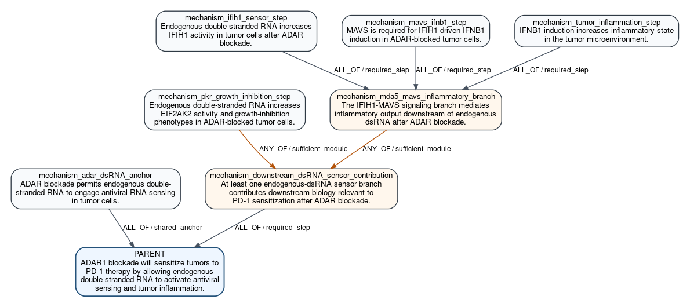

#### Parent Claim Object

| field | value |
|---|---|
| `claim_id` | `P_ADAR1_PD1_SENSITIZATION` |
| `claim_text` | ADAR1 blockade will sensitize tumors to PD-1 therapy by allowing endogenous double-stranded RNA to activate antiviral sensing and tumor inflammation. |
| `relation_name` | `drives_phenotype` |
| `relation_polarity` | `positive` |
| `participants` | perturbed_regulator:`HGNC:ADAR` (canonical_gene_symbol=ADAR; original_label=ADAR1; entrez_id=103; ensembl_id=ENSG00000160710); therapy_context:`PROPOSED-PD-1_THERAPY` (original_label=PD-1 therapy; proposed_entity_label=PD-1 therapy; requires_entity_row=True) |
| `candidate_gene` | `ADAR` |

#### Claim Rows

| role | claim_text | relation_name | polarity | participants | context/properties |
|---|---|---|---|---|---|
| `mechanism_adar_dsRNA_anchor` | ADAR blockade permits endogenous double-stranded RNA to engage antiviral RNA sensing in tumor cells. | `permits` | `positive` | perturbed_regulator:`HGNC:ADAR` (canonical_gene_symbol=ADAR; original_label=HGNC:ADAR; entrez_id=103; ensembl_id=ENSG00000160710); permitted_process:`PROPOSED-endogenous_dsRNA_sensing` (proposed_entity_label=endogenous dsRNA sensing; requires_entity_row=True); context_cell:`PROPOSED-tumor_cell` (proposed_entity_label=tumor cell; requires_entity_row=True) | scope=molecular_signal; readout=cellular endogenous dsRNA sensing signal; truth_condition=Upon ADAR perturbation, tumor cells show increased endogenous dsRNA sensing signal relative to control.; why=This is the shared upstream anchor implied by the root wording and the supplied literature context.; source=llm_claim_specific_dag2_decomposition |
| `mechanism_ifih1_sensor_step` | Endogenous double-stranded RNA increases IFIH1 activity in tumor cells after ADAR blockade. | `regulates_activity` | `positive` | upstream_signal:`PROPOSED-endogenous_dsRNA` (proposed_entity_label=endogenous double-stranded RNA; requires_entity_row=True); target_regulator:`HGNC:IFIH1` (canonical_gene_symbol=IFIH1; original_label=HGNC:IFIH1; entrez_id=64135; ensembl_id=ENSG00000115267); context_cell:`PROPOSED-tumor_cell` (proposed_entity_label=tumor cell; requires_entity_row=True) | scope=molecular_signal; readout=IFIH1-dependent signaling activity; truth_condition=In ADAR-perturbed tumor cells, endogenous dsRNA elevation is accompanied by increased IFIH1-dependent signaling activity.; why=This captures the specific MDA5 sensor branch named in the literature.; source=llm_claim_specific_dag2_decomposition |
| `mechanism_mavs_ifnb1_step` | MAVS is required for IFIH1-driven IFNB1 induction in ADAR-blocked tumor cells. | `requires` | `positive` | required_mediator:`HGNC:MAVS`; downstream_readout:`HGNC:IFNB1`; upstream_regulator_context:`HGNC:IFIH1` (canonical_gene_symbol=IFIH1; original_label=HGNC:IFIH1; entrez_id=64135; ensembl_id=ENSG00000115267); context_cell:`PROPOSED-tumor_cell` (proposed_entity_label=tumor cell; requires_entity_row=True) | scope=molecular_signal; readout=IFNB1 induction; truth_condition=Loss of MAVS reduces IFNB1 induction triggered by the IFIH1 branch in ADAR-perturbed tumor cells.; why=The supplied context explicitly assigns IFN-beta secretion to the MDA5/MAVS branch.; source=llm_claim_specific_dag2_decomposition |
| `mechanism_tumor_inflammation_step` | IFNB1 induction increases inflammatory state in the tumor microenvironment. | `drives_phenotype` | `positive` | driver:`HGNC:IFNB1`; phenotype:`PROPOSED-tumor_inflammation` (proposed_entity_label=tumor inflammation; requires_entity_row=True); context_compartment:`PROPOSED-tumor_microenvironment` (proposed_entity_label=tumor microenvironment; requires_entity_row=True) | scope=cell_state; readout=tumor inflammation phenotype; truth_condition=Higher IFNB1 output is accompanied by increased tumor inflammatory-state measurements.; why=The root claim explicitly depends on tumor inflammation, and the literature context ties this phenotype to the MDA5/MAVS-IFNB1 axis.; source=llm_claim_specific_dag2_decomposition |
| `mechanism_pkr_growth_inhibition_step` | Endogenous double-stranded RNA increases EIF2AK2 activity and growth-inhibition phenotypes in ADAR-blocked tumor cells. | `perturbation_changes_phenotype` | `positive` | perturbed_mediator:`HGNC:EIF2AK2`; phenotype:`PROPOSED-tumor_cell_growth_inhibition` (proposed_entity_label=tumor cell growth inhibition; requires_entity_row=True); context_cell:`PROPOSED-tumor_cell` (proposed_entity_label=tumor cell; requires_entity_row=True) | scope=cell_state; readout=tumor cell growth inhibition; truth_condition=In ADAR-perturbed tumor cells, endogenous dsRNA elevation is accompanied by increased EIF2AK2-dependent growth inhibition.; why=The literature context names PKR as a distinct dsRNA sensor branch contributing growth-inhibition phenotypes after ADAR1 loss.; source=llm_claim_specific_dag2_decomposition |
| `mechanism_mda5_mavs_inflammatory_branch` | The IFIH1-MAVS signaling branch mediates inflammatory output downstream of endogenous dsRNA after ADAR blockade. | `describes_mechanism_step` | `` | branch_sensor:`HGNC:IFIH1` (canonical_gene_symbol=IFIH1; original_label=HGNC:IFIH1; entrez_id=64135; ensembl_id=ENSG00000115267); branch_adaptor:`HGNC:MAVS` (canonical_gene_symbol=MAVS; original_label=HGNC:MAVS; entrez_id=57506; ensembl_id=ENSG00000088888); branch_output:`HGNC:IFNB1`; branch_phenotype:`PROPOSED-tumor_inflammation` (proposed_entity_label=tumor inflammation; requires_entity_row=True) | scope=mechanism_module; readout=IFNB1-linked inflammatory signaling; truth_condition=The IFIH1, MAVS, and downstream tumor-inflammation steps jointly support IFNB1-linked inflammatory signaling in the ADAR-blockade context.; why=A reified module is needed to represent the internal ALL_OF logic of the MDA5/MAVS inflammatory branch without mixing operators at the parent.; source=llm_claim_specific_dag2_decomposition |
| `mechanism_downstream_dsRNA_sensor_contribution` | At least one endogenous-dsRNA sensor branch contributes downstream biology relevant to PD-1 sensitization after ADAR blockade. | `describes_mechanism_step` | `` | upstream_context:`PROPOSED-endogenous_dsRNA_sensing` (proposed_entity_label=endogenous dsRNA sensing; requires_entity_row=True); alternative_branch_sensor:`HGNC:IFIH1` (canonical_gene_symbol=IFIH1; original_label=HGNC:IFIH1; entrez_id=64135; ensembl_id=ENSG00000115267); alternative_branch_sensor:`HGNC:EIF2AK2` (canonical_gene_symbol=EIF2AK2; original_label=HGNC:EIF2AK2; entrez_id=5610; ensembl_id=ENSG00000055332) | scope=mechanism_module; readout=activation of at least one downstream dsRNA sensor branch; truth_condition=In the ADAR-blockade context, either the IFIH1-MAVS inflammatory branch or the EIF2AK2 growth-inhibition branch is activated and contributes a downstream phenotype linked to sensitization.; why=This reified module captures the alternative downstream branch logic implied by the context while keeping a single operator on the parent claim.; source=llm_claim_specific_dag2_decomposition |

#### Decomposition Edges

| source_dag2_role | source_claim_id | target_dag2_role | target_claim_id | support_operator | source_role | group_id |
|---|---|---|---|---|---|---|
| `mechanism_ifih1_sensor_step` | `P_ADAR1_PD1_SENSITIZATION.stage0.endogenous_dsRNA_activates_ifih1_activity` | `mechanism_mda5_mavs_inflammatory_branch` | `P_ADAR1_PD1_SENSITIZATION.stage0.mda5_mavs_inflammatory_branch_module` | `ALL_OF` | `required_step` | `mda5_mavs_branch` |
| `mechanism_mavs_ifnb1_step` | `P_ADAR1_PD1_SENSITIZATION.stage0.ifih1_requires_mavs_for_ifnb1_induction` | `mechanism_mda5_mavs_inflammatory_branch` | `P_ADAR1_PD1_SENSITIZATION.stage0.mda5_mavs_inflammatory_branch_module` | `ALL_OF` | `required_step` | `mda5_mavs_branch` |
| `mechanism_tumor_inflammation_step` | `P_ADAR1_PD1_SENSITIZATION.stage0.ifnb1_induction_drives_tumor_inflammation` | `mechanism_mda5_mavs_inflammatory_branch` | `P_ADAR1_PD1_SENSITIZATION.stage0.mda5_mavs_inflammatory_branch_module` | `ALL_OF` | `required_step` | `mda5_mavs_branch` |
| `mechanism_mda5_mavs_inflammatory_branch` | `P_ADAR1_PD1_SENSITIZATION.stage0.mda5_mavs_inflammatory_branch_module` | `mechanism_downstream_dsRNA_sensor_contribution` | `P_ADAR1_PD1_SENSITIZATION.stage0.downstream_dsrna_sensor_contribution_module` | `ANY_OF` | `sufficient_module` | `downstream_sensor_alternatives` |
| `mechanism_pkr_growth_inhibition_step` | `P_ADAR1_PD1_SENSITIZATION.stage0.endogenous_dsRNA_activates_eif2ak2_growth_inhibition` | `mechanism_downstream_dsRNA_sensor_contribution` | `P_ADAR1_PD1_SENSITIZATION.stage0.downstream_dsrna_sensor_contribution_module` | `ANY_OF` | `sufficient_module` | `downstream_sensor_alternatives` |
| `mechanism_adar_dsRNA_anchor` | `P_ADAR1_PD1_SENSITIZATION.stage0.adar_blockade_permits_endogenous_dsRNA_sensing` | `parent_claim` | `P_ADAR1_PD1_SENSITIZATION` | `ALL_OF` | `shared_anchor` | `adar_pd1_sensitization` |
| `mechanism_downstream_dsRNA_sensor_contribution` | `P_ADAR1_PD1_SENSITIZATION.stage0.downstream_dsrna_sensor_contribution_module` | `parent_claim` | `P_ADAR1_PD1_SENSITIZATION` | `ALL_OF` | `required_step` | `adar_pd1_sensitization` |

#### Semantic Claim Relations

| source | target | relation_kind | notes |
|---|---|---|---|
| `P_ADAR1_PD1_SENSITIZATION.stage0.adar_blockade_permits_endogenous_dsRNA_sensing` | `P_ADAR1_PD1_SENSITIZATION.stage0.endogenous_dsRNA_activates_ifih1_activity` | `enables` | Shared upstream condition enables the IFIH1 sensor branch. |
| `P_ADAR1_PD1_SENSITIZATION.stage0.endogenous_dsRNA_activates_ifih1_activity` | `P_ADAR1_PD1_SENSITIZATION.stage0.ifih1_requires_mavs_for_ifnb1_induction` | `enables` | IFIH1 signaling feeds into the MAVS-dependent IFNB1 output step. |
| `P_ADAR1_PD1_SENSITIZATION.stage0.ifih1_requires_mavs_for_ifnb1_induction` | `P_ADAR1_PD1_SENSITIZATION.stage0.ifnb1_induction_drives_tumor_inflammation` | `enables` | IFNB1 induction is positioned upstream of the tumor inflammation phenotype. |
| `P_ADAR1_PD1_SENSITIZATION.stage0.endogenous_dsRNA_activates_eif2ak2_growth_inhibition` | `P_ADAR1_PD1_SENSITIZATION.stage0.mda5_mavs_inflammatory_branch_module` | `parallel_to` | PKR and MDA5/MAVS are distinct downstream dsRNA-sensor branches named in the literature context. |
| `P_ADAR1_PD1_SENSITIZATION.stage0.adar_blockade_permits_endogenous_dsRNA_sensing` | `P_ADAR1_PD1_SENSITIZATION.stage0.endogenous_dsRNA_activates_eif2ak2_growth_inhibition` | `enables` | The shared ADAR-loss/endogenous-dsRNA context also enables the PKR branch. |
| `P_ADAR1_PD1_SENSITIZATION.stage0.ifnb1_induction_drives_tumor_inflammation` | `P_ADAR1_PD1_SENSITIZATION.stage0.endogenous_dsRNA_activates_eif2ak2_growth_inhibition` | `candidate_mechanism_link` | Stage0 inferred these biological claims as related parts of the grounded mechanism; reviewer/L1 may later split, reorder, strengthen, or retire the semantic link. |
| `P_ADAR1_PD1_SENSITIZATION.stage0.mda5_mavs_inflammatory_branch_module` | `P_ADAR1_PD1_SENSITIZATION.stage0.downstream_dsrna_sensor_contribution_module` | `candidate_mechanism_link` | Stage0 inferred these biological claims as related parts of the grounded mechanism; reviewer/L1 may later split, reorder, strengthen, or retire the semantic link. |

#### Mermaid Source

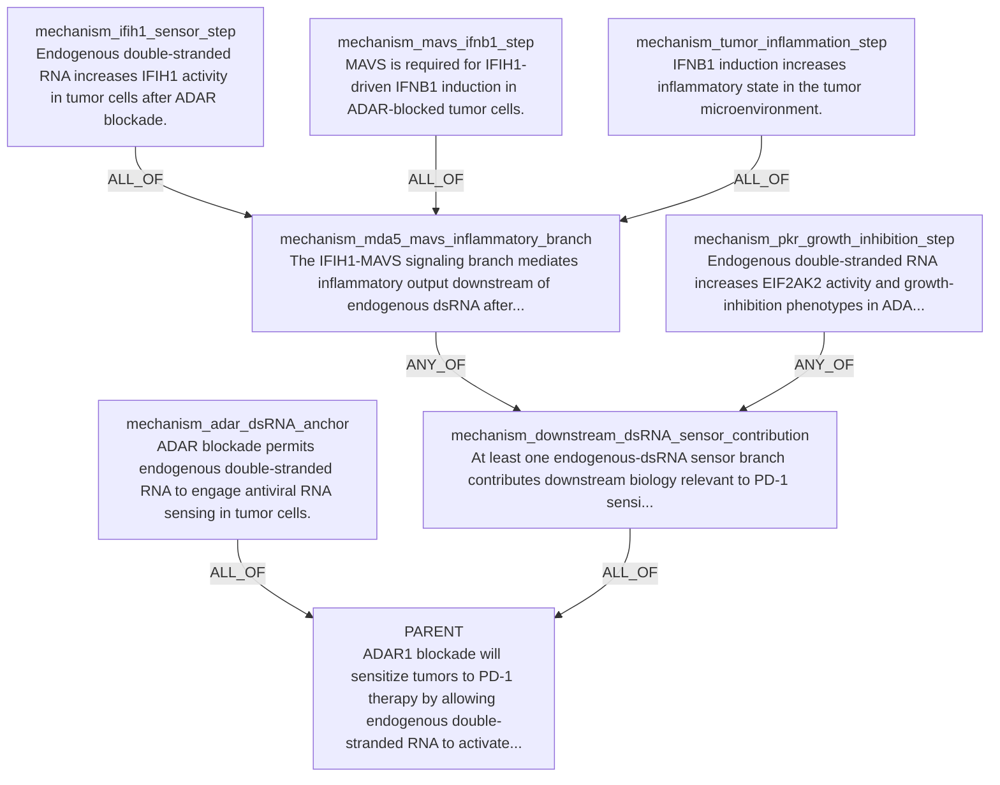

### RBMS1 / dsRNA Shielding / Antiviral Sensing

Input hypothesis:

```text
RBMS1 binds endogenous dsRNA hairpins and shields them from MDA5 and PKR recognition, preventing activation of antiviral interferon signaling and thereby reducing cell-intrinsic immune activation.
```

DAG2 mode: `llm_claim_specific_dag2_decomposition`; child claims: 6; edge operators: `ALL_OF, INDEPENDENT_CAUSES`.

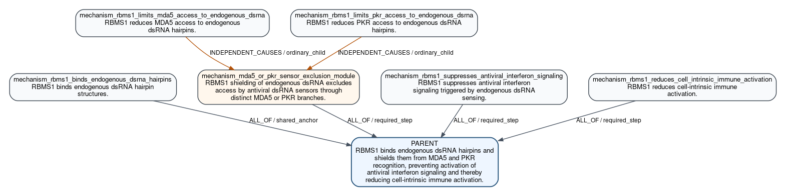

#### Parent Claim Object

| field | value |
|---|---|
| `claim_id` | `P_RBMS1_DSRNA_SHIELDING` |
| `claim_text` | RBMS1 binds endogenous dsRNA hairpins and shields them from MDA5 and PKR recognition, preventing activation of antiviral interferon signaling and thereby reducing cell-intrinsic immune activation. |
| `relation_name` | `drives_phenotype` |
| `relation_polarity` | `positive` |
| `participants` | rna_binding_protein:`HGNC:RBMS1` (canonical_gene_symbol=RBMS1; original_label=RBMS1; entrez_id=5937; ensembl_id=ENSG00000153250); sensor:`HGNC:IFIH1` (canonical_gene_symbol=IFIH1; original_label=MDA5; entrez_id=64135; ensembl_id=ENSG00000115267); sensor_kinase:`HGNC:EIF2AK2` (canonical_gene_symbol=EIF2AK2; original_label=PKR; entrez_id=5610; ensembl_id=ENSG00000055332) |
| `candidate_gene` | `RBMS1` |

#### Claim Rows

| role | claim_text | relation_name | polarity | participants | context/properties |
|---|---|---|---|---|---|
| `mechanism_rbms1_binds_endogenous_dsrna_hairpins` | RBMS1 binds endogenous dsRNA hairpin structures. | `binds_rna` | `` | binder:`HGNC:RBMS1`; rna_target:`PROPOSED-ENDOGENOUS_DSRNA_HAIRPINS` (proposed_entity_label=endogenous dsRNA hairpins; requires_entity_row=True) | scope=molecular_signal; readout=RBMS1-associated endogenous dsRNA hairpin binding; truth_condition=RBMS1 is physically associated with endogenous dsRNA hairpin RNA species in cells.; why=This is the shared upstream substrate-engagement mechanism asserted by the root and anchors both sensor branches without restating downstream outcomes.; source=llm_claim_specific_dag2_decomposition |
| `mechanism_mda5_or_pkr_sensor_exclusion_module` | RBMS1 shielding of endogenous dsRNA excludes access by antiviral dsRNA sensors through distinct MDA5 or PKR branches. | `describes_mechanism_step` | `` | upstream_regulator:`HGNC:RBMS1` (canonical_gene_symbol=RBMS1; original_label=HGNC:RBMS1; entrez_id=5937; ensembl_id=ENSG00000153250); shared_substrate:`PROPOSED-ENDOGENOUS_DSRNA_HAIRPINS` (proposed_entity_label=endogenous dsRNA hairpins; requires_entity_row=True) | scope=mechanism_module; readout=sensor access to endogenous dsRNA hairpins; truth_condition=At least one named dsRNA sensor branch shows reduced access to the shared endogenous dsRNA hairpin substrate in the presence of RBMS1.; why=A module is required to represent the context-supported branched logic in which MDA5 and PKR are distinct downstream sensor arms.; source=llm_claim_specific_dag2_decomposition |
| `mechanism_rbms1_limits_mda5_access_to_endogenous_dsrna` | RBMS1 reduces MDA5 access to endogenous dsRNA hairpins. | `modifies_effect_of` | `negative` | modifier:`HGNC:RBMS1`; affected_sensor:`HGNC:IFIH1` (canonical_gene_symbol=IFIH1; original_label=HGNC:IFIH1; entrez_id=64135; ensembl_id=ENSG00000115267); sensor_ligand:`PROPOSED-ENDOGENOUS_DSRNA_HAIRPINS` (proposed_entity_label=endogenous dsRNA hairpins; requires_entity_row=True) | scope=molecular_signal; readout=MDA5 association with endogenous dsRNA hairpins; truth_condition=Increasing RBMS1 lowers MDA5 association with endogenous dsRNA hairpin RNA species, or RBMS1 loss increases that association.; why=This captures one distinct sensor branch named in the root and context, without conflating sensor access with downstream interferon output.; source=llm_claim_specific_dag2_decomposition |
| `mechanism_rbms1_limits_pkr_access_to_endogenous_dsrna` | RBMS1 reduces PKR access to endogenous dsRNA hairpins. | `modifies_effect_of` | `negative` | modifier:`HGNC:RBMS1`; affected_sensor:`HGNC:EIF2AK2` (canonical_gene_symbol=EIF2AK2; original_label=HGNC:EIF2AK2; entrez_id=5610; ensembl_id=ENSG00000055332); sensor_ligand:`PROPOSED-ENDOGENOUS_DSRNA_HAIRPINS` (proposed_entity_label=endogenous dsRNA hairpins; requires_entity_row=True) | scope=molecular_signal; readout=PKR association with endogenous dsRNA hairpins; truth_condition=Increasing RBMS1 lowers PKR association with endogenous dsRNA hairpin RNA species, or RBMS1 loss increases that association.; why=This captures the second distinct sensor branch identified in the supplied context and keeps PKR substrate access separate from downstream pathway activation.; source=llm_claim_specific_dag2_decomposition |
| `mechanism_rbms1_suppresses_antiviral_interferon_signaling` | RBMS1 suppresses antiviral interferon signaling triggered by endogenous dsRNA sensing. | `perturbation_changes_phenotype` | `negative` | perturbed_regulator:`HGNC:RBMS1` (canonical_gene_symbol=RBMS1; original_label=HGNC:RBMS1; entrez_id=5937; ensembl_id=ENSG00000153250); phenotype:`PROPOSED-ANTIVIRAL_INTERFERON_SIGNALING` (proposed_entity_label=antiviral interferon signaling; requires_entity_row=True) | scope=molecular_signal; readout=interferon-stimulated signaling output; truth_condition=RBMS1 abundance inversely changes interferon pathway activation downstream of endogenous dsRNA sensing.; why=The root explicitly includes prevention of antiviral interferon signaling as a distinct downstream consequence of sensor shielding.; source=llm_claim_specific_dag2_decomposition |
| `mechanism_rbms1_reduces_cell_intrinsic_immune_activation` | RBMS1 reduces cell-intrinsic immune activation. | `perturbation_changes_phenotype` | `negative` | perturbed_regulator:`HGNC:RBMS1` (canonical_gene_symbol=RBMS1; original_label=HGNC:RBMS1; entrez_id=5937; ensembl_id=ENSG00000153250); phenotype:`PROPOSED-CELL_INTRINSIC_IMMUNE_ACTIVATION` (proposed_entity_label=cell-intrinsic immune activation; requires_entity_row=True) | scope=cell_state; readout=cell-intrinsic immune activation state; truth_condition=RBMS1 abundance inversely changes intrinsic inflammatory or antiviral activation state within the same cell population.; why=The root ends in a cell-state consequence downstream of antiviral signaling, so this claim preserves the final mechanistic endpoint as a distinct nonredundant downstream state.; source=llm_claim_specific_dag2_decomposition |

#### Decomposition Edges

| source_dag2_role | source_claim_id | target_dag2_role | target_claim_id | support_operator | source_role | group_id |
|---|---|---|---|---|---|---|
| `mechanism_rbms1_limits_mda5_access_to_endogenous_dsrna` | `P_RBMS1_DSRNA_SHIELDING.stage0.rbms1_limits_mda5_access_to_endogenous_dsrna` | `mechanism_mda5_or_pkr_sensor_exclusion_module` | `P_RBMS1_DSRNA_SHIELDING.stage0.mda5_or_pkr_sensor_exclusion_module` | `INDEPENDENT_CAUSES` | `ordinary_child` | `sensor_exclusion_branches` |
| `mechanism_rbms1_limits_pkr_access_to_endogenous_dsrna` | `P_RBMS1_DSRNA_SHIELDING.stage0.rbms1_limits_pkr_access_to_endogenous_dsrna` | `mechanism_mda5_or_pkr_sensor_exclusion_module` | `P_RBMS1_DSRNA_SHIELDING.stage0.mda5_or_pkr_sensor_exclusion_module` | `INDEPENDENT_CAUSES` | `ordinary_child` | `sensor_exclusion_branches` |
| `mechanism_rbms1_binds_endogenous_dsrna_hairpins` | `P_RBMS1_DSRNA_SHIELDING.stage0.rbms1_binds_endogenous_dsrna_hairpins` | `parent_claim` | `P_RBMS1_DSRNA_SHIELDING` | `ALL_OF` | `shared_anchor` | `rbms1_dsrna_shielding` |
| `mechanism_mda5_or_pkr_sensor_exclusion_module` | `P_RBMS1_DSRNA_SHIELDING.stage0.mda5_or_pkr_sensor_exclusion_module` | `parent_claim` | `P_RBMS1_DSRNA_SHIELDING` | `ALL_OF` | `required_step` | `rbms1_dsrna_shielding` |
| `mechanism_rbms1_suppresses_antiviral_interferon_signaling` | `P_RBMS1_DSRNA_SHIELDING.stage0.rbms1_suppresses_antiviral_interferon_signaling` | `parent_claim` | `P_RBMS1_DSRNA_SHIELDING` | `ALL_OF` | `required_step` | `rbms1_dsrna_shielding` |
| `mechanism_rbms1_reduces_cell_intrinsic_immune_activation` | `P_RBMS1_DSRNA_SHIELDING.stage0.rbms1_reduces_cell_intrinsic_immune_activation` | `parent_claim` | `P_RBMS1_DSRNA_SHIELDING` | `ALL_OF` | `required_step` | `rbms1_dsrna_shielding` |

#### Semantic Claim Relations

| source | target | relation_kind | notes |
|---|---|---|---|
| `P_RBMS1_DSRNA_SHIELDING.stage0.rbms1_binds_endogenous_dsrna_hairpins` | `P_RBMS1_DSRNA_SHIELDING.stage0.mda5_or_pkr_sensor_exclusion_module` | `enables` | RBMS1 occupancy of endogenous dsRNA hairpins is the proposed upstream basis for shielding the shared substrate from sensor access. |
| `P_RBMS1_DSRNA_SHIELDING.stage0.mda5_or_pkr_sensor_exclusion_module` | `P_RBMS1_DSRNA_SHIELDING.stage0.rbms1_suppresses_antiviral_interferon_signaling` | `candidate_mechanism_link` | Reduced dsRNA sensor access is proposed to lower downstream antiviral interferon signaling. |
| `P_RBMS1_DSRNA_SHIELDING.stage0.rbms1_suppresses_antiviral_interferon_signaling` | `P_RBMS1_DSRNA_SHIELDING.stage0.rbms1_reduces_cell_intrinsic_immune_activation` | `enables` | Suppression of antiviral interferon signaling is the immediate upstream explanation for reduced cell-intrinsic immune activation. |
| `P_RBMS1_DSRNA_SHIELDING.stage0.rbms1_limits_mda5_access_to_endogenous_dsrna` | `P_RBMS1_DSRNA_SHIELDING.stage0.rbms1_limits_pkr_access_to_endogenous_dsrna` | `parallel_to` | These are distinct parallel sensor branches acting on the same endogenous dsRNA substrate. |
| `P_RBMS1_DSRNA_SHIELDING.stage0.mda5_or_pkr_sensor_exclusion_module` | `P_RBMS1_DSRNA_SHIELDING.stage0.rbms1_limits_mda5_access_to_endogenous_dsrna` | `candidate_mechanism_link` | Stage0 inferred these biological claims as related parts of the grounded mechanism; reviewer/L1 may later split, reorder, strengthen, or retire the semantic link. |
| `P_RBMS1_DSRNA_SHIELDING.stage0.rbms1_limits_pkr_access_to_endogenous_dsrna` | `P_RBMS1_DSRNA_SHIELDING.stage0.rbms1_suppresses_antiviral_interferon_signaling` | `candidate_mechanism_link` | Stage0 inferred these biological claims as related parts of the grounded mechanism; reviewer/L1 may later split, reorder, strengthen, or retire the semantic link. |

#### Mermaid Source

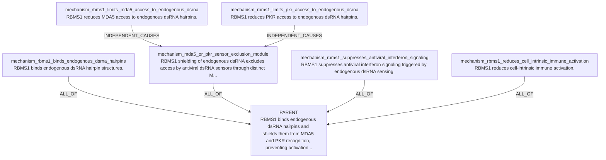

### PTPN2-PTPN1 / IFN Signaling / Immune Killing

Input hypothesis:

```text
PTPN2/PTPN1 act as brakes on JAK-STAT interferon signaling, so dual inhibition should amplify IFN response, antigen presentation, and NK/CD8 killing.
```

DAG2 mode: `llm_claim_specific_dag2_decomposition`; child claims: 5; edge operators: `ALL_OF`.

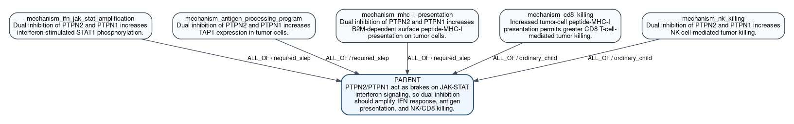

#### Parent Claim Object

| field | value |
|---|---|
| `claim_id` | `P_PTPN2_PTPN1_IFN_KILLING` |
| `claim_text` | PTPN2/PTPN1 act as brakes on JAK-STAT interferon signaling, so dual inhibition should amplify IFN response, antigen presentation, and NK/CD8 killing. |
| `relation_name` | `drives_phenotype` |
| `relation_polarity` | `positive` |
| `participants` | negative_regulator:`HGNC:PTPN2` (canonical_gene_symbol=PTPN2; original_label=PTPN2; entrez_id=5771; ensembl_id=ENSG00000175354); negative_regulator:`HGNC:PTPN1` (canonical_gene_symbol=PTPN1; original_label=PTPN1; entrez_id=5770; ensembl_id=ENSG00000196396); immune_effector_cell:`PROPOSED-CD8_T_CELL` (original_label=CD8 T cell; proposed_entity_label=CD8 T cell; requires_entity_row=True); immune_effector_cell:`PROPOSED-NK_CELL` (original_label=NK cell; proposed_entity_label=NK cell; requires_entity_row=True) |
| `candidate_gene` | `PTPN2` |

#### Claim Rows

| role | claim_text | relation_name | polarity | participants | context/properties |
|---|---|---|---|---|---|
| `mechanism_ifn_jak_stat_amplification` | Dual inhibition of PTPN2 and PTPN1 increases interferon-stimulated STAT1 phosphorylation. | `regulates_phosphorylation_state` | `positive` | perturbed_regulator_1:`HGNC:PTPN2` (canonical_gene_symbol=PTPN2; original_label=HGNC:PTPN2; entrez_id=5771; ensembl_id=ENSG00000175354); perturbed_regulator_2:`HGNC:PTPN1` (canonical_gene_symbol=PTPN1; original_label=HGNC:PTPN1; entrez_id=5770; ensembl_id=ENSG00000196396); phosphorylation_target:`HGNC:STAT1` (canonical_gene_symbol=STAT1; original_label=HGNC:STAT1; entrez_id=6772; ensembl_id=ENSG00000115415) | scope=molecular_signal; readout=phospho-STAT1 abundance; truth_condition=Compared with control, combined PTPN2/PTPN1 inhibition produces a higher phospho-STAT1 level after interferon stimulation.; why=This is the proximal signaling step that operationalizes the claim that PTPN2/PTPN1 are brakes on interferon JAK-STAT signaling.; source=llm_claim_specific_dag2_decomposition |
| `mechanism_antigen_processing_program` | Dual inhibition of PTPN2 and PTPN1 increases TAP1 expression in tumor cells. | `transcriptionally_regulates` | `positive` | perturbed_regulator_1:`HGNC:PTPN2` (canonical_gene_symbol=PTPN2; original_label=HGNC:PTPN2; entrez_id=5771; ensembl_id=ENSG00000175354); perturbed_regulator_2:`HGNC:PTPN1` (canonical_gene_symbol=PTPN1; original_label=HGNC:PTPN1; entrez_id=5770; ensembl_id=ENSG00000196396); transcriptional_target:`HGNC:TAP1` (canonical_gene_symbol=TAP1; original_label=HGNC:TAP1; entrez_id=6890; ensembl_id=ENSG00000168394); cell_context:`PROPOSED-TUMOR_CELL` (proposed_entity_label=tumor cell; requires_entity_row=True) | scope=cell_state; readout=TAP1 mRNA abundance; truth_condition=Compared with control, combined PTPN2/PTPN1 inhibition increases TAP1 mRNA or protein abundance in tumor cells under interferon-responsive conditions.; why=This captures induction of the antigen-processing machinery downstream of amplified IFN signaling without collapsing it into the final immune-killing endpoints.; source=llm_claim_specific_dag2_decomposition |
| `mechanism_mhc_i_presentation` | Dual inhibition of PTPN2 and PTPN1 increases B2M-dependent surface peptide-MHC-I presentation on tumor cells. | `regulates_protein_abundance` | `positive` | perturbed_regulator_1:`HGNC:PTPN2` (canonical_gene_symbol=PTPN2; original_label=HGNC:PTPN2; entrez_id=5771; ensembl_id=ENSG00000175354); perturbed_regulator_2:`HGNC:PTPN1` (canonical_gene_symbol=PTPN1; original_label=HGNC:PTPN1; entrez_id=5770; ensembl_id=ENSG00000196396); presentation_component:`HGNC:B2M`; surface_presented_complex:`PROPOSED-PEPTIDE_MHC_I_COMPLEX` (proposed_entity_label=surface peptide-MHC-I complex; requires_entity_row=True); cell_context:`PROPOSED-TUMOR_CELL` (proposed_entity_label=tumor cell; requires_entity_row=True) | scope=cell_state; readout=surface peptide-MHC-I level; truth_condition=Compared with control, combined PTPN2/PTPN1 inhibition increases surface B2M-associated MHC-I on tumor cells.; why=This separates antigen presentation from upstream TAP1 induction and provides the CD8-relevant visibility step that should not be conflated with NK evidence.; source=llm_claim_specific_dag2_decomposition |
| `mechanism_cd8_killing` | Increased tumor-cell peptide-MHC-I presentation permits greater CD8 T-cell-mediated tumor killing. | `permits` | `positive` | permissive_signal:`PROPOSED-PEPTIDE_MHC_I_COMPLEX` (proposed_entity_label=surface peptide-MHC-I complex; requires_entity_row=True); immune_effector_cell:`PROPOSED-CD8_T_CELL` (proposed_entity_label=CD8 T cell; requires_entity_row=True); target_cell:`PROPOSED-TUMOR_CELL` (proposed_entity_label=tumor cell; requires_entity_row=True) | scope=immune_effector; readout=CD8 T-cell-mediated tumor-cell killing; truth_condition=Tumor cells with higher surface peptide-MHC-I show increased killing by CD8 T cells relative to lower-presentation controls.; why=This gives the distinct CD8 effector outcome supported by, but not identical to, antigen presentation.; source=llm_claim_specific_dag2_decomposition |
| `mechanism_nk_killing` | Dual inhibition of PTPN2 and PTPN1 increases NK-cell-mediated tumor killing. | `perturbation_changes_phenotype` | `positive` | perturbed_regulator_1:`HGNC:PTPN2` (canonical_gene_symbol=PTPN2; original_label=HGNC:PTPN2; entrez_id=5771; ensembl_id=ENSG00000175354); perturbed_regulator_2:`HGNC:PTPN1` (canonical_gene_symbol=PTPN1; original_label=HGNC:PTPN1; entrez_id=5770; ensembl_id=ENSG00000196396); immune_effector_cell:`PROPOSED-NK_CELL` (proposed_entity_label=NK cell; requires_entity_row=True); target_cell:`PROPOSED-TUMOR_CELL` (proposed_entity_label=tumor cell; requires_entity_row=True); phenotype:`PROPOSED-NK_MEDIATED_TUMOR_KILLING` (proposed_entity_label=NK-cell-mediated tumor killing; requires_entity_row=True) | scope=immune_effector; readout=NK-cell-mediated tumor-cell killing; truth_condition=Compared with control, combined PTPN2/PTPN1 inhibition increases tumor-cell lysis in NK:tumor co-culture.; why=The context explicitly requires a distinct NK effector-readout claim and cautions that MHC-I presentation is not itself evidence for NK killing.; source=llm_claim_specific_dag2_decomposition |

#### Decomposition Edges

| source_dag2_role | source_claim_id | target_dag2_role | target_claim_id | support_operator | source_role | group_id |
|---|---|---|---|---|---|---|
| `mechanism_ifn_jak_stat_amplification` | `P_PTPN2_PTPN1_IFN_KILLING.stage0.dual_ptpn_inhibition_amplifies_stat1_phosphorylation` | `parent_claim` | `P_PTPN2_PTPN1_IFN_KILLING` | `ALL_OF` | `required_step` | `ptpn_ifn_killing` |
| `mechanism_antigen_processing_program` | `P_PTPN2_PTPN1_IFN_KILLING.stage0.dual_ptpn_inhibition_induces_tap1_expression` | `parent_claim` | `P_PTPN2_PTPN1_IFN_KILLING` | `ALL_OF` | `required_step` | `ptpn_ifn_killing` |
| `mechanism_mhc_i_presentation` | `P_PTPN2_PTPN1_IFN_KILLING.stage0.dual_ptpn_inhibition_increases_b2m_surface_pmhc1` | `parent_claim` | `P_PTPN2_PTPN1_IFN_KILLING` | `ALL_OF` | `required_step` | `ptpn_ifn_killing` |
| `mechanism_cd8_killing` | `P_PTPN2_PTPN1_IFN_KILLING.stage0.mhc_i_presentation_permits_cd8_tumor_killing` | `parent_claim` | `P_PTPN2_PTPN1_IFN_KILLING` | `ALL_OF` | `ordinary_child` | `ptpn_ifn_killing` |
| `mechanism_nk_killing` | `P_PTPN2_PTPN1_IFN_KILLING.stage0.dual_ptpn_inhibition_increases_nk_tumor_killing` | `parent_claim` | `P_PTPN2_PTPN1_IFN_KILLING` | `ALL_OF` | `ordinary_child` | `ptpn_ifn_killing` |

#### Semantic Claim Relations

| source | target | relation_kind | notes |
|---|---|---|---|
| `P_PTPN2_PTPN1_IFN_KILLING.stage0.dual_ptpn_inhibition_amplifies_stat1_phosphorylation` | `P_PTPN2_PTPN1_IFN_KILLING.stage0.dual_ptpn_inhibition_induces_tap1_expression` | `enables` | Amplified interferon-STAT signaling is the upstream driver of antigen-processing gene induction. |
| `P_PTPN2_PTPN1_IFN_KILLING.stage0.dual_ptpn_inhibition_induces_tap1_expression` | `P_PTPN2_PTPN1_IFN_KILLING.stage0.dual_ptpn_inhibition_increases_b2m_surface_pmhc1` | `enables` | Antigen-processing machinery induction supports increased surface peptide-MHC-I presentation. |
| `P_PTPN2_PTPN1_IFN_KILLING.stage0.dual_ptpn_inhibition_increases_b2m_surface_pmhc1` | `P_PTPN2_PTPN1_IFN_KILLING.stage0.mhc_i_presentation_permits_cd8_tumor_killing` | `enables` | Tumor peptide-MHC-I presentation supports CD8 T-cell recognition and killing. |
| `P_PTPN2_PTPN1_IFN_KILLING.stage0.mhc_i_presentation_permits_cd8_tumor_killing` | `P_PTPN2_PTPN1_IFN_KILLING.stage0.dual_ptpn_inhibition_increases_nk_tumor_killing` | `parallel_to` | CD8 and NK killing are distinct effector outcomes; neither should be treated as evidence for the other. |

#### Mermaid Source

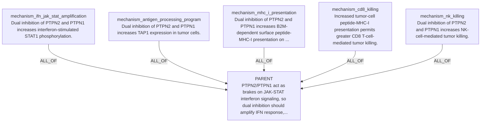

### Ferroptosis / Lipid Peroxide and Radical Detox

Input hypothesis:

```text
Cells suppress ferroptosis by detoxifying lipid peroxides or lipid radicals.
```

DAG2 mode: `llm_claim_specific_dag2_decomposition`; child claims: 5; edge operators: `ALL_OF, INDEPENDENT_CAUSES`.

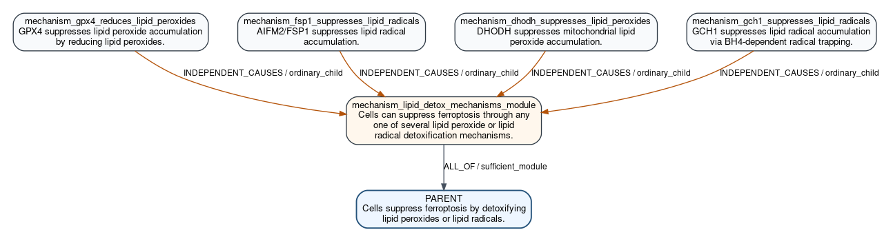

#### Parent Claim Object

| field | value |
|---|---|
| `claim_id` | `P_FERROPTOSIS_LIPID_DETOX` |
| `claim_text` | Cells suppress ferroptosis by detoxifying lipid peroxides or lipid radicals. |
| `relation_name` | `drives_phenotype` |
| `relation_polarity` | `positive` |
| `participants` | substrate:`PROPOSED-LIPID_PEROXIDES` (original_label=lipid peroxides; proposed_entity_label=lipid peroxides; requires_entity_row=True); substrate:`PROPOSED-LIPID_RADICALS` (original_label=lipid radicals; proposed_entity_label=lipid radicals; requires_entity_row=True); cell_death_phenotype:`PROPOSED-FERROPTOSIS` (original_label=ferroptosis; proposed_entity_label=ferroptosis; requires_entity_row=True) |
| `candidate_gene` | `` |

#### Claim Rows

| role | claim_text | relation_name | polarity | participants | context/properties |
|---|---|---|---|---|---|
| `mechanism_lipid_detox_mechanisms_module` | Cells can suppress ferroptosis through any one of several lipid peroxide or lipid radical detoxification mechanisms. | `describes_mechanism` | `` | target_phenotype:`PROPOSED-FERROPTOSIS` (proposed_entity_label=FERROPTOSIS; requires_entity_row=True) | scope=mechanism_module; readout=ferroptosis rate; truth_condition=At least one named detoxification branch is active and sufficient to reduce ferroptotic death in the cellular context.; why=A reified module is required to represent the alternative sufficient branches without mixing support operators directly on the parent.; source=llm_claim_specific_dag2_decomposition |
| `mechanism_gpx4_reduces_lipid_peroxides` | GPX4 suppresses lipid peroxide accumulation by reducing lipid peroxides. | `perturbation_changes_phenotype` | `negative` | perturbed_regulator:`HGNC:GPX4` (canonical_gene_symbol=GPX4; original_label=HGNC:GPX4; entrez_id=2879; ensembl_id=ENSG00000167468); measured_phenotype:`PROPOSED-LIPID_PEROXIDES` (proposed_entity_label=lipid peroxides; requires_entity_row=True) | scope=molecular_signal; readout=lipid peroxide level; truth_condition=Increasing or preserving GPX4 function lowers cellular lipid peroxide levels.; why=This is the canonical lipid peroxide detoxification branch explicitly supported by the provided ferroptosis context.; source=llm_claim_specific_dag2_decomposition |
| `mechanism_fsp1_suppresses_lipid_radicals` | AIFM2/FSP1 suppresses lipid radical accumulation. | `perturbation_changes_phenotype` | `negative` | perturbed_regulator:`HGNC:AIFM2` (canonical_gene_symbol=AIFM2; original_label=HGNC:AIFM2; entrez_id=84883; ensembl_id=ENSG00000042286); measured_phenotype:`PROPOSED-LIPID_RADICALS` (proposed_entity_label=lipid radicals; requires_entity_row=True) | scope=molecular_signal; readout=lipid radical level; truth_condition=Increasing or preserving AIFM2/FSP1 function lowers cellular lipid radical burden.; why=The context explicitly cites FSP1/CoQ as a parallel radical-trapping system, providing a distinct alternative mechanism from GPX4.; source=llm_claim_specific_dag2_decomposition |
| `mechanism_dhodh_suppresses_lipid_peroxides` | DHODH suppresses mitochondrial lipid peroxide accumulation. | `perturbation_changes_phenotype` | `negative` | perturbed_regulator:`HGNC:DHODH` (canonical_gene_symbol=DHODH; original_label=HGNC:DHODH; entrez_id=1723; ensembl_id=ENSG00000102967); measured_phenotype:`PROPOSED-LIPID_PEROXIDES` (proposed_entity_label=lipid peroxides; requires_entity_row=True) | scope=molecular_signal; readout=mitochondrial lipid peroxide level; truth_condition=Increasing or preserving DHODH function lowers mitochondrial lipid peroxide levels.; why=The literature context identifies DHODH as a parallel mitochondrial/ubiquinone ferroptosis-suppressive system, distinct from GPX4 and FSP1.; source=llm_claim_specific_dag2_decomposition |
| `mechanism_gch1_suppresses_lipid_radicals` | GCH1 suppresses lipid radical accumulation via BH4-dependent radical trapping. | `perturbation_changes_phenotype` | `negative` | perturbed_regulator:`HGNC:GCH1` (canonical_gene_symbol=GCH1; original_label=HGNC:GCH1; entrez_id=2643; ensembl_id=ENSG00000131979); measured_phenotype:`PROPOSED-LIPID_RADICALS` (proposed_entity_label=lipid radicals; requires_entity_row=True) | scope=molecular_signal; readout=lipid radical level; truth_condition=Increasing or preserving GCH1 function lowers cellular lipid radical burden.; why=The context explicitly names GCH1-derived BH4 as a parallel radical-trapping route, supporting an additional alternative branch.; source=llm_claim_specific_dag2_decomposition |

#### Decomposition Edges

| source_dag2_role | source_claim_id | target_dag2_role | target_claim_id | support_operator | source_role | group_id |
|---|---|---|---|---|---|---|
| `mechanism_gpx4_reduces_lipid_peroxides` | `P_FERROPTOSIS_LIPID_DETOX.stage0.gpx4_reduces_lipid_peroxides` | `mechanism_lipid_detox_mechanisms_module` | `P_FERROPTOSIS_LIPID_DETOX.stage0.lipid_detox_mechanisms_module` | `INDEPENDENT_CAUSES` | `ordinary_child` | `lipid_detox_alternatives` |
| `mechanism_fsp1_suppresses_lipid_radicals` | `P_FERROPTOSIS_LIPID_DETOX.stage0.fsp1_suppresses_lipid_radicals` | `mechanism_lipid_detox_mechanisms_module` | `P_FERROPTOSIS_LIPID_DETOX.stage0.lipid_detox_mechanisms_module` | `INDEPENDENT_CAUSES` | `ordinary_child` | `lipid_detox_alternatives` |
| `mechanism_dhodh_suppresses_lipid_peroxides` | `P_FERROPTOSIS_LIPID_DETOX.stage0.dhodh_suppresses_lipid_peroxides` | `mechanism_lipid_detox_mechanisms_module` | `P_FERROPTOSIS_LIPID_DETOX.stage0.lipid_detox_mechanisms_module` | `INDEPENDENT_CAUSES` | `ordinary_child` | `lipid_detox_alternatives` |
| `mechanism_gch1_suppresses_lipid_radicals` | `P_FERROPTOSIS_LIPID_DETOX.stage0.gch1_suppresses_lipid_radicals` | `mechanism_lipid_detox_mechanisms_module` | `P_FERROPTOSIS_LIPID_DETOX.stage0.lipid_detox_mechanisms_module` | `INDEPENDENT_CAUSES` | `ordinary_child` | `lipid_detox_alternatives` |
| `mechanism_lipid_detox_mechanisms_module` | `P_FERROPTOSIS_LIPID_DETOX.stage0.lipid_detox_mechanisms_module` | `parent_claim` | `P_FERROPTOSIS_LIPID_DETOX` | `ALL_OF` | `sufficient_module` | `lipid_detox_parent_link` |

#### Semantic Claim Relations

| source | target | relation_kind | notes |
|---|---|---|---|
| `P_FERROPTOSIS_LIPID_DETOX.stage0.gpx4_reduces_lipid_peroxides` | `P_FERROPTOSIS_LIPID_DETOX.stage0.fsp1_suppresses_lipid_radicals` | `parallel_to` | Distinct non-redundant anti-ferroptotic detoxification branches. |
| `P_FERROPTOSIS_LIPID_DETOX.stage0.gpx4_reduces_lipid_peroxides` | `P_FERROPTOSIS_LIPID_DETOX.stage0.dhodh_suppresses_lipid_peroxides` | `parallel_to` | Both lower lipid peroxide burden through distinct systems. |
| `P_FERROPTOSIS_LIPID_DETOX.stage0.fsp1_suppresses_lipid_radicals` | `P_FERROPTOSIS_LIPID_DETOX.stage0.gch1_suppresses_lipid_radicals` | `parallel_to` | Both represent radical-trapping branches supported by the provided context. |
| `P_FERROPTOSIS_LIPID_DETOX.stage0.lipid_detox_mechanisms_module` | `P_FERROPTOSIS_LIPID_DETOX.stage0.gpx4_reduces_lipid_peroxides` | `candidate_mechanism_link` | Stage0 inferred these biological claims as related parts of the grounded mechanism; reviewer/L1 may later split, reorder, strengthen, or retire the semantic link. |
| `P_FERROPTOSIS_LIPID_DETOX.stage0.fsp1_suppresses_lipid_radicals` | `P_FERROPTOSIS_LIPID_DETOX.stage0.dhodh_suppresses_lipid_peroxides` | `candidate_mechanism_link` | Stage0 inferred these biological claims as related parts of the grounded mechanism; reviewer/L1 may later split, reorder, strengthen, or retire the semantic link. |
| `P_FERROPTOSIS_LIPID_DETOX.stage0.dhodh_suppresses_lipid_peroxides` | `P_FERROPTOSIS_LIPID_DETOX.stage0.gch1_suppresses_lipid_radicals` | `candidate_mechanism_link` | Stage0 inferred these biological claims as related parts of the grounded mechanism; reviewer/L1 may later split, reorder, strengthen, or retire the semantic link. |

#### Mermaid Source

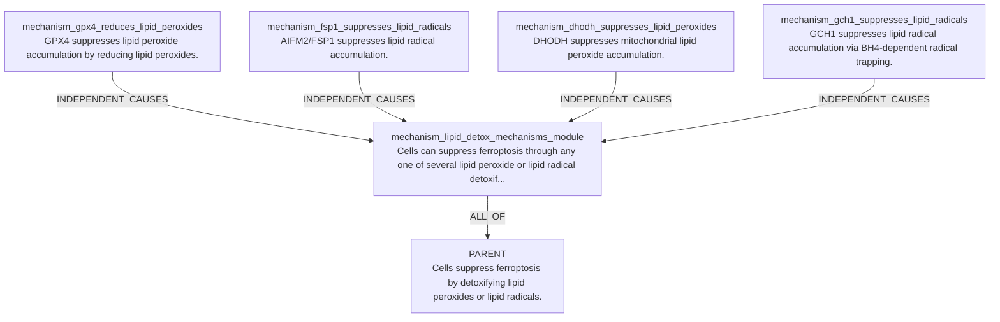

### Lenalidomide / del(5q) MDS / CK1alpha

Input hypothesis:

```text
Lenalidomide creates a therapeutic window in del(5q) MDS by degrading CK1alpha.
```

DAG2 mode: `llm_claim_specific_dag2_decomposition`; child claims: 5; edge operators: `ALL_OF`.

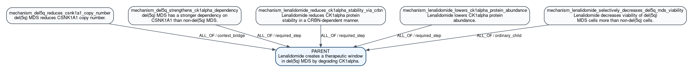

#### Parent Claim Object

| field | value |
|---|---|
| `claim_id` | `P_LENALIDOMIDE_DEL5Q_CK1A` |
| `claim_text` | Lenalidomide creates a therapeutic window in del(5q) MDS by degrading CK1alpha. |
| `relation_name` | `drives_phenotype` |
| `relation_polarity` | `positive` |
| `participants` | perturbagen:`PROPOSED-LENALIDOMIDE` (original_label=lenalidomide; proposed_entity_label=lenalidomide; requires_entity_row=True); degraded_substrate:`CSNK1A1`; disease_context:`PROPOSED-DEL_5Q_MDS` (original_label=del(5q) MDS; proposed_entity_label=del(5q) MDS; requires_entity_row=True) |
| `candidate_gene` | `CSNK1A1` |

#### Claim Rows

| role | claim_text | relation_name | polarity | participants | context/properties |
|---|---|---|---|---|---|
| `mechanism_del5q_reduces_csnk1a1_copy_number` | del(5q) MDS reduces CSNK1A1 copy number. | `changes_copy_number` | `negative` | disease_context:`PROPOSED-DEL_5Q_MDS` (original_label=del(5q) MDS; proposed_entity_label=del(5q) MDS; requires_entity_row=True); target_gene:`HGNC:CSNK1A1` (canonical_gene_symbol=CSNK1A1; original_label=HGNC:CSNK1A1; entrez_id=1452; ensembl_id=ENSG00000113712) | scope=molecular_signal; readout=CSNK1A1 DNA copy number; truth_condition=In del(5q) MDS samples, CSNK1A1 shows copy loss relative to non-del(5q) MDS.; why=The therapeutic window in the supplied context is based on CSNK1A1 haploinsufficiency in del(5q), so the disease context must be explicitly linked to reduced CSNK1A1 dosage.; source=llm_claim_specific_dag2_decomposition |
| `mechanism_del5q_strengthens_ck1alpha_dependency` | del(5q) MDS has a stronger dependency on CSNK1A1 than non-del(5q) MDS. | `has_selective_dependency` | `positive` | dependency_gene:`HGNC:CSNK1A1` (canonical_gene_symbol=CSNK1A1; original_label=HGNC:CSNK1A1; entrez_id=1452; ensembl_id=ENSG00000113712); selective_context:`PROPOSED-DEL_5Q_MDS` (original_label=del(5q) MDS; proposed_entity_label=del(5q) MDS; requires_entity_row=True) | scope=therapy_endpoint; readout=differential cell viability after CSNK1A1 perturbation; truth_condition=CSNK1A1 perturbation causes a larger viability defect in del(5q) MDS cells than in non-del(5q) MDS cells.; why=The parent claims a therapeutic window, which requires selective vulnerability of the del(5q) context to further CK1alpha loss rather than merely CK1alpha degradation in all cells.; source=llm_claim_specific_dag2_decomposition |
| `mechanism_lenalidomide_reduces_ck1alpha_stability_via_crbn` | Lenalidomide reduces CK1alpha protein stability in a CRBN-dependent manner. | `modifies_effect_of` | `positive` | modifier:`HGNC:CRBN`; perturbagen:`PROPOSED-LENALIDOMIDE` (original_label=lenalidomide; proposed_entity_label=lenalidomide; requires_entity_row=True); target_protein:`HGNC:CSNK1A1` (canonical_gene_symbol=CSNK1A1; original_label=HGNC:CSNK1A1; entrez_id=1452; ensembl_id=ENSG00000113712) | scope=molecular_signal; readout=CK1alpha protein half-life; truth_condition=Lenalidomide shortens CK1alpha protein half-life, and this effect is lost when CRBN is absent or impaired.; why=This captures the core drug mechanism from the provided literature context without using assay-QC target engagement language.; source=llm_claim_specific_dag2_decomposition |
| `mechanism_lenalidomide_lowers_ck1alpha_protein_abundance` | Lenalidomide lowers CK1alpha protein abundance. | `regulates_protein_abundance` | `negative` | perturbagen:`PROPOSED-LENALIDOMIDE` (original_label=lenalidomide; proposed_entity_label=lenalidomide; requires_entity_row=True); target_protein:`HGNC:CSNK1A1` (canonical_gene_symbol=CSNK1A1; original_label=HGNC:CSNK1A1; entrez_id=1452; ensembl_id=ENSG00000113712) | scope=molecular_signal; readout=CK1alpha protein abundance; truth_condition=Lenalidomide treatment decreases steady-state CK1alpha protein level relative to untreated cells.; why=The root specifically states that lenalidomide acts by degrading CK1alpha; reduced CK1alpha abundance is the direct substrate-level consequence that links destabilization to phenotype.; source=llm_claim_specific_dag2_decomposition |
| `mechanism_lenalidomide_selectively_decreases_del5q_mds_viability` | Lenalidomide decreases viability of del(5q) MDS cells more than non-del(5q) cells. | `perturbation_changes_phenotype` | `negative` | perturbagen:`PROPOSED-LENALIDOMIDE` (original_label=lenalidomide; proposed_entity_label=lenalidomide; requires_entity_row=True); target_context:`PROPOSED-DEL_5Q_MDS` (original_label=del(5q) MDS; proposed_entity_label=del(5q) MDS; requires_entity_row=True); phenotype:`PROPOSED-MDS_CELL_VIABILITY` (original_label=MDS cell viability; proposed_entity_label=MDS cell viability; requires_entity_row=True) | scope=therapy_endpoint; readout=relative viability of del(5q) versus non-del(5q) MDS cells after lenalidomide; truth_condition=Under lenalidomide treatment, del(5q) MDS cells show a larger reduction in viability or expansion than comparator non-del(5q) cells.; why=A therapeutic window requires a selective cellular response in the disease context; this is the endpoint consequence of the upstream CK1alpha mechanism.; source=llm_claim_specific_dag2_decomposition |

#### Decomposition Edges

| source_dag2_role | source_claim_id | target_dag2_role | target_claim_id | support_operator | source_role | group_id |
|---|---|---|---|---|---|---|
| `mechanism_del5q_reduces_csnk1a1_copy_number` | `P_LENALIDOMIDE_DEL5Q_CK1A.stage0.del5q_reduces_csnk1a1_copy_number` | `parent_claim` | `P_LENALIDOMIDE_DEL5Q_CK1A` | `ALL_OF` | `context_bridge` | `lenalidomide_del5q_ck1a_mechanism` |
| `mechanism_del5q_strengthens_ck1alpha_dependency` | `P_LENALIDOMIDE_DEL5Q_CK1A.stage0.del5q_strengthens_ck1alpha_dependency` | `parent_claim` | `P_LENALIDOMIDE_DEL5Q_CK1A` | `ALL_OF` | `required_step` | `lenalidomide_del5q_ck1a_mechanism` |
| `mechanism_lenalidomide_reduces_ck1alpha_stability_via_crbn` | `P_LENALIDOMIDE_DEL5Q_CK1A.stage0.lenalidomide_reduces_ck1alpha_stability_via_crbn` | `parent_claim` | `P_LENALIDOMIDE_DEL5Q_CK1A` | `ALL_OF` | `required_step` | `lenalidomide_del5q_ck1a_mechanism` |
| `mechanism_lenalidomide_lowers_ck1alpha_protein_abundance` | `P_LENALIDOMIDE_DEL5Q_CK1A.stage0.lenalidomide_lowers_ck1alpha_protein_abundance` | `parent_claim` | `P_LENALIDOMIDE_DEL5Q_CK1A` | `ALL_OF` | `required_step` | `lenalidomide_del5q_ck1a_mechanism` |
| `mechanism_lenalidomide_selectively_decreases_del5q_mds_viability` | `P_LENALIDOMIDE_DEL5Q_CK1A.stage0.lenalidomide_selectively_decreases_del5q_mds_viability` | `parent_claim` | `P_LENALIDOMIDE_DEL5Q_CK1A` | `ALL_OF` | `ordinary_child` | `lenalidomide_del5q_ck1a_mechanism` |

#### Semantic Claim Relations

| source | target | relation_kind | notes |
|---|---|---|---|
| `P_LENALIDOMIDE_DEL5Q_CK1A.stage0.del5q_reduces_csnk1a1_copy_number` | `P_LENALIDOMIDE_DEL5Q_CK1A.stage0.del5q_strengthens_ck1alpha_dependency` | `enables` | Reduced CSNK1A1 dosage explains the stronger dependency on remaining CK1alpha in del(5q) cells. |
| `P_LENALIDOMIDE_DEL5Q_CK1A.stage0.lenalidomide_reduces_ck1alpha_stability_via_crbn` | `P_LENALIDOMIDE_DEL5Q_CK1A.stage0.lenalidomide_lowers_ck1alpha_protein_abundance` | `enables` | Reduced protein stability is an upstream cause of lower steady-state CK1alpha abundance. |
| `P_LENALIDOMIDE_DEL5Q_CK1A.stage0.del5q_strengthens_ck1alpha_dependency` | `P_LENALIDOMIDE_DEL5Q_CK1A.stage0.lenalidomide_selectively_decreases_del5q_mds_viability` | `enables` | Selective dependency provides the context for stronger viability loss after drug-induced CK1alpha reduction. |
| `P_LENALIDOMIDE_DEL5Q_CK1A.stage0.lenalidomide_lowers_ck1alpha_protein_abundance` | `P_LENALIDOMIDE_DEL5Q_CK1A.stage0.lenalidomide_selectively_decreases_del5q_mds_viability` | `enables` | Lower CK1alpha abundance is the immediate molecular change linking lenalidomide to selective viability loss. |
| `P_LENALIDOMIDE_DEL5Q_CK1A.stage0.del5q_strengthens_ck1alpha_dependency` | `P_LENALIDOMIDE_DEL5Q_CK1A.stage0.lenalidomide_reduces_ck1alpha_stability_via_crbn` | `candidate_mechanism_link` | Stage0 inferred these biological claims as related parts of the grounded mechanism; reviewer/L1 may later split, reorder, strengthen, or retire the semantic link. |

#### Mermaid Source

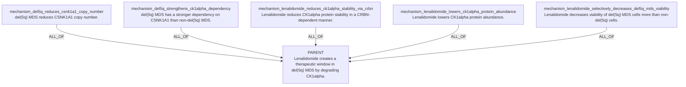

## Key

### Claim Fields

| Column | Meaning |
|---|---|
| `ID` | Stable candidate claim id used in formulas and diagrams. |
| `claim_text` | Full biological assertion. |
| `participants` | Role-labeled KG node ids or proposed node ids. |
| `relation_name` | Predicate for the claim. |
| `polarity` | `positive`, `negative`, `bidirectional`, `null`, `unknown`, or SQL `NULL` when sign is not applicable. |
| `context/properties` | Context and non-proof metadata. |

### Edge Fields

| Field | Meaning |
|---|---|
| `source_claim_id -> target_claim_id` | Child/module supports target. |
| `support_operator` | `ALL_OF`, `ANY_OF`, `K_OF_N`, `INDEPENDENT_CAUSES`, or `MUTUALLY_EXCLUSIVE_ALTERNATIVES`. |
| `source_role` | `shared_anchor`, `required_step`, `sufficient_module`, `context_bridge`, or `ordinary_child`. |
| `group_id` | Mechanism/pathway group. |

## Local Reference Context

| File | Local title / citation anchor | DOI |
|---|---|---|
| `ADAR1paper.pdf` | Loss of ADAR1 in tumours overcomes resistance to immune checkpoint blockade | not present in PDF metadata |
| `nature23465.pdf` | CDK4/6 inhibition triggers anti-tumour immunity | `10.1038/nature23465` |
| `s41586-020-2229-5.pdf` | Autophagy promotes immune evasion of pancreatic cancer by degrading MHC-I | `10.1038/s41586-020-2229-5` |
| `s41586-023-06575-7.pdf` | The PTPN2/PTPN1 inhibitor ABBV-CLS-484 unleashes potent anti-tumour immunity | `10.1038/s41586-023-06575-7` |
| `s41586-024-08439-0.pdf` | Immune evasion through mitochondrial transfer in the tumour microenvironment | `10.1038/s41586-024-08439-0` |
| `s41580-024-00768-2.pdf` | Profiling cell identity and tissue architecture with single-cell and spatial transcriptomics | `10.1038/s41580-024-00768-2` |
| `cellTree.pdf` | A reference cell tree will serve science better than a reference cell atlas | `10.1016/j.cell.2023.02.016` |
| `cellstates.pdf` | Establishing a conceptual framework for holistic cell states and state transitions | `10.1016/j.cell.2024.04.035` |

The ADAR1 PDF text includes DOI `10.1038/s41586-018-0768-9`, although that DOI
was not present in the PDF metadata. PTPN2/PTPN1, mitochondrial transfer, ADAR1,
CDK4/6, and autophagy/MHC-I have directly matching primary papers in this local
folder. The CIN/cGAS-STING, beta-catenin/DC-exclusion, IFNg/ferroptosis, and
RBMS1 examples still need direct primary literature attachment before their
child claims should be treated as known evidence.

## 1. Chromosomal Instability / cGAS-STING Metastasis Bias

Hypothesis:

```text
Chromosomal instability causes micronuclei formation and chronic cGAS-STING
signaling, which rewires tumor inflammation toward metastasis rather than
immune clearance.
```

Formula:

```text
P_CIN_STING_METASTASIS =
  F_CIN_MICRONUCLEI AND
  F_MICRONUCLEAR_DNA_EXPOSURE AND
  F_MICRONUCLEI_ACTIVATE_STING AND
  F_CIN_SUSTAINS_CHRONIC_STING AND
  F_CHRONIC_STING_REWIRES_INFLAMMATION AND
  F_REWIRED_INFLAMMATION_METASTASIS_BIAS
```

Claims:

| ID | claim_text | participants | relation_name | polarity | context/properties |
|---|---|---|---|---|---|
| `P_CIN_STING_METASTASIS` | Chromosomal instability promotes a chronic cGAS-STING inflammatory state that biases tumors toward metastasis rather than immune clearance. | process:`BP-chromosomal_instability`; pathway:`PATHWAY-cGAS_STING`; phenotype:`PHENO-metastasis`; phenotype:`PHENO-immune_clearance`; cell_context:`TME-tumor_intrinsic` | `drives_phenotype` | `positive` | parent hypothesis |
| `F_CIN_MICRONUCLEI` | Chromosomal instability in tumor cells increases micronuclei containing missegregated chromosomal DNA. | process:`BP-chromosomal_instability`; structure:`STRUCT-micronucleus`; cell_context:`TME-tumor_intrinsic` | `increases` | `positive` | structural DNA-damage step |
| `F_MICRONUCLEAR_DNA_EXPOSURE` | Micronuclei formed during chromosomal instability expose micronuclear DNA to the cytosol after envelope disruption. | structure:`STRUCT-micronucleus`; material:`DNA-chromosomal`; compartment:`GO-cytosol` | `exposes_to` | `positive` | cytosolic DNA trigger |
| `F_MICRONUCLEI_ACTIVATE_STING` | Cytosol-exposed micronuclear DNA activates cGAS-STING signaling in tumor cells. | material:`DNA-cytosolic`; effector:`CGAS`; pathway:`PATHWAY-STING1_TBK1_IRF3`; cell_context:`TME-tumor_intrinsic` | `activates` | `positive` | pathway activation |
| `F_CIN_SUSTAINS_CHRONIC_STING` | Persistent chromosomal instability sustains chronic rather than transient cGAS-STING signaling. | process:`BP-chromosomal_instability`; pathway:`PATHWAY-cGAS_STING`; temporal_context:`chronic` | `sustains` | `positive` | chronicity requirement |
| `F_CHRONIC_STING_REWIRES_INFLAMMATION` | Chronic STING signaling shifts inflammatory output from immune-clearing programs toward nonresolving pro-metastatic inflammatory programs. | pathway:`PATHWAY-cGAS_STING`; phenotype:`PHENO-pro_metastatic_inflammation`; phenotype:`PHENO-immune_clearance` | `rewires` | `positive` | inflammatory state transition |
| `F_REWIRED_INFLAMMATION_METASTASIS_BIAS` | The chronic STING-driven inflammatory state increases invasion, dissemination, or metastatic outgrowth more than immune-mediated tumor clearance. | phenotype:`PHENO-pro_metastatic_inflammation`; phenotype:`PHENO-metastatic_outgrowth`; phenotype:`PHENO-immune_clearance` | `biases_toward` | `positive` | endpoint |

Decomposition:

| source -> target | operator | source_role | group_id |
|---|---|---|---|
| every `F_*` child -> `P_CIN_STING_METASTASIS` | `ALL_OF` | `required_step` | `cin_sting_chain` |

Semantic claim_relations:

```text
F_CIN_MICRONUCLEI enables F_MICRONUCLEAR_DNA_EXPOSURE
F_MICRONUCLEAR_DNA_EXPOSURE enables F_MICRONUCLEI_ACTIVATE_STING
F_MICRONUCLEI_ACTIVATE_STING enables F_CIN_SUSTAINS_CHRONIC_STING
F_CIN_SUSTAINS_CHRONIC_STING enables F_CHRONIC_STING_REWIRES_INFLAMMATION
F_CHRONIC_STING_REWIRES_INFLAMMATION enables F_REWIRED_INFLAMMATION_METASTASIS_BIAS
```

Boxed-arrow DAG:

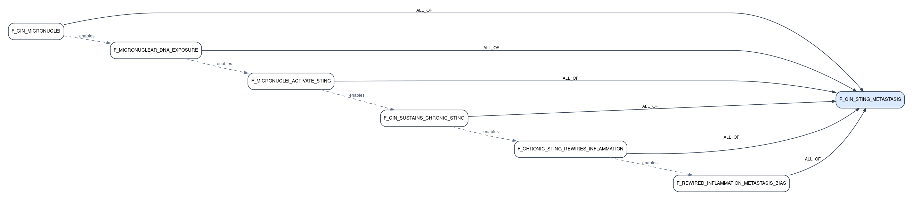

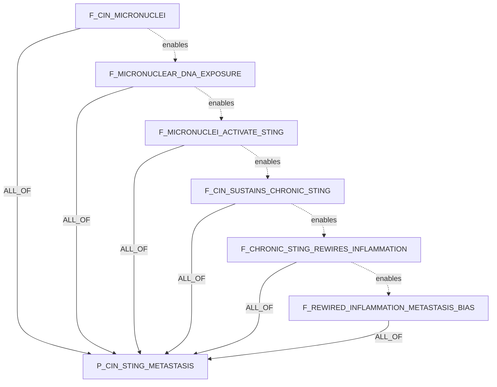

Rationale: the DAG separates genome-structural damage, cytosolic DNA exposure,
pathway activation, chronic signaling, inflammatory-state rewiring, and the
metastasis-biased endpoint. This is better than a single broad "STING causes
metastasis" claim because each child has a distinct truth condition and
measurable readout.

## 2. Tumor-To-T-Cell Mitochondrial Transfer

Hypothesis:

```text
Tumor cells transfer damaged mitochondria into T cells, causing T-cell
mitochondrial dysfunction and immune evasion; blocking mitochondrial transfer
should restore T-cell cytotoxicity.
```

Formula:

```text
P_TUMOR_MITO_TRANSFER_TCELL_EVASION =
  F_TUMOR_TO_TCELL_MITO_TRANSFER AND
  F_TRANSFERRED_MITOCHONDRIA_DAMAGED AND
  F_TRANSFER_CAUSES_TCELL_MITO_DYSFUNCTION AND
  F_TCELL_MITO_DYSFUNCTION_REDUCES_CYTOTOXICITY AND
  F_CYTOTOXICITY_LOSS_PERMITS_EVASION AND
  F_TRANSFER_BLOCKADE_RESCUES_TCELL_FUNCTION
```

Claims:

| ID | claim_text | participants | relation_name | polarity | context/properties |
|---|---|---|---|---|---|
| `P_TUMOR_MITO_TRANSFER_TCELL_EVASION` | Tumor-to-T-cell transfer of damaged mitochondria impairs T-cell cytotoxicity and promotes tumor immune evasion, while transfer blockade restores cytotoxic function. | source_cell:`TME-tumor_cell`; recipient_cell:`CT-TCELL`; organelle:`GO-mitochondrion`; phenotype:`PHENO-immune_evasion`; phenotype:`PHENO-TCELL_cytotoxicity` | `drives_phenotype` | `positive` | parent hypothesis |
| `F_TUMOR_TO_TCELL_MITO_TRANSFER` | Tumor cells transfer mitochondria into T cells in the tumor microenvironment. | source_cell:`TME-tumor_cell`; recipient_cell:`CT-TCELL`; organelle:`GO-mitochondrion`; location:`TME` | `transfers_to` | `positive` | intercellular transfer step |
| `F_TRANSFERRED_MITOCHONDRIA_DAMAGED` | Tumor-origin mitochondria found in recipient T cells are damaged or dysfunctional. | organelle:`GO-mitochondrion`; phenotype:`PHENO-mitochondrial_damage`; recipient_cell:`CT-TCELL` | `has_observed_property` | SQL `NULL` | cargo state |
| `F_TRANSFER_CAUSES_TCELL_MITO_DYSFUNCTION` | Receipt of tumor-derived damaged mitochondria causes mitochondrial dysfunction in recipient T cells. | organelle:`GO-mitochondrion`; cell_context:`CT-TCELL`; phenotype:`PHENO-mitochondrial_dysfunction` | `causes` | `positive` | recipient-cell state |
| `F_TCELL_MITO_DYSFUNCTION_REDUCES_CYTOTOXICITY` | Mitochondrial dysfunction in T cells reduces tumor-cell killing and cytotoxic effector output. | cell_context:`CT-TCELL`; phenotype:`PHENO-mitochondrial_dysfunction`; phenotype:`PHENO-TCELL_cytotoxicity` | `reduces` | `negative` | effector function |
| `F_CYTOTOXICITY_LOSS_PERMITS_EVASION` | Loss of T-cell cytotoxic function permits increased tumor immune evasion or survival. | cell_context:`CT-TCELL`; phenotype:`PHENO-TCELL_cytotoxicity`; phenotype:`PHENO-immune_evasion` | `permits` | `positive` | endpoint |
| `F_TRANSFER_BLOCKADE_RESCUES_TCELL_FUNCTION` | Blocking tumor-to-T-cell mitochondrial transfer restores T-cell mitochondrial fitness and cytotoxic function. | intervention:`INT-mitochondrial_transfer_blockade`; source_cell:`TME-tumor_cell`; recipient_cell:`CT-TCELL`; phenotype:`PHENO-TCELL_cytotoxicity` | `restores` | `positive` | intervention/rescue |

Decomposition:

| source -> target | operator | source_role | group_id |
|---|---|---|---|
| every `F_*` child -> `P_TUMOR_MITO_TRANSFER_TCELL_EVASION` | `ALL_OF` | `required_step` | `mito_transfer_chain` |

Semantic claim_relations:

```text
F_TUMOR_TO_TCELL_MITO_TRANSFER enables F_TRANSFERRED_MITOCHONDRIA_DAMAGED
F_TRANSFERRED_MITOCHONDRIA_DAMAGED enables F_TRANSFER_CAUSES_TCELL_MITO_DYSFUNCTION
F_TRANSFER_CAUSES_TCELL_MITO_DYSFUNCTION enables F_TCELL_MITO_DYSFUNCTION_REDUCES_CYTOTOXICITY
F_TCELL_MITO_DYSFUNCTION_REDUCES_CYTOTOXICITY enables F_CYTOTOXICITY_LOSS_PERMITS_EVASION
F_TRANSFER_BLOCKADE_RESCUES_TCELL_FUNCTION refutes_if_false P_TUMOR_MITO_TRANSFER_TCELL_EVASION
```

Boxed-arrow DAG:

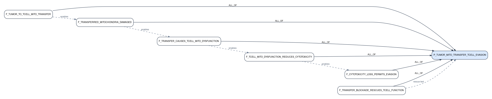

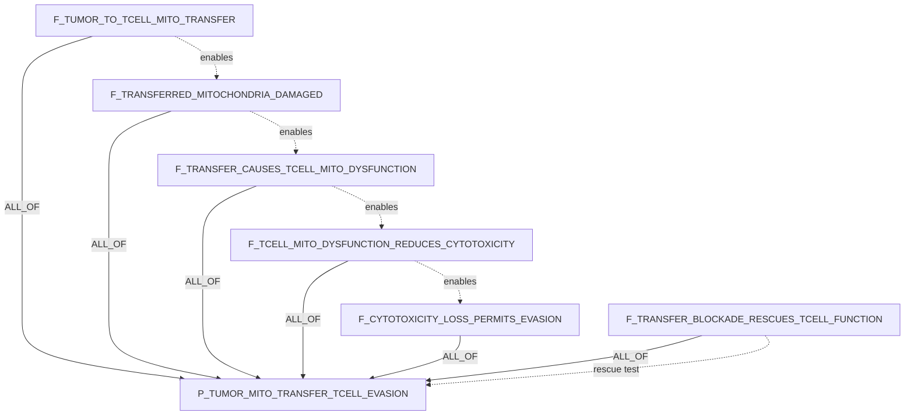

Rationale: the DAG prevents overclaiming by requiring evidence for transfer,
cargo damage, recipient T-cell dysfunction, cytotoxic loss, immune-evasion
outcome, and rescue after blockade. The rescue child is essential because it
distinguishes causal transfer from a correlated exhausted T-cell state.

Source: `s41586-024-08439-0.pdf`, DOI `10.1038/s41586-024-08439-0`.

## 3. PTPN2/PTPN1 Interferon Amplification And Immune Killing

Hypothesis:

```text
PTPN2/PTPN1 act as brakes on JAK-STAT interferon signaling, so dual inhibition
should amplify IFN response, antigen presentation, and NK/CD8 killing.
```

Formula:

```text
P_PTPN2_PTPN1_IFN_KILLING =
  F_PTPN2_PTPN1_LOSS_AMPLIFIES_JAK_STAT AND
  F_IFN_AMPLIFICATION_INCREASES_ANTIGEN_PRESENTATION AND
  F_PTPN_INHIBITION_INCREASES_NK_SUSCEPTIBILITY AND
  F_PTPN_INHIBITION_INCREASES_CD8_KILLING AND
  F_DUAL_PARALOG_INHIBITION_OUTPERFORMS_SINGLE
```

Claims:

| ID | claim_text | participants | relation_name | polarity | context/properties |
|---|---|---|---|---|---|
| `P_PTPN2_PTPN1_IFN_KILLING` | Dual PTPN2/PTPN1 inhibition amplifies interferon-JAK-STAT signaling, antigen presentation, and NK/CD8 tumor killing. | target:`PTPN2`; target:`PTPN1`; pathway:`PATHWAY-interferon_JAK_STAT`; phenotype:`PHENO-antigen_presentation`; immune_cell:`CT-CD8_TCELL`; immune_cell:`CT-NK_CELL` | `increases` | `positive` | parent hypothesis |
| `F_PTPN2_PTPN1_LOSS_AMPLIFIES_JAK_STAT` | Reduced PTPN2/PTPN1 phosphatase activity increases interferon-induced JAK-STAT signaling, including STAT phosphorylation and ISG transcription. | target:`PTPN2`; target:`PTPN1`; pathway:`PATHWAY-interferon_JAK_STAT`; process:`BP-ISG_expression` | `amplifies` | `positive` | proximal pathway |
| `F_IFN_AMPLIFICATION_INCREASES_ANTIGEN_PRESENTATION` | Amplified interferon-JAK-STAT signaling after PTPN2/PTPN1 inhibition increases tumor-cell antigen-processing and MHC-I presentation machinery. | pathway:`PATHWAY-interferon_JAK_STAT`; phenotype:`PHENO-antigen_presentation`; target:`B2M`; target:`TAP1`; target:`HLA_class_I`; cell_context:`TME-tumor_intrinsic` | `upregulates` | `positive` | tumor immune visibility |
| `F_PTPN_INHIBITION_INCREASES_NK_SUSCEPTIBILITY` | PTPN2/PTPN1 inhibition increases tumor susceptibility to NK-cell attack through interferon-linked visibility or cytotoxic-response programs. | target:`PTPN2`; target:`PTPN1`; immune_cell:`CT-NK_CELL`; phenotype:`PHENO-NK_cell_killing` | `increases_susceptibility_to` | `positive` | NK arm |
| `F_PTPN_INHIBITION_INCREASES_CD8_KILLING` | Tumor-cell interferon and antigen-presentation changes caused by PTPN2/PTPN1 inhibition increase CD8 T-cell recognition and cytotoxic killing. | target:`PTPN2`; target:`PTPN1`; immune_cell:`CT-CD8_TCELL`; phenotype:`PHENO-CD8_TCELL_killing`; phenotype:`PHENO-antigen_presentation` | `increases` | `positive` | CD8 arm |
| `F_DUAL_PARALOG_INHIBITION_OUTPERFORMS_SINGLE` | Concurrent inhibition of PTPN2 and PTPN1 produces stronger interferon signaling and immune-visibility phenotypes than inhibiting either phosphatase alone. | target:`PTPN2`; target:`PTPN1`; intervention:`INT-dual_phosphatase_inhibition`; pathway:`PATHWAY-interferon_JAK_STAT` | `has_greater_effect_than` | `positive` | dual-paralog requirement |

Decomposition:

| source -> target | operator | source_role | group_id |
|---|---|---|---|
| every `F_*` child -> `P_PTPN2_PTPN1_IFN_KILLING` | `ALL_OF` | `required_step` | `ptpn_ifn_killing_chain` |

Semantic claim_relations:

```text
F_PTPN2_PTPN1_LOSS_AMPLIFIES_JAK_STAT enables F_IFN_AMPLIFICATION_INCREASES_ANTIGEN_PRESENTATION
F_IFN_AMPLIFICATION_INCREASES_ANTIGEN_PRESENTATION enables F_PTPN_INHIBITION_INCREASES_CD8_KILLING
F_PTPN2_PTPN1_LOSS_AMPLIFIES_JAK_STAT enables F_PTPN_INHIBITION_INCREASES_NK_SUSCEPTIBILITY
F_DUAL_PARALOG_INHIBITION_OUTPERFORMS_SINGLE refines P_PTPN2_PTPN1_IFN_KILLING
```

Boxed-arrow DAG:

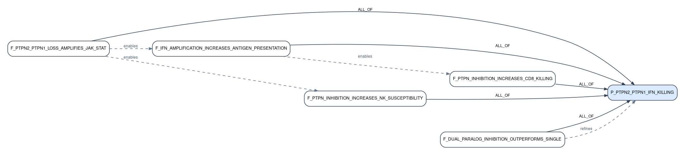

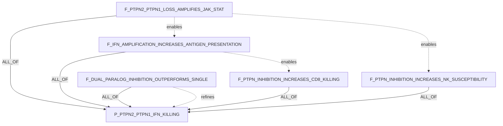

Rationale: this is the strongest local-paper-backed example in the set. The DAG
keeps the proximal JAK-STAT phosphatase mechanism separate from antigen
presentation, NK susceptibility, CD8 killing, and the dual-paralog requirement.
That prevents the system from proving "PTPN2 works" when the real claim is that
dual PTPN2/PTPN1 inhibition creates stronger tumor immune visibility and killing.

Source: `s41586-023-06575-7.pdf`, DOI `10.1038/s41586-023-06575-7`.

## 4. Tumor-Intrinsic Beta-Catenin / DC Recruitment / T-Cell Exclusion

Hypothesis:

```text
Tumor-intrinsic beta-catenin signaling blocks dendritic-cell recruitment,
causing T-cell exclusion; beta-catenin inhibition should restore DC recruitment
and CD8 entry.
```

Formula:

```text
P_CTNNB1_DC_CD8_EXCLUSION =
  F_CTNNB1_SUPPRESSES_DC_CHEMOKINES AND
  F_CHEMOKINE_LOSS_REDUCES_DC_RECRUITMENT AND
  F_DC_LOSS_REDUCES_CD8_ENTRY AND
  F_HIGH_CTNNB1_ASSOCIATES_WITH_CD8_EXCLUSION AND
  F_CTNNB1_INHIBITION_RESTORES_CHEMOKINES AND
  F_CTNNB1_INHIBITION_RESTORES_DC_AND_CD8
```

Claims:

| ID | claim_text | participants | relation_name | polarity | context/properties |
|---|---|---|---|---|---|
| `P_CTNNB1_DC_CD8_EXCLUSION` | Tumor-intrinsic CTNNB1 signaling suppresses dendritic-cell recruitment and causes CD8 T-cell exclusion, while CTNNB1 inhibition restores DC recruitment and CD8 entry. | effector:`CTNNB1`; immune_cell:`CT-dendritic_cell`; immune_cell:`CT-CD8_TCELL`; phenotype:`PHENO-TCELL_exclusion`; cell_context:`TME-tumor_intrinsic` | `drives_phenotype` | `positive` | parent hypothesis |
| `F_CTNNB1_SUPPRESSES_DC_CHEMOKINES` | Tumor-cell-intrinsic CTNNB1 activation decreases expression or secretion of dendritic-cell-recruiting chemokines. | effector:`CTNNB1`; phenotype:`PHENO-DC_recruiting_chemokine_expression`; cell_context:`TME-tumor_intrinsic` | `suppresses` | `negative` | chemokine mediator |
| `F_CHEMOKINE_LOSS_REDUCES_DC_RECRUITMENT` | Reduced tumor-derived dendritic-cell-recruiting chemokines lower intratumoral dendritic-cell recruitment or abundance. | phenotype:`PHENO-DC_recruiting_chemokine_expression`; immune_cell:`CT-dendritic_cell`; location:`TME` | `reduces` | `negative` | DC recruitment step |
| `F_DC_LOSS_REDUCES_CD8_ENTRY` | Reduced intratumoral dendritic-cell abundance lowers CD8 T-cell priming, recruitment, or entry into tumors. | immune_cell:`CT-dendritic_cell`; immune_cell:`CT-CD8_TCELL`; phenotype:`PHENO-CD8_TCELL_infiltration` | `reduces` | `negative` | immune-cell bridge |
| `F_HIGH_CTNNB1_ASSOCIATES_WITH_CD8_EXCLUSION` | High tumor-cell-intrinsic CTNNB1 signaling is associated with reduced intratumoral CD8 T-cell infiltration. | effector:`CTNNB1`; immune_cell:`CT-CD8_TCELL`; phenotype:`PHENO-TCELL_exclusion`; cell_context:`TME-tumor_intrinsic` | `is_associated_with_outcome` | `positive` | human/tumor context bridge |
| `F_CTNNB1_INHIBITION_RESTORES_CHEMOKINES` | Inhibiting tumor-cell CTNNB1 signaling restores expression or secretion of dendritic-cell-recruiting chemokines. | intervention:`INT-CTNNB1_pathway_inhibition`; effector:`CTNNB1`; phenotype:`PHENO-DC_recruiting_chemokine_expression` | `restores` | `positive` | intervention step |
| `F_CTNNB1_INHIBITION_RESTORES_DC_AND_CD8` | Inhibiting tumor-cell CTNNB1 signaling increases intratumoral dendritic-cell abundance and permits CD8 T-cell entry. | intervention:`INT-CTNNB1_pathway_inhibition`; immune_cell:`CT-dendritic_cell`; immune_cell:`CT-CD8_TCELL`; phenotype:`PHENO-CD8_TCELL_infiltration` | `restores` | `positive` | rescue endpoint |

Decomposition:

| source -> target | operator | source_role | group_id |
|---|---|---|---|
| every `F_*` child -> `P_CTNNB1_DC_CD8_EXCLUSION` | `ALL_OF` | `required_step` | `ctnnb1_dc_cd8_chain` |

Semantic claim_relations:

```text
F_CTNNB1_SUPPRESSES_DC_CHEMOKINES enables F_CHEMOKINE_LOSS_REDUCES_DC_RECRUITMENT
F_CHEMOKINE_LOSS_REDUCES_DC_RECRUITMENT enables F_DC_LOSS_REDUCES_CD8_ENTRY
F_DC_LOSS_REDUCES_CD8_ENTRY enables F_HIGH_CTNNB1_ASSOCIATES_WITH_CD8_EXCLUSION
F_CTNNB1_INHIBITION_RESTORES_CHEMOKINES enables F_CTNNB1_INHIBITION_RESTORES_DC_AND_CD8
```

Boxed-arrow DAG:

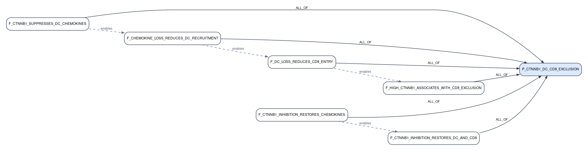

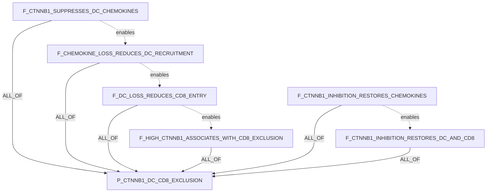

Rationale: the compiler produced a useful intermediary mediator: tumor-derived
DC-recruiting chemokines. That makes the claim much more testable than a direct
"beta-catenin blocks T cells" statement because L1/L2 can separately evaluate
chemokine expression, dendritic-cell recruitment, CD8 entry, and rescue after
pathway inhibition.

## 5. CD8 T-Cell IFNg / Tumor Ferroptosis / Immune Killing

Hypothesis:

```text
CD8 T-cell IFNg signaling induces tumor-cell ferroptosis by suppressing lipid
antioxidant defenses; increasing tumor ferroptosis sensitivity should improve
immune-mediated tumor killing.
```

Formula:

```text
P_IFNG_FERROPTOSIS_IMMUNE_KILLING =
  F_TUMOR_IFNG_SIGNAL_TRANSDUCTION AND
  F_IFNG_REPRESSES_SYSTEM_XC AND
  F_SYSTEM_XC_REPRESSION_LOWERS_GSH_DEFENSE AND
  F_LIPID_DEFENSE_LOSS_CAUSES_FERROPTOSIS AND
  F_IFNG_KILLING_HAS_FERROPTOSIS_COMPONENT AND
  F_FERROPTOSIS_SENSITIZATION_IMPROVES_IMMUNE_KILLING
```

Claims:

| ID | claim_text | participants | relation_name | polarity | context/properties |
|---|---|---|---|---|---|
| `P_IFNG_FERROPTOSIS_IMMUNE_KILLING` | CD8 T-cell IFNg signaling induces tumor-cell ferroptosis through lipid antioxidant defense suppression, and ferroptosis sensitization improves immune-mediated tumor killing. | immune_cell:`CT-CD8_TCELL`; cytokine:`IFNG`; phenotype:`PHENO-ferroptosis`; phenotype:`PHENO-immune_mediated_tumor_killing`; cell_context:`TME-tumor_intrinsic` | `drives_phenotype` | `positive` | parent hypothesis |
| `F_TUMOR_IFNG_SIGNAL_TRANSDUCTION` | Tumor-cell exposure to IFNg activates tumor-intrinsic IFNGR-JAK-STAT1 signaling. | cytokine:`IFNG`; receptor:`IFNGR1`; pathway:`PATHWAY-JAK_STAT1`; cell_context:`TME-tumor_intrinsic` | `activates` | `positive` | proximal IFNg step |
| `F_IFNG_REPRESSES_SYSTEM_XC` | IFNg signaling represses the tumor-cell cystine import system xCT/SLC7A11-SLC3A2. | cytokine:`IFNG`; target:`SLC7A11`; target:`SLC3A2`; transporter:`SYSTEM-xc_minus` | `represses` | `negative` | cystine import step |
| `F_SYSTEM_XC_REPRESSION_LOWERS_GSH_DEFENSE` | Repression of tumor-cell cystine import lowers glutathione-dependent lipid peroxide detoxification capacity. | transporter:`SYSTEM-xc_minus`; cofactor:`CHEBI-glutathione`; phenotype:`PHENO-lipid_antioxidant_defense` | `reduces` | `negative` | antioxidant defense step |
| `F_LIPID_DEFENSE_LOSS_CAUSES_FERROPTOSIS` | Loss of tumor-cell lipid antioxidant defense causes lipid peroxide accumulation and ferroptotic death. | phenotype:`PHENO-lipid_antioxidant_defense`; metabolite:`CHEBI-lipid_peroxide`; phenotype:`PHENO-ferroptosis` | `causes` | `positive` | ferroptosis execution |
| `F_IFNG_KILLING_HAS_FERROPTOSIS_COMPONENT` | A component of IFNg-induced tumor-cell killing is ferroptosis-dependent rather than solely apoptosis or growth arrest. | cytokine:`IFNG`; phenotype:`PHENO-tumor_cell_death`; phenotype:`PHENO-ferroptosis` | `has_component` | `positive` | causality discriminator |
| `F_FERROPTOSIS_SENSITIZATION_IMPROVES_IMMUNE_KILLING` | Increasing tumor-cell ferroptosis sensitivity enhances immune-mediated tumor killing in the presence of cytotoxic lymphocytes. | intervention:`INT-ferroptosis_sensitization`; phenotype:`PHENO-ferroptosis`; phenotype:`PHENO-immune_mediated_tumor_killing`; immune_cell:`CT-CD8_TCELL` | `enhances` | `positive` | intervention endpoint |

Decomposition:

| source -> target | operator | source_role | group_id |
|---|---|---|---|
| every `F_*` child -> `P_IFNG_FERROPTOSIS_IMMUNE_KILLING` | `ALL_OF` | `required_step` | `ifng_ferroptosis_chain` |

Semantic claim_relations:

```text
F_TUMOR_IFNG_SIGNAL_TRANSDUCTION enables F_IFNG_REPRESSES_SYSTEM_XC
F_IFNG_REPRESSES_SYSTEM_XC enables F_SYSTEM_XC_REPRESSION_LOWERS_GSH_DEFENSE
F_SYSTEM_XC_REPRESSION_LOWERS_GSH_DEFENSE enables F_LIPID_DEFENSE_LOSS_CAUSES_FERROPTOSIS
F_LIPID_DEFENSE_LOSS_CAUSES_FERROPTOSIS enables F_IFNG_KILLING_HAS_FERROPTOSIS_COMPONENT
F_IFNG_KILLING_HAS_FERROPTOSIS_COMPONENT enables F_FERROPTOSIS_SENSITIZATION_IMPROVES_IMMUNE_KILLING
```

Boxed-arrow DAG:

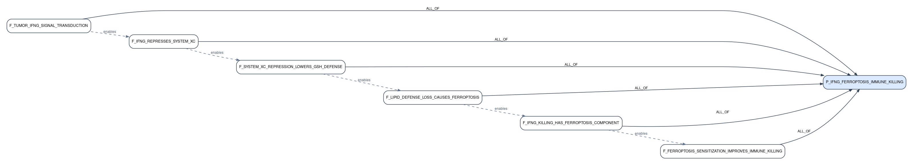

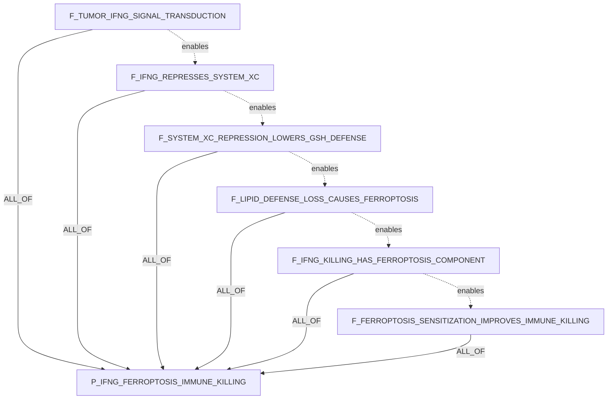

Rationale: the DAG adds the key mechanistic bridge through system xc-,
glutathione, and lipid peroxide defense. This prevents the system from treating
"IFNg kills tumor cells" and "ferroptosis happens" as enough; the causal claim
requires a ferroptosis-dependent component of CD8/IFNg-mediated killing plus a
sensitization experiment that improves immune killing.

## 6. ADAR1 Loss / dsRNA Sensing / PD-1 Sensitization

Hypothesis:

```text
ADAR1 blockade will sensitize tumors to PD-1 therapy by allowing endogenous
double-stranded RNA to activate antiviral sensing and tumor inflammation.
```

Formula:

```text
P_ADAR1_PD1_SENSITIZATION =
  F_ADAR1_EDITS_ENDOGENOUS_DSRNA AND
  F_ADAR1_LOSS_ACCUMULATES_UNEDITED_DSRNA AND
  F_UNEDITED_DSRNA_ACTIVATES_PKR_AND_MDA5 AND
  F_MDA5_MAVS_INDUCES_TUMOR_INFLAMMATION AND
  F_PKR_INDUCES_GROWTH_INHIBITION AND
  F_ADAR1_LOSS_OVERCOMES_PD1_RESISTANCE
```

Claims:

| ID | claim_text | participants | relation_name | polarity | context/properties |
|---|---|---|---|---|---|
| `P_ADAR1_PD1_SENSITIZATION` | ADAR1 loss or blockade sensitizes tumors to PD-1 checkpoint blockade by unleashing endogenous dsRNA sensing and tumor inflammation. | effector:`ADAR`; therapy_context:`THR-anti_PD1`; target:`RNA-endogenous_dsRNA`; pathway:`PATHWAY-antiviral_RNA_sensing`; phenotype:`PHENO-ICB_sensitization`; cell_context:`TME-tumor_intrinsic` | `sensitizes_to_therapy` | `positive` | parent hypothesis |
| `F_ADAR1_EDITS_ENDOGENOUS_DSRNA` | ADAR1 normally edits endogenous double-stranded RNA in tumor cells. | effector:`ADAR`; substrate:`RNA-endogenous_dsRNA`; process:`BP-A_to_I_RNA_editing`; cell_context:`TME-tumor_intrinsic` | `edits` | `positive` | RNA-editing anchor |
| `F_ADAR1_LOSS_ACCUMULATES_UNEDITED_DSRNA` | ADAR1 loss or blockade increases unedited endogenous dsRNA available for antiviral sensor recognition. | effector:`ADAR`; substrate:`RNA-unedited_endogenous_dsRNA`; process:`BP-antiviral_sensor_exposure`; cell_context:`TME-tumor_intrinsic` | `increases` | `positive` | sensor substrate |
| `F_UNEDITED_DSRNA_ACTIVATES_PKR_AND_MDA5` | Unedited endogenous dsRNA activates PKR and MDA5-family antiviral RNA sensing in tumor cells. | substrate:`RNA-unedited_endogenous_dsRNA`; effector:`EIF2AK2`; effector:`IFIH1`; pathway:`PATHWAY-antiviral_RNA_sensing` | `activates` | `positive` | paired sensor activation |
| `F_MDA5_MAVS_INDUCES_TUMOR_INFLAMMATION` | MDA5-MAVS signaling downstream of unedited dsRNA induces tumor-cell antiviral interferon and inflammatory programs. | effector:`IFIH1`; effector:`MAVS`; pathway:`PATHWAY-type_I_interferon`; phenotype:`PHENO-tumor_inflammation` | `induces` | `positive` | inflammatory arm |
| `F_PKR_INDUCES_GROWTH_INHIBITION` | PKR activation downstream of unedited dsRNA contributes to tumor-cell growth inhibition. | effector:`EIF2AK2`; pathway:`PATHWAY-integrated_stress_response`; phenotype:`PHENO-tumor_cell_growth_inhibition` | `induces` | `positive` | growth-inhibition arm |
| `F_ADAR1_LOSS_OVERCOMES_PD1_RESISTANCE` | Loss or blockade of ADAR1 overcomes resistance to PD-1 checkpoint blockade in tumor contexts, including contexts with impaired antigen presentation. | effector:`ADAR`; therapy_context:`THR-anti_PD1`; phenotype:`PHENO-PD1_resistance`; phenotype:`PHENO-ICB_sensitization` | `overcomes_resistance_to` | `positive` | therapeutic endpoint |

Decomposition:

| source -> target | operator | source_role | group_id |
|---|---|---|---|
| every `F_*` child -> `P_ADAR1_PD1_SENSITIZATION` | `ALL_OF` | `required_step` | `adar1_dsrna_pd1_chain` |

Semantic claim_relations:

```text
F_ADAR1_EDITS_ENDOGENOUS_DSRNA enables F_ADAR1_LOSS_ACCUMULATES_UNEDITED_DSRNA
F_ADAR1_LOSS_ACCUMULATES_UNEDITED_DSRNA enables F_UNEDITED_DSRNA_ACTIVATES_PKR_AND_MDA5
F_UNEDITED_DSRNA_ACTIVATES_PKR_AND_MDA5 enables F_MDA5_MAVS_INDUCES_TUMOR_INFLAMMATION
F_UNEDITED_DSRNA_ACTIVATES_PKR_AND_MDA5 enables F_PKR_INDUCES_GROWTH_INHIBITION
F_MDA5_MAVS_INDUCES_TUMOR_INFLAMMATION enables F_ADAR1_LOSS_OVERCOMES_PD1_RESISTANCE
F_PKR_INDUCES_GROWTH_INHIBITION enables F_ADAR1_LOSS_OVERCOMES_PD1_RESISTANCE
```

Boxed-arrow DAG:

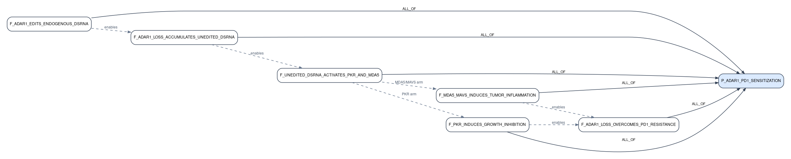

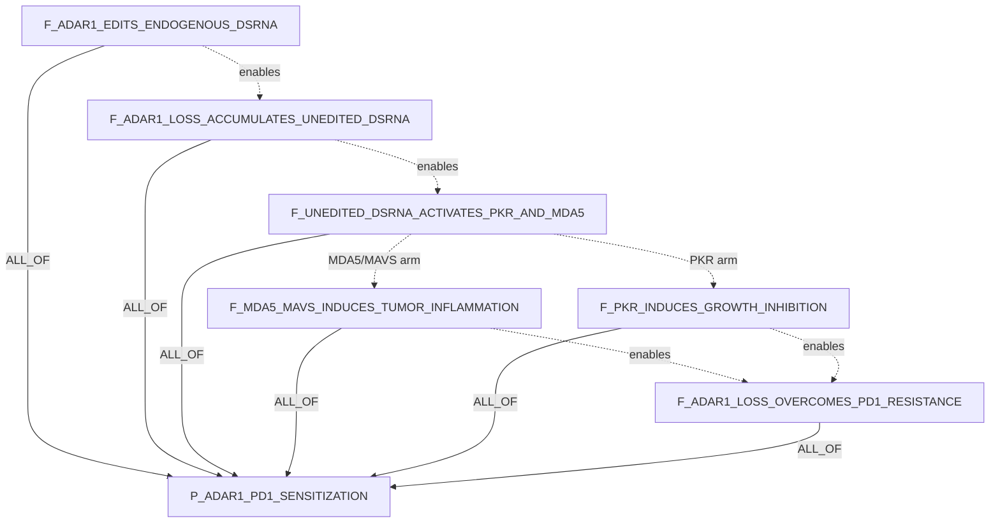

Rationale: ADAR1 was not part of the original five-hypothesis Step0 run. This
added candidate DAG captures the key logic from the local ADAR1 paper: ADAR1
editing suppresses endogenous dsRNA sensing; ADAR1 loss activates PKR and MDA5
arms; those arms produce growth inhibition and tumor inflammation; and the
combined state can overcome PD-1 resistance. The DAG keeps the RNA-editing
substrate, the sensor arms, and the therapy endpoint separate so evidence can
attach at the right child claim.

Source: `ADAR1paper.pdf`, DOI found in PDF text: `10.1038/s41586-018-0768-9`.

## 7. RBMS1 / Endogenous dsRNA Shielding / Cell-Intrinsic Immune Suppression

Hypothesis:

```text
RBMS1 binds endogenous dsRNA hairpins and shields them from MDA5 and PKR
recognition, preventing activation of antiviral interferon signaling and thereby
reducing cell-intrinsic immune activation.
```

Formula:

```text
P_RBMS1_DSRNA_SHIELDING =
  F_RBMS1_BINDS_ENDOGENOUS_DSRNA_HAIRPINS AND
  M_RBMS1_MDA5_SHIELDING_ARM AND
  M_RBMS1_PKR_SHIELDING_ARM AND
  F_RBMS1_LOSS_UNMASKS_DSRNA_SENSOR_ACTIVATION AND
  F_SENSOR_SUPPRESSION_REDUCES_CELL_INTRINSIC_IMMUNE_ACTIVATION

M_RBMS1_MDA5_SHIELDING_ARM =
  F_RBMS1_SHIELDS_DSRNA_FROM_MDA5 AND
  F_MDA5_RECOGNITION_LOSS_REDUCES_MAVS_IFN_SIGNALING

M_RBMS1_PKR_SHIELDING_ARM =
  F_RBMS1_SHIELDS_DSRNA_FROM_PKR AND
  F_PKR_RECOGNITION_LOSS_REDUCES_STRESS_OR_IFN_SIGNALING
```

Claims:

| ID | claim_text | participants | relation_name | polarity | context/properties |
|---|---|---|---|---|---|
| `P_RBMS1_DSRNA_SHIELDING` | RBMS1 binds endogenous dsRNA hairpins and shields them from MDA5 and PKR recognition, reducing antiviral interferon signaling and cell-intrinsic immune activation. | effector:`RBMS1`; substrate:`RNA-endogenous_dsRNA_hairpin`; effector:`IFIH1`; effector:`EIF2AK2`; pathway:`PATHWAY-antiviral_RNA_sensing`; phenotype:`PHENO-cell_intrinsic_immune_activation` | `suppresses` | `negative` | parent hypothesis |
| `M_RBMS1_MDA5_SHIELDING_ARM` | RBMS1 shielding of endogenous dsRNA prevents MDA5-MAVS interferon signaling. | effector:`RBMS1`; substrate:`RNA-endogenous_dsRNA_hairpin`; effector:`IFIH1`; effector:`MAVS`; pathway:`PATHWAY-type_I_interferon` | `suppresses` | `negative` | module=true; MDA5 arm |
| `M_RBMS1_PKR_SHIELDING_ARM` | RBMS1 shielding of endogenous dsRNA prevents PKR-dependent stress or antiviral signaling. | effector:`RBMS1`; substrate:`RNA-endogenous_dsRNA_hairpin`; effector:`EIF2AK2`; pathway:`PATHWAY-integrated_stress_response` | `suppresses` | `negative` | module=true; PKR arm |
| `F_RBMS1_BINDS_ENDOGENOUS_DSRNA_HAIRPINS` | RBMS1 physically binds endogenous double-stranded RNA hairpins. | effector:`RBMS1`; substrate:`RNA-endogenous_dsRNA_hairpin` | `binds` | `positive` | shared substrate anchor |
| `F_RBMS1_SHIELDS_DSRNA_FROM_MDA5` | RBMS1 occupancy on endogenous dsRNA hairpins reduces MDA5 access or recognition. | effector:`RBMS1`; substrate:`RNA-endogenous_dsRNA_hairpin`; effector:`IFIH1` | `blocks_recognition_by` | `negative` | MDA5 arm |
| `F_MDA5_RECOGNITION_LOSS_REDUCES_MAVS_IFN_SIGNALING` | Reduced MDA5 recognition lowers MAVS-dependent type I interferon and interferon-stimulated gene signaling. | effector:`IFIH1`; effector:`MAVS`; pathway:`PATHWAY-type_I_interferon`; process:`BP-ISG_expression` | `reduces` | `negative` | MDA5 downstream |
| `F_RBMS1_SHIELDS_DSRNA_FROM_PKR` | RBMS1 occupancy on endogenous dsRNA hairpins reduces PKR access or recognition. | effector:`RBMS1`; substrate:`RNA-endogenous_dsRNA_hairpin`; effector:`EIF2AK2` | `blocks_recognition_by` | `negative` | PKR arm |
| `F_PKR_RECOGNITION_LOSS_REDUCES_STRESS_OR_IFN_SIGNALING` | Reduced PKR recognition lowers PKR-dependent stress signaling and antiviral immune activation. | effector:`EIF2AK2`; pathway:`PATHWAY-integrated_stress_response`; phenotype:`PHENO-antiviral_immune_activation` | `reduces` | `negative` | PKR downstream |
| `F_RBMS1_LOSS_UNMASKS_DSRNA_SENSOR_ACTIVATION` | RBMS1 loss or depletion unmasks endogenous dsRNA hairpins and increases MDA5 and/or PKR sensor activation. | effector:`RBMS1`; substrate:`RNA-endogenous_dsRNA_hairpin`; effector:`IFIH1`; effector:`EIF2AK2` | `increases_when_lost` | `positive` | perturbation/rescue discriminator |
| `F_SENSOR_SUPPRESSION_REDUCES_CELL_INTRINSIC_IMMUNE_ACTIVATION` | Suppression of MDA5/PKR recognition reduces cell-intrinsic antiviral interferon signaling and immune activation. | effector:`IFIH1`; effector:`EIF2AK2`; phenotype:`PHENO-cell_intrinsic_immune_activation`; pathway:`PATHWAY-antiviral_RNA_sensing` | `reduces` | `negative` | endpoint |

Decomposition:

| source -> target | operator | source_role | group_id |
|---|---|---|---|
| `F_RBMS1_BINDS_ENDOGENOUS_DSRNA_HAIRPINS -> P_RBMS1_DSRNA_SHIELDING` | `ALL_OF` | `shared_anchor` | `rbms1_parent` |
| `M_RBMS1_MDA5_SHIELDING_ARM -> P_RBMS1_DSRNA_SHIELDING` | `ALL_OF` | `required_step` | `rbms1_parent` |
| `M_RBMS1_PKR_SHIELDING_ARM -> P_RBMS1_DSRNA_SHIELDING` | `ALL_OF` | `required_step` | `rbms1_parent` |
| `F_RBMS1_LOSS_UNMASKS_DSRNA_SENSOR_ACTIVATION -> P_RBMS1_DSRNA_SHIELDING` | `ALL_OF` | `required_step` | `rbms1_parent` |
| `F_SENSOR_SUPPRESSION_REDUCES_CELL_INTRINSIC_IMMUNE_ACTIVATION -> P_RBMS1_DSRNA_SHIELDING` | `ALL_OF` | `required_step` | `rbms1_parent` |
| `F_RBMS1_SHIELDS_DSRNA_FROM_MDA5 -> M_RBMS1_MDA5_SHIELDING_ARM` | `ALL_OF` | `required_step` | `rbms1_mda5_arm` |
| `F_MDA5_RECOGNITION_LOSS_REDUCES_MAVS_IFN_SIGNALING -> M_RBMS1_MDA5_SHIELDING_ARM` | `ALL_OF` | `required_step` | `rbms1_mda5_arm` |
| `F_RBMS1_SHIELDS_DSRNA_FROM_PKR -> M_RBMS1_PKR_SHIELDING_ARM` | `ALL_OF` | `required_step` | `rbms1_pkr_arm` |
| `F_PKR_RECOGNITION_LOSS_REDUCES_STRESS_OR_IFN_SIGNALING -> M_RBMS1_PKR_SHIELDING_ARM` | `ALL_OF` | `required_step` | `rbms1_pkr_arm` |

Semantic claim_relations:

```text
F_RBMS1_BINDS_ENDOGENOUS_DSRNA_HAIRPINS enables F_RBMS1_SHIELDS_DSRNA_FROM_MDA5
F_RBMS1_BINDS_ENDOGENOUS_DSRNA_HAIRPINS enables F_RBMS1_SHIELDS_DSRNA_FROM_PKR
F_RBMS1_SHIELDS_DSRNA_FROM_MDA5 enables F_MDA5_RECOGNITION_LOSS_REDUCES_MAVS_IFN_SIGNALING
F_RBMS1_SHIELDS_DSRNA_FROM_PKR enables F_PKR_RECOGNITION_LOSS_REDUCES_STRESS_OR_IFN_SIGNALING
F_MDA5_RECOGNITION_LOSS_REDUCES_MAVS_IFN_SIGNALING enables F_SENSOR_SUPPRESSION_REDUCES_CELL_INTRINSIC_IMMUNE_ACTIVATION
F_PKR_RECOGNITION_LOSS_REDUCES_STRESS_OR_IFN_SIGNALING enables F_SENSOR_SUPPRESSION_REDUCES_CELL_INTRINSIC_IMMUNE_ACTIVATION
F_RBMS1_LOSS_UNMASKS_DSRNA_SENSOR_ACTIVATION refines P_RBMS1_DSRNA_SHIELDING
```

Boxed-arrow DAG:

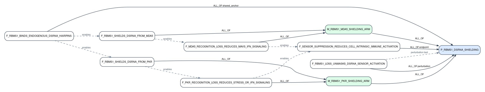

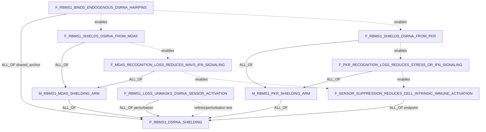

Rationale: RBMS1 was not part of the original five-hypothesis Step0 run. This
added DAG makes the lab hypothesis concrete by separating the shared biochemical
anchor from two sensor arms. The MDA5 arm should be proven with dsRNA occupancy,
MDA5 access, MAVS/IFN, and ISG readouts. The PKR arm should be proven with PKR
binding or activation, eIF2alpha/stress signaling, and antiviral activation
readouts. The RBMS1-loss child is included as a necessary perturbation test so
the claim is not reduced to a correlation between RBMS1 expression and low IFN
signaling.

## Cross-Example Notes

1. Each parent candidate claim uses `ALL_OF` because these are mechanistic
   causal chains where all listed steps are required to prove the exact parent
   hypothesis.
2. Semantic `enables` edges encode causal order but do not roll up truth into
   the parent. The proof rollup is represented only by `claim_decomposition_edges`.
3. Rescue or perturbation children are included where the input hypothesis makes
   an intervention claim. These are especially useful for distinguishing
   correlation from mechanism.
4. Literature BiologicalResults should attach to the most specific child claim
   supported by a paper. One paper can support multiple analyses inside one
   BiologicalResult, but should not inflate the claim count by creating many
   duplicate literature claims.
