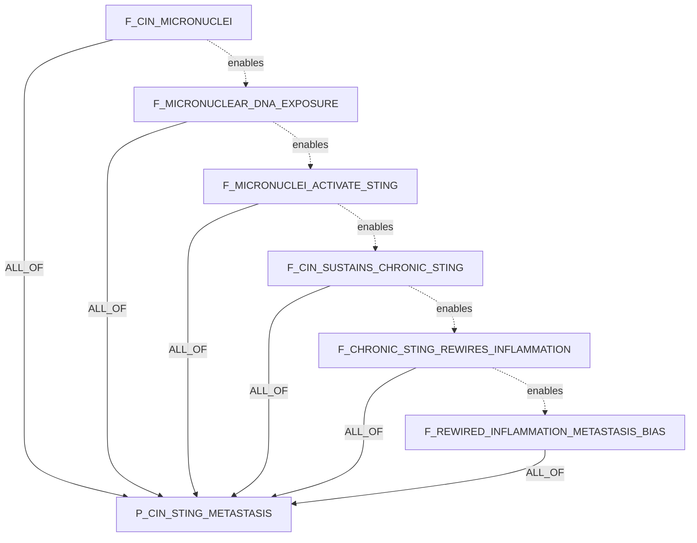
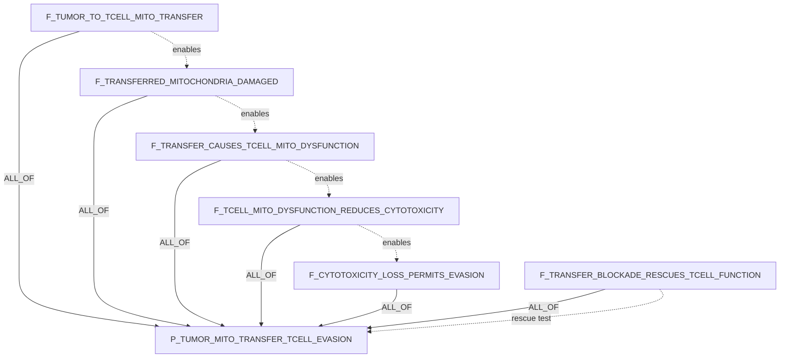
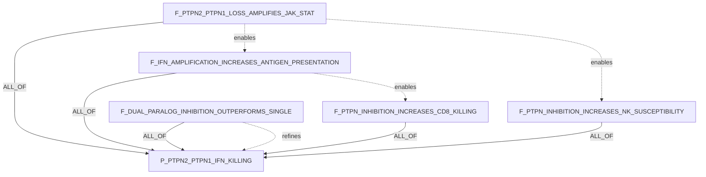
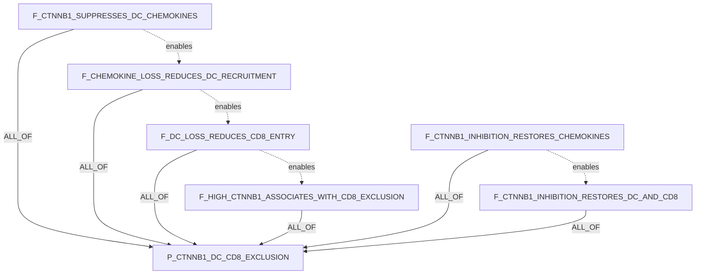
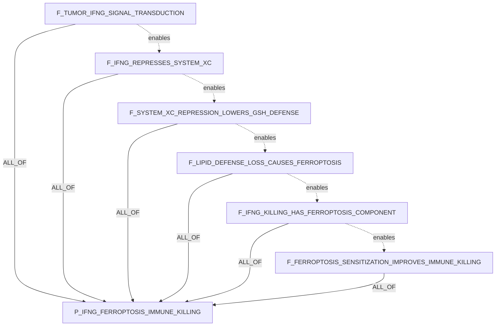

# LLM Step0 Candidate Claim DAG Examples

Date: 2026-06-02

Source run artifact: `/tmp/step0_five_hypotheses_llm_results.json`

Companion audit: `LLM_STEP0_PAPER_HYPOTHESES_DAG2_AUDIT_20260602.md`

These examples mirror the claim-object style used in
`CLAIM_OBJECT_MECHANISM_DAG_EXAMPLES.md`. They convert five live Step0 DAG2
outputs into candidate claim rows, decomposition edges, semantic relations, and
human-readable rationale.

Important scope: these are candidate DAG2 mechanism decompositions, not proven
claims. The live Stage0 LLM compiler generated the DAGs with
`GBD_STAGE0_REQUIRE_DAG2_LLM=1`; deterministic fallback was not used.

## Key

### Claim Fields

| Column | Meaning |
|---|---|
| `ID` | Stable candidate claim id used in formulas and diagrams. |
| `claim_text` | Full biological assertion. |
| `participants` | Role-labeled KG node ids or proposed node ids. |
| `relation_name` | Predicate for the claim. |
| `polarity` | `positive`, `negative`, `bidirectional`, `null`, `unknown`, or SQL `NULL` when sign is not applicable. |
| `context/properties` | Context and non-proof metadata. |

### Edge Fields

| Field | Meaning |
|---|---|
| `source_claim_id -> target_claim_id` | Child/module supports target. |
| `support_operator` | `ALL_OF`, `ANY_OF`, `K_OF_N`, `INDEPENDENT_CAUSES`, or `MUTUALLY_EXCLUSIVE_ALTERNATIVES`. |
| `source_role` | `shared_anchor`, `required_step`, `sufficient_module`, `context_bridge`, or `ordinary_child`. |
| `group_id` | Mechanism/pathway group. |

## Local Reference Context

| File | Local title / citation anchor | DOI |
|---|---|---|
| `ADAR1paper.pdf` | Loss of ADAR1 in tumours overcomes resistance to immune checkpoint blockade | not present in PDF metadata |
| `nature23465.pdf` | CDK4/6 inhibition triggers anti-tumour immunity | `10.1038/nature23465` |
| `s41586-020-2229-5.pdf` | Autophagy promotes immune evasion of pancreatic cancer by degrading MHC-I | `10.1038/s41586-020-2229-5` |
| `s41586-023-06575-7.pdf` | The PTPN2/PTPN1 inhibitor ABBV-CLS-484 unleashes potent anti-tumour immunity | `10.1038/s41586-023-06575-7` |
| `s41580-024-00768-2.pdf` | Profiling cell identity and tissue architecture with single-cell and spatial transcriptomics | `10.1038/s41580-024-00768-2` |
| `cellTree.pdf` | A reference cell tree will serve science better than a reference cell atlas | `10.1016/j.cell.2023.02.016` |
| `cellstates.pdf` | Establishing a conceptual framework for holistic cell states and state transitions | `10.1016/j.cell.2024.04.035` |

Only the PTPN2/PTPN1 example had a directly matching primary local paper in
this folder. The other examples are structurally useful DAG2 decompositions, but
their direct primary literature should be retrieved before treating the child
claims as known evidence.

## 1. Chromosomal Instability / cGAS-STING Metastasis Bias

Hypothesis:

```text
Chromosomal instability causes micronuclei formation and chronic cGAS-STING
signaling, which rewires tumor inflammation toward metastasis rather than
immune clearance.
```

Formula:

```text
P_CIN_STING_METASTASIS =
  F_CIN_MICRONUCLEI AND
  F_MICRONUCLEAR_DNA_EXPOSURE AND
  F_MICRONUCLEI_ACTIVATE_STING AND
  F_CIN_SUSTAINS_CHRONIC_STING AND
  F_CHRONIC_STING_REWIRES_INFLAMMATION AND
  F_REWIRED_INFLAMMATION_METASTASIS_BIAS
```

Claims:

| ID | claim_text | participants | relation_name | polarity | context/properties |
|---|---|---|---|---|---|
| `P_CIN_STING_METASTASIS` | Chromosomal instability promotes a chronic cGAS-STING inflammatory state that biases tumors toward metastasis rather than immune clearance. | process:`BP-chromosomal_instability`; pathway:`PATHWAY-cGAS_STING`; phenotype:`PHENO-metastasis`; phenotype:`PHENO-immune_clearance`; cell_context:`TME-tumor_intrinsic` | `drives_phenotype` | `positive` | parent hypothesis |
| `F_CIN_MICRONUCLEI` | Chromosomal instability in tumor cells increases micronuclei containing missegregated chromosomal DNA. | process:`BP-chromosomal_instability`; structure:`STRUCT-micronucleus`; cell_context:`TME-tumor_intrinsic` | `increases` | `positive` | structural DNA-damage step |
| `F_MICRONUCLEAR_DNA_EXPOSURE` | Micronuclei formed during chromosomal instability expose micronuclear DNA to the cytosol after envelope disruption. | structure:`STRUCT-micronucleus`; material:`DNA-chromosomal`; compartment:`GO-cytosol` | `exposes_to` | `positive` | cytosolic DNA trigger |
| `F_MICRONUCLEI_ACTIVATE_STING` | Cytosol-exposed micronuclear DNA activates cGAS-STING signaling in tumor cells. | material:`DNA-cytosolic`; effector:`CGAS`; pathway:`PATHWAY-STING1_TBK1_IRF3`; cell_context:`TME-tumor_intrinsic` | `activates` | `positive` | pathway activation |
| `F_CIN_SUSTAINS_CHRONIC_STING` | Persistent chromosomal instability sustains chronic rather than transient cGAS-STING signaling. | process:`BP-chromosomal_instability`; pathway:`PATHWAY-cGAS_STING`; temporal_context:`chronic` | `sustains` | `positive` | chronicity requirement |
| `F_CHRONIC_STING_REWIRES_INFLAMMATION` | Chronic STING signaling shifts inflammatory output from immune-clearing programs toward nonresolving pro-metastatic inflammatory programs. | pathway:`PATHWAY-cGAS_STING`; phenotype:`PHENO-pro_metastatic_inflammation`; phenotype:`PHENO-immune_clearance` | `rewires` | `positive` | inflammatory state transition |
| `F_REWIRED_INFLAMMATION_METASTASIS_BIAS` | The chronic STING-driven inflammatory state increases invasion, dissemination, or metastatic outgrowth more than immune-mediated tumor clearance. | phenotype:`PHENO-pro_metastatic_inflammation`; phenotype:`PHENO-metastatic_outgrowth`; phenotype:`PHENO-immune_clearance` | `biases_toward` | `positive` | endpoint |

Decomposition:

| source -> target | operator | source_role | group_id |
|---|---|---|---|
| every `F_*` child -> `P_CIN_STING_METASTASIS` | `ALL_OF` | `required_step` | `cin_sting_chain` |

Semantic claim_relations:

```text
F_CIN_MICRONUCLEI enables F_MICRONUCLEAR_DNA_EXPOSURE
F_MICRONUCLEAR_DNA_EXPOSURE enables F_MICRONUCLEI_ACTIVATE_STING
F_MICRONUCLEI_ACTIVATE_STING enables F_CIN_SUSTAINS_CHRONIC_STING
F_CIN_SUSTAINS_CHRONIC_STING enables F_CHRONIC_STING_REWIRES_INFLAMMATION
F_CHRONIC_STING_REWIRES_INFLAMMATION enables F_REWIRED_INFLAMMATION_METASTASIS_BIAS
```



Rationale: the DAG separates genome-structural damage, cytosolic DNA exposure,
pathway activation, chronic signaling, inflammatory-state rewiring, and the
metastasis-biased endpoint. This is better than a single broad "STING causes
metastasis" claim because each child has a distinct truth condition and
measurable readout.

## 2. Tumor-To-T-Cell Mitochondrial Transfer

Hypothesis:

```text
Tumor cells transfer damaged mitochondria into T cells, causing T-cell
mitochondrial dysfunction and immune evasion; blocking mitochondrial transfer
should restore T-cell cytotoxicity.
```

Formula:

```text
P_TUMOR_MITO_TRANSFER_TCELL_EVASION =
  F_TUMOR_TO_TCELL_MITO_TRANSFER AND
  F_TRANSFERRED_MITOCHONDRIA_DAMAGED AND
  F_TRANSFER_CAUSES_TCELL_MITO_DYSFUNCTION AND
  F_TCELL_MITO_DYSFUNCTION_REDUCES_CYTOTOXICITY AND
  F_CYTOTOXICITY_LOSS_PERMITS_EVASION AND
  F_TRANSFER_BLOCKADE_RESCUES_TCELL_FUNCTION
```

Claims:

| ID | claim_text | participants | relation_name | polarity | context/properties |
|---|---|---|---|---|---|
| `P_TUMOR_MITO_TRANSFER_TCELL_EVASION` | Tumor-to-T-cell transfer of damaged mitochondria impairs T-cell cytotoxicity and promotes tumor immune evasion, while transfer blockade restores cytotoxic function. | source_cell:`TME-tumor_cell`; recipient_cell:`CT-TCELL`; organelle:`GO-mitochondrion`; phenotype:`PHENO-immune_evasion`; phenotype:`PHENO-TCELL_cytotoxicity` | `drives_phenotype` | `positive` | parent hypothesis |
| `F_TUMOR_TO_TCELL_MITO_TRANSFER` | Tumor cells transfer mitochondria into T cells in the tumor microenvironment. | source_cell:`TME-tumor_cell`; recipient_cell:`CT-TCELL`; organelle:`GO-mitochondrion`; location:`TME` | `transfers_to` | `positive` | intercellular transfer step |
| `F_TRANSFERRED_MITOCHONDRIA_DAMAGED` | Tumor-origin mitochondria found in recipient T cells are damaged or dysfunctional. | organelle:`GO-mitochondrion`; phenotype:`PHENO-mitochondrial_damage`; recipient_cell:`CT-TCELL` | `has_observed_property` | SQL `NULL` | cargo state |
| `F_TRANSFER_CAUSES_TCELL_MITO_DYSFUNCTION` | Receipt of tumor-derived damaged mitochondria causes mitochondrial dysfunction in recipient T cells. | organelle:`GO-mitochondrion`; cell_context:`CT-TCELL`; phenotype:`PHENO-mitochondrial_dysfunction` | `causes` | `positive` | recipient-cell state |
| `F_TCELL_MITO_DYSFUNCTION_REDUCES_CYTOTOXICITY` | Mitochondrial dysfunction in T cells reduces tumor-cell killing and cytotoxic effector output. | cell_context:`CT-TCELL`; phenotype:`PHENO-mitochondrial_dysfunction`; phenotype:`PHENO-TCELL_cytotoxicity` | `reduces` | `negative` | effector function |
| `F_CYTOTOXICITY_LOSS_PERMITS_EVASION` | Loss of T-cell cytotoxic function permits increased tumor immune evasion or survival. | cell_context:`CT-TCELL`; phenotype:`PHENO-TCELL_cytotoxicity`; phenotype:`PHENO-immune_evasion` | `permits` | `positive` | endpoint |
| `F_TRANSFER_BLOCKADE_RESCUES_TCELL_FUNCTION` | Blocking tumor-to-T-cell mitochondrial transfer restores T-cell mitochondrial fitness and cytotoxic function. | intervention:`INT-mitochondrial_transfer_blockade`; source_cell:`TME-tumor_cell`; recipient_cell:`CT-TCELL`; phenotype:`PHENO-TCELL_cytotoxicity` | `restores` | `positive` | intervention/rescue |

Decomposition:

| source -> target | operator | source_role | group_id |
|---|---|---|---|
| every `F_*` child -> `P_TUMOR_MITO_TRANSFER_TCELL_EVASION` | `ALL_OF` | `required_step` | `mito_transfer_chain` |

Semantic claim_relations:

```text
F_TUMOR_TO_TCELL_MITO_TRANSFER enables F_TRANSFERRED_MITOCHONDRIA_DAMAGED
F_TRANSFERRED_MITOCHONDRIA_DAMAGED enables F_TRANSFER_CAUSES_TCELL_MITO_DYSFUNCTION
F_TRANSFER_CAUSES_TCELL_MITO_DYSFUNCTION enables F_TCELL_MITO_DYSFUNCTION_REDUCES_CYTOTOXICITY
F_TCELL_MITO_DYSFUNCTION_REDUCES_CYTOTOXICITY enables F_CYTOTOXICITY_LOSS_PERMITS_EVASION
F_TRANSFER_BLOCKADE_RESCUES_TCELL_FUNCTION refutes_if_false P_TUMOR_MITO_TRANSFER_TCELL_EVASION
```



Rationale: the DAG prevents overclaiming by requiring evidence for transfer,
cargo damage, recipient T-cell dysfunction, cytotoxic loss, immune-evasion
outcome, and rescue after blockade. The rescue child is essential because it
distinguishes causal transfer from a correlated exhausted T-cell state.

## 3. PTPN2/PTPN1 Interferon Amplification And Immune Killing

Hypothesis:

```text
PTPN2/PTPN1 act as brakes on JAK-STAT interferon signaling, so dual inhibition
should amplify IFN response, antigen presentation, and NK/CD8 killing.
```

Formula:

```text
P_PTPN2_PTPN1_IFN_KILLING =
  F_PTPN2_PTPN1_LOSS_AMPLIFIES_JAK_STAT AND
  F_IFN_AMPLIFICATION_INCREASES_ANTIGEN_PRESENTATION AND
  F_PTPN_INHIBITION_INCREASES_NK_SUSCEPTIBILITY AND
  F_PTPN_INHIBITION_INCREASES_CD8_KILLING AND
  F_DUAL_PARALOG_INHIBITION_OUTPERFORMS_SINGLE
```

Claims:

| ID | claim_text | participants | relation_name | polarity | context/properties |
|---|---|---|---|---|---|
| `P_PTPN2_PTPN1_IFN_KILLING` | Dual PTPN2/PTPN1 inhibition amplifies interferon-JAK-STAT signaling, antigen presentation, and NK/CD8 tumor killing. | target:`PTPN2`; target:`PTPN1`; pathway:`PATHWAY-interferon_JAK_STAT`; phenotype:`PHENO-antigen_presentation`; immune_cell:`CT-CD8_TCELL`; immune_cell:`CT-NK_CELL` | `increases` | `positive` | parent hypothesis |
| `F_PTPN2_PTPN1_LOSS_AMPLIFIES_JAK_STAT` | Reduced PTPN2/PTPN1 phosphatase activity increases interferon-induced JAK-STAT signaling, including STAT phosphorylation and ISG transcription. | target:`PTPN2`; target:`PTPN1`; pathway:`PATHWAY-interferon_JAK_STAT`; process:`BP-ISG_expression` | `amplifies` | `positive` | proximal pathway |
| `F_IFN_AMPLIFICATION_INCREASES_ANTIGEN_PRESENTATION` | Amplified interferon-JAK-STAT signaling after PTPN2/PTPN1 inhibition increases tumor-cell antigen-processing and MHC-I presentation machinery. | pathway:`PATHWAY-interferon_JAK_STAT`; phenotype:`PHENO-antigen_presentation`; target:`B2M`; target:`TAP1`; target:`HLA_class_I`; cell_context:`TME-tumor_intrinsic` | `upregulates` | `positive` | tumor immune visibility |
| `F_PTPN_INHIBITION_INCREASES_NK_SUSCEPTIBILITY` | PTPN2/PTPN1 inhibition increases tumor susceptibility to NK-cell attack through interferon-linked visibility or cytotoxic-response programs. | target:`PTPN2`; target:`PTPN1`; immune_cell:`CT-NK_CELL`; phenotype:`PHENO-NK_cell_killing` | `increases_susceptibility_to` | `positive` | NK arm |
| `F_PTPN_INHIBITION_INCREASES_CD8_KILLING` | Tumor-cell interferon and antigen-presentation changes caused by PTPN2/PTPN1 inhibition increase CD8 T-cell recognition and cytotoxic killing. | target:`PTPN2`; target:`PTPN1`; immune_cell:`CT-CD8_TCELL`; phenotype:`PHENO-CD8_TCELL_killing`; phenotype:`PHENO-antigen_presentation` | `increases` | `positive` | CD8 arm |
| `F_DUAL_PARALOG_INHIBITION_OUTPERFORMS_SINGLE` | Concurrent inhibition of PTPN2 and PTPN1 produces stronger interferon signaling and immune-visibility phenotypes than inhibiting either phosphatase alone. | target:`PTPN2`; target:`PTPN1`; intervention:`INT-dual_phosphatase_inhibition`; pathway:`PATHWAY-interferon_JAK_STAT` | `has_greater_effect_than` | `positive` | dual-paralog requirement |

Decomposition:

| source -> target | operator | source_role | group_id |
|---|---|---|---|
| every `F_*` child -> `P_PTPN2_PTPN1_IFN_KILLING` | `ALL_OF` | `required_step` | `ptpn_ifn_killing_chain` |

Semantic claim_relations:

```text
F_PTPN2_PTPN1_LOSS_AMPLIFIES_JAK_STAT enables F_IFN_AMPLIFICATION_INCREASES_ANTIGEN_PRESENTATION
F_IFN_AMPLIFICATION_INCREASES_ANTIGEN_PRESENTATION enables F_PTPN_INHIBITION_INCREASES_CD8_KILLING
F_PTPN2_PTPN1_LOSS_AMPLIFIES_JAK_STAT enables F_PTPN_INHIBITION_INCREASES_NK_SUSCEPTIBILITY
F_DUAL_PARALOG_INHIBITION_OUTPERFORMS_SINGLE refines P_PTPN2_PTPN1_IFN_KILLING
```



Rationale: this is the strongest local-paper-backed example in the set. The DAG
keeps the proximal JAK-STAT phosphatase mechanism separate from antigen
presentation, NK susceptibility, CD8 killing, and the dual-paralog requirement.
That prevents the system from proving "PTPN2 works" when the real claim is that
dual PTPN2/PTPN1 inhibition creates stronger tumor immune visibility and killing.

Source: `s41586-023-06575-7.pdf`, DOI `10.1038/s41586-023-06575-7`.

## 4. Tumor-Intrinsic Beta-Catenin / DC Recruitment / T-Cell Exclusion

Hypothesis:

```text
Tumor-intrinsic beta-catenin signaling blocks dendritic-cell recruitment,
causing T-cell exclusion; beta-catenin inhibition should restore DC recruitment
and CD8 entry.
```

Formula:

```text
P_CTNNB1_DC_CD8_EXCLUSION =
  F_CTNNB1_SUPPRESSES_DC_CHEMOKINES AND
  F_CHEMOKINE_LOSS_REDUCES_DC_RECRUITMENT AND
  F_DC_LOSS_REDUCES_CD8_ENTRY AND
  F_HIGH_CTNNB1_ASSOCIATES_WITH_CD8_EXCLUSION AND
  F_CTNNB1_INHIBITION_RESTORES_CHEMOKINES AND
  F_CTNNB1_INHIBITION_RESTORES_DC_AND_CD8
```

Claims:

| ID | claim_text | participants | relation_name | polarity | context/properties |
|---|---|---|---|---|---|
| `P_CTNNB1_DC_CD8_EXCLUSION` | Tumor-intrinsic CTNNB1 signaling suppresses dendritic-cell recruitment and causes CD8 T-cell exclusion, while CTNNB1 inhibition restores DC recruitment and CD8 entry. | effector:`CTNNB1`; immune_cell:`CT-dendritic_cell`; immune_cell:`CT-CD8_TCELL`; phenotype:`PHENO-TCELL_exclusion`; cell_context:`TME-tumor_intrinsic` | `drives_phenotype` | `positive` | parent hypothesis |
| `F_CTNNB1_SUPPRESSES_DC_CHEMOKINES` | Tumor-cell-intrinsic CTNNB1 activation decreases expression or secretion of dendritic-cell-recruiting chemokines. | effector:`CTNNB1`; phenotype:`PHENO-DC_recruiting_chemokine_expression`; cell_context:`TME-tumor_intrinsic` | `suppresses` | `negative` | chemokine mediator |
| `F_CHEMOKINE_LOSS_REDUCES_DC_RECRUITMENT` | Reduced tumor-derived dendritic-cell-recruiting chemokines lower intratumoral dendritic-cell recruitment or abundance. | phenotype:`PHENO-DC_recruiting_chemokine_expression`; immune_cell:`CT-dendritic_cell`; location:`TME` | `reduces` | `negative` | DC recruitment step |
| `F_DC_LOSS_REDUCES_CD8_ENTRY` | Reduced intratumoral dendritic-cell abundance lowers CD8 T-cell priming, recruitment, or entry into tumors. | immune_cell:`CT-dendritic_cell`; immune_cell:`CT-CD8_TCELL`; phenotype:`PHENO-CD8_TCELL_infiltration` | `reduces` | `negative` | immune-cell bridge |
| `F_HIGH_CTNNB1_ASSOCIATES_WITH_CD8_EXCLUSION` | High tumor-cell-intrinsic CTNNB1 signaling is associated with reduced intratumoral CD8 T-cell infiltration. | effector:`CTNNB1`; immune_cell:`CT-CD8_TCELL`; phenotype:`PHENO-TCELL_exclusion`; cell_context:`TME-tumor_intrinsic` | `is_associated_with_outcome` | `positive` | human/tumor context bridge |
| `F_CTNNB1_INHIBITION_RESTORES_CHEMOKINES` | Inhibiting tumor-cell CTNNB1 signaling restores expression or secretion of dendritic-cell-recruiting chemokines. | intervention:`INT-CTNNB1_pathway_inhibition`; effector:`CTNNB1`; phenotype:`PHENO-DC_recruiting_chemokine_expression` | `restores` | `positive` | intervention step |
| `F_CTNNB1_INHIBITION_RESTORES_DC_AND_CD8` | Inhibiting tumor-cell CTNNB1 signaling increases intratumoral dendritic-cell abundance and permits CD8 T-cell entry. | intervention:`INT-CTNNB1_pathway_inhibition`; immune_cell:`CT-dendritic_cell`; immune_cell:`CT-CD8_TCELL`; phenotype:`PHENO-CD8_TCELL_infiltration` | `restores` | `positive` | rescue endpoint |

Decomposition:

| source -> target | operator | source_role | group_id |
|---|---|---|---|
| every `F_*` child -> `P_CTNNB1_DC_CD8_EXCLUSION` | `ALL_OF` | `required_step` | `ctnnb1_dc_cd8_chain` |

Semantic claim_relations:

```text
F_CTNNB1_SUPPRESSES_DC_CHEMOKINES enables F_CHEMOKINE_LOSS_REDUCES_DC_RECRUITMENT
F_CHEMOKINE_LOSS_REDUCES_DC_RECRUITMENT enables F_DC_LOSS_REDUCES_CD8_ENTRY
F_DC_LOSS_REDUCES_CD8_ENTRY enables F_HIGH_CTNNB1_ASSOCIATES_WITH_CD8_EXCLUSION
F_CTNNB1_INHIBITION_RESTORES_CHEMOKINES enables F_CTNNB1_INHIBITION_RESTORES_DC_AND_CD8
```



Rationale: the compiler produced a useful intermediary mediator: tumor-derived
DC-recruiting chemokines. That makes the claim much more testable than a direct
"beta-catenin blocks T cells" statement because L1/L2 can separately evaluate
chemokine expression, dendritic-cell recruitment, CD8 entry, and rescue after
pathway inhibition.

## 5. CD8 T-Cell IFNg / Tumor Ferroptosis / Immune Killing

Hypothesis:

```text
CD8 T-cell IFNg signaling induces tumor-cell ferroptosis by suppressing lipid
antioxidant defenses; increasing tumor ferroptosis sensitivity should improve
immune-mediated tumor killing.
```

Formula:

```text
P_IFNG_FERROPTOSIS_IMMUNE_KILLING =
  F_TUMOR_IFNG_SIGNAL_TRANSDUCTION AND
  F_IFNG_REPRESSES_SYSTEM_XC AND
  F_SYSTEM_XC_REPRESSION_LOWERS_GSH_DEFENSE AND
  F_LIPID_DEFENSE_LOSS_CAUSES_FERROPTOSIS AND
  F_IFNG_KILLING_HAS_FERROPTOSIS_COMPONENT AND
  F_FERROPTOSIS_SENSITIZATION_IMPROVES_IMMUNE_KILLING
```

Claims:

| ID | claim_text | participants | relation_name | polarity | context/properties |
|---|---|---|---|---|---|
| `P_IFNG_FERROPTOSIS_IMMUNE_KILLING` | CD8 T-cell IFNg signaling induces tumor-cell ferroptosis through lipid antioxidant defense suppression, and ferroptosis sensitization improves immune-mediated tumor killing. | immune_cell:`CT-CD8_TCELL`; cytokine:`IFNG`; phenotype:`PHENO-ferroptosis`; phenotype:`PHENO-immune_mediated_tumor_killing`; cell_context:`TME-tumor_intrinsic` | `drives_phenotype` | `positive` | parent hypothesis |
| `F_TUMOR_IFNG_SIGNAL_TRANSDUCTION` | Tumor-cell exposure to IFNg activates tumor-intrinsic IFNGR-JAK-STAT1 signaling. | cytokine:`IFNG`; receptor:`IFNGR1`; pathway:`PATHWAY-JAK_STAT1`; cell_context:`TME-tumor_intrinsic` | `activates` | `positive` | proximal IFNg step |
| `F_IFNG_REPRESSES_SYSTEM_XC` | IFNg signaling represses the tumor-cell cystine import system xCT/SLC7A11-SLC3A2. | cytokine:`IFNG`; target:`SLC7A11`; target:`SLC3A2`; transporter:`SYSTEM-xc_minus` | `represses` | `negative` | cystine import step |
| `F_SYSTEM_XC_REPRESSION_LOWERS_GSH_DEFENSE` | Repression of tumor-cell cystine import lowers glutathione-dependent lipid peroxide detoxification capacity. | transporter:`SYSTEM-xc_minus`; cofactor:`CHEBI-glutathione`; phenotype:`PHENO-lipid_antioxidant_defense` | `reduces` | `negative` | antioxidant defense step |
| `F_LIPID_DEFENSE_LOSS_CAUSES_FERROPTOSIS` | Loss of tumor-cell lipid antioxidant defense causes lipid peroxide accumulation and ferroptotic death. | phenotype:`PHENO-lipid_antioxidant_defense`; metabolite:`CHEBI-lipid_peroxide`; phenotype:`PHENO-ferroptosis` | `causes` | `positive` | ferroptosis execution |
| `F_IFNG_KILLING_HAS_FERROPTOSIS_COMPONENT` | A component of IFNg-induced tumor-cell killing is ferroptosis-dependent rather than solely apoptosis or growth arrest. | cytokine:`IFNG`; phenotype:`PHENO-tumor_cell_death`; phenotype:`PHENO-ferroptosis` | `has_component` | `positive` | causality discriminator |
| `F_FERROPTOSIS_SENSITIZATION_IMPROVES_IMMUNE_KILLING` | Increasing tumor-cell ferroptosis sensitivity enhances immune-mediated tumor killing in the presence of cytotoxic lymphocytes. | intervention:`INT-ferroptosis_sensitization`; phenotype:`PHENO-ferroptosis`; phenotype:`PHENO-immune_mediated_tumor_killing`; immune_cell:`CT-CD8_TCELL` | `enhances` | `positive` | intervention endpoint |

Decomposition:

| source -> target | operator | source_role | group_id |
|---|---|---|---|
| every `F_*` child -> `P_IFNG_FERROPTOSIS_IMMUNE_KILLING` | `ALL_OF` | `required_step` | `ifng_ferroptosis_chain` |

Semantic claim_relations:

```text
F_TUMOR_IFNG_SIGNAL_TRANSDUCTION enables F_IFNG_REPRESSES_SYSTEM_XC
F_IFNG_REPRESSES_SYSTEM_XC enables F_SYSTEM_XC_REPRESSION_LOWERS_GSH_DEFENSE
F_SYSTEM_XC_REPRESSION_LOWERS_GSH_DEFENSE enables F_LIPID_DEFENSE_LOSS_CAUSES_FERROPTOSIS
F_LIPID_DEFENSE_LOSS_CAUSES_FERROPTOSIS enables F_IFNG_KILLING_HAS_FERROPTOSIS_COMPONENT
F_IFNG_KILLING_HAS_FERROPTOSIS_COMPONENT enables F_FERROPTOSIS_SENSITIZATION_IMPROVES_IMMUNE_KILLING
```



Rationale: the DAG adds the key mechanistic bridge through system xc-,
glutathione, and lipid peroxide defense. This prevents the system from treating
"IFNg kills tumor cells" and "ferroptosis happens" as enough; the causal claim
requires a ferroptosis-dependent component of CD8/IFNg-mediated killing plus a
sensitization experiment that improves immune killing.

## Cross-Example Notes

1. Each parent candidate claim uses `ALL_OF` because these are mechanistic
   causal chains where all listed steps are required to prove the exact parent
   hypothesis.
2. Semantic `enables` edges encode causal order but do not roll up truth into
   the parent. The proof rollup is represented only by `claim_decomposition_edges`.
3. Rescue or perturbation children are included where the input hypothesis makes
   an intervention claim. These are especially useful for distinguishing
   correlation from mechanism.
4. Literature BiologicalResults should attach to the most specific child claim
   supported by a paper. One paper can support multiple analyses inside one
   BiologicalResult, but should not inflate the claim count by creating many
   duplicate literature claims.
