# LLM Step0 Candidate Claim DAG Examples

Date: 2026-06-02

Source run artifact for examples 1-5: `/tmp/step0_five_hypotheses_llm_results.json`

Companion audit: `LLM_STEP0_PAPER_HYPOTHESES_DAG2_AUDIT_20260602.md`

These examples mirror the claim-object style used in
`CLAIM_OBJECT_MECHANISM_DAG_EXAMPLES.md`. They convert five live Step0 DAG2
outputs into candidate claim rows, decomposition edges, semantic relations, and
human-readable rationale.

Important scope: these are candidate DAG2 mechanism decompositions, not proven
claims. The "Live Step0 Atomic Rerun" section below is the current
post-fix Step0 output. The later numbered examples are retained as historical
worked examples from the earlier document version; examples 6-7 in that older
section were manually added before the live ADAR1/RBMS1 rerun existed.

Every section includes a Mermaid graph. GitHub renders these blocks as
boxed-arrow DAG images.
Some historical numbered examples also have PNG and SVG files under
`assets/claim_dags/` and embed those images directly. The live rerun section
uses Mermaid blocks generated from the current Step0 artifact.

## Live Step0 Atomic Rerun, 2026-06-03

Run artifact: `/tmp/step0_atomic_claim_dag_rerun_20260603_entity_contract_v5b.json`

This section is the current bounded Step0 DAG2 compiler output after the
entity-contract and participant-completeness fixes. This was a DAG2 compiler
rerun, not an L2/L3 proof-wave run. All five cases below reported
`dag2_generation.mode = llm_claim_specific_dag2_decomposition`; none used
the deterministic fallback.

The tables above each graph now show the claim-object fields that the DAG2
compiler emitted: relation predicate, polarity, role-labeled participants,
context/properties, decomposition edges, and semantic mechanism edges. The
context/properties column is planning metadata, not proof evidence.

Participant correction: immune endpoint claims should carry the relevant
cell-type participants explicitly. Peptide-MHC-I presentation can support CD8
recognition/killing, but it is not NK-killing evidence by itself.

Gene-alias correction: gene/protein participants resolve through the
KG/gene-alias resolver before materialization. In this rerun, MDA5 resolves
to `HGNC:IFIH1`, PKR resolves to `HGNC:EIF2AK2`, ADAR1 resolves to
`HGNC:ADAR`, and CK1alpha resolves to `HGNC:CSNK1A1` when the canonical
candidate gene is supplied.

### ADAR1 / dsRNA Sensing / PD-1 Sensitization

Input hypothesis:

```text
ADAR1 blockade will sensitize tumors to PD-1 therapy by allowing endogenous double-stranded RNA to activate antiviral sensing and tumor inflammation.
```

DAG2 mode: `llm_claim_specific_dag2_decomposition`; child claims: 7; edge operators: `ALL_OF`.

#### Parent Claim Object

| field | value |
|---|---|
| `claim_id` | `P_ADAR1_PD1_SENSITIZATION` |
| `claim_text` | ADAR1 blockade will sensitize tumors to PD-1 therapy by allowing endogenous double-stranded RNA to activate antiviral sensing and tumor inflammation. |
| `relation_name` | `drives_phenotype` |
| `relation_polarity` | `positive` |
| `participants` | perturbed_regulator:`HGNC:ADAR` (canonical_gene_symbol=ADAR; original_label=HGNC:ADAR); therapy_context:`PROPOSED-PDCD1_THERAPY` (proposed_entity_label=PD-1 therapy; requires_entity_row=True) |
| `candidate_gene` | `ADAR` |

#### Claim Rows

| role | claim_text | relation_name | polarity | participants | context/properties |
|---|---|---|---|---|---|
| `mechanism_viral_sensing_module` | One mechanism by which ADAR1 blockade sensitizes tumors to PD-1 therapy is activation of endogenous dsRNA-triggered antiviral sensing in tumor cells. | `describes_mechanism` | `` | mechanism_effector:`HGNC:ADAR` (canonical_gene_symbol=ADAR; original_label=HGNC:ADAR); therapy_context:`PROPOSED-PDCD1_THERAPY` (proposed_entity_label=PD-1 therapy; requires_entity_row=True); mechanism_process:`PROPOSED-ENDOGENOUS_DSRNA_ANTIVIRAL_SENSING_PROGRAM` (proposed_entity_label=endogenous dsRNA-triggered antiviral sensing program; requires_entity_row=True) | scope=mechanism_module; primary_readout=activation of a tumor-intrinsic antiviral sensing program; truth_condition=In the PD-1/PD-L1 therapy context, ADAR perturbation engages a tumor-intrinsic antiviral sensing program attributable to endogenous dsRNA.; why=Reifies the specific mechanistic branch stated in the root claim so downstream steps can be organized without conflating them with the therapy endpoint.; source_mode=llm_claim_specific_dag2_decomposition |
| `mechanism_dsrna_accumulation` | ADAR1 blockade increases the abundance of endogenous immunostimulatory double-stranded RNA in tumor cells. | `perturbation_changes_phenotype` | `positive` | perturbed_regulator:`HGNC:ADAR` (canonical_gene_symbol=ADAR; original_label=HGNC:ADAR); phenotype:`PROPOSED-ENDOGENOUS_DSRNA` (proposed_entity_label=endogenous double-stranded RNA; requires_entity_row=True); cell_context:`PROPOSED-TUMOR_CELL` (proposed_entity_label=tumor cell; requires_entity_row=True) | scope=molecular_signal; primary_readout=endogenous dsRNA abundance; truth_condition=Loss or inhibition of ADAR1 increases cellular endogenous dsRNA signal relative to control in tumor cells.; why=This is the proximal molecular consequence explicitly named by the root claim and should be separated from downstream sensing and inflammation readouts.; source_mode=llm_claim_specific_dag2_decomposition |
| `mechanism_antiviral_sensing_activation` | Accumulated endogenous double-stranded RNA activates antiviral sensing in tumor cells. | `regulates_activity` | `positive` | regulator:`PROPOSED-ENDOGENOUS_DSRNA` (proposed_entity_label=endogenous double-stranded RNA; requires_entity_row=True); regulated_process:`PROPOSED-ANTIVIRAL_DSRNA_SENSING_PATHWAY` (proposed_entity_label=antiviral dsRNA-sensing pathway; requires_entity_row=True); cell_context:`PROPOSED-TUMOR_CELL` (proposed_entity_label=tumor cell; requires_entity_row=True) | scope=molecular_signal; primary_readout=antiviral dsRNA-sensing pathway activity; truth_condition=Higher endogenous dsRNA is accompanied by increased activity of antiviral dsRNA-sensing pathways in tumor cells.; why=Separates the dsRNA accumulation step from the sensing step so the mechanism is not collapsed into one claim.; source_mode=llm_claim_specific_dag2_decomposition |
| `mechanism_tumor_inflammation_induction` | Activation of antiviral sensing in tumor cells induces a tumor inflammatory program. | `drives_phenotype` | `positive` | effector:`PROPOSED-ANTIVIRAL_DSRNA_SENSING_PATHWAY` (proposed_entity_label=antiviral dsRNA-sensing pathway; requires_entity_row=True); phenotype:`PROPOSED-TUMOR_INFLAMMATORY_PROGRAM` (proposed_entity_label=tumor inflammatory program; requires_entity_row=True); cell_context:`PROPOSED-TUMOR_CELL` (proposed_entity_label=tumor cell; requires_entity_row=True) | scope=cell_state; primary_readout=tumor inflammatory program expression; truth_condition=In tumor cells, increased antiviral sensing activity raises inflammatory gene-expression output such as interferon-stimulated or chemokine programs.; why=Captures the inflammation step named in the root claim without yet asserting immune-cell recruitment or therapy response.; source_mode=llm_claim_specific_dag2_decomposition |
| `mechanism_cd8_recruitment` | A tumor inflammatory program increases CD8 T-cell recruitment into the tumor microenvironment. | `regulates_cell_recruitment` | `positive` | regulator:`PROPOSED-TUMOR_INFLAMMATORY_PROGRAM` (proposed_entity_label=tumor inflammatory program; requires_entity_row=True); recruited_cell:`PROPOSED-CD8_T_CELL` (proposed_entity_label=CD8 T cell; requires_entity_row=True); target_compartment:`PROPOSED-TUMOR_MICROENVIRONMENT` (proposed_entity_label=tumor microenvironment; requires_entity_row=True) | scope=immune_effector; primary_readout=intratumoral CD8 T-cell infiltration; truth_condition=Tumors with a stronger inflammatory program show increased intratumoral CD8 T-cell infiltration.; why=Provides a distinct immune-effector consequence of inflammation that can plausibly connect tumor-intrinsic sensing to checkpoint response.; source_mode=llm_claim_specific_dag2_decomposition |
| `mechanism_pd1_response_potentiation` | Increased intratumoral CD8 T-cell infiltration potentiates tumor response to PD-1 therapy. | `modifies_response_to` | `positive` | response_modifier:`PROPOSED-CD8_T_CELL` (proposed_entity_label=CD8 T cell; requires_entity_row=True); therapy:`PROPOSED-PDCD1_THERAPY` (proposed_entity_label=PD-1 therapy; requires_entity_row=True); treatment_response:`PROPOSED-ANTI_PD1_TUMOR_RESPONSE` (proposed_entity_label=tumor response to PD-1 therapy; requires_entity_row=True); context_compartment:`PROPOSED-TUMOR_MICROENVIRONMENT` (proposed_entity_label=tumor microenvironment; requires_entity_row=True) | scope=therapy_endpoint; primary_readout=tumor control under PD-1 therapy; truth_condition=Greater CD8 T-cell infiltration is associated with improved tumor control under PD-1 therapy.; why=Links the immune-inflamed state to the named therapeutic endpoint rather than stopping at inflammation alone.; source_mode=llm_claim_specific_dag2_decomposition |
| `mechanism_root_therapy_endpoint` | ADAR1 blockade sensitizes tumors to PD-1 therapy. | `confers_sensitivity_to` | `positive` | effector:`HGNC:ADAR` (canonical_gene_symbol=ADAR; original_label=HGNC:ADAR); therapy:`PROPOSED-PDCD1_THERAPY` (proposed_entity_label=PD-1 therapy; requires_entity_row=True); disease_entity:`PROPOSED-TUMOR` (proposed_entity_label=tumor; requires_entity_row=True) | scope=therapy_endpoint; primary_readout=improved tumor response under PD-1 therapy; truth_condition=ADAR1 loss or inhibition improves tumor control or response under PD-1/PD-L1 blockade relative to matched control.; why=Keeps the final therapeutic implication as a distinct endpoint claim rather than embedding it inside mechanistic intermediate claims.; source_mode=llm_claim_specific_dag2_decomposition |

#### Decomposition Edges

| source_dag2_role | source_claim_id | target_dag2_role | target_claim_id | support_operator | source_role | group_id |
|---|---|---|---|---|---|---|
| `mechanism_viral_sensing_module` | `P_ADAR1_PD1_SENSITIZATION.stage0.viral_sensing_module` | `parent_claim` | `P_ADAR1_PD1_SENSITIZATION` | `ALL_OF` | `sufficient_module` | `adar1_pd1_main` |
| `mechanism_dsrna_accumulation` | `P_ADAR1_PD1_SENSITIZATION.stage0.adar_blockade_increases_unedited_endogenous_dsRNA` | `mechanism_viral_sensing_module` | `P_ADAR1_PD1_SENSITIZATION.stage0.viral_sensing_module` | `ALL_OF` | `required_step` | `viral_sensing_chain` |
| `mechanism_antiviral_sensing_activation` | `P_ADAR1_PD1_SENSITIZATION.stage0.endogenous_dsRNA_activates_antiviral_sensing` | `mechanism_viral_sensing_module` | `P_ADAR1_PD1_SENSITIZATION.stage0.viral_sensing_module` | `ALL_OF` | `required_step` | `viral_sensing_chain` |
| `mechanism_tumor_inflammation_induction` | `P_ADAR1_PD1_SENSITIZATION.stage0.antiviral_sensing_induces_inflammatory_program` | `mechanism_viral_sensing_module` | `P_ADAR1_PD1_SENSITIZATION.stage0.viral_sensing_module` | `ALL_OF` | `required_step` | `viral_sensing_chain` |
| `mechanism_cd8_recruitment` | `P_ADAR1_PD1_SENSITIZATION.stage0.tumor_inflammation_recruits_cd8_t_cells` | `mechanism_viral_sensing_module` | `P_ADAR1_PD1_SENSITIZATION.stage0.viral_sensing_module` | `ALL_OF` | `required_step` | `viral_sensing_chain` |
| `mechanism_pd1_response_potentiation` | `P_ADAR1_PD1_SENSITIZATION.stage0.cd8_infiltration_potentiates_pd1_response` | `mechanism_viral_sensing_module` | `P_ADAR1_PD1_SENSITIZATION.stage0.viral_sensing_module` | `ALL_OF` | `required_step` | `viral_sensing_chain` |
| `mechanism_root_therapy_endpoint` | `P_ADAR1_PD1_SENSITIZATION.stage0.adar_blockade_sensitizes_to_pd1` | `parent_claim` | `P_ADAR1_PD1_SENSITIZATION` | `ALL_OF` | `ordinary_child` | `adar1_pd1_main` |

#### Semantic Relations

| source_dag2_role | source_claim_id | relation_kind | target_dag2_role | target_claim_id | notes |
|---|---|---|---|---|---|
| `mechanism_dsrna_accumulation` | `P_ADAR1_PD1_SENSITIZATION.stage0.adar_blockade_increases_unedited_endogenous_dsRNA` | `enables` | `mechanism_antiviral_sensing_activation` | `P_ADAR1_PD1_SENSITIZATION.stage0.endogenous_dsRNA_activates_antiviral_sensing` | Endogenous dsRNA accumulation is the proposed upstream trigger for antiviral sensing. |
| `mechanism_antiviral_sensing_activation` | `P_ADAR1_PD1_SENSITIZATION.stage0.endogenous_dsRNA_activates_antiviral_sensing` | `candidate_mechanism_link` | `mechanism_tumor_inflammation_induction` | `P_ADAR1_PD1_SENSITIZATION.stage0.antiviral_sensing_induces_inflammatory_program` | Antiviral sensing is proposed to induce inflammatory transcriptional output. |
| `mechanism_tumor_inflammation_induction` | `P_ADAR1_PD1_SENSITIZATION.stage0.antiviral_sensing_induces_inflammatory_program` | `candidate_mechanism_link` | `mechanism_cd8_recruitment` | `P_ADAR1_PD1_SENSITIZATION.stage0.tumor_inflammation_recruits_cd8_t_cells` | Inflammatory tumor programs can recruit effector T cells into the tumor microenvironment. |
| `mechanism_cd8_recruitment` | `P_ADAR1_PD1_SENSITIZATION.stage0.tumor_inflammation_recruits_cd8_t_cells` | `candidate_mechanism_link` | `mechanism_pd1_response_potentiation` | `P_ADAR1_PD1_SENSITIZATION.stage0.cd8_infiltration_potentiates_pd1_response` | Greater CD8 T-cell presence provides a plausible substrate for improved PD-1 blockade efficacy. |
| `mechanism_viral_sensing_module` | `P_ADAR1_PD1_SENSITIZATION.stage0.viral_sensing_module` | `refines` | `mechanism_root_therapy_endpoint` | `P_ADAR1_PD1_SENSITIZATION.stage0.adar_blockade_sensitizes_to_pd1` | The module specifies the proposed mechanism underlying the therapy sensitization endpoint. |
| `mechanism_viral_sensing_module` | `P_ADAR1_PD1_SENSITIZATION.stage0.viral_sensing_module` | `candidate_mechanism_link` | `mechanism_dsrna_accumulation` | `P_ADAR1_PD1_SENSITIZATION.stage0.adar_blockade_increases_unedited_endogenous_dsRNA` | Stage0 inferred these biological claims as related parts of the grounded mechanism; reviewer/L1 may later split, reorder, strengthen, or retire the semantic link. |
| `mechanism_pd1_response_potentiation` | `P_ADAR1_PD1_SENSITIZATION.stage0.cd8_infiltration_potentiates_pd1_response` | `candidate_mechanism_link` | `mechanism_root_therapy_endpoint` | `P_ADAR1_PD1_SENSITIZATION.stage0.adar_blockade_sensitizes_to_pd1` | Stage0 inferred these biological claims as related parts of the grounded mechanism; reviewer/L1 may later split, reorder, strengthen, or retire the semantic link. |

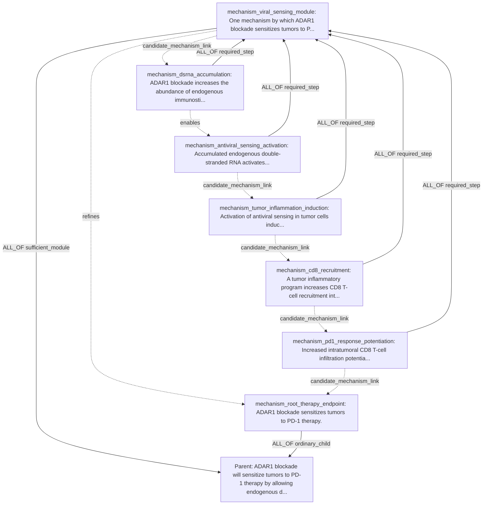

### RBMS1 / Endogenous dsRNA Shielding

Input hypothesis:

```text
RBMS1 binds endogenous dsRNA hairpins and shields them from MDA5 and PKR recognition, preventing activation of antiviral interferon signaling and thereby reducing cell-intrinsic immune activation.
```

DAG2 mode: `llm_claim_specific_dag2_decomposition`; child claims: 8; edge operators: `ALL_OF, ANY_OF`.

#### Parent Claim Object

| field | value |
|---|---|
| `claim_id` | `P_RBMS1_DSRNA_SHIELDING` |
| `claim_text` | RBMS1 binds endogenous dsRNA hairpins and shields them from MDA5 and PKR recognition, preventing activation of antiviral interferon signaling and thereby reducing cell-intrinsic immune activation. |
| `relation_name` | `drives_phenotype` |
| `relation_polarity` | `positive` |
| `participants` | rna_binding_protein:`HGNC:RBMS1` (canonical_gene_symbol=RBMS1; original_label=HGNC:RBMS1); rna_substrate:`PROPOSED-ENDOGENOUS_DSRNA_HAIRPINS` (proposed_entity_label=endogenous dsRNA hairpins; requires_entity_row=True) |
| `candidate_gene` | `RBMS1` |

#### Claim Rows

| role | claim_text | relation_name | polarity | participants | context/properties |
|---|---|---|---|---|---|
| `mechanism_dsrna_binding_step` | RBMS1 physically binds endogenous dsRNA hairpins. | `binds_rna` | `` | binder:`HGNC:RBMS1`; rna_target:`PROPOSED-ENDOGENOUS_DSRNA_HAIRPINS` (proposed_entity_label=endogenous dsRNA hairpins; requires_entity_row=True) | scope=molecular_signal; primary_readout=RBMS1-bound endogenous dsRNA hairpin enrichment; truth_condition=RBMS1-associated RNA is enriched for endogenous dsRNA hairpin species relative to control.; why=This is the proximal substrate-engagement step named explicitly in the root mechanism.; source_mode=llm_claim_specific_dag2_decomposition |
| `mechanism_mda5_shielding_step` | RBMS1 reduces IFIH1/MDA5 association with endogenous dsRNA hairpins. | `modifies_effect_of` | `negative` | modifier:`HGNC:RBMS1`; regulated_sensor:`HGNC:IFIH1` (canonical_gene_symbol=IFIH1; original_label=HGNC:IFIH1); rna_target:`PROPOSED-ENDOGENOUS_DSRNA_HAIRPINS` (proposed_entity_label=endogenous dsRNA hairpins; requires_entity_row=True) | scope=molecular_signal; primary_readout=MDA5-associated endogenous dsRNA hairpin abundance; truth_condition=Increasing RBMS1 lowers MDA5-bound endogenous dsRNA hairpin signal, or RBMS1 loss increases it.; why=The root claim specifically asserts shielding from MDA5 recognition, which is distinct from simple RBMS1-RNA binding.; source_mode=llm_claim_specific_dag2_decomposition |
| `mechanism_pkr_shielding_step` | RBMS1 reduces EIF2AK2/PKR association with endogenous dsRNA hairpins. | `modifies_effect_of` | `negative` | modifier:`HGNC:RBMS1`; regulated_sensor:`HGNC:EIF2AK2` (canonical_gene_symbol=EIF2AK2; original_label=HGNC:EIF2AK2); rna_target:`PROPOSED-ENDOGENOUS_DSRNA_HAIRPINS` (proposed_entity_label=endogenous dsRNA hairpins; requires_entity_row=True) | scope=molecular_signal; primary_readout=PKR-associated endogenous dsRNA hairpin abundance; truth_condition=Increasing RBMS1 lowers PKR-bound endogenous dsRNA hairpin signal, or RBMS1 loss increases it.; why=The root claim separately names shielding from PKR recognition, which should be represented as a distinct mechanism branch from MDA5 shielding.; source_mode=llm_claim_specific_dag2_decomposition |
| `mechanism_mda5_shielding_module` | RBMS1 suppresses antiviral interferon signaling through a MDA5-shielding mechanism. | `describes_mechanism` | `` | effector:`HGNC:RBMS1` (canonical_gene_symbol=RBMS1; original_label=HGNC:RBMS1); sensor:`HGNC:IFIH1` (canonical_gene_symbol=IFIH1; original_label=HGNC:IFIH1); rna_trigger:`PROPOSED-ENDOGENOUS_DSRNA_HAIRPINS` (proposed_entity_label=endogenous dsRNA hairpins; requires_entity_row=True); downstream_pathway:`PROPOSED-ANTIVIRAL_INTERFERON_SIGNALING` (proposed_entity_label=antiviral interferon signaling; requires_entity_row=True) | scope=mechanism_module; primary_readout=interferon-stimulated gene program after RBMS1 perturbation in an MDA5-dependent setting; truth_condition=RBMS1-dependent reduction in antiviral interferon signaling is explained by reduced MDA5 access to endogenous dsRNA hairpins.; why=This reifies one alternative sufficient branch of the root mechanism so downstream signaling can be attached without conflating it with PKR.; source_mode=llm_claim_specific_dag2_decomposition |
| `mechanism_mda5_to_ifn_step` | IFIH1/MDA5 recognition of endogenous dsRNA hairpins increases antiviral interferon signaling. | `regulates_activity` | `positive` | regulator:`HGNC:IFIH1` (canonical_gene_symbol=IFIH1; original_label=HGNC:IFIH1); regulated_pathway:`PROPOSED-ANTIVIRAL_INTERFERON_SIGNALING` (proposed_entity_label=antiviral interferon signaling; requires_entity_row=True); activating_ligand:`PROPOSED-ENDOGENOUS_DSRNA_HAIRPINS` (proposed_entity_label=endogenous dsRNA hairpins; requires_entity_row=True) | scope=molecular_signal; primary_readout=type I interferon / ISG induction; truth_condition=Enhancing MDA5 access to endogenous dsRNA hairpins increases interferon-pathway output, and reducing MDA5 decreases it.; why=This transmits the MDA5 shielding branch to the antiviral interferon endpoint named in the root claim.; source_mode=llm_claim_specific_dag2_decomposition |
| `mechanism_pkr_shielding_module` | RBMS1 suppresses antiviral interferon signaling through a PKR-shielding mechanism. | `describes_mechanism` | `` | effector:`HGNC:RBMS1` (canonical_gene_symbol=RBMS1; original_label=HGNC:RBMS1); sensor:`HGNC:EIF2AK2` (canonical_gene_symbol=EIF2AK2; original_label=HGNC:EIF2AK2); rna_trigger:`PROPOSED-ENDOGENOUS_DSRNA_HAIRPINS` (proposed_entity_label=endogenous dsRNA hairpins; requires_entity_row=True); downstream_pathway:`PROPOSED-ANTIVIRAL_INTERFERON_SIGNALING` (proposed_entity_label=antiviral interferon signaling; requires_entity_row=True) | scope=mechanism_module; primary_readout=interferon-stimulated gene program after RBMS1 perturbation in a PKR-dependent setting; truth_condition=RBMS1-dependent reduction in antiviral interferon signaling is explained by reduced PKR access to endogenous dsRNA hairpins.; why=This reifies the second alternative sufficient branch of the root mechanism so it remains non-overlapping with the MDA5 branch.; source_mode=llm_claim_specific_dag2_decomposition |
| `mechanism_pkr_to_ifn_step` | EIF2AK2/PKR recognition of endogenous dsRNA hairpins increases antiviral interferon signaling. | `regulates_activity` | `positive` | regulator:`HGNC:EIF2AK2` (canonical_gene_symbol=EIF2AK2; original_label=HGNC:EIF2AK2); regulated_pathway:`PROPOSED-ANTIVIRAL_INTERFERON_SIGNALING` (proposed_entity_label=antiviral interferon signaling; requires_entity_row=True); activating_ligand:`PROPOSED-ENDOGENOUS_DSRNA_HAIRPINS` (proposed_entity_label=endogenous dsRNA hairpins; requires_entity_row=True) | scope=molecular_signal; primary_readout=type I interferon / ISG induction; truth_condition=Enhancing PKR access to endogenous dsRNA hairpins increases interferon-pathway output, and reducing PKR decreases it.; why=This transmits the PKR shielding branch to the antiviral interferon endpoint named in the root claim.; source_mode=llm_claim_specific_dag2_decomposition |
| `mechanism_ifn_to_intrinsic_immune_activation_step` | Antiviral interferon signaling increases cell-intrinsic immune activation. | `regulates_cell_state` | `positive` | regulator:`PROPOSED-ANTIVIRAL_INTERFERON_SIGNALING` (proposed_entity_label=antiviral interferon signaling; requires_entity_row=True); regulated_cell_state:`PROPOSED-CELL_INTRINSIC_IMMUNE_ACTIVATION` (proposed_entity_label=cell-intrinsic immune activation; requires_entity_row=True) | scope=cell_state; primary_readout=cell-intrinsic immune activation score; truth_condition=Higher antiviral interferon signaling increases intrinsic immune activation markers in the same cells.; why=This is the final downstream step connecting antiviral interferon signaling to the root endpoint of reduced cell-intrinsic immune activation.; source_mode=llm_claim_specific_dag2_decomposition |

#### Decomposition Edges

| source_dag2_role | source_claim_id | target_dag2_role | target_claim_id | support_operator | source_role | group_id |
|---|---|---|---|---|---|---|
| `mechanism_mda5_shielding_module` | `P_RBMS1_DSRNA_SHIELDING.stage0.mda5_shielding_module` | `parent_claim` | `P_RBMS1_DSRNA_SHIELDING` | `ANY_OF` | `sufficient_module` | `alternative_sensor_shielding_modules` |
| `mechanism_pkr_shielding_module` | `P_RBMS1_DSRNA_SHIELDING.stage0.pkr_shielding_module` | `parent_claim` | `P_RBMS1_DSRNA_SHIELDING` | `ANY_OF` | `sufficient_module` | `alternative_sensor_shielding_modules` |
| `mechanism_ifn_to_intrinsic_immune_activation_step` | `P_RBMS1_DSRNA_SHIELDING.stage0.interferon_signaling_increases_cell_intrinsic_immune_a` | `parent_claim` | `P_RBMS1_DSRNA_SHIELDING` | `ALL_OF` | `required_step` | `shared_downstream_consequence` |
| `mechanism_dsrna_binding_step` | `P_RBMS1_DSRNA_SHIELDING.stage0.rbms1_binds_endogenous_dsrna_hairpins` | `mechanism_mda5_shielding_module` | `P_RBMS1_DSRNA_SHIELDING.stage0.mda5_shielding_module` | `ALL_OF` | `required_step` | `mda5_module_steps` |
| `mechanism_mda5_shielding_step` | `P_RBMS1_DSRNA_SHIELDING.stage0.rbms1_limits_mda5_access_to_endogenous_dsRNA` | `mechanism_mda5_shielding_module` | `P_RBMS1_DSRNA_SHIELDING.stage0.mda5_shielding_module` | `ALL_OF` | `required_step` | `mda5_module_steps` |
| `mechanism_mda5_to_ifn_step` | `P_RBMS1_DSRNA_SHIELDING.stage0.mda5_recognition_activates_interferon_signaling` | `mechanism_mda5_shielding_module` | `P_RBMS1_DSRNA_SHIELDING.stage0.mda5_shielding_module` | `ALL_OF` | `required_step` | `mda5_module_steps` |
| `mechanism_dsrna_binding_step` | `P_RBMS1_DSRNA_SHIELDING.stage0.rbms1_binds_endogenous_dsrna_hairpins` | `mechanism_pkr_shielding_module` | `P_RBMS1_DSRNA_SHIELDING.stage0.pkr_shielding_module` | `ALL_OF` | `required_step` | `pkr_module_steps` |
| `mechanism_pkr_shielding_step` | `P_RBMS1_DSRNA_SHIELDING.stage0.rbms1_limits_pkr_access_to_endogenous_dsRNA` | `mechanism_pkr_shielding_module` | `P_RBMS1_DSRNA_SHIELDING.stage0.pkr_shielding_module` | `ALL_OF` | `required_step` | `pkr_module_steps` |
| `mechanism_pkr_to_ifn_step` | `P_RBMS1_DSRNA_SHIELDING.stage0.pkr_recognition_activates_interferon_signaling` | `mechanism_pkr_shielding_module` | `P_RBMS1_DSRNA_SHIELDING.stage0.pkr_shielding_module` | `ALL_OF` | `required_step` | `pkr_module_steps` |

#### Semantic Relations

| source_dag2_role | source_claim_id | relation_kind | target_dag2_role | target_claim_id | notes |
|---|---|---|---|---|---|
| `mechanism_dsrna_binding_step` | `P_RBMS1_DSRNA_SHIELDING.stage0.rbms1_binds_endogenous_dsrna_hairpins` | `enables` | `mechanism_mda5_shielding_step` | `P_RBMS1_DSRNA_SHIELDING.stage0.rbms1_limits_mda5_access_to_endogenous_dsRNA` | RBMS1 must bind endogenous dsRNA hairpins to physically occlude MDA5 access. |
| `mechanism_dsrna_binding_step` | `P_RBMS1_DSRNA_SHIELDING.stage0.rbms1_binds_endogenous_dsrna_hairpins` | `enables` | `mechanism_pkr_shielding_step` | `P_RBMS1_DSRNA_SHIELDING.stage0.rbms1_limits_pkr_access_to_endogenous_dsRNA` | RBMS1 must bind endogenous dsRNA hairpins to physically occlude PKR access. |
| `mechanism_mda5_shielding_step` | `P_RBMS1_DSRNA_SHIELDING.stage0.rbms1_limits_mda5_access_to_endogenous_dsRNA` | `candidate_mechanism_link` | `mechanism_mda5_to_ifn_step` | `P_RBMS1_DSRNA_SHIELDING.stage0.mda5_recognition_activates_interferon_signaling` | Reduced MDA5 access is proposed to lower downstream antiviral interferon signaling. |
| `mechanism_pkr_shielding_step` | `P_RBMS1_DSRNA_SHIELDING.stage0.rbms1_limits_pkr_access_to_endogenous_dsRNA` | `candidate_mechanism_link` | `mechanism_pkr_to_ifn_step` | `P_RBMS1_DSRNA_SHIELDING.stage0.pkr_recognition_activates_interferon_signaling` | Reduced PKR access is proposed to lower downstream antiviral interferon signaling. |
| `mechanism_mda5_shielding_module` | `P_RBMS1_DSRNA_SHIELDING.stage0.mda5_shielding_module` | `parallel_to` | `mechanism_pkr_shielding_module` | `P_RBMS1_DSRNA_SHIELDING.stage0.pkr_shielding_module` | These are alternative sensor-shielding mechanisms named in the root claim. |
| `mechanism_mda5_to_ifn_step` | `P_RBMS1_DSRNA_SHIELDING.stage0.mda5_recognition_activates_interferon_signaling` | `enables` | `mechanism_ifn_to_intrinsic_immune_activation_step` | `P_RBMS1_DSRNA_SHIELDING.stage0.interferon_signaling_increases_cell_intrinsic_immune_a` | MDA5-driven interferon signaling feeds the downstream intrinsic immune activation state. |
| `mechanism_pkr_to_ifn_step` | `P_RBMS1_DSRNA_SHIELDING.stage0.pkr_recognition_activates_interferon_signaling` | `enables` | `mechanism_ifn_to_intrinsic_immune_activation_step` | `P_RBMS1_DSRNA_SHIELDING.stage0.interferon_signaling_increases_cell_intrinsic_immune_a` | PKR-driven interferon signaling feeds the downstream intrinsic immune activation state. |
| `mechanism_mda5_shielding_step` | `P_RBMS1_DSRNA_SHIELDING.stage0.rbms1_limits_mda5_access_to_endogenous_dsRNA` | `candidate_mechanism_link` | `mechanism_pkr_shielding_step` | `P_RBMS1_DSRNA_SHIELDING.stage0.rbms1_limits_pkr_access_to_endogenous_dsRNA` | Stage0 inferred these biological claims as related parts of the grounded mechanism; reviewer/L1 may later split, reorder, strengthen, or retire the semantic link. |
| `mechanism_pkr_shielding_step` | `P_RBMS1_DSRNA_SHIELDING.stage0.rbms1_limits_pkr_access_to_endogenous_dsRNA` | `candidate_mechanism_link` | `mechanism_mda5_shielding_module` | `P_RBMS1_DSRNA_SHIELDING.stage0.mda5_shielding_module` | Stage0 inferred these biological claims as related parts of the grounded mechanism; reviewer/L1 may later split, reorder, strengthen, or retire the semantic link. |
| `mechanism_mda5_shielding_module` | `P_RBMS1_DSRNA_SHIELDING.stage0.mda5_shielding_module` | `candidate_mechanism_link` | `mechanism_mda5_to_ifn_step` | `P_RBMS1_DSRNA_SHIELDING.stage0.mda5_recognition_activates_interferon_signaling` | Stage0 inferred these biological claims as related parts of the grounded mechanism; reviewer/L1 may later split, reorder, strengthen, or retire the semantic link. |
| `mechanism_mda5_to_ifn_step` | `P_RBMS1_DSRNA_SHIELDING.stage0.mda5_recognition_activates_interferon_signaling` | `candidate_mechanism_link` | `mechanism_pkr_shielding_module` | `P_RBMS1_DSRNA_SHIELDING.stage0.pkr_shielding_module` | Stage0 inferred these biological claims as related parts of the grounded mechanism; reviewer/L1 may later split, reorder, strengthen, or retire the semantic link. |
| `mechanism_pkr_shielding_module` | `P_RBMS1_DSRNA_SHIELDING.stage0.pkr_shielding_module` | `candidate_mechanism_link` | `mechanism_pkr_to_ifn_step` | `P_RBMS1_DSRNA_SHIELDING.stage0.pkr_recognition_activates_interferon_signaling` | Stage0 inferred these biological claims as related parts of the grounded mechanism; reviewer/L1 may later split, reorder, strengthen, or retire the semantic link. |

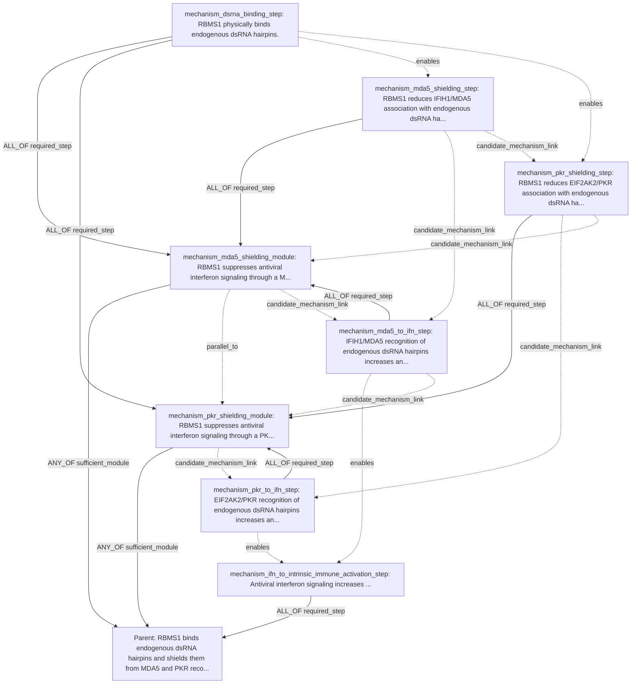

### PTPN2/PTPN1 / IFN, CD8, And NK Killing

Input hypothesis:

```text
PTPN2/PTPN1 act as brakes on JAK-STAT interferon signaling, so dual inhibition should amplify IFN response, antigen presentation, and NK/CD8 killing.
```

DAG2 mode: `llm_claim_specific_dag2_decomposition`; child claims: 8; edge operators: `ALL_OF, ANY_OF`.

#### Parent Claim Object

| field | value |
|---|---|
| `claim_id` | `P_PTPN2_PTPN1_IFN_KILLING` |
| `claim_text` | PTPN2/PTPN1 act as brakes on JAK-STAT interferon signaling, so dual inhibition should amplify IFN response, antigen presentation, and NK/CD8 killing. |
| `relation_name` | `drives_phenotype` |
| `relation_polarity` | `positive` |
| `participants` | negative_regulator:`HGNC:PTPN2` (canonical_gene_symbol=PTPN2; original_label=HGNC:PTPN2); negative_regulator:`HGNC:PTPN1` (canonical_gene_symbol=PTPN1; original_label=HGNC:PTPN1); immune_effector_cell:`PROPOSED-CD8_T_CELL` (proposed_entity_label=CD8 T cell; requires_entity_row=True); immune_effector_cell:`PROPOSED-NK_CELL` (proposed_entity_label=NK cell; requires_entity_row=True); target_cell:`PROPOSED-TUMOR_CELL` (proposed_entity_label=tumor cell; requires_entity_row=True) |
| `candidate_gene` | `PTPN2` |

#### Claim Rows

| role | claim_text | relation_name | polarity | participants | context/properties |
|---|---|---|---|---|---|
| `mechanism_ifn_signal_amplification_module` | One sufficient mechanism for the parent claim is that dual PTPN2/PTPN1 inhibition amplifies tumor-cell interferon signaling. | `describes_mechanism` | `` | negative_regulator:`HGNC:PTPN2` (canonical_gene_symbol=PTPN2; original_label=HGNC:PTPN2); negative_regulator:`HGNC:PTPN1` (canonical_gene_symbol=PTPN1; original_label=HGNC:PTPN1); target_cell:`PROPOSED-TUMOR_CELL` (proposed_entity_label=tumor cell; requires_entity_row=True) | scope=mechanism_module; primary_readout=tumor-cell interferon pathway activation; truth_condition=A perturbation that inhibits both PTPN2 and PTPN1 increases a direct interferon-pathway signaling readout in tumor cells.; why=Reifies the interferon-amplification branch as a distinct mechanism module under the parent.; source_mode=llm_claim_specific_dag2_decomposition |
| `mechanism_antigen_presentation_module` | One sufficient mechanism for the parent claim is that dual PTPN2/PTPN1 inhibition increases tumor-cell antigen presentation to CD8 T cells. | `describes_mechanism` | `` | negative_regulator:`HGNC:PTPN2` (canonical_gene_symbol=PTPN2; original_label=HGNC:PTPN2); negative_regulator:`HGNC:PTPN1` (canonical_gene_symbol=PTPN1; original_label=HGNC:PTPN1); target_cell:`PROPOSED-TUMOR_CELL` (proposed_entity_label=tumor cell; requires_entity_row=True); immune_effector_cell:`PROPOSED-CD8_T_CELL` (proposed_entity_label=CD8 T cell; requires_entity_row=True) | scope=mechanism_module; primary_readout=tumor-cell peptide-MHC-I presentation; truth_condition=A perturbation that inhibits both PTPN2 and PTPN1 increases a direct peptide-MHC-I antigen-presentation readout in tumor cells.; why=Separates antigen-presentation biology from upstream interferon signaling and downstream killing.; source_mode=llm_claim_specific_dag2_decomposition |
| `mechanism_nk_killing_module` | One sufficient mechanism for the parent claim is that dual PTPN2/PTPN1 inhibition increases tumor susceptibility to NK-cell-mediated killing. | `describes_mechanism` | `` | negative_regulator:`HGNC:PTPN2` (canonical_gene_symbol=PTPN2; original_label=HGNC:PTPN2); negative_regulator:`HGNC:PTPN1` (canonical_gene_symbol=PTPN1; original_label=HGNC:PTPN1); target_cell:`PROPOSED-TUMOR_CELL` (proposed_entity_label=tumor cell; requires_entity_row=True); immune_effector_cell:`PROPOSED-NK_CELL` (proposed_entity_label=NK cell; requires_entity_row=True) | scope=mechanism_module; primary_readout=NK-cell-mediated tumor killing; truth_condition=A perturbation that inhibits both PTPN2 and PTPN1 increases a direct NK-mediated tumor-cell killing readout.; why=Keeps NK-specific killing distinct from CD8 visibility and generic interferon signaling.; source_mode=llm_claim_specific_dag2_decomposition |
| `mechanism_dual_inhibition_increases_tumor_stat_activity` | Dual inhibition of PTPN2 and PTPN1 increases interferon-stimulated STAT activity in tumor cells. | `perturbation_changes_phenotype` | `positive` | perturbed_gene:`HGNC:PTPN2` (canonical_gene_symbol=PTPN2; original_label=HGNC:PTPN2); perturbed_gene:`HGNC:PTPN1` (canonical_gene_symbol=PTPN1; original_label=HGNC:PTPN1); target_cell:`PROPOSED-TUMOR_CELL` (proposed_entity_label=tumor cell; requires_entity_row=True); phenotype:`PROPOSED-INTERFERON_SIGNALING_STATE` (proposed_entity_label=interferon-stimulated STAT activity; requires_entity_row=True) | scope=molecular_signal; primary_readout=STAT phosphorylation or IFN-responsive reporter activity; truth_condition=Compared with control, combined PTPN2/PTPN1 inhibition increases a direct STAT phosphorylation or transcriptional reporter readout after interferon stimulation in tumor cells.; why=Captures the core upstream signaling consequence asserted by the root claim.; source_mode=llm_claim_specific_dag2_decomposition |
| `mechanism_tumor_ifn_signaling_induces_ifn_response_genes` | In tumor cells, increased interferon signaling induces interferon-response gene expression. | `transcriptionally_regulates` | `positive` | regulator_state:`PROPOSED-INTERFERON_SIGNALING_STATE` (proposed_entity_label=interferon-stimulated STAT activity; requires_entity_row=True); target_program:`PROPOSED-IFN_RESPONSE_GENE_PROGRAM` (proposed_entity_label=interferon-response gene program; requires_entity_row=True); context_cell:`PROPOSED-TUMOR_CELL` (proposed_entity_label=tumor cell; requires_entity_row=True) | scope=cell_state; primary_readout=interferon-stimulated gene expression; truth_condition=Across matched perturbation conditions, higher tumor-cell interferon signaling is accompanied by increased expression of interferon-stimulated genes.; why=Separates immediate pathway activation from downstream transcriptional IFN response.; source_mode=llm_claim_specific_dag2_decomposition |
| `mechanism_tumor_ifn_signaling_increases_mhc1_presentation` | In tumor cells, increased interferon signaling increases peptide-MHC-I antigen presentation. | `perturbation_changes_phenotype` | `positive` | upstream_state:`PROPOSED-INTERFERON_SIGNALING_STATE` (proposed_entity_label=interferon-stimulated STAT activity; requires_entity_row=True); target_cell:`PROPOSED-TUMOR_CELL` (proposed_entity_label=tumor cell; requires_entity_row=True); phenotype:`PROPOSED-PEPTIDE_MHC_I_PRESENTATION` (proposed_entity_label=peptide-MHC-I antigen presentation; requires_entity_row=True) | scope=cell_state; primary_readout=cell-surface peptide-MHC-I presentation; truth_condition=Across matched perturbation conditions, higher tumor-cell interferon signaling increases a direct cell-surface peptide-MHC-I presentation readout.; why=Provides the mechanistic bridge from interferon signaling to CD8-relevant immune visibility.; source_mode=llm_claim_specific_dag2_decomposition |
| `mechanism_mhc1_presentation_permits_cd8_killing` | Tumor-cell peptide-MHC-I antigen presentation permits CD8 T-cell-mediated tumor killing. | `permits` | `positive` | permissive_state:`PROPOSED-PEPTIDE_MHC_I_PRESENTATION` (proposed_entity_label=peptide-MHC-I antigen presentation; requires_entity_row=True); immune_effector_cell:`PROPOSED-CD8_T_CELL` (proposed_entity_label=CD8 T cell; requires_entity_row=True); target_cell:`PROPOSED-TUMOR_CELL` (proposed_entity_label=tumor cell; requires_entity_row=True); phenotype:`PROPOSED-CD8_TUMOR_KILLING` (proposed_entity_label=CD8 T-cell-mediated tumor killing; requires_entity_row=True) | scope=immune_effector; primary_readout=CD8 T-cell-mediated tumor killing; truth_condition=Reducing peptide-MHC-I presentation diminishes CD8 T-cell-mediated tumor-cell killing in the matched system.; why=Links antigen presentation specifically to CD8 effector function without conflating it with NK biology.; source_mode=llm_claim_specific_dag2_decomposition |
| `mechanism_dual_inhibition_increases_nk_tumor_killing` | Dual inhibition of PTPN2 and PTPN1 increases NK-cell-mediated killing of tumor cells. | `perturbation_changes_phenotype` | `positive` | perturbed_gene:`HGNC:PTPN2` (canonical_gene_symbol=PTPN2; original_label=HGNC:PTPN2); perturbed_gene:`HGNC:PTPN1` (canonical_gene_symbol=PTPN1; original_label=HGNC:PTPN1); immune_effector_cell:`PROPOSED-NK_CELL` (proposed_entity_label=NK cell; requires_entity_row=True); target_cell:`PROPOSED-TUMOR_CELL` (proposed_entity_label=tumor cell; requires_entity_row=True); phenotype:`PROPOSED-NK_TUMOR_KILLING` (proposed_entity_label=NK-cell-mediated tumor killing; requires_entity_row=True) | scope=immune_effector; primary_readout=NK-cell-mediated tumor killing; truth_condition=Compared with control, combined PTPN2/PTPN1 inhibition increases direct NK-cell cytotoxicity against tumor cells in co-culture or in vivo.; why=Captures the NK arm as a distinct endpoint branch rather than inferring it from MHC-I or generic IFN readouts.; source_mode=llm_claim_specific_dag2_decomposition |

#### Decomposition Edges

| source_dag2_role | source_claim_id | target_dag2_role | target_claim_id | support_operator | source_role | group_id |
|---|---|---|---|---|---|---|
| `mechanism_ifn_signal_amplification_module` | `P_PTPN2_PTPN1_IFN_KILLING.stage0.ifn_signal_amplification_module` | `parent_claim` | `P_PTPN2_PTPN1_IFN_KILLING` | `ANY_OF` | `sufficient_module` | `root_alternative_mechanisms` |
| `mechanism_antigen_presentation_module` | `P_PTPN2_PTPN1_IFN_KILLING.stage0.antigen_presentation_module` | `parent_claim` | `P_PTPN2_PTPN1_IFN_KILLING` | `ANY_OF` | `sufficient_module` | `root_alternative_mechanisms` |
| `mechanism_nk_killing_module` | `P_PTPN2_PTPN1_IFN_KILLING.stage0.nk_killing_module` | `parent_claim` | `P_PTPN2_PTPN1_IFN_KILLING` | `ANY_OF` | `sufficient_module` | `root_alternative_mechanisms` |
| `mechanism_dual_inhibition_increases_tumor_stat_activity` | `P_PTPN2_PTPN1_IFN_KILLING.stage0.dual_inhibition_increases_tumor_stat_activity` | `mechanism_ifn_signal_amplification_module` | `P_PTPN2_PTPN1_IFN_KILLING.stage0.ifn_signal_amplification_module` | `ALL_OF` | `required_step` | `ifn_signal_branch` |
| `mechanism_tumor_ifn_signaling_induces_ifn_response_genes` | `P_PTPN2_PTPN1_IFN_KILLING.stage0.tumor_ifn_signaling_induces_ifn_response_genes` | `mechanism_ifn_signal_amplification_module` | `P_PTPN2_PTPN1_IFN_KILLING.stage0.ifn_signal_amplification_module` | `ALL_OF` | `required_step` | `ifn_signal_branch` |
| `mechanism_tumor_ifn_signaling_increases_mhc1_presentation` | `P_PTPN2_PTPN1_IFN_KILLING.stage0.tumor_ifn_signaling_increases_mhc1_presentation` | `mechanism_antigen_presentation_module` | `P_PTPN2_PTPN1_IFN_KILLING.stage0.antigen_presentation_module` | `ALL_OF` | `required_step` | `antigen_presentation_branch` |
| `mechanism_mhc1_presentation_permits_cd8_killing` | `P_PTPN2_PTPN1_IFN_KILLING.stage0.mhc1_presentation_permits_cd8_killing` | `mechanism_antigen_presentation_module` | `P_PTPN2_PTPN1_IFN_KILLING.stage0.antigen_presentation_module` | `ALL_OF` | `required_step` | `antigen_presentation_branch` |
| `mechanism_dual_inhibition_increases_nk_tumor_killing` | `P_PTPN2_PTPN1_IFN_KILLING.stage0.dual_inhibition_increases_nk_tumor_killing` | `mechanism_nk_killing_module` | `P_PTPN2_PTPN1_IFN_KILLING.stage0.nk_killing_module` | `ALL_OF` | `required_step` | `nk_killing_branch` |

#### Semantic Relations

| source_dag2_role | source_claim_id | relation_kind | target_dag2_role | target_claim_id | notes |
|---|---|---|---|---|---|
| `mechanism_dual_inhibition_increases_tumor_stat_activity` | `P_PTPN2_PTPN1_IFN_KILLING.stage0.dual_inhibition_increases_tumor_stat_activity` | `enables` | `mechanism_tumor_ifn_signaling_induces_ifn_response_genes` | `P_PTPN2_PTPN1_IFN_KILLING.stage0.tumor_ifn_signaling_induces_ifn_response_genes` | Upstream interferon-pathway activation can drive IFN-response transcription. |
| `mechanism_dual_inhibition_increases_tumor_stat_activity` | `P_PTPN2_PTPN1_IFN_KILLING.stage0.dual_inhibition_increases_tumor_stat_activity` | `enables` | `mechanism_tumor_ifn_signaling_increases_mhc1_presentation` | `P_PTPN2_PTPN1_IFN_KILLING.stage0.tumor_ifn_signaling_increases_mhc1_presentation` | Amplified interferon signaling can increase tumor antigen-presentation machinery. |
| `mechanism_tumor_ifn_signaling_increases_mhc1_presentation` | `P_PTPN2_PTPN1_IFN_KILLING.stage0.tumor_ifn_signaling_increases_mhc1_presentation` | `enables` | `mechanism_mhc1_presentation_permits_cd8_killing` | `P_PTPN2_PTPN1_IFN_KILLING.stage0.mhc1_presentation_permits_cd8_killing` | Peptide-MHC-I presentation is a permissive prerequisite for CD8 recognition and killing. |
| `mechanism_antigen_presentation_module` | `P_PTPN2_PTPN1_IFN_KILLING.stage0.antigen_presentation_module` | `parallel_to` | `mechanism_nk_killing_module` | `P_PTPN2_PTPN1_IFN_KILLING.stage0.nk_killing_module` | CD8-visibility and NK-killing are distinct downstream immune-effector branches. |
| `mechanism_ifn_signal_amplification_module` | `P_PTPN2_PTPN1_IFN_KILLING.stage0.ifn_signal_amplification_module` | `candidate_mechanism_link` | `mechanism_antigen_presentation_module` | `P_PTPN2_PTPN1_IFN_KILLING.stage0.antigen_presentation_module` | Antigen-presentation changes may arise downstream of amplified interferon signaling, but the module is kept distinct from the upstream signaling readout. |
| `mechanism_nk_killing_module` | `P_PTPN2_PTPN1_IFN_KILLING.stage0.nk_killing_module` | `candidate_mechanism_link` | `mechanism_dual_inhibition_increases_tumor_stat_activity` | `P_PTPN2_PTPN1_IFN_KILLING.stage0.dual_inhibition_increases_tumor_stat_activity` | Stage0 inferred these biological claims as related parts of the grounded mechanism; reviewer/L1 may later split, reorder, strengthen, or retire the semantic link. |
| `mechanism_tumor_ifn_signaling_induces_ifn_response_genes` | `P_PTPN2_PTPN1_IFN_KILLING.stage0.tumor_ifn_signaling_induces_ifn_response_genes` | `candidate_mechanism_link` | `mechanism_tumor_ifn_signaling_increases_mhc1_presentation` | `P_PTPN2_PTPN1_IFN_KILLING.stage0.tumor_ifn_signaling_increases_mhc1_presentation` | Stage0 inferred these biological claims as related parts of the grounded mechanism; reviewer/L1 may later split, reorder, strengthen, or retire the semantic link. |
| `mechanism_mhc1_presentation_permits_cd8_killing` | `P_PTPN2_PTPN1_IFN_KILLING.stage0.mhc1_presentation_permits_cd8_killing` | `candidate_mechanism_link` | `mechanism_dual_inhibition_increases_nk_tumor_killing` | `P_PTPN2_PTPN1_IFN_KILLING.stage0.dual_inhibition_increases_nk_tumor_killing` | Stage0 inferred these biological claims as related parts of the grounded mechanism; reviewer/L1 may later split, reorder, strengthen, or retire the semantic link. |

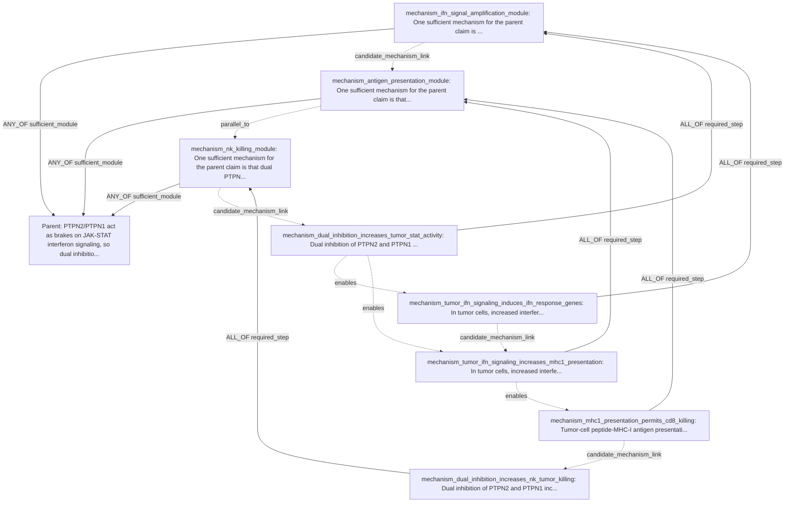

### Ferroptosis Suppression Alternatives

Input hypothesis:

```text
Cells suppress ferroptosis by detoxifying lipid peroxides or lipid radicals.
```

DAG2 mode: `llm_claim_specific_dag2_decomposition`; child claims: 6; edge operators: `ALL_OF, ANY_OF`.

#### Parent Claim Object

| field | value |
|---|---|
| `claim_id` | `P_FERROPTOSIS_LIPID_DETOX` |
| `claim_text` | Cells suppress ferroptosis by detoxifying lipid peroxides or lipid radicals. |
| `relation_name` | `drives_phenotype` |
| `relation_polarity` | `positive` |
| `participants` | cell_death_process:`PROPOSED-FERROPTOSIS` (proposed_entity_label=ferroptosis; requires_entity_row=True); toxic_lipid_species:`PROPOSED-LIPID_PEROXIDES` (proposed_entity_label=lipid peroxides; requires_entity_row=True); toxic_lipid_species:`PROPOSED-LIPID_RADICALS` (proposed_entity_label=lipid radicals; requires_entity_row=True) |
| `candidate_gene` | `` |

#### Claim Rows

| role | claim_text | relation_name | polarity | participants | context/properties |
|---|---|---|---|---|---|
| `mechanism_lipid_peroxide_detox_module` | Detoxification of lipid peroxides is a sufficient mechanism by which cells suppress ferroptosis. | `describes_mechanism` | `` | mechanistic_intermediate:`PROPOSED-LIPID_PEROXIDES` (proposed_entity_label=LIPID_PEROXIDES; requires_entity_row=True); phenotype:`PROPOSED-FERROPTOSIS` (proposed_entity_label=FERROPTOSIS; requires_entity_row=True) | scope=mechanism_module; primary_readout=cellular lipid peroxide abundance; truth_condition=A decrease in cellular lipid peroxide burden is directionally linked to reduced ferroptotic cell death.; why=The root claim states an alternative mechanism branch centered on lipid peroxide detoxification.; source_mode=llm_claim_specific_dag2_decomposition |
| `mechanism_lipid_radical_detox_module` | Detoxification of lipid radicals is a sufficient mechanism by which cells suppress ferroptosis. | `describes_mechanism` | `` | mechanistic_intermediate:`PROPOSED-LIPID_RADICALS` (proposed_entity_label=LIPID_RADICALS; requires_entity_row=True); phenotype:`PROPOSED-FERROPTOSIS` (proposed_entity_label=FERROPTOSIS; requires_entity_row=True) | scope=mechanism_module; primary_readout=cellular lipid radical abundance; truth_condition=A decrease in cellular lipid radical burden is directionally linked to reduced ferroptotic cell death.; why=The root claim explicitly includes lipid radical detoxification as an alternative mechanism branch.; source_mode=llm_claim_specific_dag2_decomposition |
| `mechanism_reduced_lipid_peroxides` | Lower cellular lipid peroxide abundance suppresses ferroptosis. | `perturbation_changes_phenotype` | `negative` | subject:`PROPOSED-LIPID_PEROXIDES` (proposed_entity_label=LIPID_PEROXIDES; requires_entity_row=True); phenotype:`PROPOSED-FERROPTOSIS` (proposed_entity_label=FERROPTOSIS; requires_entity_row=True) | scope=cell_state; primary_readout=ferroptotic cell death; truth_condition=When lipid peroxide levels are reduced, ferroptotic cell death decreases in the same cellular context.; why=This captures the causal consequence of lowering lipid peroxides on the endpoint without restating a specific detox chemistry.; source_mode=llm_claim_specific_dag2_decomposition |
| `mechanism_detox_process_lowers_lipid_peroxides` | Cellular lipid peroxide detoxification decreases lipid peroxide abundance. | `perturbation_changes_phenotype` | `negative` | subject:`PROPOSED-LIPID_PEROXIDE_DETOXIFICATION` (proposed_entity_label=lipid peroxide detoxification; requires_entity_row=True); phenotype:`PROPOSED-LIPID_PEROXIDES` (proposed_entity_label=LIPID_PEROXIDES; requires_entity_row=True) | scope=molecular_signal; primary_readout=cellular lipid peroxide abundance; truth_condition=Activation or presence of a lipid peroxide detoxification process lowers measured lipid peroxide levels.; why=This is the upstream mechanistic step that defines the lipid peroxide detoxification branch.; source_mode=llm_claim_specific_dag2_decomposition |
| `mechanism_reduced_lipid_radicals` | Lower cellular lipid radical abundance suppresses ferroptosis. | `perturbation_changes_phenotype` | `negative` | subject:`PROPOSED-LIPID_RADICALS` (proposed_entity_label=LIPID_RADICALS; requires_entity_row=True); phenotype:`PROPOSED-FERROPTOSIS` (proposed_entity_label=FERROPTOSIS; requires_entity_row=True) | scope=cell_state; primary_readout=ferroptotic cell death; truth_condition=When lipid radical levels are reduced, ferroptotic cell death decreases in the same cellular context.; why=This captures the causal consequence of lowering lipid radicals on ferroptosis as a distinct branch from lipid peroxide detoxification.; source_mode=llm_claim_specific_dag2_decomposition |
| `mechanism_detox_process_lowers_lipid_radicals` | Cellular lipid radical detoxification decreases lipid radical abundance. | `perturbation_changes_phenotype` | `negative` | subject:`PROPOSED-LIPID_RADICAL_DETOXIFICATION` (proposed_entity_label=lipid radical detoxification; requires_entity_row=True); phenotype:`PROPOSED-LIPID_RADICALS` (proposed_entity_label=LIPID_RADICALS; requires_entity_row=True) | scope=molecular_signal; primary_readout=cellular lipid radical abundance; truth_condition=Activation or presence of a lipid radical detoxification process lowers measured lipid radical levels.; why=This is the upstream mechanistic step that defines the lipid radical detoxification branch.; source_mode=llm_claim_specific_dag2_decomposition |

#### Decomposition Edges

| source_dag2_role | source_claim_id | target_dag2_role | target_claim_id | support_operator | source_role | group_id |
|---|---|---|---|---|---|---|
| `mechanism_lipid_peroxide_detox_module` | `P_FERROPTOSIS_LIPID_DETOX.stage0.lipid_peroxide_detox_module` | `parent_claim` | `P_FERROPTOSIS_LIPID_DETOX` | `ANY_OF` | `sufficient_module` | `ferroptosis_lipid_detox_alternatives` |
| `mechanism_lipid_radical_detox_module` | `P_FERROPTOSIS_LIPID_DETOX.stage0.lipid_radical_detox_module` | `parent_claim` | `P_FERROPTOSIS_LIPID_DETOX` | `ANY_OF` | `sufficient_module` | `ferroptosis_lipid_detox_alternatives` |
| `mechanism_detox_process_lowers_lipid_peroxides` | `P_FERROPTOSIS_LIPID_DETOX.stage0.detox_process_lowers_lipid_peroxides` | `mechanism_lipid_peroxide_detox_module` | `P_FERROPTOSIS_LIPID_DETOX.stage0.lipid_peroxide_detox_module` | `ALL_OF` | `required_step` | `lipid_peroxide_detox_branch` |
| `mechanism_reduced_lipid_peroxides` | `P_FERROPTOSIS_LIPID_DETOX.stage0.reduced_lipid_peroxides` | `mechanism_lipid_peroxide_detox_module` | `P_FERROPTOSIS_LIPID_DETOX.stage0.lipid_peroxide_detox_module` | `ALL_OF` | `required_step` | `lipid_peroxide_detox_branch` |
| `mechanism_detox_process_lowers_lipid_radicals` | `P_FERROPTOSIS_LIPID_DETOX.stage0.detox_process_lowers_lipid_radicals` | `mechanism_lipid_radical_detox_module` | `P_FERROPTOSIS_LIPID_DETOX.stage0.lipid_radical_detox_module` | `ALL_OF` | `required_step` | `lipid_radical_detox_branch` |
| `mechanism_reduced_lipid_radicals` | `P_FERROPTOSIS_LIPID_DETOX.stage0.reduced_lipid_radicals` | `mechanism_lipid_radical_detox_module` | `P_FERROPTOSIS_LIPID_DETOX.stage0.lipid_radical_detox_module` | `ALL_OF` | `required_step` | `lipid_radical_detox_branch` |

#### Semantic Relations

| source_dag2_role | source_claim_id | relation_kind | target_dag2_role | target_claim_id | notes |
|---|---|---|---|---|---|
| `mechanism_detox_process_lowers_lipid_peroxides` | `P_FERROPTOSIS_LIPID_DETOX.stage0.detox_process_lowers_lipid_peroxides` | `enables` | `mechanism_reduced_lipid_peroxides` | `P_FERROPTOSIS_LIPID_DETOX.stage0.reduced_lipid_peroxides` | Lowering lipid peroxide abundance is the mechanistic intermediate linking detoxification to ferroptosis suppression. |
| `mechanism_detox_process_lowers_lipid_radicals` | `P_FERROPTOSIS_LIPID_DETOX.stage0.detox_process_lowers_lipid_radicals` | `enables` | `mechanism_reduced_lipid_radicals` | `P_FERROPTOSIS_LIPID_DETOX.stage0.reduced_lipid_radicals` | Lowering lipid radical abundance is the mechanistic intermediate linking detoxification to ferroptosis suppression. |
| `mechanism_lipid_peroxide_detox_module` | `P_FERROPTOSIS_LIPID_DETOX.stage0.lipid_peroxide_detox_module` | `parallel_to` | `mechanism_lipid_radical_detox_module` | `P_FERROPTOSIS_LIPID_DETOX.stage0.lipid_radical_detox_module` | These are alternative non-overlapping mechanism branches stated by the root claim. |
| `mechanism_lipid_radical_detox_module` | `P_FERROPTOSIS_LIPID_DETOX.stage0.lipid_radical_detox_module` | `candidate_mechanism_link` | `mechanism_reduced_lipid_peroxides` | `P_FERROPTOSIS_LIPID_DETOX.stage0.reduced_lipid_peroxides` | Stage0 inferred these biological claims as related parts of the grounded mechanism; reviewer/L1 may later split, reorder, strengthen, or retire the semantic link. |
| `mechanism_reduced_lipid_peroxides` | `P_FERROPTOSIS_LIPID_DETOX.stage0.reduced_lipid_peroxides` | `candidate_mechanism_link` | `mechanism_detox_process_lowers_lipid_peroxides` | `P_FERROPTOSIS_LIPID_DETOX.stage0.detox_process_lowers_lipid_peroxides` | Stage0 inferred these biological claims as related parts of the grounded mechanism; reviewer/L1 may later split, reorder, strengthen, or retire the semantic link. |
| `mechanism_detox_process_lowers_lipid_peroxides` | `P_FERROPTOSIS_LIPID_DETOX.stage0.detox_process_lowers_lipid_peroxides` | `candidate_mechanism_link` | `mechanism_reduced_lipid_radicals` | `P_FERROPTOSIS_LIPID_DETOX.stage0.reduced_lipid_radicals` | Stage0 inferred these biological claims as related parts of the grounded mechanism; reviewer/L1 may later split, reorder, strengthen, or retire the semantic link. |
| `mechanism_reduced_lipid_radicals` | `P_FERROPTOSIS_LIPID_DETOX.stage0.reduced_lipid_radicals` | `candidate_mechanism_link` | `mechanism_detox_process_lowers_lipid_radicals` | `P_FERROPTOSIS_LIPID_DETOX.stage0.detox_process_lowers_lipid_radicals` | Stage0 inferred these biological claims as related parts of the grounded mechanism; reviewer/L1 may later split, reorder, strengthen, or retire the semantic link. |

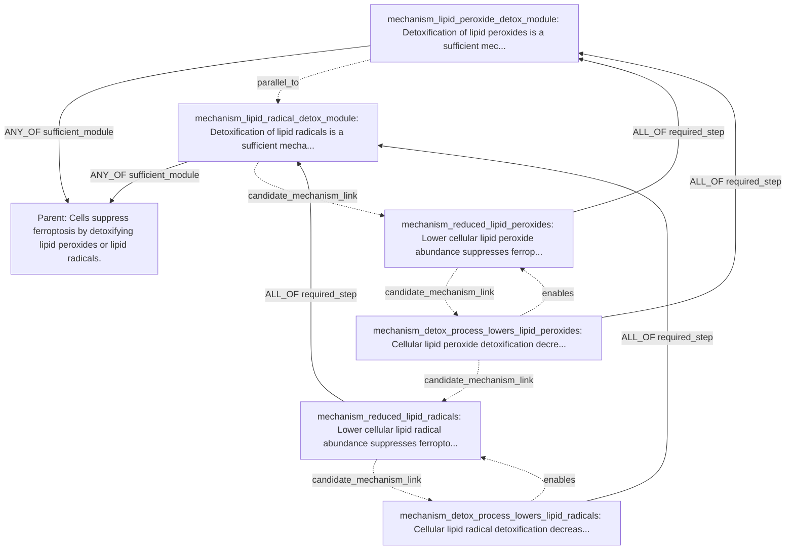

### Lenalidomide / del(5q) MDS / CK1alpha Degradation

Input hypothesis:

```text
Lenalidomide creates a therapeutic window in del(5q) MDS by degrading CK1alpha.
```

DAG2 mode: `llm_claim_specific_dag2_decomposition`; child claims: 5; edge operators: `ALL_OF`.

#### Parent Claim Object

| field | value |
|---|---|
| `claim_id` | `P_LENALIDOMIDE_DEL5Q_CK1A` |
| `claim_text` | Lenalidomide creates a therapeutic window in del(5q) MDS by degrading CK1alpha. |
| `relation_name` | `drives_phenotype` |
| `relation_polarity` | `positive` |
| `participants` | degraded_substrate_gene:`HGNC:CSNK1A1` (canonical_gene_symbol=CSNK1A1; original_label=HGNC:CSNK1A1); perturbagen:`PROPOSED-LENALIDOMIDE` (proposed_entity_label=lenalidomide; requires_entity_row=True); disease_context:`PROPOSED-DEL5Q_MDS` (proposed_entity_label=del(5q) MDS; requires_entity_row=True) |
| `candidate_gene` | `CSNK1A1` |

#### Claim Rows

| role | claim_text | relation_name | polarity | participants | context/properties |
|---|---|---|---|---|---|
| `mechanism_ck1a_abundance_step` | Lenalidomide decreases CK1alpha protein abundance in del(5q) MDS cells. | `regulates_protein_abundance` | `negative` | perturbagen:`PROPOSED-LENALIDOMIDE` (proposed_entity_label=lenalidomide; requires_entity_row=True); target_gene:`HGNC:CSNK1A1` (canonical_gene_symbol=CSNK1A1; original_label=HGNC:CSNK1A1); disease_context:`PROPOSED-DEL5Q_MDS` (proposed_entity_label=del(5q) MDS; requires_entity_row=True); cell_population:`PROPOSED-DEL5Q_MDS_CELL` (proposed_entity_label=del(5q) MDS cell; requires_entity_row=True) | scope=molecular_signal; primary_readout=CK1alpha protein abundance; truth_condition=In del(5q) MDS cells exposed to lenalidomide, CK1alpha protein level is reduced relative to matched untreated cells.; why=This is the core proximal mechanism asserted by the root claim and anchors downstream selectivity claims.; source_mode=llm_claim_specific_dag2_decomposition |
| `mechanism_del5q_selective_dependency_step` | del(5q) MDS cells have stronger dependency on residual CSNK1A1 dosage than matched non-del(5q) hematopoietic cells. | `has_selective_dependency` | `positive` | dependency_gene:`HGNC:CSNK1A1` (canonical_gene_symbol=CSNK1A1; original_label=HGNC:CSNK1A1); selected_cell_population:`PROPOSED-DEL5Q_MDS_CELL` (proposed_entity_label=del(5q) MDS cell; requires_entity_row=True); reference_cell_population:`PROPOSED-NON_DEL5Q_HEMATOPOIETIC_CELL` (proposed_entity_label=non-del(5q) hematopoietic cell; requires_entity_row=True) | scope=therapy_endpoint; primary_readout=differential cell viability or growth after CSNK1A1 reduction; truth_condition=Reducing CSNK1A1 state produces a larger viability or growth defect in del(5q) MDS cells than in matched non-del(5q) hematopoietic cells.; why=The therapeutic window requires selective vulnerability of del(5q) cells to further CK1alpha loss, not just CK1alpha reduction itself.; source_mode=llm_claim_specific_dag2_decomposition |
| `mechanism_therapeutic_window_step` | Lenalidomide preferentially decreases survival of del(5q) MDS cells relative to non-del(5q) hematopoietic cells. | `perturbation_changes_phenotype` | `negative` | perturbagen:`PROPOSED-LENALIDOMIDE` (proposed_entity_label=lenalidomide; requires_entity_row=True); affected_cell_population:`PROPOSED-DEL5Q_MDS_CELL` (proposed_entity_label=del(5q) MDS cell; requires_entity_row=True); reference_cell_population:`PROPOSED-NON_DEL5Q_HEMATOPOIETIC_CELL` (proposed_entity_label=non-del(5q) hematopoietic cell; requires_entity_row=True) | scope=therapy_endpoint; primary_readout=differential cell viability or expansion under lenalidomide; truth_condition=Under matched lenalidomide exposure, del(5q) MDS cells show a larger reduction in viability or expansion than non-del(5q) hematopoietic cells.; why=This operationalizes the claimed therapeutic window as selective anti-clonal effect in the del(5q) context.; source_mode=llm_claim_specific_dag2_decomposition |
| `mechanism_ck1a_sufficiency_step` | Direct reduction of CSNK1A1 is sufficient to preferentially impair del(5q) MDS cell survival. | `perturbation_changes_phenotype` | `negative` | perturbed_gene:`HGNC:CSNK1A1` (canonical_gene_symbol=CSNK1A1; original_label=HGNC:CSNK1A1); affected_cell_population:`PROPOSED-DEL5Q_MDS_CELL` (proposed_entity_label=del(5q) MDS cell; requires_entity_row=True); reference_cell_population:`PROPOSED-NON_DEL5Q_HEMATOPOIETIC_CELL` (proposed_entity_label=non-del(5q) hematopoietic cell; requires_entity_row=True) | scope=therapy_endpoint; primary_readout=differential cell viability or growth after CSNK1A1 reduction; truth_condition=Experimental CSNK1A1 reduction, without lenalidomide, causes a larger survival or growth defect in del(5q) MDS cells than in matched non-del(5q) hematopoietic cells.; why=This separates the claimed causal mediator from other possible lenalidomide effects by asking whether CK1alpha loss alone reproduces selectivity.; source_mode=llm_claim_specific_dag2_decomposition |
| `mechanism_ck1a_necessity_step` | Maintaining CSNK1A1 abundance buffers the selective cytotoxic effect of lenalidomide in del(5q) MDS cells. | `requires` | `positive` | required_gene:`HGNC:CSNK1A1` (canonical_gene_symbol=CSNK1A1; original_label=HGNC:CSNK1A1); upstream_perturbagen:`PROPOSED-LENALIDOMIDE` (proposed_entity_label=lenalidomide; requires_entity_row=True); affected_cell_population:`PROPOSED-DEL5Q_MDS_CELL` (proposed_entity_label=del(5q) MDS cell; requires_entity_row=True); phenotype:`PROPOSED-LENALIDOMIDE_SELECTIVE_CYTOTOXICITY` (proposed_entity_label=lenalidomide selective cytotoxicity in del(5q) MDS; requires_entity_row=True) | scope=therapy_endpoint; primary_readout=rescue of del(5q) MDS cell survival during lenalidomide exposure; truth_condition=When CSNK1A1 abundance is experimentally maintained during lenalidomide treatment, the reduction in del(5q) MDS cell survival is attenuated.; why=This tests whether CK1alpha loss is necessary for the lenalidomide therapeutic window rather than merely correlated with it.; source_mode=llm_claim_specific_dag2_decomposition |

#### Decomposition Edges

| source_dag2_role | source_claim_id | target_dag2_role | target_claim_id | support_operator | source_role | group_id |
|---|---|---|---|---|---|---|
| `mechanism_ck1a_abundance_step` | `P_LENALIDOMIDE_DEL5Q_CK1A.stage0.ck1a_protein_abundance_decrease` | `parent_claim` | `P_LENALIDOMIDE_DEL5Q_CK1A` | `ALL_OF` | `ordinary_child` | `len_ck1a_window` |
| `mechanism_del5q_selective_dependency_step` | `P_LENALIDOMIDE_DEL5Q_CK1A.stage0.del5q_ck1a_haploinsufficient_dependency` | `parent_claim` | `P_LENALIDOMIDE_DEL5Q_CK1A` | `ALL_OF` | `ordinary_child` | `len_ck1a_window` |
| `mechanism_therapeutic_window_step` | `P_LENALIDOMIDE_DEL5Q_CK1A.stage0.lenalidomide_selective_del5q_cell_killing` | `parent_claim` | `P_LENALIDOMIDE_DEL5Q_CK1A` | `ALL_OF` | `ordinary_child` | `len_ck1a_window` |
| `mechanism_ck1a_sufficiency_step` | `P_LENALIDOMIDE_DEL5Q_CK1A.stage0.ck1a_loss_recapitulates_del5q_selective_toxicity` | `parent_claim` | `P_LENALIDOMIDE_DEL5Q_CK1A` | `ALL_OF` | `ordinary_child` | `len_ck1a_window` |
| `mechanism_ck1a_necessity_step` | `P_LENALIDOMIDE_DEL5Q_CK1A.stage0.ck1a_restoration_buffers_lenalidomide_selectivity` | `parent_claim` | `P_LENALIDOMIDE_DEL5Q_CK1A` | `ALL_OF` | `ordinary_child` | `len_ck1a_window` |

#### Semantic Relations

| source_dag2_role | source_claim_id | relation_kind | target_dag2_role | target_claim_id | notes |
|---|---|---|---|---|---|
| `mechanism_ck1a_abundance_step` | `P_LENALIDOMIDE_DEL5Q_CK1A.stage0.ck1a_protein_abundance_decrease` | `candidate_mechanism_link` | `mechanism_therapeutic_window_step` | `P_LENALIDOMIDE_DEL5Q_CK1A.stage0.lenalidomide_selective_del5q_cell_killing` | Lenalidomide-induced CK1alpha loss is proposed to transmit the selective anti-del(5q) effect. |
| `mechanism_del5q_selective_dependency_step` | `P_LENALIDOMIDE_DEL5Q_CK1A.stage0.del5q_ck1a_haploinsufficient_dependency` | `enables` | `mechanism_therapeutic_window_step` | `P_LENALIDOMIDE_DEL5Q_CK1A.stage0.lenalidomide_selective_del5q_cell_killing` | Pre-existing heightened dependency on residual CSNK1A1 explains why CK1alpha reduction yields a therapeutic window in del(5q) cells. |
| `mechanism_ck1a_sufficiency_step` | `P_LENALIDOMIDE_DEL5Q_CK1A.stage0.ck1a_loss_recapitulates_del5q_selective_toxicity` | `refines` | `mechanism_therapeutic_window_step` | `P_LENALIDOMIDE_DEL5Q_CK1A.stage0.lenalidomide_selective_del5q_cell_killing` | Shows that CK1alpha reduction can reproduce the selective phenotype without invoking other lenalidomide actions. |
| `mechanism_ck1a_necessity_step` | `P_LENALIDOMIDE_DEL5Q_CK1A.stage0.ck1a_restoration_buffers_lenalidomide_selectivity` | `refines` | `mechanism_therapeutic_window_step` | `P_LENALIDOMIDE_DEL5Q_CK1A.stage0.lenalidomide_selective_del5q_cell_killing` | Shows that the selective lenalidomide phenotype depends on CK1alpha loss. |
| `mechanism_ck1a_abundance_step` | `P_LENALIDOMIDE_DEL5Q_CK1A.stage0.ck1a_protein_abundance_decrease` | `candidate_mechanism_link` | `mechanism_del5q_selective_dependency_step` | `P_LENALIDOMIDE_DEL5Q_CK1A.stage0.del5q_ck1a_haploinsufficient_dependency` | Stage0 inferred these biological claims as related parts of the grounded mechanism; reviewer/L1 may later split, reorder, strengthen, or retire the semantic link. |
| `mechanism_therapeutic_window_step` | `P_LENALIDOMIDE_DEL5Q_CK1A.stage0.lenalidomide_selective_del5q_cell_killing` | `candidate_mechanism_link` | `mechanism_ck1a_sufficiency_step` | `P_LENALIDOMIDE_DEL5Q_CK1A.stage0.ck1a_loss_recapitulates_del5q_selective_toxicity` | Stage0 inferred these biological claims as related parts of the grounded mechanism; reviewer/L1 may later split, reorder, strengthen, or retire the semantic link. |
| `mechanism_ck1a_sufficiency_step` | `P_LENALIDOMIDE_DEL5Q_CK1A.stage0.ck1a_loss_recapitulates_del5q_selective_toxicity` | `candidate_mechanism_link` | `mechanism_ck1a_necessity_step` | `P_LENALIDOMIDE_DEL5Q_CK1A.stage0.ck1a_restoration_buffers_lenalidomide_selectivity` | Stage0 inferred these biological claims as related parts of the grounded mechanism; reviewer/L1 may later split, reorder, strengthen, or retire the semantic link. |

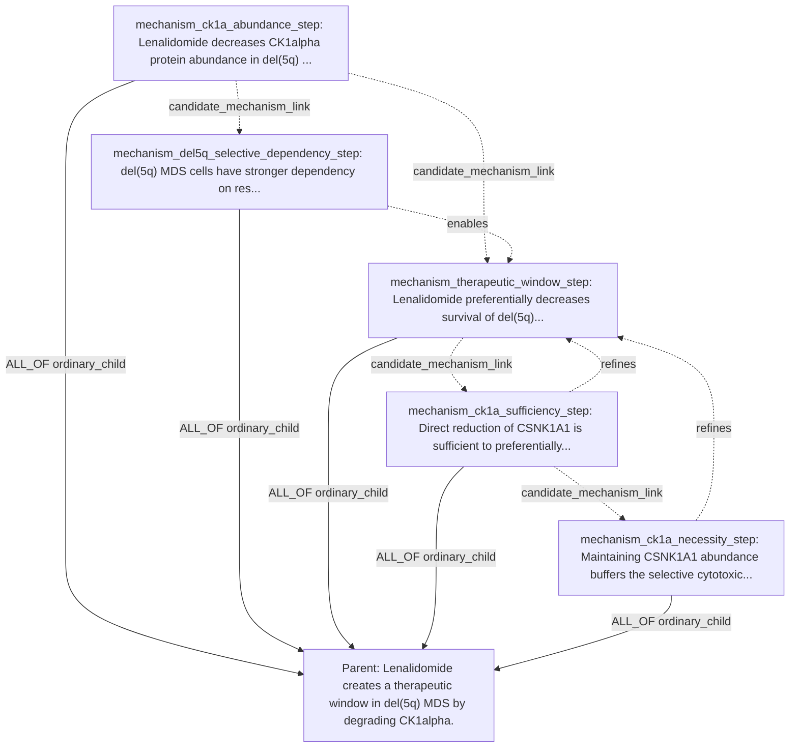

## Key

### Claim Fields

| Column | Meaning |
|---|---|
| `ID` | Stable candidate claim id used in formulas and diagrams. |
| `claim_text` | Full biological assertion. |
| `participants` | Role-labeled KG node ids or proposed node ids. |
| `relation_name` | Predicate for the claim. |
| `polarity` | `positive`, `negative`, `bidirectional`, `null`, `unknown`, or SQL `NULL` when sign is not applicable. |
| `context/properties` | Context and non-proof metadata. |

### Edge Fields

| Field | Meaning |
|---|---|
| `source_claim_id -> target_claim_id` | Child/module supports target. |
| `support_operator` | `ALL_OF`, `ANY_OF`, `K_OF_N`, `INDEPENDENT_CAUSES`, or `MUTUALLY_EXCLUSIVE_ALTERNATIVES`. |
| `source_role` | `shared_anchor`, `required_step`, `sufficient_module`, `context_bridge`, or `ordinary_child`. |
| `group_id` | Mechanism/pathway group. |

## Local Reference Context

| File | Local title / citation anchor | DOI |
|---|---|---|
| `ADAR1paper.pdf` | Loss of ADAR1 in tumours overcomes resistance to immune checkpoint blockade | not present in PDF metadata |
| `nature23465.pdf` | CDK4/6 inhibition triggers anti-tumour immunity | `10.1038/nature23465` |
| `s41586-020-2229-5.pdf` | Autophagy promotes immune evasion of pancreatic cancer by degrading MHC-I | `10.1038/s41586-020-2229-5` |
| `s41586-023-06575-7.pdf` | The PTPN2/PTPN1 inhibitor ABBV-CLS-484 unleashes potent anti-tumour immunity | `10.1038/s41586-023-06575-7` |
| `s41586-024-08439-0.pdf` | Immune evasion through mitochondrial transfer in the tumour microenvironment | `10.1038/s41586-024-08439-0` |
| `s41580-024-00768-2.pdf` | Profiling cell identity and tissue architecture with single-cell and spatial transcriptomics | `10.1038/s41580-024-00768-2` |
| `cellTree.pdf` | A reference cell tree will serve science better than a reference cell atlas | `10.1016/j.cell.2023.02.016` |
| `cellstates.pdf` | Establishing a conceptual framework for holistic cell states and state transitions | `10.1016/j.cell.2024.04.035` |

The ADAR1 PDF text includes DOI `10.1038/s41586-018-0768-9`, although that DOI
was not present in the PDF metadata. PTPN2/PTPN1, mitochondrial transfer, ADAR1,
CDK4/6, and autophagy/MHC-I have directly matching primary papers in this local
folder. The CIN/cGAS-STING, beta-catenin/DC-exclusion, IFNg/ferroptosis, and
RBMS1 examples still need direct primary literature attachment before their
child claims should be treated as known evidence.

## 1. Chromosomal Instability / cGAS-STING Metastasis Bias

Hypothesis:

```text
Chromosomal instability causes micronuclei formation and chronic cGAS-STING
signaling, which rewires tumor inflammation toward metastasis rather than
immune clearance.
```

Formula:

```text
P_CIN_STING_METASTASIS =
  F_CIN_MICRONUCLEI AND
  F_MICRONUCLEAR_DNA_EXPOSURE AND
  F_MICRONUCLEI_ACTIVATE_STING AND
  F_CIN_SUSTAINS_CHRONIC_STING AND
  F_CHRONIC_STING_REWIRES_INFLAMMATION AND
  F_REWIRED_INFLAMMATION_METASTASIS_BIAS
```

Claims:

| ID | claim_text | participants | relation_name | polarity | context/properties |
|---|---|---|---|---|---|
| `P_CIN_STING_METASTASIS` | Chromosomal instability promotes a chronic cGAS-STING inflammatory state that biases tumors toward metastasis rather than immune clearance. | process:`BP-chromosomal_instability`; pathway:`PATHWAY-cGAS_STING`; phenotype:`PHENO-metastasis`; phenotype:`PHENO-immune_clearance`; cell_context:`TME-tumor_intrinsic` | `drives_phenotype` | `positive` | parent hypothesis |
| `F_CIN_MICRONUCLEI` | Chromosomal instability in tumor cells increases micronuclei containing missegregated chromosomal DNA. | process:`BP-chromosomal_instability`; structure:`STRUCT-micronucleus`; cell_context:`TME-tumor_intrinsic` | `increases` | `positive` | structural DNA-damage step |
| `F_MICRONUCLEAR_DNA_EXPOSURE` | Micronuclei formed during chromosomal instability expose micronuclear DNA to the cytosol after envelope disruption. | structure:`STRUCT-micronucleus`; material:`DNA-chromosomal`; compartment:`GO-cytosol` | `exposes_to` | `positive` | cytosolic DNA trigger |
| `F_MICRONUCLEI_ACTIVATE_STING` | Cytosol-exposed micronuclear DNA activates cGAS-STING signaling in tumor cells. | material:`DNA-cytosolic`; effector:`CGAS`; pathway:`PATHWAY-STING1_TBK1_IRF3`; cell_context:`TME-tumor_intrinsic` | `activates` | `positive` | pathway activation |
| `F_CIN_SUSTAINS_CHRONIC_STING` | Persistent chromosomal instability sustains chronic rather than transient cGAS-STING signaling. | process:`BP-chromosomal_instability`; pathway:`PATHWAY-cGAS_STING`; temporal_context:`chronic` | `sustains` | `positive` | chronicity requirement |
| `F_CHRONIC_STING_REWIRES_INFLAMMATION` | Chronic STING signaling shifts inflammatory output from immune-clearing programs toward nonresolving pro-metastatic inflammatory programs. | pathway:`PATHWAY-cGAS_STING`; phenotype:`PHENO-pro_metastatic_inflammation`; phenotype:`PHENO-immune_clearance` | `rewires` | `positive` | inflammatory state transition |
| `F_REWIRED_INFLAMMATION_METASTASIS_BIAS` | The chronic STING-driven inflammatory state increases invasion, dissemination, or metastatic outgrowth more than immune-mediated tumor clearance. | phenotype:`PHENO-pro_metastatic_inflammation`; phenotype:`PHENO-metastatic_outgrowth`; phenotype:`PHENO-immune_clearance` | `biases_toward` | `positive` | endpoint |

Decomposition:

| source -> target | operator | source_role | group_id |
|---|---|---|---|
| every `F_*` child -> `P_CIN_STING_METASTASIS` | `ALL_OF` | `required_step` | `cin_sting_chain` |

Semantic claim_relations:

```text
F_CIN_MICRONUCLEI enables F_MICRONUCLEAR_DNA_EXPOSURE
F_MICRONUCLEAR_DNA_EXPOSURE enables F_MICRONUCLEI_ACTIVATE_STING
F_MICRONUCLEI_ACTIVATE_STING enables F_CIN_SUSTAINS_CHRONIC_STING
F_CIN_SUSTAINS_CHRONIC_STING enables F_CHRONIC_STING_REWIRES_INFLAMMATION
F_CHRONIC_STING_REWIRES_INFLAMMATION enables F_REWIRED_INFLAMMATION_METASTASIS_BIAS
```

Boxed-arrow DAG:


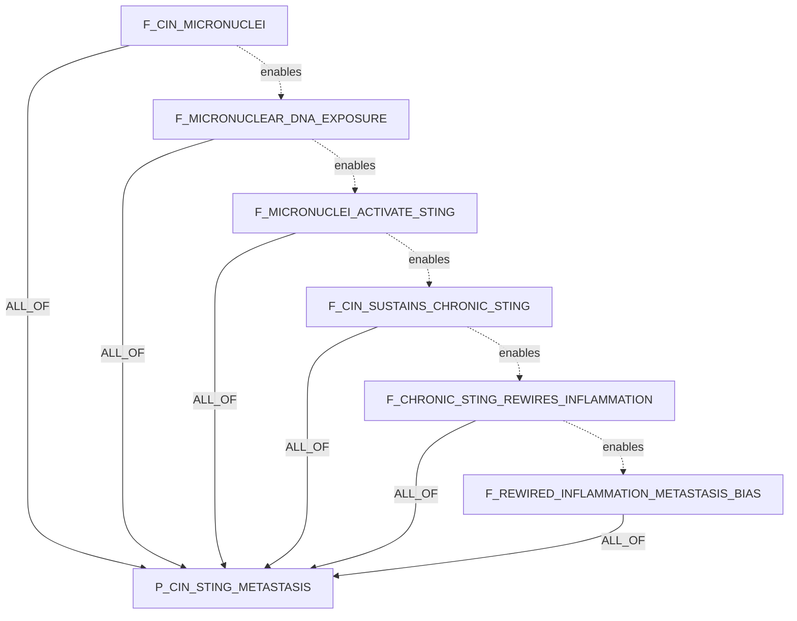

Rationale: the DAG separates genome-structural damage, cytosolic DNA exposure,
pathway activation, chronic signaling, inflammatory-state rewiring, and the
metastasis-biased endpoint. This is better than a single broad "STING causes
metastasis" claim because each child has a distinct truth condition and
measurable readout.

## 2. Tumor-To-T-Cell Mitochondrial Transfer

Hypothesis:

```text
Tumor cells transfer damaged mitochondria into T cells, causing T-cell
mitochondrial dysfunction and immune evasion; blocking mitochondrial transfer
should restore T-cell cytotoxicity.
```

Formula:

```text
P_TUMOR_MITO_TRANSFER_TCELL_EVASION =
  F_TUMOR_TO_TCELL_MITO_TRANSFER AND
  F_TRANSFERRED_MITOCHONDRIA_DAMAGED AND
  F_TRANSFER_CAUSES_TCELL_MITO_DYSFUNCTION AND
  F_TCELL_MITO_DYSFUNCTION_REDUCES_CYTOTOXICITY AND
  F_CYTOTOXICITY_LOSS_PERMITS_EVASION AND
  F_TRANSFER_BLOCKADE_RESCUES_TCELL_FUNCTION
```

Claims:

| ID | claim_text | participants | relation_name | polarity | context/properties |
|---|---|---|---|---|---|
| `P_TUMOR_MITO_TRANSFER_TCELL_EVASION` | Tumor-to-T-cell transfer of damaged mitochondria impairs T-cell cytotoxicity and promotes tumor immune evasion, while transfer blockade restores cytotoxic function. | source_cell:`TME-tumor_cell`; recipient_cell:`CT-TCELL`; organelle:`GO-mitochondrion`; phenotype:`PHENO-immune_evasion`; phenotype:`PHENO-TCELL_cytotoxicity` | `drives_phenotype` | `positive` | parent hypothesis |
| `F_TUMOR_TO_TCELL_MITO_TRANSFER` | Tumor cells transfer mitochondria into T cells in the tumor microenvironment. | source_cell:`TME-tumor_cell`; recipient_cell:`CT-TCELL`; organelle:`GO-mitochondrion`; location:`TME` | `transfers_to` | `positive` | intercellular transfer step |
| `F_TRANSFERRED_MITOCHONDRIA_DAMAGED` | Tumor-origin mitochondria found in recipient T cells are damaged or dysfunctional. | organelle:`GO-mitochondrion`; phenotype:`PHENO-mitochondrial_damage`; recipient_cell:`CT-TCELL` | `has_observed_property` | SQL `NULL` | cargo state |
| `F_TRANSFER_CAUSES_TCELL_MITO_DYSFUNCTION` | Receipt of tumor-derived damaged mitochondria causes mitochondrial dysfunction in recipient T cells. | organelle:`GO-mitochondrion`; cell_context:`CT-TCELL`; phenotype:`PHENO-mitochondrial_dysfunction` | `causes` | `positive` | recipient-cell state |
| `F_TCELL_MITO_DYSFUNCTION_REDUCES_CYTOTOXICITY` | Mitochondrial dysfunction in T cells reduces tumor-cell killing and cytotoxic effector output. | cell_context:`CT-TCELL`; phenotype:`PHENO-mitochondrial_dysfunction`; phenotype:`PHENO-TCELL_cytotoxicity` | `reduces` | `negative` | effector function |
| `F_CYTOTOXICITY_LOSS_PERMITS_EVASION` | Loss of T-cell cytotoxic function permits increased tumor immune evasion or survival. | cell_context:`CT-TCELL`; phenotype:`PHENO-TCELL_cytotoxicity`; phenotype:`PHENO-immune_evasion` | `permits` | `positive` | endpoint |
| `F_TRANSFER_BLOCKADE_RESCUES_TCELL_FUNCTION` | Blocking tumor-to-T-cell mitochondrial transfer restores T-cell mitochondrial fitness and cytotoxic function. | intervention:`INT-mitochondrial_transfer_blockade`; source_cell:`TME-tumor_cell`; recipient_cell:`CT-TCELL`; phenotype:`PHENO-TCELL_cytotoxicity` | `restores` | `positive` | intervention/rescue |

Decomposition:

| source -> target | operator | source_role | group_id |
|---|---|---|---|
| every `F_*` child -> `P_TUMOR_MITO_TRANSFER_TCELL_EVASION` | `ALL_OF` | `required_step` | `mito_transfer_chain` |

Semantic claim_relations:

```text
F_TUMOR_TO_TCELL_MITO_TRANSFER enables F_TRANSFERRED_MITOCHONDRIA_DAMAGED
F_TRANSFERRED_MITOCHONDRIA_DAMAGED enables F_TRANSFER_CAUSES_TCELL_MITO_DYSFUNCTION
F_TRANSFER_CAUSES_TCELL_MITO_DYSFUNCTION enables F_TCELL_MITO_DYSFUNCTION_REDUCES_CYTOTOXICITY
F_TCELL_MITO_DYSFUNCTION_REDUCES_CYTOTOXICITY enables F_CYTOTOXICITY_LOSS_PERMITS_EVASION
F_TRANSFER_BLOCKADE_RESCUES_TCELL_FUNCTION refutes_if_false P_TUMOR_MITO_TRANSFER_TCELL_EVASION
```

Boxed-arrow DAG:


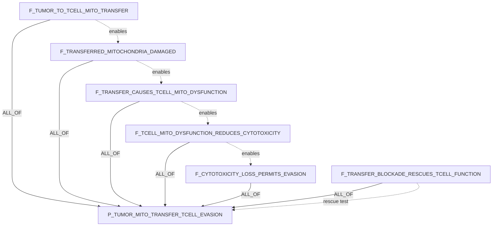

Rationale: the DAG prevents overclaiming by requiring evidence for transfer,
cargo damage, recipient T-cell dysfunction, cytotoxic loss, immune-evasion
outcome, and rescue after blockade. The rescue child is essential because it
distinguishes causal transfer from a correlated exhausted T-cell state.

Source: `s41586-024-08439-0.pdf`, DOI `10.1038/s41586-024-08439-0`.

## 3. PTPN2/PTPN1 Interferon Amplification And Immune Killing

Hypothesis:

```text
PTPN2/PTPN1 act as brakes on JAK-STAT interferon signaling, so dual inhibition
should amplify IFN response, antigen presentation, and NK/CD8 killing.
```

Formula:

```text
P_PTPN2_PTPN1_IFN_KILLING =
  F_PTPN2_PTPN1_LOSS_AMPLIFIES_JAK_STAT AND
  F_IFN_AMPLIFICATION_INCREASES_ANTIGEN_PRESENTATION AND
  F_PTPN_INHIBITION_INCREASES_NK_SUSCEPTIBILITY AND
  F_PTPN_INHIBITION_INCREASES_CD8_KILLING AND
  F_DUAL_PARALOG_INHIBITION_OUTPERFORMS_SINGLE
```

Claims:

| ID | claim_text | participants | relation_name | polarity | context/properties |
|---|---|---|---|---|---|
| `P_PTPN2_PTPN1_IFN_KILLING` | Dual PTPN2/PTPN1 inhibition amplifies interferon-JAK-STAT signaling, antigen presentation, and NK/CD8 tumor killing. | target:`PTPN2`; target:`PTPN1`; pathway:`PATHWAY-interferon_JAK_STAT`; phenotype:`PHENO-antigen_presentation`; immune_cell:`CT-CD8_TCELL`; immune_cell:`CT-NK_CELL` | `increases` | `positive` | parent hypothesis |
| `F_PTPN2_PTPN1_LOSS_AMPLIFIES_JAK_STAT` | Reduced PTPN2/PTPN1 phosphatase activity increases interferon-induced JAK-STAT signaling, including STAT phosphorylation and ISG transcription. | target:`PTPN2`; target:`PTPN1`; pathway:`PATHWAY-interferon_JAK_STAT`; process:`BP-ISG_expression` | `amplifies` | `positive` | proximal pathway |
| `F_IFN_AMPLIFICATION_INCREASES_ANTIGEN_PRESENTATION` | Amplified interferon-JAK-STAT signaling after PTPN2/PTPN1 inhibition increases tumor-cell antigen-processing and MHC-I presentation machinery. | pathway:`PATHWAY-interferon_JAK_STAT`; phenotype:`PHENO-antigen_presentation`; target:`B2M`; target:`TAP1`; target:`HLA_class_I`; cell_context:`TME-tumor_intrinsic` | `upregulates` | `positive` | tumor immune visibility |
| `F_PTPN_INHIBITION_INCREASES_NK_SUSCEPTIBILITY` | PTPN2/PTPN1 inhibition increases tumor susceptibility to NK-cell attack through interferon-linked visibility or cytotoxic-response programs. | target:`PTPN2`; target:`PTPN1`; immune_cell:`CT-NK_CELL`; phenotype:`PHENO-NK_cell_killing` | `increases_susceptibility_to` | `positive` | NK arm |
| `F_PTPN_INHIBITION_INCREASES_CD8_KILLING` | Tumor-cell interferon and antigen-presentation changes caused by PTPN2/PTPN1 inhibition increase CD8 T-cell recognition and cytotoxic killing. | target:`PTPN2`; target:`PTPN1`; immune_cell:`CT-CD8_TCELL`; phenotype:`PHENO-CD8_TCELL_killing`; phenotype:`PHENO-antigen_presentation` | `increases` | `positive` | CD8 arm |
| `F_DUAL_PARALOG_INHIBITION_OUTPERFORMS_SINGLE` | Concurrent inhibition of PTPN2 and PTPN1 produces stronger interferon signaling and immune-visibility phenotypes than inhibiting either phosphatase alone. | target:`PTPN2`; target:`PTPN1`; intervention:`INT-dual_phosphatase_inhibition`; pathway:`PATHWAY-interferon_JAK_STAT` | `has_greater_effect_than` | `positive` | dual-paralog requirement |

Decomposition:

| source -> target | operator | source_role | group_id |
|---|---|---|---|
| every `F_*` child -> `P_PTPN2_PTPN1_IFN_KILLING` | `ALL_OF` | `required_step` | `ptpn_ifn_killing_chain` |

Semantic claim_relations:

```text
F_PTPN2_PTPN1_LOSS_AMPLIFIES_JAK_STAT enables F_IFN_AMPLIFICATION_INCREASES_ANTIGEN_PRESENTATION
F_IFN_AMPLIFICATION_INCREASES_ANTIGEN_PRESENTATION enables F_PTPN_INHIBITION_INCREASES_CD8_KILLING
F_PTPN2_PTPN1_LOSS_AMPLIFIES_JAK_STAT enables F_PTPN_INHIBITION_INCREASES_NK_SUSCEPTIBILITY
F_DUAL_PARALOG_INHIBITION_OUTPERFORMS_SINGLE refines P_PTPN2_PTPN1_IFN_KILLING
```

Boxed-arrow DAG:


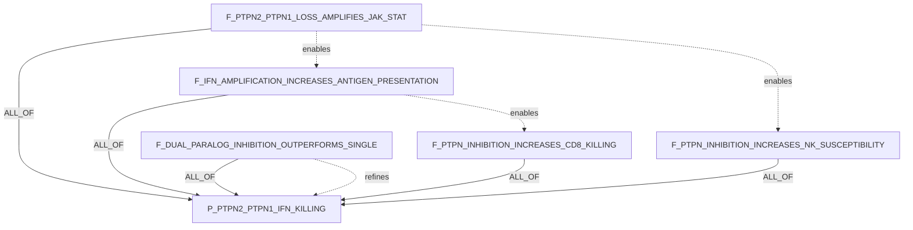

Rationale: this is the strongest local-paper-backed example in the set. The DAG
keeps the proximal JAK-STAT phosphatase mechanism separate from antigen
presentation, NK susceptibility, CD8 killing, and the dual-paralog requirement.
That prevents the system from proving "PTPN2 works" when the real claim is that
dual PTPN2/PTPN1 inhibition creates stronger tumor immune visibility and killing.

Source: `s41586-023-06575-7.pdf`, DOI `10.1038/s41586-023-06575-7`.

## 4. Tumor-Intrinsic Beta-Catenin / DC Recruitment / T-Cell Exclusion

Hypothesis:

```text
Tumor-intrinsic beta-catenin signaling blocks dendritic-cell recruitment,
causing T-cell exclusion; beta-catenin inhibition should restore DC recruitment
and CD8 entry.
```

Formula:

```text
P_CTNNB1_DC_CD8_EXCLUSION =
  F_CTNNB1_SUPPRESSES_DC_CHEMOKINES AND
  F_CHEMOKINE_LOSS_REDUCES_DC_RECRUITMENT AND
  F_DC_LOSS_REDUCES_CD8_ENTRY AND
  F_HIGH_CTNNB1_ASSOCIATES_WITH_CD8_EXCLUSION AND
  F_CTNNB1_INHIBITION_RESTORES_CHEMOKINES AND
  F_CTNNB1_INHIBITION_RESTORES_DC_AND_CD8
```

Claims:

| ID | claim_text | participants | relation_name | polarity | context/properties |
|---|---|---|---|---|---|
| `P_CTNNB1_DC_CD8_EXCLUSION` | Tumor-intrinsic CTNNB1 signaling suppresses dendritic-cell recruitment and causes CD8 T-cell exclusion, while CTNNB1 inhibition restores DC recruitment and CD8 entry. | effector:`CTNNB1`; immune_cell:`CT-dendritic_cell`; immune_cell:`CT-CD8_TCELL`; phenotype:`PHENO-TCELL_exclusion`; cell_context:`TME-tumor_intrinsic` | `drives_phenotype` | `positive` | parent hypothesis |
| `F_CTNNB1_SUPPRESSES_DC_CHEMOKINES` | Tumor-cell-intrinsic CTNNB1 activation decreases expression or secretion of dendritic-cell-recruiting chemokines. | effector:`CTNNB1`; phenotype:`PHENO-DC_recruiting_chemokine_expression`; cell_context:`TME-tumor_intrinsic` | `suppresses` | `negative` | chemokine mediator |
| `F_CHEMOKINE_LOSS_REDUCES_DC_RECRUITMENT` | Reduced tumor-derived dendritic-cell-recruiting chemokines lower intratumoral dendritic-cell recruitment or abundance. | phenotype:`PHENO-DC_recruiting_chemokine_expression`; immune_cell:`CT-dendritic_cell`; location:`TME` | `reduces` | `negative` | DC recruitment step |
| `F_DC_LOSS_REDUCES_CD8_ENTRY` | Reduced intratumoral dendritic-cell abundance lowers CD8 T-cell priming, recruitment, or entry into tumors. | immune_cell:`CT-dendritic_cell`; immune_cell:`CT-CD8_TCELL`; phenotype:`PHENO-CD8_TCELL_infiltration` | `reduces` | `negative` | immune-cell bridge |
| `F_HIGH_CTNNB1_ASSOCIATES_WITH_CD8_EXCLUSION` | High tumor-cell-intrinsic CTNNB1 signaling is associated with reduced intratumoral CD8 T-cell infiltration. | effector:`CTNNB1`; immune_cell:`CT-CD8_TCELL`; phenotype:`PHENO-TCELL_exclusion`; cell_context:`TME-tumor_intrinsic` | `is_associated_with_outcome` | `positive` | human/tumor context bridge |
| `F_CTNNB1_INHIBITION_RESTORES_CHEMOKINES` | Inhibiting tumor-cell CTNNB1 signaling restores expression or secretion of dendritic-cell-recruiting chemokines. | intervention:`INT-CTNNB1_pathway_inhibition`; effector:`CTNNB1`; phenotype:`PHENO-DC_recruiting_chemokine_expression` | `restores` | `positive` | intervention step |
| `F_CTNNB1_INHIBITION_RESTORES_DC_AND_CD8` | Inhibiting tumor-cell CTNNB1 signaling increases intratumoral dendritic-cell abundance and permits CD8 T-cell entry. | intervention:`INT-CTNNB1_pathway_inhibition`; immune_cell:`CT-dendritic_cell`; immune_cell:`CT-CD8_TCELL`; phenotype:`PHENO-CD8_TCELL_infiltration` | `restores` | `positive` | rescue endpoint |

Decomposition:

| source -> target | operator | source_role | group_id |
|---|---|---|---|
| every `F_*` child -> `P_CTNNB1_DC_CD8_EXCLUSION` | `ALL_OF` | `required_step` | `ctnnb1_dc_cd8_chain` |

Semantic claim_relations:

```text
F_CTNNB1_SUPPRESSES_DC_CHEMOKINES enables F_CHEMOKINE_LOSS_REDUCES_DC_RECRUITMENT
F_CHEMOKINE_LOSS_REDUCES_DC_RECRUITMENT enables F_DC_LOSS_REDUCES_CD8_ENTRY
F_DC_LOSS_REDUCES_CD8_ENTRY enables F_HIGH_CTNNB1_ASSOCIATES_WITH_CD8_EXCLUSION
F_CTNNB1_INHIBITION_RESTORES_CHEMOKINES enables F_CTNNB1_INHIBITION_RESTORES_DC_AND_CD8
```

Boxed-arrow DAG:


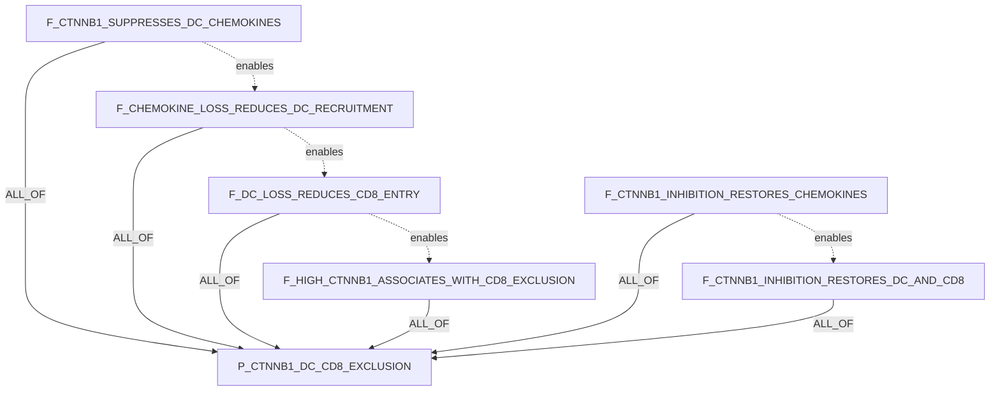

Rationale: the compiler produced a useful intermediary mediator: tumor-derived
DC-recruiting chemokines. That makes the claim much more testable than a direct
"beta-catenin blocks T cells" statement because L1/L2 can separately evaluate
chemokine expression, dendritic-cell recruitment, CD8 entry, and rescue after
pathway inhibition.

## 5. CD8 T-Cell IFNg / Tumor Ferroptosis / Immune Killing

Hypothesis:

```text
CD8 T-cell IFNg signaling induces tumor-cell ferroptosis by suppressing lipid
antioxidant defenses; increasing tumor ferroptosis sensitivity should improve
immune-mediated tumor killing.
```

Formula:

```text
P_IFNG_FERROPTOSIS_IMMUNE_KILLING =
  F_TUMOR_IFNG_SIGNAL_TRANSDUCTION AND
  F_IFNG_REPRESSES_SYSTEM_XC AND
  F_SYSTEM_XC_REPRESSION_LOWERS_GSH_DEFENSE AND
  F_LIPID_DEFENSE_LOSS_CAUSES_FERROPTOSIS AND
  F_IFNG_KILLING_HAS_FERROPTOSIS_COMPONENT AND
  F_FERROPTOSIS_SENSITIZATION_IMPROVES_IMMUNE_KILLING
```

Claims:

| ID | claim_text | participants | relation_name | polarity | context/properties |
|---|---|---|---|---|---|
| `P_IFNG_FERROPTOSIS_IMMUNE_KILLING` | CD8 T-cell IFNg signaling induces tumor-cell ferroptosis through lipid antioxidant defense suppression, and ferroptosis sensitization improves immune-mediated tumor killing. | immune_cell:`CT-CD8_TCELL`; cytokine:`IFNG`; phenotype:`PHENO-ferroptosis`; phenotype:`PHENO-immune_mediated_tumor_killing`; cell_context:`TME-tumor_intrinsic` | `drives_phenotype` | `positive` | parent hypothesis |
| `F_TUMOR_IFNG_SIGNAL_TRANSDUCTION` | Tumor-cell exposure to IFNg activates tumor-intrinsic IFNGR-JAK-STAT1 signaling. | cytokine:`IFNG`; receptor:`IFNGR1`; pathway:`PATHWAY-JAK_STAT1`; cell_context:`TME-tumor_intrinsic` | `activates` | `positive` | proximal IFNg step |
| `F_IFNG_REPRESSES_SYSTEM_XC` | IFNg signaling represses the tumor-cell cystine import system xCT/SLC7A11-SLC3A2. | cytokine:`IFNG`; target:`SLC7A11`; target:`SLC3A2`; transporter:`SYSTEM-xc_minus` | `represses` | `negative` | cystine import step |
| `F_SYSTEM_XC_REPRESSION_LOWERS_GSH_DEFENSE` | Repression of tumor-cell cystine import lowers glutathione-dependent lipid peroxide detoxification capacity. | transporter:`SYSTEM-xc_minus`; cofactor:`CHEBI-glutathione`; phenotype:`PHENO-lipid_antioxidant_defense` | `reduces` | `negative` | antioxidant defense step |
| `F_LIPID_DEFENSE_LOSS_CAUSES_FERROPTOSIS` | Loss of tumor-cell lipid antioxidant defense causes lipid peroxide accumulation and ferroptotic death. | phenotype:`PHENO-lipid_antioxidant_defense`; metabolite:`CHEBI-lipid_peroxide`; phenotype:`PHENO-ferroptosis` | `causes` | `positive` | ferroptosis execution |
| `F_IFNG_KILLING_HAS_FERROPTOSIS_COMPONENT` | A component of IFNg-induced tumor-cell killing is ferroptosis-dependent rather than solely apoptosis or growth arrest. | cytokine:`IFNG`; phenotype:`PHENO-tumor_cell_death`; phenotype:`PHENO-ferroptosis` | `has_component` | `positive` | causality discriminator |
| `F_FERROPTOSIS_SENSITIZATION_IMPROVES_IMMUNE_KILLING` | Increasing tumor-cell ferroptosis sensitivity enhances immune-mediated tumor killing in the presence of cytotoxic lymphocytes. | intervention:`INT-ferroptosis_sensitization`; phenotype:`PHENO-ferroptosis`; phenotype:`PHENO-immune_mediated_tumor_killing`; immune_cell:`CT-CD8_TCELL` | `enhances` | `positive` | intervention endpoint |

Decomposition:

| source -> target | operator | source_role | group_id |
|---|---|---|---|
| every `F_*` child -> `P_IFNG_FERROPTOSIS_IMMUNE_KILLING` | `ALL_OF` | `required_step` | `ifng_ferroptosis_chain` |

Semantic claim_relations:

```text
F_TUMOR_IFNG_SIGNAL_TRANSDUCTION enables F_IFNG_REPRESSES_SYSTEM_XC
F_IFNG_REPRESSES_SYSTEM_XC enables F_SYSTEM_XC_REPRESSION_LOWERS_GSH_DEFENSE
F_SYSTEM_XC_REPRESSION_LOWERS_GSH_DEFENSE enables F_LIPID_DEFENSE_LOSS_CAUSES_FERROPTOSIS
F_LIPID_DEFENSE_LOSS_CAUSES_FERROPTOSIS enables F_IFNG_KILLING_HAS_FERROPTOSIS_COMPONENT
F_IFNG_KILLING_HAS_FERROPTOSIS_COMPONENT enables F_FERROPTOSIS_SENSITIZATION_IMPROVES_IMMUNE_KILLING
```

Boxed-arrow DAG:


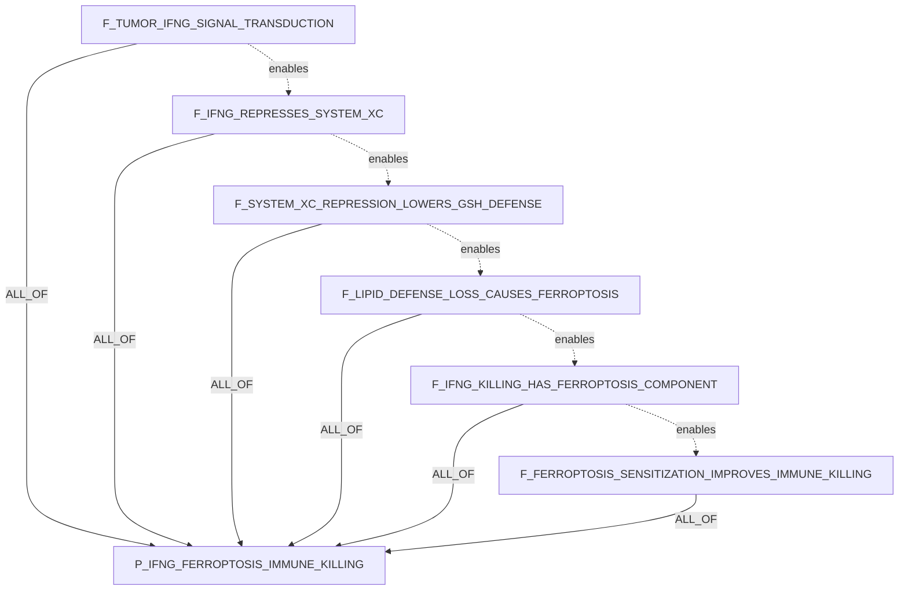

Rationale: the DAG adds the key mechanistic bridge through system xc-,
glutathione, and lipid peroxide defense. This prevents the system from treating
"IFNg kills tumor cells" and "ferroptosis happens" as enough; the causal claim
requires a ferroptosis-dependent component of CD8/IFNg-mediated killing plus a
sensitization experiment that improves immune killing.

## 6. ADAR1 Loss / dsRNA Sensing / PD-1 Sensitization

Hypothesis:

```text
ADAR1 blockade will sensitize tumors to PD-1 therapy by allowing endogenous
double-stranded RNA to activate antiviral sensing and tumor inflammation.
```

Formula:

```text
P_ADAR1_PD1_SENSITIZATION =
  F_ADAR1_EDITS_ENDOGENOUS_DSRNA AND
  F_ADAR1_LOSS_ACCUMULATES_UNEDITED_DSRNA AND
  F_UNEDITED_DSRNA_ACTIVATES_PKR_AND_MDA5 AND
  F_MDA5_MAVS_INDUCES_TUMOR_INFLAMMATION AND
  F_PKR_INDUCES_GROWTH_INHIBITION AND
  F_ADAR1_LOSS_OVERCOMES_PD1_RESISTANCE
```

Claims:

| ID | claim_text | participants | relation_name | polarity | context/properties |
|---|---|---|---|---|---|
| `P_ADAR1_PD1_SENSITIZATION` | ADAR1 loss or blockade sensitizes tumors to PD-1 checkpoint blockade by unleashing endogenous dsRNA sensing and tumor inflammation. | effector:`ADAR`; therapy_context:`THR-anti_PD1`; target:`RNA-endogenous_dsRNA`; pathway:`PATHWAY-antiviral_RNA_sensing`; phenotype:`PHENO-ICB_sensitization`; cell_context:`TME-tumor_intrinsic` | `sensitizes_to_therapy` | `positive` | parent hypothesis |
| `F_ADAR1_EDITS_ENDOGENOUS_DSRNA` | ADAR1 normally edits endogenous double-stranded RNA in tumor cells. | effector:`ADAR`; substrate:`RNA-endogenous_dsRNA`; process:`BP-A_to_I_RNA_editing`; cell_context:`TME-tumor_intrinsic` | `edits` | `positive` | RNA-editing anchor |
| `F_ADAR1_LOSS_ACCUMULATES_UNEDITED_DSRNA` | ADAR1 loss or blockade increases unedited endogenous dsRNA available for antiviral sensor recognition. | effector:`ADAR`; substrate:`RNA-unedited_endogenous_dsRNA`; process:`BP-antiviral_sensor_exposure`; cell_context:`TME-tumor_intrinsic` | `increases` | `positive` | sensor substrate |
| `F_UNEDITED_DSRNA_ACTIVATES_PKR_AND_MDA5` | Unedited endogenous dsRNA activates PKR and MDA5-family antiviral RNA sensing in tumor cells. | substrate:`RNA-unedited_endogenous_dsRNA`; effector:`EIF2AK2`; effector:`IFIH1`; pathway:`PATHWAY-antiviral_RNA_sensing` | `activates` | `positive` | paired sensor activation |
| `F_MDA5_MAVS_INDUCES_TUMOR_INFLAMMATION` | MDA5-MAVS signaling downstream of unedited dsRNA induces tumor-cell antiviral interferon and inflammatory programs. | effector:`IFIH1`; effector:`MAVS`; pathway:`PATHWAY-type_I_interferon`; phenotype:`PHENO-tumor_inflammation` | `induces` | `positive` | inflammatory arm |
| `F_PKR_INDUCES_GROWTH_INHIBITION` | PKR activation downstream of unedited dsRNA contributes to tumor-cell growth inhibition. | effector:`EIF2AK2`; pathway:`PATHWAY-integrated_stress_response`; phenotype:`PHENO-tumor_cell_growth_inhibition` | `induces` | `positive` | growth-inhibition arm |
| `F_ADAR1_LOSS_OVERCOMES_PD1_RESISTANCE` | Loss or blockade of ADAR1 overcomes resistance to PD-1 checkpoint blockade in tumor contexts, including contexts with impaired antigen presentation. | effector:`ADAR`; therapy_context:`THR-anti_PD1`; phenotype:`PHENO-PD1_resistance`; phenotype:`PHENO-ICB_sensitization` | `overcomes_resistance_to` | `positive` | therapeutic endpoint |

Decomposition:

| source -> target | operator | source_role | group_id |
|---|---|---|---|
| every `F_*` child -> `P_ADAR1_PD1_SENSITIZATION` | `ALL_OF` | `required_step` | `adar1_dsrna_pd1_chain` |

Semantic claim_relations:

```text
F_ADAR1_EDITS_ENDOGENOUS_DSRNA enables F_ADAR1_LOSS_ACCUMULATES_UNEDITED_DSRNA
F_ADAR1_LOSS_ACCUMULATES_UNEDITED_DSRNA enables F_UNEDITED_DSRNA_ACTIVATES_PKR_AND_MDA5
F_UNEDITED_DSRNA_ACTIVATES_PKR_AND_MDA5 enables F_MDA5_MAVS_INDUCES_TUMOR_INFLAMMATION
F_UNEDITED_DSRNA_ACTIVATES_PKR_AND_MDA5 enables F_PKR_INDUCES_GROWTH_INHIBITION
F_MDA5_MAVS_INDUCES_TUMOR_INFLAMMATION enables F_ADAR1_LOSS_OVERCOMES_PD1_RESISTANCE
F_PKR_INDUCES_GROWTH_INHIBITION enables F_ADAR1_LOSS_OVERCOMES_PD1_RESISTANCE
```

Boxed-arrow DAG:


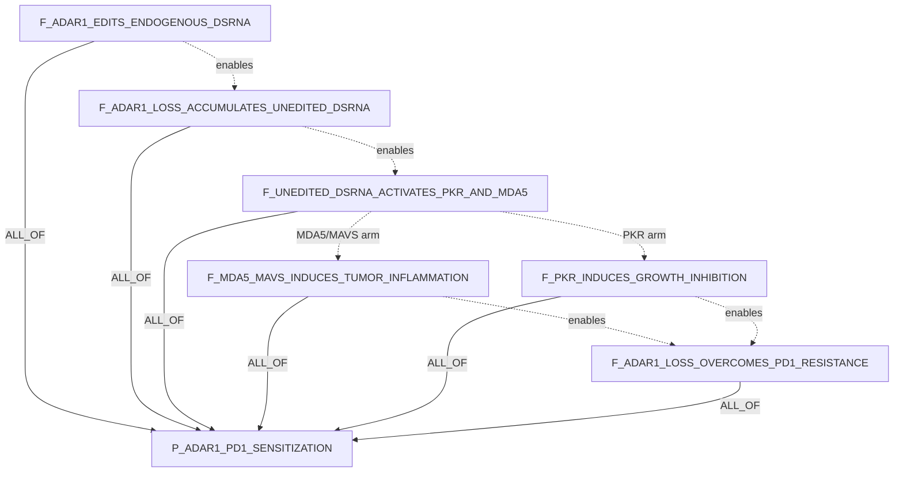

Rationale: ADAR1 was not part of the original five-hypothesis Step0 run. This
added candidate DAG captures the key logic from the local ADAR1 paper: ADAR1
editing suppresses endogenous dsRNA sensing; ADAR1 loss activates PKR and MDA5
arms; those arms produce growth inhibition and tumor inflammation; and the
combined state can overcome PD-1 resistance. The DAG keeps the RNA-editing
substrate, the sensor arms, and the therapy endpoint separate so evidence can
attach at the right child claim.

Source: `ADAR1paper.pdf`, DOI found in PDF text: `10.1038/s41586-018-0768-9`.

## 7. RBMS1 / Endogenous dsRNA Shielding / Cell-Intrinsic Immune Suppression

Hypothesis:

```text
RBMS1 binds endogenous dsRNA hairpins and shields them from MDA5 and PKR
recognition, preventing activation of antiviral interferon signaling and thereby
reducing cell-intrinsic immune activation.
```

Formula:

```text
P_RBMS1_DSRNA_SHIELDING =
  F_RBMS1_BINDS_ENDOGENOUS_DSRNA_HAIRPINS AND
  M_RBMS1_MDA5_SHIELDING_ARM AND
  M_RBMS1_PKR_SHIELDING_ARM AND
  F_RBMS1_LOSS_UNMASKS_DSRNA_SENSOR_ACTIVATION AND
  F_SENSOR_SUPPRESSION_REDUCES_CELL_INTRINSIC_IMMUNE_ACTIVATION

M_RBMS1_MDA5_SHIELDING_ARM =
  F_RBMS1_SHIELDS_DSRNA_FROM_MDA5 AND
  F_MDA5_RECOGNITION_LOSS_REDUCES_MAVS_IFN_SIGNALING

M_RBMS1_PKR_SHIELDING_ARM =
  F_RBMS1_SHIELDS_DSRNA_FROM_PKR AND
  F_PKR_RECOGNITION_LOSS_REDUCES_STRESS_OR_IFN_SIGNALING
```

Claims:

| ID | claim_text | participants | relation_name | polarity | context/properties |
|---|---|---|---|---|---|
| `P_RBMS1_DSRNA_SHIELDING` | RBMS1 binds endogenous dsRNA hairpins and shields them from MDA5 and PKR recognition, reducing antiviral interferon signaling and cell-intrinsic immune activation. | effector:`RBMS1`; substrate:`RNA-endogenous_dsRNA_hairpin`; effector:`IFIH1`; effector:`EIF2AK2`; pathway:`PATHWAY-antiviral_RNA_sensing`; phenotype:`PHENO-cell_intrinsic_immune_activation` | `suppresses` | `negative` | parent hypothesis |
| `M_RBMS1_MDA5_SHIELDING_ARM` | RBMS1 shielding of endogenous dsRNA prevents MDA5-MAVS interferon signaling. | effector:`RBMS1`; substrate:`RNA-endogenous_dsRNA_hairpin`; effector:`IFIH1`; effector:`MAVS`; pathway:`PATHWAY-type_I_interferon` | `suppresses` | `negative` | module=true; MDA5 arm |
| `M_RBMS1_PKR_SHIELDING_ARM` | RBMS1 shielding of endogenous dsRNA prevents PKR-dependent stress or antiviral signaling. | effector:`RBMS1`; substrate:`RNA-endogenous_dsRNA_hairpin`; effector:`EIF2AK2`; pathway:`PATHWAY-integrated_stress_response` | `suppresses` | `negative` | module=true; PKR arm |
| `F_RBMS1_BINDS_ENDOGENOUS_DSRNA_HAIRPINS` | RBMS1 physically binds endogenous double-stranded RNA hairpins. | effector:`RBMS1`; substrate:`RNA-endogenous_dsRNA_hairpin` | `binds` | `positive` | shared substrate anchor |
| `F_RBMS1_SHIELDS_DSRNA_FROM_MDA5` | RBMS1 occupancy on endogenous dsRNA hairpins reduces MDA5 access or recognition. | effector:`RBMS1`; substrate:`RNA-endogenous_dsRNA_hairpin`; effector:`IFIH1` | `blocks_recognition_by` | `negative` | MDA5 arm |
| `F_MDA5_RECOGNITION_LOSS_REDUCES_MAVS_IFN_SIGNALING` | Reduced MDA5 recognition lowers MAVS-dependent type I interferon and interferon-stimulated gene signaling. | effector:`IFIH1`; effector:`MAVS`; pathway:`PATHWAY-type_I_interferon`; process:`BP-ISG_expression` | `reduces` | `negative` | MDA5 downstream |
| `F_RBMS1_SHIELDS_DSRNA_FROM_PKR` | RBMS1 occupancy on endogenous dsRNA hairpins reduces PKR access or recognition. | effector:`RBMS1`; substrate:`RNA-endogenous_dsRNA_hairpin`; effector:`EIF2AK2` | `blocks_recognition_by` | `negative` | PKR arm |
| `F_PKR_RECOGNITION_LOSS_REDUCES_STRESS_OR_IFN_SIGNALING` | Reduced PKR recognition lowers PKR-dependent stress signaling and antiviral immune activation. | effector:`EIF2AK2`; pathway:`PATHWAY-integrated_stress_response`; phenotype:`PHENO-antiviral_immune_activation` | `reduces` | `negative` | PKR downstream |
| `F_RBMS1_LOSS_UNMASKS_DSRNA_SENSOR_ACTIVATION` | RBMS1 loss or depletion unmasks endogenous dsRNA hairpins and increases MDA5 and/or PKR sensor activation. | effector:`RBMS1`; substrate:`RNA-endogenous_dsRNA_hairpin`; effector:`IFIH1`; effector:`EIF2AK2` | `increases_when_lost` | `positive` | perturbation/rescue discriminator |
| `F_SENSOR_SUPPRESSION_REDUCES_CELL_INTRINSIC_IMMUNE_ACTIVATION` | Suppression of MDA5/PKR recognition reduces cell-intrinsic antiviral interferon signaling and immune activation. | effector:`IFIH1`; effector:`EIF2AK2`; phenotype:`PHENO-cell_intrinsic_immune_activation`; pathway:`PATHWAY-antiviral_RNA_sensing` | `reduces` | `negative` | endpoint |

Decomposition:

| source -> target | operator | source_role | group_id |
|---|---|---|---|
| `F_RBMS1_BINDS_ENDOGENOUS_DSRNA_HAIRPINS -> P_RBMS1_DSRNA_SHIELDING` | `ALL_OF` | `shared_anchor` | `rbms1_parent` |
| `M_RBMS1_MDA5_SHIELDING_ARM -> P_RBMS1_DSRNA_SHIELDING` | `ALL_OF` | `required_step` | `rbms1_parent` |
| `M_RBMS1_PKR_SHIELDING_ARM -> P_RBMS1_DSRNA_SHIELDING` | `ALL_OF` | `required_step` | `rbms1_parent` |
| `F_RBMS1_LOSS_UNMASKS_DSRNA_SENSOR_ACTIVATION -> P_RBMS1_DSRNA_SHIELDING` | `ALL_OF` | `required_step` | `rbms1_parent` |
| `F_SENSOR_SUPPRESSION_REDUCES_CELL_INTRINSIC_IMMUNE_ACTIVATION -> P_RBMS1_DSRNA_SHIELDING` | `ALL_OF` | `required_step` | `rbms1_parent` |
| `F_RBMS1_SHIELDS_DSRNA_FROM_MDA5 -> M_RBMS1_MDA5_SHIELDING_ARM` | `ALL_OF` | `required_step` | `rbms1_mda5_arm` |
| `F_MDA5_RECOGNITION_LOSS_REDUCES_MAVS_IFN_SIGNALING -> M_RBMS1_MDA5_SHIELDING_ARM` | `ALL_OF` | `required_step` | `rbms1_mda5_arm` |
| `F_RBMS1_SHIELDS_DSRNA_FROM_PKR -> M_RBMS1_PKR_SHIELDING_ARM` | `ALL_OF` | `required_step` | `rbms1_pkr_arm` |
| `F_PKR_RECOGNITION_LOSS_REDUCES_STRESS_OR_IFN_SIGNALING -> M_RBMS1_PKR_SHIELDING_ARM` | `ALL_OF` | `required_step` | `rbms1_pkr_arm` |

Semantic claim_relations:

```text
F_RBMS1_BINDS_ENDOGENOUS_DSRNA_HAIRPINS enables F_RBMS1_SHIELDS_DSRNA_FROM_MDA5
F_RBMS1_BINDS_ENDOGENOUS_DSRNA_HAIRPINS enables F_RBMS1_SHIELDS_DSRNA_FROM_PKR
F_RBMS1_SHIELDS_DSRNA_FROM_MDA5 enables F_MDA5_RECOGNITION_LOSS_REDUCES_MAVS_IFN_SIGNALING
F_RBMS1_SHIELDS_DSRNA_FROM_PKR enables F_PKR_RECOGNITION_LOSS_REDUCES_STRESS_OR_IFN_SIGNALING
F_MDA5_RECOGNITION_LOSS_REDUCES_MAVS_IFN_SIGNALING enables F_SENSOR_SUPPRESSION_REDUCES_CELL_INTRINSIC_IMMUNE_ACTIVATION
F_PKR_RECOGNITION_LOSS_REDUCES_STRESS_OR_IFN_SIGNALING enables F_SENSOR_SUPPRESSION_REDUCES_CELL_INTRINSIC_IMMUNE_ACTIVATION
F_RBMS1_LOSS_UNMASKS_DSRNA_SENSOR_ACTIVATION refines P_RBMS1_DSRNA_SHIELDING
```

Boxed-arrow DAG:


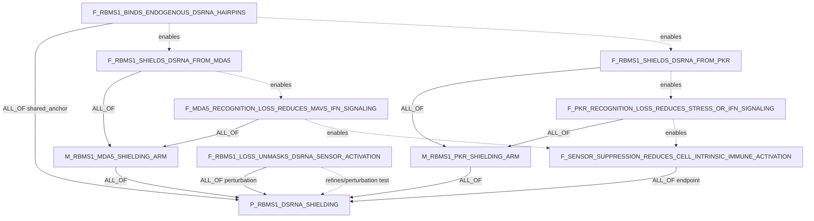

Rationale: RBMS1 was not part of the original five-hypothesis Step0 run. This
added DAG makes the lab hypothesis concrete by separating the shared biochemical
anchor from two sensor arms. The MDA5 arm should be proven with dsRNA occupancy,
MDA5 access, MAVS/IFN, and ISG readouts. The PKR arm should be proven with PKR
binding or activation, eIF2alpha/stress signaling, and antiviral activation
readouts. The RBMS1-loss child is included as a necessary perturbation test so
the claim is not reduced to a correlation between RBMS1 expression and low IFN
signaling.

## Cross-Example Notes

1. Each parent candidate claim uses `ALL_OF` because these are mechanistic
   causal chains where all listed steps are required to prove the exact parent
   hypothesis.
2. Semantic `enables` edges encode causal order but do not roll up truth into
   the parent. The proof rollup is represented only by `claim_decomposition_edges`.
3. Rescue or perturbation children are included where the input hypothesis makes
   an intervention claim. These are especially useful for distinguishing
   correlation from mechanism.
4. Literature BiologicalResults should attach to the most specific child claim
   supported by a paper. One paper can support multiple analyses inside one
   BiologicalResult, but should not inflate the claim count by creating many
   duplicate literature claims.
